# How to contribute to MeshLink

This guide takes you from a fresh checkout to a review-ready MeshLink change.

**Audience:** engineers changing this repository, especially the `:meshlink`
library.

**After reading this guide, you should be able to:** prepare a compatible
workstation, build the library, run the expected verification bundle, and know
which supporting documents to use when you need more detail.

If you are integrating MeshLink into a host app rather than changing MeshLink
itself, start with the [documentation map](docs/README.md).

If you are preparing a release rather than a normal feature or maintenance
change, start with the [release runbook](RELEASING.md) and then return here for
the contributor verification bundle.

## Quick path picker

| If you are changing... | Start here | Verify with |
|---|---|---|
| docs only | this guide + the [documentation map](docs/README.md) | `./gradlew verifyDocs` |
| shared SDK behavior in `:meshlink` | this guide + the [repository layout reference](docs/reference/repository-layout.md) | `./gradlew :meshlink:allTests :meshlink:detekt :meshlink:koverVerify` |
| the reference app | this guide + the [MeshLink reference app overview](meshlink-reference/README.md) | `./scripts/run-reference-local-check.sh` |
| Gradle, AGP, or module shape | this guide + the [repository architecture explanation](docs/explanation/about-the-repository-architecture.md) | `./scripts/run-agp9-verification.sh` |
| proof apps or retained benchmark surfaces | this guide + the proof-app or benchmark docs | the matching proof or benchmark flow from the contributor reference |

## Workflow at a glance

```mermaid
%%{init: {"theme": "base", "themeVariables": {"background": "#ffffff", "primaryColor": "#E8F1FF", "primaryBorderColor": "#3A7BD5", "primaryTextColor": "#102A43", "lineColor": "#6B7C93", "secondaryColor": "#EEF7EE", "tertiaryColor": "#FFF3E6", "clusterBkg": "#F8FAFC", "clusterBorder": "#B8C4D6", "fontFamily": "Inter, ui-sans-serif, system-ui"}}}%%
flowchart LR
    Checkout["Fresh checkout"] --> Warm["./gradlew help"]
    Warm --> Hooks["Install Git hooks"]
    Hooks --> Build["Build the relevant module"]
    Build --> Loop["Run the narrow local edit loop"]
    Loop --> Verify["Run the pre-review bundle"]
    Verify --> PR["Open the PR with evidence"]

    classDef step fill:#E8F1FF,stroke:#3A7BD5,color:#102A43,stroke-width:1.5px;
    classDef review fill:#EEF7EE,stroke:#4D9F70,color:#14361F,stroke-width:1.5px;
    class Checkout,Warm,Hooks,Build,Loop step;
    class Verify,PR review;
```



## 1. Prepare your workstation

For the full contributor workflow, use a macOS machine with:

- JDK 21 or newer
- Android SDK for API 36 builds
- Xcode
- Python 3

Install `xcodegen` only if you need to regenerate the committed iOS project
after project-spec changes.

For the exact workstation matrix, task list, and repository rules, use the
[Contributor build, test, and verification reference](docs/reference/contributor-reference.md).
If you need a module map before you start editing, use the
[Repository layout reference](docs/reference/repository-layout.md).

## 2. Warm the checkout

From the repository root, run:

```bash
./gradlew help
```

This confirms the Gradle wrapper works and downloads the required plugins and
toolchains.

Then install the repository Git hook suite:

```bash
./scripts/install-git-hooks.sh
```

The repository keeps contributor workflow guidance in `AGENTS.md` and the
shared agent skill/reference corpus in `.agents/`. Generated local workflow
state such as `.gsd/`, `.bg-shell/`, `.tmp-yamllint/`, `.specify/`, and `.pi/`
should stay local and should not be committed.

The suite includes:

- `pre-commit` — formats touched Kotlin modules, runs `yamllint` for staged
  YAML files, and runs the relevant Gradle verification for the staged paths,
  including the verified JVM smoke benchmark guard when benchmark code changes
- `commit-msg` — enforces Conventional Commits
- `pre-push` — scans outgoing commit subjects for Conventional Commit
  compliance, blocks direct pushes to `main`, and runs the heavier
  verification bundle for the affected paths, including verified JVM smoke
  benchmark runs for benchmark-sensitive MeshLink changes

If formatting changes a staged file, the commit stops so you can review and
re-stage the result.

## 3. Build the library

For a normal first build, run:

```bash
./gradlew :meshlink:build
```

If you only want a compile pass while shaping the change, run:

```bash
./gradlew :meshlink:assemble
```

## 4. Use the local edit loop

Start with formatting:

```bash
./gradlew :meshlink:ktfmtFormat
```

Then run the narrowest tests that still cover your change:

```bash
./gradlew :meshlink:jvmTest
./gradlew :meshlink:testDebugUnitTest
./gradlew :meshlink:iosSimulatorArm64Test
```

When a change crosses shared logic, public API behavior, or Android/iOS parity,
run the full library test bundle:

```bash
./gradlew :meshlink:allTests
```

For `meshlink-reference` changes, prefer the faster reference-app bundle:

```bash
./scripts/run-reference-local-check.sh
```

That wrapper runs `:meshlink-reference:localCheck` directly on the current AGP 9
toolchain.

For the Android direct-proof check path, use the repo-owned unittest runner
instead of `pytest`:

```bash
./scripts/check_reference_android_direct_proof.sh
```

If you touch Gradle, Android plugin wiring, or post-migration module shape, run
the AGP 9 build-surface bundle. It now includes the verified JVM smoke
benchmark guard so benchmark regressions do not hide behind a successful Gradle
exit code:

```bash
./scripts/run-agp9-verification.sh
```

For a narrower loop, you can still run just the invariant guard:

```bash
./gradlew checkAgp9Invariants
```

Use `:meshlink-reference:build` only when you need release APK or iOS framework
artifacts, because it also links release frameworks for all iOS targets.

For the full test-surface matrix, use the
[Contributor build, test, and verification reference](docs/reference/contributor-reference.md).

## 5. Run the pre-review verification bundle

Before you ask for review on a library change, run:

```bash
./gradlew \
  :meshlink:allTests \
  :meshlink:detekt \
  :meshlink:apiCheck \
  :meshlink:koverVerify \
  verifyDocs
```

For a `meshlink-reference` review bundle, run:

```bash
./scripts/run-reference-local-check.sh
```

If your change touches performance-sensitive code or physical transport
behavior, add `./gradlew verifyJvmSmokeBenchmarks` or the proof validation
described in the contributor reference and benchmark guides.

If your change touches Gradle, Android plugin wiring, or module layout, include
`./scripts/run-agp9-verification.sh` in the verification bundle as well.

## 6. If the public surface changes

A public API change requires all of the following in the same change set:

- updated KDoc
- refreshed checked-in API dump
- regenerated human-readable API appendix
- matching Android and iOS documentation updates
- `verifyDocs` rerun after the doc and appendix updates
- PR rationale for the API diff and version impact

The exact commands and required artifacts are listed in the
[Contributor build, test, and verification reference](docs/reference/contributor-reference.md).

## 7. Open the PR

Before you push:

- work from a feature branch, not `main`
- use Conventional Commit messages
- include the verification commands you ran in the PR description or handoff
- include benchmark or proof evidence when the change needs retained
  performance or physical validation

## 8. Use the right supporting docs

Use this guide for the contributor workflow.

Use these documents when you need more detail:

- [Contributor build, test, and verification reference](docs/reference/contributor-reference.md)
- [Repository layout reference](docs/reference/repository-layout.md)
- [About the repository architecture](docs/explanation/about-the-repository-architecture.md)
- [MeshLink Constitution](constitution.md)
- [MeshLink documentation map](docs/README.md)
- [Benchmark and validation baselines](benchmarks/README.md)
- [Release runbook](RELEASING.md)
- [Security policy](SECURITY.md)
- [Changelog](CHANGELOG.md)
- [MeshLink reference app overview](meshlink-reference/README.md)
- [How to run the Android proof app](meshlink-proof/android/README.md)
- [How to build and run the iOS proof app](meshlink-proof/ios/README.md)
