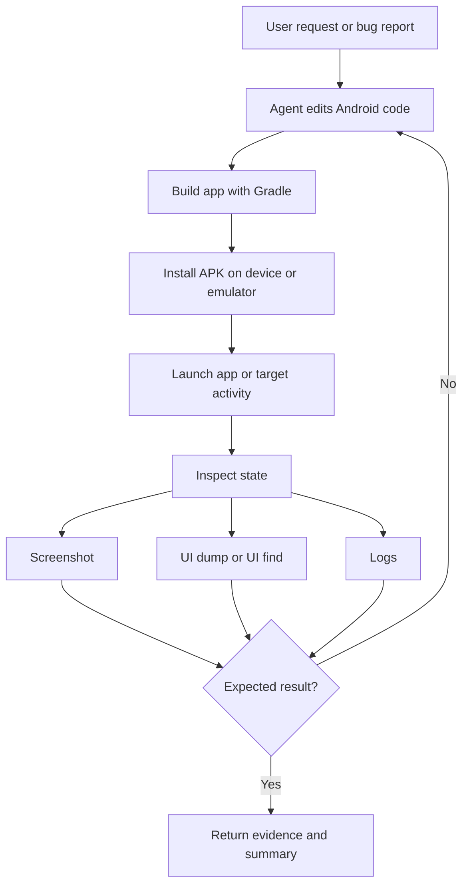
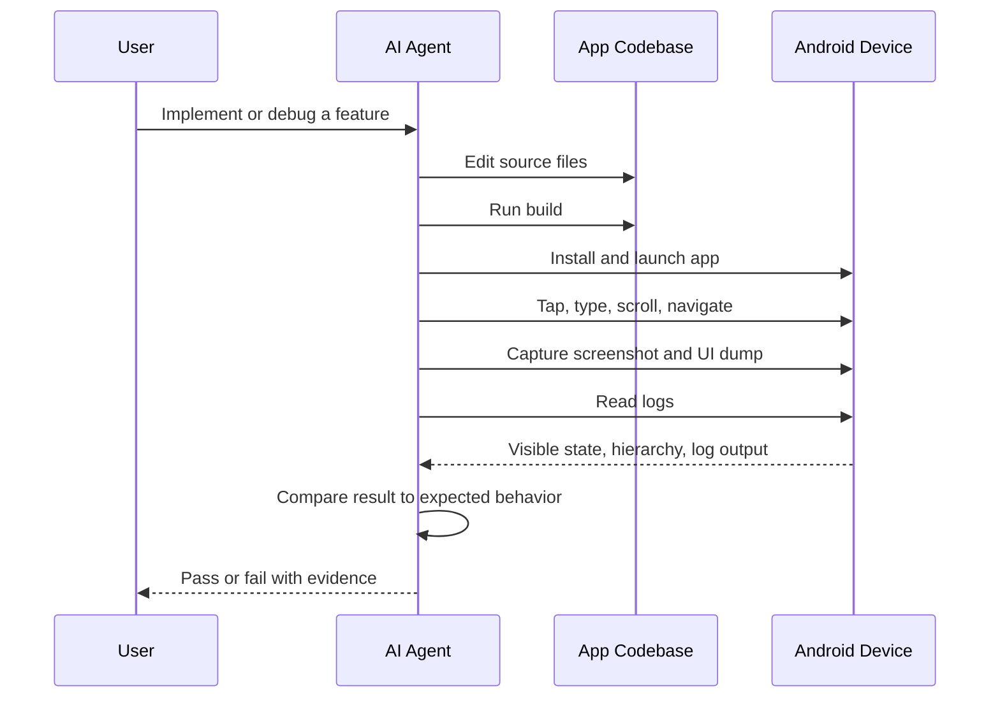
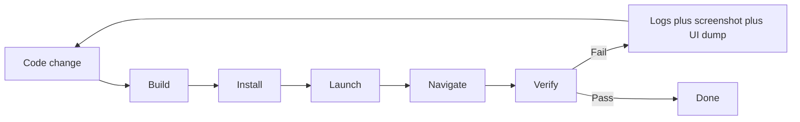

# AI Development Workflow

This repo can support an AI-driven Android development loop where the agent:

1. changes app code
2. builds and installs the app
3. launches the target screen
4. inspects the UI with screenshots and UI dumps
5. interacts with the device
6. verifies the result
7. repeats until the feature or bugfix is correct

The key idea is that `./tools/android` gives the agent a deterministic device-control layer, while your app repo still owns the build, test, and source code edits.

## Recommended Setup

Use this repo inside the Android app repo you actually want to work on.

Copy:

```bash
cp AGENTS.md /path/to/app/
cp -r docs /path/to/app/docs
cp -r skills /path/to/app/skills
cp -r tools /path/to/app/tools
```

Then let the agent work from the app repo root, where it can:

- edit app code
- run Gradle builds
- install the built APK
- drive the emulator or device
- collect screenshots and logs as evidence

## Development Loop



## Verification Loop

After every meaningful interaction, the agent should verify state instead of assuming success.



## What This Repo Is Good At

- black-box UI validation on a real device or emulator
- reproducible navigation flows
- screenshot-based and UI-tree-based verification
- collecting logs when a flow fails
- giving an AI agent a single command surface instead of ad hoc `adb` calls

## What It Does Not Replace

- your app build system
- unit tests and instrumentation tests
- screenshot diff tooling
- semantic app-specific assertions that require internal app knowledge

This repo is best used as the outer loop around development, not as the only test strategy.

## Recommended Agent Workflow

For a feature or bugfix, the agent should usually follow this sequence:

1. Build the app in the app repo.
2. Install the APK with `./tools/android app install --apk ... --json`.
3. Launch the app.
4. Use `screenshot`, `ui dump`, and `ui find` to establish the starting state.
5. Perform one interaction at a time.
6. After each interaction, verify with `wait element`, `ui dump`, or `screenshot`.
7. If the flow fails, collect `debug logs`.
8. Edit code and repeat.

## Example Commands In A Real Iteration

Build and install:

```bash
./gradlew :app:assembleDebug
./tools/android app install --apk app/build/outputs/apk/debug/app-debug.apk --json
```

Launch and inspect:

```bash
./tools/android app launch --package com.example.app --activity .MainActivity --json
./tools/android screenshot --out /tmp/start.png --json
./tools/android ui dump --json
```

Interact and verify:

```bash
./tools/android input tap-element --by text --value "Login" --json
./tools/android wait element --by text --value "Home" --timeout 10000 --json
./tools/android screenshot --out /tmp/home.png --json
```

Debug failures:

```bash
./tools/android debug clear-logs --json
./tools/android debug logs --package com.example.app --level E --lines 200 --json
```

## Suggested Prompt Pattern

Give the agent both the product goal and the verification bar.

Example:

```text
Implement the new Settings toggle for offline mode.
Build the app, install it on the emulator, navigate to the Settings screen,
turn the toggle on, verify the UI state with screenshots and UI dumps,
and keep iterating until the flow works end to end.
```

For debugging:

```text
Reproduce the bug where tapping Save does nothing on the profile screen.
Use screenshots, UI inspection, and logs as evidence.
Do not claim success unless the result is visible on the device.
```

## Best Practices

- Prefer `--json` so the agent can reason from structured output.
- Prefer explicit `--device` when multiple devices are connected.
- Prefer explicit activities for launch when you need a predictable entry point.
- Verify after every interaction.
- Save screenshots at important checkpoints.
- Use `resource-id` selectors first, then `text`, then `content-desc`.
- Keep app build commands in the app repo, not in this skill repo.

## Example Continuous Iteration Plan



## Where Each Skill Fits

- `android`: overall orchestration
- `android-install`: install and launch the app
- `android-ui`: inspect the current hierarchy
- `android-screenshot`: capture visual evidence
- `android-tap`: interact with buttons or fields
- `android-scroll`: find off-screen elements
- `android-gesture`: perform swipes and other gestures
- `android-navigate`: execute multi-step screen flows
- `android-test`: run end-to-end checks with evidence
- `android-debug`: collect logs and diagnose failures
- `android-device`: choose or start the target device

## Practical Bottom Line

Yes, this repo is suitable for AI-assisted Android development if it is used from inside the app repo being developed.

The strongest use case is:

- edit code
- build app
- install app
- drive emulator
- verify with screenshots, UI dumps, waits, and logs
- repeat until the behavior is correct

That gives the agent an observable feedback loop instead of pure guesswork.
