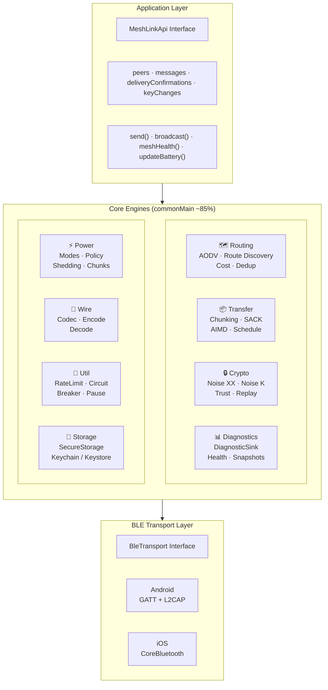
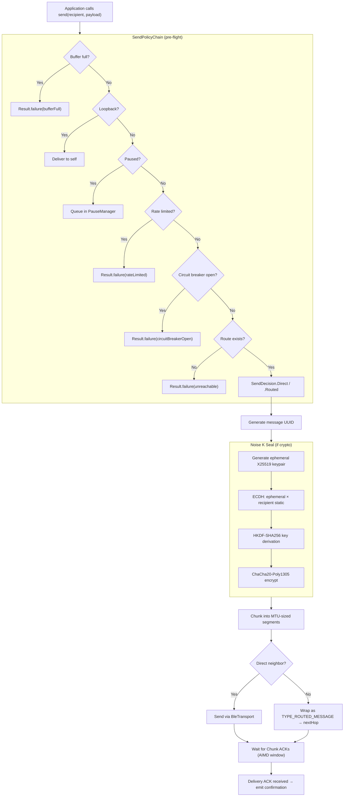
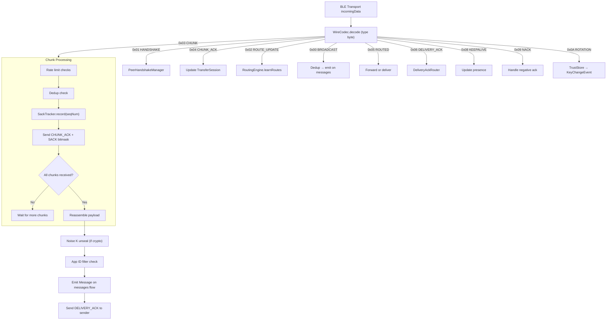
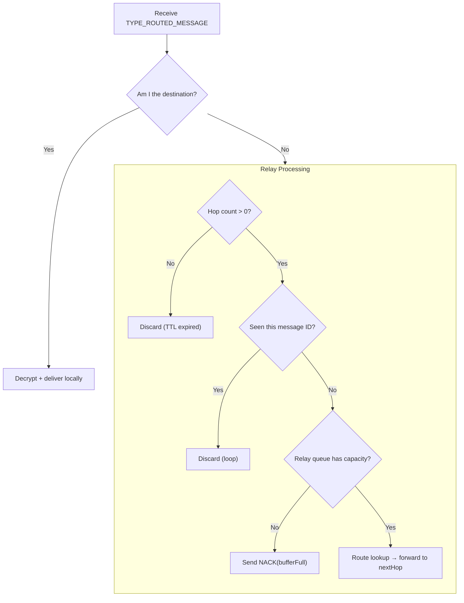

# MeshLink Architecture

Technical architecture overview of MeshLink — a Kotlin Multiplatform BLE mesh
messaging library for Android and iOS.

---

## Table of Contents

1. [System Overview](#system-overview)
2. [Module Responsibilities](#module-responsibilities)
3. [Message Flow](#message-flow)
4. [Routing](#routing)
5. [Security Model](#security-model)
6. [Power Management](#power-management)
7. [Transfer & Congestion Control](#transfer--congestion-control)
8. [Extension Points](#extension-points)
9. [Wire Protocol](#wire-protocol)
10. [Platform Architecture](#platform-architecture)

---

## System Overview



MeshLink is structured as a layered library with a clean boundary between
platform-agnostic logic (in `commonMain`) and platform-specific I/O (in
`androidMain` / `iosMain`). Approximately 85% of the code is shared.

---

## Module Responsibilities

### `io.meshlink` — Core

| File | Responsibility |
|------|---------------|
| `MeshLinkApi.kt` | Public interface — all application-facing methods and flows. |
| `MeshLink.kt` | Implementation: orchestrates all subsystems, owns coroutine scopes, dispatches events. |

### `io.meshlink.config` — Configuration

| File | Responsibility |
|------|---------------|
| `MeshLinkConfig.kt` | Immutable config data class with 30+ fields, validation, presets (`smallPayloadLowLatency`, `largePayloadHighThroughput`, `minimalResourceUsage`), and DSL builder. |

### `io.meshlink.routing` — Mesh Routing

| File | Responsibility |
|------|---------------|
| `RoutingEngine.kt` | Facade consolidating routing table, presence, dedup, AODV route discovery (RREQ/RREP handling, route cache, pending message queue), and adaptive timing behind sealed result types. |
| `RoutingTable.kt` | AODV route cache with TTL-based expiry, settling, holddown, and neighbor capacity limits. |
| `RouteCostCalculator.kt` | Composite cost metric from RSSI, packet loss, freshness, and stability. |
| `DedupSet.kt` | LRU set for message deduplication (default 10K entries). |
| `PresenceTracker.kt` | Tracks peer liveness for route validity. |
| `DeliveryAckRouter.kt` | Routes delivery ACKs back along the reverse path of routed messages. |

### `io.meshlink.transfer` — Message Transfer

| File | Responsibility |
|------|---------------|
| `TransferEngine.kt` | Public façade consolidating outbound chunking (AIMD/SACK) and inbound reassembly behind sealed result types. |
| `TransferSession.kt` | _(internal)_ Sender-side state machine for multi-chunk transfers. |
| `SackTracker.kt` | _(internal)_ Receiver-side selective acknowledgement tracking. |
| `AimdController.kt` | _(internal)_ Additive Increase / Multiplicative Decrease congestion control. |
| `TransferScheduler.kt` | _(internal)_ Fair round-robin scheduling across concurrent transfers with power-mode limits. |
| `ChunkSizePolicy.kt` | _(internal)_ Power-aware chunk payload sizing. |
| `CutThroughBuffer.kt` | _(internal)_ Receiver-side reassembly buffer for out-of-order chunks. |
| `ResumeCalculator.kt` | _(internal)_ Resumption offset computation for interrupted transfers. |

### `io.meshlink.crypto` — Security

| File | Responsibility |
|------|---------------|
| `SecurityEngine.kt` | Facade consolidating E2E encryption, signatures, handshakes, and peer key lifecycle. |
| `CryptoProvider.kt` | Interface for all cryptographic primitives (Ed25519, X25519, ChaCha20-Poly1305, SHA-256, HKDF). |
| `SecureRandom.kt` | `expect/actual` CSPRNG — delegates to `java.security.SecureRandom` (JVM/Android), `SecRandomCopyBytes` (Apple), `/dev/urandom` (Linux). |
| `NoiseXXHandshake.kt` | Noise XX handshake — mutual authentication with forward secrecy. |
| `PeerHandshakeManager.kt` | Multi-peer handshake orchestration and session key storage. |
| `NoiseKSealer.kt` | Per-message end-to-end encryption using Noise K pattern. |
| `ReplayGuard.kt` | 64-entry sliding window replay protection per sender. |
| `TrustStore.kt` | Key pinning with STRICT and SOFT_REPIN modes. |

> **CSPRNG design note:** `kotlin.random.Random.Default` happens to use platform-secure
> sources on current Kotlin versions, but the stdlib docs do not guarantee cryptographic
> security. `secureRandomBytes()` uses canonical platform APIs via `expect/actual`,
> making the security contract explicit and immune to future Kotlin changes.

### `io.meshlink.power` — Power Management

| File | Responsibility |
|------|---------------|
| `PowerCoordinator.kt` | Facade consolidating power-mode transitions, memory-pressure evaluation, and buffer-pressure monitoring behind sealed result types. |
| `PowerProfile.kt` | Single source of truth for all power-mode-dependent constants (advertising interval, scan timing, max connections, keepalive interval). Replaces scattered `when(mode)` lookups. |
| `PowerModeEngine.kt` | Hysteresis-based mode transitions driven by battery level and charging state. |
| `PowerProfile.kt` | Single source of truth for power-mode-dependent constants (intervals, limits). |
| `TieredShedder.kt` | Three-tier memory shedding strategy (MODERATE → HIGH → CRITICAL). |
| `ConnectionLimiter.kt` | Manages per-mode connection limits with eviction on power mode downgrade. |

### `io.meshlink.send` — Send Policy

| File | Responsibility |
|------|---------------|
| `SendPolicyChain.kt` | Pure pre-flight evaluator for outbound sends; chains buffer, pause, rate-limit, circuit-breaker, routing, and crypto checks into sealed `SendDecision`. |
| `BroadcastPolicyChain.kt` | Pure pre-flight evaluator for broadcast sends; chains buffer and rate-limit checks, then constructs a signed encoded frame via sealed `BroadcastDecision`. |

### `io.meshlink.dispatch` — Message Dispatch

| File | Responsibility |
|------|---------------|
| `MessageDispatcher.kt` | _(internal)_ Dispatches inbound BLE frames to typed handlers; owns decode pipeline and delegates effects via `DispatchSink`. |
| `InboundValidator.kt` | _(internal)_ Pre-dispatch validation: signatures, replay counters, loop detection, hop limits, rate limiting, app-ID filtering, and decryption. |
| `OutboundTracker.kt` | _(internal)_ Tracks outbound message state: recipient mapping, next-hop tracking, and monotonic replay counter. |
| `DispatchSink.kt` | _(internal)_ Callback interface grouping 8 effect callbacks for flow emissions and transport sends. |

### `io.meshlink.routing` — Route Coordination

| File | Responsibility |
|------|---------------|
| `RouteCoordinator.kt` | Coordinates route maintenance: keepalive probing of 1-hop neighbors. AODV route discovery handles all multi-hop route establishment on demand. |

### `io.meshlink.peer` — Peer Connection

| File | Responsibility |
|------|---------------|
| `PeerConnectionCoordinator.kt` | Coordinates BLE peer discovery: version negotiation, routing presence, security key registration, and handshake initiation via sealed `PeerConnectionAction`. |

### `io.meshlink.model` — Domain Model

| File | Responsibility |
|------|---------------|
| `Identifiers.kt` | Inline value classes `PeerId` and `MessageId` wrapping hex strings for compile-time type safety and correct map-key equality. |
| `Message.kt` | Inbound message data class. |
| `PeerEvent.kt` | Sealed interface for peer discovery/loss events. |
| `KeyChangeEvent.kt` | Key rotation notification data class. |
| `TransferFailure.kt` | Transfer failure event data class. |
| `TransferProgress.kt` | Transfer progress event data class. |

### `io.meshlink.wire` — Wire Protocol

| File | Responsibility |
|------|---------------|
| `WireCodec.kt` | Binary encoding/decoding for all 11 message types. Constants for type bytes and header sizes. |

### `io.meshlink.transport` — Transport Abstraction

| File | Responsibility |
|------|---------------|
| `BleTransport.kt` | Interface for platform-specific BLE I/O. |

### `io.meshlink.diagnostics` — Observability

| File | Responsibility |
|------|---------------|
| `DiagnosticSink.kt` | Event emission via `SharedFlow`, 19 diagnostic codes, severity levels. |
| `MeshHealthSnapshot.kt` | Point-in-time mesh state data class. |

### `io.meshlink.storage` — Persistence

| File | Responsibility |
|------|---------------|
| `SecureStorage.kt` | Interface for platform-specific secure key-value storage. |

### `io.meshlink.delivery` — Delivery Pipeline

| File | Responsibility |
|------|---------------|
| `DeliveryPipeline.kt` | Consolidated pipeline owning delivery state tracking (PENDING→RESOLVED), tombstones, deadline timers, reverse-path relay, replay guards, inbound rate limiting, and store-and-forward buffering behind sealed result types. |

### `io.meshlink.util` — Utilities

| File | Responsibility |
|------|---------------|
| `DeliveryOutcome.kt` | Enum of delivery outcomes (confirmed, failed variants). |
| `RateLimitPolicy.kt` | Facade consolidating 7 rate limiters and circuit breaker behind sealed `RateLimitResult` type. |
| `PauseManager.kt` | Manages paused state with bounded send and relay queues; returns `PauseSnapshot` on resume for deferred flush. |
| `RateLimiter.kt` | Sliding window rate limiting (per-key token bucket). |
| `CircuitBreaker.kt` | Fault isolation with closed → open → half-open state machine. |
| `HexUtil.kt` | Hex encoding/decoding. |
| `PlatformLock.kt` | Multiplatform mutex (`expect`/`actual`). |

---

## Message Flow

### Outbound Unicast



### Inbound Unicast



### Routed Message Forwarding



---

## Routing

`RoutingEngine` consolidates routing table management, peer presence tracking,
message deduplication, AODV route discovery (RREQ/RREP handling), and
route cache management behind sealed result types (`NextHopResult`,
`RouteLearnResult`).

MeshLink uses reactive AODV (Ad-hoc On-demand Distance Vector) routing with
composite cost metrics, primary + backup routes, TTL-based cache expiry,
settling delay, holddown timers, and per-neighbor routing table caps.
`DedupSet` is an LRU set (default 10K entries) for message deduplication.

For protocol details, cost formula, and routing behavior, see
[design.md §6](design.md#6-routing).

---

## Security Model

Two-layer Noise encryption when a `CryptoProvider` is supplied:

| Layer | Protocol | Scope | Purpose |
|-------|----------|-------|---------|
| Hop-by-hop | Noise XX | Per BLE link | Mutual authentication, session keys, forward secrecy |
| End-to-end | Noise K | Per message | Sender-authenticated encryption, relay-opaque |

Key components: `SecurityEngine` (facade), `NoiseXXHandshake` +
`PeerHandshakeManager` (3-message mutual auth), `NoiseKSealer` (E2E, 48B
overhead), `ReplayGuard` (64-entry sliding window), `TrustStore` (TOFU key
pinning). All crypto is pure Kotlin — Ed25519, X25519, ChaCha20-Poly1305,
SHA-256, HKDF-SHA256.

For handshake flows and trust model details, see
[design.md §5](design.md#5-security) and
[diagrams.md § Noise XX Handshake](diagrams.md#5-noise-xx-handshake).

---

## Power Management

`PowerCoordinator` manages battery-adaptive power modes with hysteresis:

| Mode | Battery | Adv Interval | Scan Duty | Max Transfers |
|------|---------|-------------|-----------|---------------|
| PERFORMANCE | >80% / charging | 250 ms | 80% | 8 |
| BALANCED | 30–80% | 500 ms | 50% | 4 |
| POWER_SAVER | <30% | 1,000 ms | 16% | 1 |

Downward transitions delayed 30s (hysteresis); upward and charging immediate.
For state diagrams and memory shedding, see
[design.md §7](design.md#7-power-management).

---

## Transfer & Congestion Control

`TransferEngine` consolidates outbound chunking (AIMD/SACK) and inbound
reassembly behind sealed result types. Chunks use 21-byte headers; SACK uses
64-bit bitmasks for selective retransmission; `AimdController` adapts the
congestion window; `TransferScheduler` limits concurrent transfers per power
mode.

For wire format details, see [wire-format-spec.md](wire-format-spec.md).

---

## Extension Points

MeshLink is designed for testability and platform flexibility through three
key interfaces:

### BleTransport

**Purpose:** Abstract BLE hardware so `MeshLink` never touches platform APIs
directly.

| Implementation | Platform | Description |
|---------------|----------|-------------|
| `AndroidBleTransport` | Android | GATT server/client + L2CAP CoC |
| `IosBleTransport` | iOS | CoreBluetooth central/peripheral |
| `VirtualMeshTransport` | Tests | In-memory simulated mesh (no hardware) |

### CryptoProvider

**Purpose:** Abstract cryptographic primitives for cross-platform support and
testing.

| Implementation | Description |
|---------------|-------------|
| `PureKotlinCryptoProvider` | Pure Kotlin crypto (used on all platforms) |

Created via the `expect`/`actual` factory: `CryptoProvider()`.

### SecureStorage

**Purpose:** Abstract platform-specific secure key-value storage.

| Implementation | Platform | Backend |
|---------------|----------|---------|
| `EncryptedSharedPreferences` | Android | Android Keystore |
| Keychain wrapper | iOS | `kSecAttrAccessibleAfterFirstUnlockThisDeviceOnly` |
| `InMemorySecureStorage` | Tests | In-memory `Map` |

---

## Wire Protocol

MeshLink uses a binary wire protocol (version 1.0) with 11 message types.

### Message Types

| Type Byte | Name | Description |
|-----------|------|-------------|
| `0x00` | `TYPE_BROADCAST` | Unencrypted broadcast message |
| `0x01` | `TYPE_HANDSHAKE` | Noise XX handshake message |
| `0x02` | `TYPE_ROUTE_UPDATE` | Legacy route update (kept for backward compatibility, not actively sent) |
| `0x03` | `TYPE_CHUNK` | Unicast message chunk |
| `0x04` | `TYPE_CHUNK_ACK` | Chunk acknowledgement with SACK |
| `0x05` | `TYPE_ROUTED_MESSAGE` | Multi-hop forwarded message |
| `0x06` | `TYPE_DELIVERY_ACK` | End-to-end delivery confirmation |
| `0x07` | `TYPE_RESUME_REQUEST` | Resume an interrupted transfer |
| `0x08` | `TYPE_KEEPALIVE` | Idle connection keepalive |
| `0x09` | `TYPE_NACK` | Negative acknowledgement |
| `0x0A` | `TYPE_ROTATION` | Identity key rotation announcement |
| `0x0B` | `TYPE_ROUTE_REQUEST` | AODV Route Request (RREQ) |
| `0x0C` | `TYPE_ROUTE_REPLY` | AODV Route Reply (RREP) |

### BLE Advertisement Payload

10 bytes: `version+power(2B) + keyHash(8B)`

BLE 4.x scan response allows 31 bytes maximum. A Service Data AD with a
128-bit UUID consumes 18 bytes of overhead (2 header + 16 UUID), leaving
at most 13 bytes for the payload. MeshLink uses 10 bytes for a clean fit.

- Bits 0–5 of byte 0: protocol version
- Bits 6–7 of byte 0: power mode (0 = PERFORMANCE, 1 = BALANCED, 2 = POWER_SAVER)
- Byte 1: reserved (0x00)
- Bytes 2–9: truncated SHA-256 of the local X25519 public key

### Byte Order

All multi-byte integers in chunk headers and ACKs use **little-endian** byte
order. See `docs/wire-format-spec.md` for the complete protocol specification.

---

## Platform Architecture

### Kotlin Multiplatform Structure

```
meshlink/
├── src/
│   ├── commonMain/          ← ~85% of code (platform-agnostic)
│   │   └── kotlin/io/meshlink/
│   │       ├── MeshLink.kt           Core implementation
│   │       ├── MeshLinkApi.kt        Public interface
│   │       ├── config/               Configuration
│   │       ├── crypto/               Noise XX, Noise K, trust, replay
│   │       ├── delivery/             Delivery pipeline, tracking, tombstones
│   │       ├── diagnostics/          Events, health snapshots
│   │       ├── dispatch/             Inbound frame dispatch
│   │       ├── model/                Message, PeerEvent, identifiers
│   │       ├── peer/                 Peer connection coordination
│   │       ├── power/                Power mode engine, profiles, policies
│   │       ├── protocol/             Protocol version
│   │       ├── routing/              AODV, route discovery, cost, dedup, keepalive
│   │       ├── send/                 Send and broadcast policy chains
│   │       ├── storage/              SecureStorage interface
│   │       ├── transfer/             AIMD, SACK, chunking, scheduling
│   │       ├── transport/            BleTransport interface
│   │       ├── util/                 Rate limiter, circuit breaker, etc.
│   │       └── wire/                 Wire codec
│   │
│   ├── androidMain/         ← Android platform bindings
│   │   └── kotlin/io/meshlink/
│   │       ├── crypto/               CryptoProvider (JCA-backed)
│   │       ├── platform/             MeshLinkService
│   │       ├── power/                BatteryMonitor
│   │       ├── storage/              SecureStorage (Keystore)
│   │       ├── transport/            BleTransport, BleConstants
│   │       └── util/                 PlatformLock, Time
│   │
│   ├── iosMain/             ← iOS platform bindings
│   │   └── kotlin/io/meshlink/
│   │       ├── crypto/               CryptoProvider (CryptoKit)
│   │       ├── platform/             StatePreservation
│   │       ├── power/                BatteryMonitor
│   │       ├── storage/              SecureStorage (Keychain)
│   │       ├── transport/            BleTransport
│   │       └── util/                 PlatformLock, Time
│   │
│   └── commonTest/          ← Shared test suite
```

### Build Targets

| Target | Min Version | Notes |
|--------|-------------|-------|
| Android | API 26 (Android 8.0) | compileSdk 36 |
| iOS arm64 | — | Physical devices |
| iOS simulator arm64 | — | Apple Silicon simulators |
| JVM | — | For desktop/server testing |

### Dependencies

- `org.jetbrains.kotlinx:kotlinx-coroutines-core:1.10.2` — the **only**
  runtime dependency.
- All cryptography is pure Kotlin (no BouncyCastle, no native libs).

### expect/actual Pattern

Platform-specific code uses Kotlin's `expect`/`actual` mechanism:

| expect Declaration | Android actual | iOS actual |
|-------------------|----------------|------------|
| `CryptoProvider()` | `PureKotlinCryptoProvider` | `PureKotlinCryptoProvider` |
| `PlatformLock()` | JVM `ReentrantLock` wrapper | iOS mutex wrapper |
| `currentTimeMillis()` | `System.currentTimeMillis()` | iOS time function |
