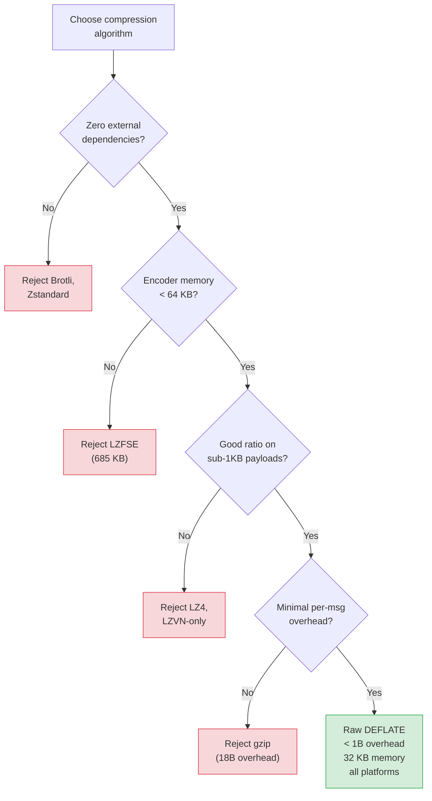

# MeshLink — Compression Algorithm Analysis

Analysis of five compression RFCs for MeshLink's BLE mesh messaging use case.

## Context

MeshLink compresses payloads before encryption (compress-then-encrypt). Each
message is compressed independently — no shared dictionary across messages.
Typical payloads range from 50 bytes to 100 KB, with the majority under 1 KB
(chat messages, sensor readings). The library targets Android, iOS, macOS,
Linux, and JVM with zero external dependencies.

**Current implementation:** raw DEFLATE (RFC 1951) via platform-native APIs.

## RFCs Evaluated

| RFC | Algorithm | Year | Core technique |
|-----|-----------|------|----------------|
| 1951 | DEFLATE | 1996 | LZ77 + Huffman coding |
| 1950 | zlib | 1996 | DEFLATE + Adler-32 wrapper |
| 1952 | gzip | 1996 | DEFLATE + CRC-32 wrapper |
| 7932 | Brotli | 2016 | LZ77 + Huffman + 120 KB static dictionary |
| 8878 | Zstandard | 2021 | LZ77 + FSE (Finite State Entropy) |

## Comparison

### Overhead per message

| Algorithm | Min header | Checksum | Total overhead | Notes |
|-----------|-----------|----------|----------------|-------|
| Raw DEFLATE | ~3 bits | None | < 1 byte | No integrity check |
| zlib | 2 bytes | 4 B Adler-32 | 6 bytes | Redundant with AEAD |
| gzip | 10 bytes | 8 B (CRC-32 + size) | 18 bytes | Wasteful for BLE |
| Brotli | 1–4 bytes | None | 1–4 bytes | Low overhead |
| Zstandard | 4 B magic + hdr | Optional 4 B xxHash | 9+ bytes | Frame-oriented |

### Compression ratio

| Algorithm | Text (> 1 KB) | Text (< 1 KB) | Binary | Incompressible |
|-----------|---------------|---------------|--------|----------------|
| DEFLATE/zlib | 2.5–3× | Poor (tree overhead dominates) | 1.5–2× | ~1.0× (slight expansion) |
| gzip | 2.5–3× | Poor | 1.5–2× | ~1.0× |
| Brotli | 3–5× | Good (static dictionary) | 1.5–2.5× | ~1.0× |
| Zstandard | 3–4× | Moderate | 2–3× | ~1.0× |

### Performance characteristics

| Algorithm | Compress speed | Decompress speed | Encoder memory | Decoder memory |
|-----------|---------------|-----------------|----------------|----------------|
| DEFLATE/zlib | Fast | Fast | ~32 KB | ~32 KB |
| gzip | Fast | Fast | ~32 KB | ~32 KB |
| Brotli (level 5) | Slow | Fast | 8–15 MB | 1–2 MB |
| Zstandard (level 3) | Fast | **Fastest** (2–10× vs zlib) | ~1 MB | ~1 MB |

### Platform availability (native, zero-dependency)

| Algorithm | Android | iOS/macOS | Linux | JVM |
|-----------|---------|-----------|-------|-----|
| DEFLATE/zlib | ✅ `java.util.zip` | ✅ `NSData` zlib | ✅ libz | ✅ `java.util.zip` |
| gzip | ✅ `java.util.zip` | ⚠️ partial | ✅ libz | ✅ `java.util.zip` |
| Brotli | ❌ JNI required | ❌ not in Foundation | ❌ libbrotli | ❌ external lib |
| Zstandard | ❌ JNI required | ❌ not in Foundation | ❌ libzstd | ❌ external lib |

Apple's `NSData.CompressionAlgorithm` also natively supports LZFSE (Apple-only,
faster than zlib) and LZ4 (ultra-fast, poor ratio) — but neither is available
on Android/JVM/Linux without external libraries.

## Decision

**Keep DEFLATE (switch from zlib wrapper to raw DEFLATE).**



### Rationale

1. **Zero external dependencies** — Brotli and Zstandard both require native C
   libraries on all 4 platform groups. This violates MeshLink's zero-dependency
   constraint and would add ~500 KB of native binaries per platform.

2. **AEAD makes checksums redundant** — Every payload is encrypted with
   ChaCha20-Poly1305 (AEAD), which provides integrity verification. The zlib
   Adler-32 checksum is redundant — switching to raw DEFLATE saves 6 bytes per
   compressed message.

3. **Small payloads limit algorithmic advantage** — Brotli's 20–30% better
   ratio comes from its 120 KB static dictionary (English/HTML words). For
   arbitrary binary payloads under 1 KB, the advantage shrinks to < 10%.
   Zstandard's speed advantage matters less when payloads are small.

4. **Encoder memory** — Brotli's encoder uses 8–15 MB, unsuitable for
   battery-constrained mobile devices. Zstandard's encoder at low levels uses
   ~1 MB, acceptable but unnecessary when DEFLATE uses only ~32 KB.

### Optimizations applied

| Change | Benefit |
|--------|---------|
| Raw DEFLATE (drop zlib wrapper) | −6 bytes per compressed message |
| Raise `compressionMinBytes` 64 → 128 | Avoid negative compression on small payloads |
| Use BEST_SPEED (level 1) | 2–3× faster compression, ~5% worse ratio |
| Reuse Deflater/Inflater instances | ~10% throughput improvement, fewer native allocations |

### Alternatives considered but rejected

- **Brotli** — Best compression ratio but requires external library on all
  platforms and encoder memory is prohibitive for mobile.
- **Zstandard** — Best decompression speed but requires external library.
  Frame overhead (9+ bytes) is larger than raw DEFLATE for small messages.
- **gzip** — Same DEFLATE algorithm but 18 bytes of mandatory overhead.
  Strictly worse than zlib/raw DEFLATE for BLE.
- **LZFSE** — Apple-only natively. Pure Kotlin port is feasible (~5,400 LOC)
  but encoder needs 685 KB scratch memory (21× DEFLATE) and small payloads
  fall back to LZVN which lacks entropy coding. See [LZFSE Deep-Dive](#lzfse-deep-dive).
- **LZ4** — Ultra-fast but poor compression ratio. Not worth the 1-byte
  envelope overhead when most messages would not compress meaningfully.

## LZFSE Deep-Dive (Summary)

LZFSE (Lempel-Ziv Finite State Entropy) is Apple's open-source compression
algorithm (2016). The [reference implementation](https://github.com/lzfse/lzfse)
is ~5,400 lines of pure C99, making a Kotlin port feasible (~14–18 weeks).
However, it was rejected for three reasons:

1. **Encoder memory is prohibitive.** ~685 KB scratch space (21× DEFLATE's
   32 KB) — exceeds MeshLink's `minimalOverhead` buffer capacity (64 KB) by 10×.
2. **Wrong payload sweet spot.** Below 4 KB, LZFSE falls back to LZVN (LZ77
   without entropy coding) — worse than DEFLATE's Huffman for MeshLink's
   typical sub-1 KB payloads.
3. **Disproportionate effort.** 14–18 weeks of porting + ongoing maintenance
   for marginal gain on the ~10–20% of messages above 4 KB.

## Wire envelope format

Unchanged — the envelope prefix scheme is independent of the compression
algorithm:

```
Uncompressed: [0x00][raw payload...]
Compressed:   [0x01][originalSize: 4 bytes LE][DEFLATE stream...]
```

The only change is that the compressed data is now a raw DEFLATE stream
(RFC 1951) instead of a zlib-wrapped stream (RFC 1950). This is a breaking
wire format change — peers running the old zlib format cannot decompress
raw DEFLATE payloads. Protocol version negotiation handles this.
