# MeshLink — Design Document

> A secure, decentralized, peer-to-peer messaging library for Android and iOS over Bluetooth Low Energy mesh networks.

## 1. Product Vision

MeshLink is a **library-first SDK** that enables developers to embed encrypted, serverless, offline-capable messaging into their Android and iOS apps. Communication happens entirely over BLE mesh — no internet, no servers, no accounts.

A **reference app** ships alongside the library to demonstrate integration patterns and serve as a development/testing tool.

**License:** Unlicense (public domain dedication). See LICENSE file.

**Distribution:**
- **Android:** Maven Central — `ch.trancee:meshlink:<version>`. Gradle's KMP plugin resolves the correct platform artifact automatically.
- **iOS:** Swift Package Manager (SPM) via GitHub release tags. CocoaPods as secondary option.
- **Minimum platform versions:** Android API 26 (Android 8.0 — BLE advertising APIs), iOS 14 (stable L2CAP CoC + modern CoreBluetooth APIs).
- **Release cadence:** Semantic versioning. Releases on feature completion, not on schedule. Patch releases for security/critical bugs.
- **Android packaging:** AAR ships with **consumer ProGuard rules** (keeps public API surface and Kotlin serialization metadata). Apps using R8 do not need custom keep rules for MeshLink.
- **Observability:** The `.diagnostics` Flow is the **sole observability surface**. No built-in crash reporting adapter — apps pipe diagnostics to their own crash reporter. The library never installs global crash/exception handlers. **Zero console output in release builds.** Debug builds may enable verbose logging via compile-time `MESHLINK_DEBUG` flag.
- **Binary size and cold-start:** No premature targets. After Phase 1, **measure baseline** (AAR size, `start()` latency) and add a **CI regression gate** (size must not increase >10% per release without justification).

---

## 2. Cross-Platform Strategy

### Kotlin Multiplatform (KMP) Architecture

KMP abstracts shared protocol logic (~85% of codebase); platform-specific BLE transport (~15%) is implemented per platform via the `BleTransport` interface. See [Appendix A](#appendix-a-decision-records) for alternatives evaluated.

**KMP/Native FFI boundary:** Platform BLE layers (CoreBluetooth delegates, Android BluetoothGattCallback) communicate with the shared Kotlin code via **function-type dependency injection** through the `BleTransport` interface. Platform implementations post lightweight value-type events (e.g., `BleEvent.PeerDiscovered`, `BleEvent.GattWriteComplete`) through the `BleTransport` abstraction — the only FFI surface. No retain cycles, no cross-FFI exception propagation, no lifecycle coupling.

**Module instantiation:** The `MeshLink` orchestrator creates all modules via **constructor injection**: engines (SecurityEngine, RoutingEngine, TransferEngine, DeliveryPipeline), coordinators (PowerCoordinator, RouteCoordinator, PeerConnectionCoordinator), and policy chains (SendPolicyChain, BroadcastPolicyChain, MessageDispatcher). Each module receives its dependencies as constructor parameters. No DI frameworks — the wiring is explicit code. `BleTransport` is a constructor parameter: production passes `AndroidBleTransport` / `IosBleTransport`, tests pass `VirtualMeshTransport`.

**Architecture:**

```
shared/                    ← KMP module (Kotlin, ~85% of code)
  ├── protocol/            ← Wire format, serialization, message types
  ├── crypto/              ← Noise handshake state machine, encryption
  ├── mesh/                ← Routing (Babel), keepalive, presence, dedup, buffering
  ├── transport/           ← Chunking, ACKs, flow control
  └── power/               ← Power mode state machine
android/                   ← Platform-specific (~8%)
  └── ble/                 ← android.bluetooth BleTransport implementation
  └── storage/             ← EncryptedSharedPreferences key storage
ios/                       ← Platform-specific (~7%)
  └── ble/                 ← CoreBluetooth BleTransport implementation
  └── storage/             ← Keychain key storage
```

**Crypto library strategy:** Crypto primitives (Curve25519, Ed25519, ChaCha20-Poly1305, SHA-256) use **platform-native crypto** — no third-party crypto dependencies. JVM/Desktop: Java 21 built-in (Ed25519, X25519, ChaCha20-Poly1305, SHA-256). Android API 33+: Java native. Android API 26–32: pure Kotlin Ed25519/X25519 fallback (JCA lacks these before API 31/33), with JCA for ChaCha20-Poly1305 and SHA-256. iOS: CryptoKit via Kotlin/Native interop (Curve25519.Signing, Curve25519.KeyAgreement, ChaChaPoly, SHA256, HKDF). The Noise Protocol state machine (XX + K patterns) is implemented in shared Kotlin code on top of these primitives (~500-800 lines).

**Reference app:** Built with **Compose Multiplatform** — a single codebase for both Android and iOS. Compose Multiplatform UI for iOS is Beta as of 2026, which is acceptable for a development/testing tool. **Four screens:**
1. **Chat screen** (demo mode) — send/receive text messages to discovered peers. Demonstrates `send()`, `.messages`, `.peers` integration patterns.
2. **Mesh Visualizer** (debug mode) — live graph of peer nodes (sized by connection count) with edges between connected peers (color-coded by signal quality). Route paths highlighted when sending a message. The "wow" demo and the "aha" debug tool.
3. **Diagnostics** (debug mode) — scrollable, filterable view of all `DiagnosticEvent` emissions with severity color-coding and auto-scroll. Toggle between demo/debug mode via settings.
4. **Settings** — config presets, MTU slider, health dashboard.

**Safeguards:**
1. Single shared implementation prevents protocol drift
2. Platform layers pass identical conformance tests
3. Formal wire format RFC with test vectors ensures cross-platform correctness

### Extension Points

MeshLink is designed for testability and platform flexibility through three
key interfaces:

#### BleTransport

**Purpose:** Abstract BLE hardware so `MeshLink` never touches platform APIs
directly.

| Implementation | Platform | Description |
|---------------|----------|-------------|
| `AndroidBleTransport` | Android | GATT server/client + L2CAP CoC |
| `IosBleTransport` | iOS | CoreBluetooth central/peripheral |
| `VirtualMeshTransport` | Tests | In-memory simulated mesh (no hardware) |

#### CryptoProvider

**Purpose:** Abstract cryptographic primitives for cross-platform support and
testing.

| Implementation | Description |
|---------------|-------------|
| `PureKotlinCryptoProvider` | Pure Kotlin crypto (used on all platforms) |

Created via the `expect`/`actual` factory: `CryptoProvider()`.

#### SecureStorage

**Purpose:** Abstract platform-specific secure key-value storage.

| Implementation | Platform | Backend |
|---------------|----------|---------|
| `EncryptedSharedPreferences` | Android | Android Keystore |
| Keychain wrapper | iOS | `kSecAttrAccessibleAfterFirstUnlockThisDeviceOnly` |
| `InMemorySecureStorage` | Tests | In-memory `Map` |

### 2.1 Module Responsibilities

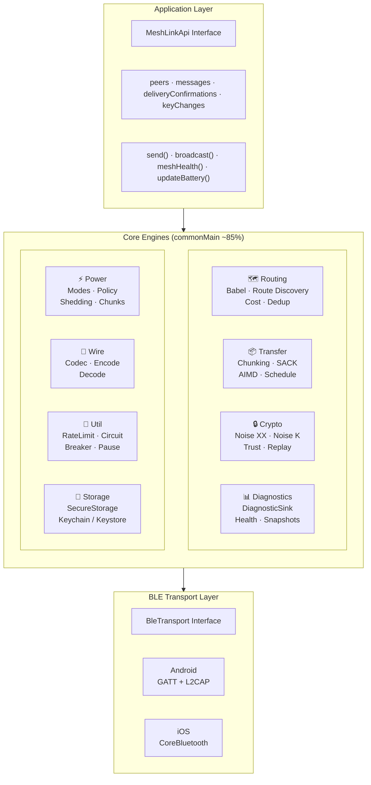

The core is organized into **stateful engines** (SecurityEngine, RoutingEngine,
TransferEngine, DeliveryPipeline) that own domain state and return sealed
result types, **coordinators** (PowerCoordinator, RouteCoordinator,
PeerConnectionCoordinator) that orchestrate multi-step workflows, and
**policy chains** (SendPolicyChain, BroadcastPolicyChain, MessageDispatcher)
that apply rules and produce decisions. `MeshLink.kt` is the sole wiring
layer — no module sends messages directly to another. See the source tree
and [API Reference](api-reference.md) for the full module inventory.

---

## 3. Transport Layer

> **Note:** For the complete byte-level wire format specification, see [wire-format-spec.md](wire-format-spec.md).

### BLE Transport: GATT + L2CAP CoC

BLE is available on all modern iOS/Android devices, power-efficient, no pairing required. The hybrid GATT + L2CAP approach maximizes throughput without sacrificing compatibility — GATT is the guaranteed fallback. See [Appendix A](#appendix-a-decision-records) for alternatives evaluated.

### GATT Service Design

Each MeshLink device exposes a single GATT service with **two characteristic pairs** (write + notify each):

**GATT UUIDs:** MeshLink uses a single base UUID with 16-bit offsets for the service and characteristics:

| Resource | UUID |
|----------|------|
| **Service** | `0x7F3A` (16-bit, CRC-16/ARC of "MESH") |
| **Control Write** | Base UUID + offset `0x0001` |
| **Control Notify** | Base UUID + offset `0x0002` |
| **Data Write** | Base UUID + offset `0x0003` |
| **Data Notify** | Base UUID + offset `0x0004` |

Base UUID: `7F3Axxxx-8FC5-11EC-B909-0242AC120002` (random 128-bit UUID with the 16-bit service UUID embedded at `xxxx`). The 16-bit service UUID `0x7F3A` is used in BLE advertisements for space efficiency (see §3 Protocol Versioning & Advertisement Layout).

| Characteristic | Direction | Traffic |
|----------------|-----------|---------|
| **Control Write** | Central → Peripheral | Noise XX handshake, routing control messages (Babel Hello/Update) |
| **Control Notify** | Peripheral → Central | Noise XX handshake responses, routing control responses |
| **Data Write** | Central → Peripheral | Data chunks, chunk ACKs, delivery ACKs |
| **Data Notify** | Peripheral → Central | Data chunks, chunk ACKs, delivery ACKs |

**GATT write type semantics:** Control characteristics (0x0001–0x0002) use **write-with-response** (ATT Write Request) — handshake and control messages are low-frequency, high-importance, and cannot tolerate silent loss. Data characteristics (0x0003–0x0004) use **write-without-response** (ATT Write Command) — chunk transfers are high-frequency and protected by SACK retransmission, so the ~15ms per-write ATT round-trip is unnecessary overhead. This split maximizes data throughput while ensuring control-plane reliability.

Every write/notification carries a **1-byte type prefix**: `0x00`=handshake, `0x01`=keepalive, `0x02`=rotation, `0x03`=route_request, `0x04`=route_reply, `0x05`=chunk, `0x06`=chunk_ack, `0x07`=nack, `0x08`=resume_request, `0x09`=broadcast, `0x0A`=routed_message, `0x0B`=delivery_ack. This costs 0.4% overhead at 244-byte MTU but eliminates all ambiguity when multiple message types share a characteristic.

**Reserved codes:** `0x0C–0xFF` are reserved for future use. Receiving a reserved message type code → drop the message + emit `UNKNOWN_MESSAGE_TYPE` diagnostic event.

**Relay forward compatibility:** Relays never inspect the inner message type of routed messages — they forward opaquely based on routing headers only. Unknown type inspection and drop happens only at the **final destination**. This enables incremental mesh upgrades: v2 nodes can use new message types through v1 relays.

**Unknown hop-by-hop types:** For non-relayed hop-by-hop message types (handshake, chunk_ack), unknown type codes are dropped + `UNKNOWN_MESSAGE_TYPE` diagnostic, connection stays alive. V2 senders should gate new hop-by-hop features behind the **capability byte** exchanged during Noise XX handshake.

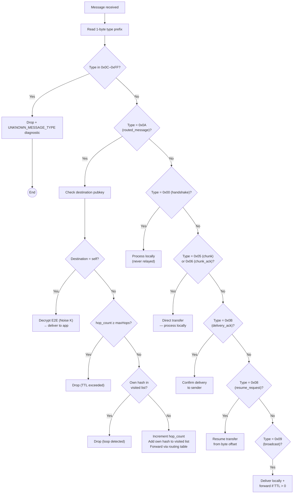

**Message type relationships:**
- **`routed_message` (0x0A)** is the **routing envelope** — it carries routing metadata and wraps each chunk of E2E-encrypted payload. Every chunk in a multi-hop transfer is wrapped in a `routed_message` envelope.
- **`resume_request` (0x08)** is sent on the **Control Characteristic** after an L2CAP→GATT transport fallback. It carries `{messageId, bytesReceived}` and triggers the sender to resume from the specified byte offset. `bytesReceived` counts only fully-reassembled chunks; partial L2CAP frames are discarded. See [wire-format-spec.md § Resume Request](wire-format-spec.md#0x08--resume-request) for the byte layout.

- **`routed_message` (0x0A)** is the **routing envelope** — it carries origin/destination peer IDs (8-byte truncated hashes), hop limit, replay counter, a visited list for loop detection, and the E2E-encrypted chunk payload. See [wire-format-spec.md § Routed Message](wire-format-spec.md#0x0a--routed-message) for the byte layout.

**Parser safety:** Visited count (V) is validated: `V ≤ maxHops`. Messages exceeding bounds are rejected. Malformed messages are dropped with a diagnostic event.

**Forwarding predicate:** A relay MUST NOT forward a `routed_message` if `hop_limit` has reached 0. The hop limit is decremented by each relay. The visited list provides independent **loop detection** — if the relay's own key hash appears, the message is dropped.

**Relay-is-also-destination:** DirectMessage → deliver locally and stop forwarding. Broadcast → deliver locally and continue forwarding if remaining hops > 0.

- **`chunk` (0x05)** is used for **direct (single-hop) transfers only**. The first chunk (seq=0) carries a `totalChunks` field; subsequent chunks omit it, saving 2 bytes per chunk. See [wire-format-spec.md § Chunk](wire-format-spec.md#0x05--chunk) for the byte layout. Protocol cap: uint16 sequence numbers support up to ~16MB per transfer.

- **`chunk_ack` / SACK (0x06)** — selective acknowledgement using a 128-bit SACK bitmask (two uint64 fields) covering up to 128 chunks beyond the base sequence. Negative acknowledgements use a separate **NACK (0x07)** message type with a reason code (`bufferFull`, `unknownDestination`, `decryptFailed`, `rateLimited`). See [wire-format-spec.md § Chunk ACK](wire-format-spec.md#0x06--chunk-ack) for the byte layout.

- **Single-chunk fast path:** If the E2E ciphertext fits within a single chunk (payload ≤ MTU minus envelope overhead for GATT, or ≤ L2CAP chunk size minus framing), it is sent as a single `routed_message` or `chunk` — no multi-chunk transfer setup required.
- **`broadcast` (0x09)** is a standalone envelope for broadcast messages (signed, relay-forwarded up to `broadcastTtl` hops).

### Data Plane: L2CAP CoC (Preferred) with GATT Fallback

The data plane uses **L2CAP Connection-Oriented Channels** when both peers support it, falling back to GATT data characteristics on older devices.

**Platform support:**

| Platform | L2CAP CoC API | Minimum Version |
|----------|--------------|-----------------|
| iOS | `CBL2CAPChannel` / `CBPeripheralManager.publishL2CAPChannel(withEncryption:)` | iOS 11 (2017) |
| Android | `BluetoothDevice.createInsecureL2capChannel(psm)` | API 29 / Android 10 (2019) |

**Capability negotiation:** During the Noise XX handshake (see §5 Hop-by-Hop Layer: Noise XX), peers exchange a **capability byte**:

| Bit | Meaning |
|-----|---------|
| 0 | L2CAP CoC supported (1 = yes) |
| 1–7 | Reserved |

If **both** peers advertise L2CAP support:
1. Peripheral publishes an insecure L2CAP channel (no BLE-level encryption — MeshLink encrypts at app layer)
2. Peripheral sends the assigned **PSM** (Protocol/Service Multiplexer, 2-byte little-endian) to central via GATT control characteristic
3. Central opens an L2CAP channel to that PSM
4. Data plane upgraded — all chunk transfers, routed messages, and broadcasts use L2CAP

The PSM is assigned dynamically by the OS Bluetooth stack and is guaranteed unique per device — no collision risk. The peripheral re-publishes a channel (getting a new PSM) after any L2CAP teardown.

If **either** peer lacks L2CAP support, the data plane remains on GATT data characteristics (unchanged from the fallback protocol described below).

**L2CAP stream framing:** L2CAP CoC is stream-oriented (unlike GATT's natural message boundaries). Each message on the L2CAP channel is length-prefixed:

| Offset | Size | Field |
|--------|------|-------|
| 0 | 1 byte | Message type (same 1-byte prefix: 0x09 broadcast, 0x05 chunk, 0x0A routed_message) |
| 1 | 3 bytes | Payload length (little-endian, max ~16MB) |
| 4 | N bytes | Payload |

Overhead: 4 bytes per message (vs 1 byte on GATT). Negligible at data-plane message sizes.

**L2CAP chunk sizing:** With L2CAP, chunk sizes can be much larger than GATT MTU:

| Mode | Chunk size | Chunks for 100KB | Flow control |
|------|-----------|-----------------|-------------|
| GATT | MTU-dependent (244–512 bytes) | ~200–410 | App-level SACK (64-bit bitmask) |
| L2CAP | Negotiated per connection (1024–8192 bytes) | ~13–100 | L2CAP credit-based (automatic) |

On the L2CAP path, **SACK is not needed** — L2CAP's credit-based flow control provides automatic backpressure. Credit management is fully delegated to the OS Bluetooth stack; the library treats L2CAP as a stream socket. Chunk sequence numbers and message IDs are still required for relay cut-through forwarding, resume-on-disconnect, and concurrent transfer demuxing.

**Backpressure → GATT fallback:** 3 **strictly consecutive** L2CAP writes each exceeding 100ms within the `l2capBackpressureWindow` (default **7s**, configurable 3–15s) (starting from the first slow write) triggers teardown of the L2CAP channel and fallback to GATT (`resume_request` sent for in-flight transfers). A single write completing in ≤100ms resets the consecutive counter to 0. L2CAP is NOT retried until the next fresh connection — corrupted credit state may persist. Window resets if it expires without reaching 3 slow writes. `L2CAP_BACKPRESSURE` diagnostic emitted per slow write.

**L2CAP chunk size negotiation:** The chunk size is determined by the **lower power mode** of the two connected peers, negotiated at connection time:

| Lower Power Mode of Pair | L2CAP Chunk Size |
|--------------------------|-----------------|
| Performance | 8192 bytes |
| Balanced | 4096 bytes |
| PowerSaver | 1024 bytes |

The chunk size is set once at connection establishment and **does not change** if a peer's power mode transitions mid-connection. On the next reconnection, the new power mode determines the new chunk size.

**Concurrent transfers on L2CAP:** A single L2CAP channel per peer connection, with app-level round-robin interleaving (same as GATT mode). Each framed message carries a message ID for demuxing. Per-power-mode concurrent transfer limits still apply.

**Demuxing strategy:** On both GATT and L2CAP, the message ID for concurrent transfer demuxing lives **inside the encrypted payload** — receivers decrypt first, then demux by message ID. This ensures zero metadata leakage to **passive eavesdroppers**; they cannot correlate which chunks belong to the same transfer without decrypting the Noise XX session. Note: relay nodes terminate the hop-by-hop Noise XX session and can observe message IDs within their relay scope (see §5 Metadata Protection).

**Fallback and degradation:**
- If L2CAP channel setup fails (known reliability issues on some Android OEMs — Samsung, OnePlus): fall back to GATT for that connection. Mark peer as GATT-only for the session.
- If L2CAP channel drops mid-transfer: the receiver sends a `resume_request` (0x08) to resume from the last byte offset (see §3 Chunking & Reassembly). The `transportModeChanged` diagnostic event is emitted.
- Attempt L2CAP open up to **3 total attempts** (1 initial + 2 retries) with exponential backoff (200ms → 800ms, base 200ms × 4ⁿ) before marking the peer GATT-only. GATT-only designation is **permanent for the current session** — the library does not retry L2CAP for that peer until the app is restarted (in case a firmware update or OS change fixes the issue). This avoids periodic retry overhead on devices with fundamentally broken L2CAP stacks.
- L2CAP failure is **never fatal** — GATT is always available.

**L2CAP OEM capability probe:** On first connection to a new `manufacturer|model|SDK_INT` combination, the library attempts a single L2CAP channel open. Success → cached as "L2CAP-capable". Failure → cached as "GATT-only" with a **30-day expiry** (firmware updates may fix the issue). Cache is persisted alongside the existing Android connection limit data (same `manufacturer|model|SDK_INT` key). `L2CAP_OEM_PROBE(device, result)` diagnostic emitted on each probe.

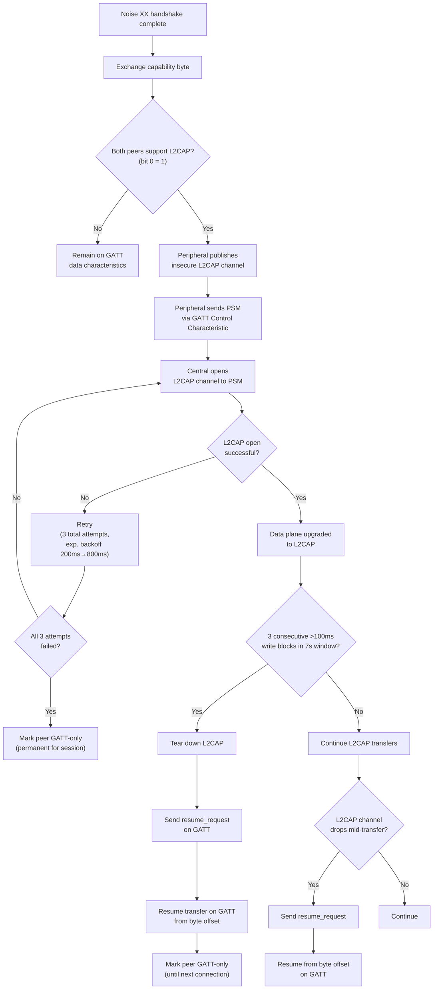

**MTU minimum enforcement:** After MTU negotiation, if the effective MTU (minus ATT header overhead) is less than **100 bytes**, the connection is rejected with a `MTU_TOO_SMALL` diagnostic event. A routed_message header alone requires ~52 bytes (with zero visited entries); MTUs below 100 bytes cannot carry meaningful payload. No fallback or fragmentation is attempted.

**ATT overhead:** 3 bytes (1B opcode + 2B attribute handle). Effective chunk payload = `negotiated_MTU − 3 − 1` (1 byte for MeshLink type prefix) = `MTU − 4`. The MTU minimum rejection threshold (`MTU_TOO_SMALL`) fires when effective payload < 100 bytes, i.e., `negotiated_MTU < 104`.

**No pairing required:** Insecure L2CAP channels (iOS: `publishL2CAPChannel(withEncryption: false)`, Android: `createInsecureL2capChannel()`) do not require BLE-level pairing. MeshLink's Noise XX hop-by-hop encryption already secures the channel at the application layer, making BLE-level encryption redundant.

**GATT write error handling:** When a GATT characteristic write returns an error (Android `onCharacteristicWrite(status ≠ GATT_SUCCESS)`, iOS `didWriteValueFor` with error), the library retries with **exponential backoff: 3 attempts at 100ms, 200ms, 400ms intervals**. If all 3 retries fail, the connection is torn down and a `WRITE_FAILED` diagnostic event is emitted. This handles transient BLE stack errors (resource contention, buffer overflow) without treating every write failure as a connection loss.

**BLE error mapping:** Platform-specific BLE errors are mapped to 6 abstract MeshLink error categories. The platform-specific error code is preserved in the `DiagnosticEvent` payload for debugging:

| MeshLink Error | Triggers |
|----------------|----------|
| `CONNECTION_FAILED` | BLE connection timeout, GATT disconnection, OS-level connection errors |
| `HANDSHAKE_FAILED` | Noise XX handshake timeout/invalid, authentication failure |
| `WRITE_FAILED` | GATT characteristic write errors after 3 retries exhausted |
| `MTU_TOO_SMALL` | Negotiated MTU < 104 bytes (effective payload < 100 bytes after ATT overhead) |
| `DISCOVERY_TIMEOUT` | GATT service/characteristic discovery exceeded 10s |
| `SERVICE_NOT_FOUND` | MeshLink GATT service UUID not found on peer |

**Encryption boundary on L2CAP:** Each L2CAP framed message (type + length + payload) is encrypted/decrypted as an **independent Noise XX unit** — matching GATT's per-write encryption model. Relay cut-through decrypts each frame from the inbound Noise XX session and re-encrypts it under the outbound session. This keeps both transport modes symmetric and simplifies relay logic.

**Partial frame handling:** On L2CAP connection drop, any partially-received frame buffer is discarded. The new Noise XX handshake on reconnection establishes fresh session keys — partial frames from the old session are undecryptable.

**Nonce desync handling:** If an L2CAP frame fails Noise XX decryption (nonce desynchronization), the library immediately **tears down the L2CAP channel** and falls back to GATT (same fallback path as above). Unlike GATT where a corrupted write affects only that write, L2CAP nonce desync breaks all subsequent frames — a single mismatch triggers immediate teardown with no tolerance window. An attacker who can drop L2CAP frames can force GATT-only mode (3–10× slower), but cannot break encryption or prevent communication.

**Nonce desync circuit breaker:** 3 nonce desyncs with the same peer within 5 minutes → demote that peer to **GATT-only for 30 minutes**. After 30 minutes, L2CAP is retried on the next connection. `L2CAP_NONCE_DESYNC_DEMOTION(peer, demotionDurationMillis)` diagnostic emitted when circuit breaker trips.

### Wire Format: Custom Binary Protocol

> 📋 **Canonical reference:** [wire-format-spec.md](wire-format-spec.md) has the complete byte-level specification for all message types. This section covers design rationale only.

All message types use a **hand-specified binary format** — no protobuf, no schema language. Every message layout is documented as byte-offset tables in the protocol RFC.

**Design choices:**
- **Blanket encoding rule:** All multi-byte integer fields are **unsigned little-endian** unless explicitly stated otherwise. All single-byte integer fields are **unsigned**. This applies to every wire format table in this document and the protocol RFC. (Matches ARM-native byte order on both iOS and Android.)
- **TLV extension areas** — seven fixed/known-length message types (Keepalive, ChunkAck, Nack, ResumeRequest, RouteRequest, RouteReply, DeliveryAck) include a trailing TLV (Type-Length-Value) extension area for backward-compatible schema evolution. Adding new fields via TLV entries does not require a protocol version bump. Tags `0x00`–`0x7F` are reserved for protocol use; `0x80`–`0xFF` are available for applications. Unknown tags are preserved for forward compatibility. See [wire-format-spec.md § TLV Extension Area](wire-format-spec.md#tlv-extension-area) for the binary layout and `TlvCodec.kt` for the implementation.
- **No self-describing format** — parsers must know the protocol version to decode. This maximizes payload efficiency on the bandwidth-constrained BLE link.

**Tradeoff:** The shared cross-platform test suite becomes critical — a single byte offset error = total failure. Test vectors in Phase 0 must cover every message type with exact byte-level golden outputs.

**Safe parsing rules (mandatory in RFC):** All variable-length fields must be validated before reading:
- `visited_count`: verify `header_size + V×16 ≤ frame_size` AND `V ≤ maxHops`
- `payload_length`: verify `offset + payload_length ≤ frame_size`
- Any field exceeding bounds → reject entire frame, increment `malformedFrames` diagnostic counter

**Complete parser validation rule set (mandatory):**
- `V = 0` is valid (originator, no visited peers yet)
- `TotalLen ≤ maxMessageSize` (default 100KB) — reject oversized messages
- `ChunkSeq ≤ ceil(TotalLen / chunkPayloadSize)` — reject out-of-range sequence numbers
- All public key fields must be non-zero (32 bytes of 0x00 is not a valid Ed25519 key)
- Message ID must be non-zero (12 bytes of 0x00 is not a valid message ID)
- Any validation failure → drop message + emit `MALFORMED_MESSAGE` diagnostic with failure reason

### Message ID Format

Message IDs are **128-bit random** identifiers (16 bytes) generated from the platform CSPRNG. With 128 bits of entropy, the birthday-bound collision probability is ~2⁻⁶⁴ — negligible for any practical message volume. No counter or peer ID prefix is needed.

### Protocol Versioning & Advertisement Layout

Protocol version, mesh network hash, and key hash are bit-packed into the BLE advertisement payload (16 bytes total: 2B version+power, 2B mesh hash, 12B key hash). The scan response uses a Service Data AD with the **16-bit UUID alias `0x7F3A`** (4 bytes overhead), leaving 27 bytes for payload — MeshLink uses 16. The 128-bit UUID is used in the advertisement data for GATT service discovery.

> **Unified peer ID:** The 12-byte key hash in the BLE advertisement is identical to the 12-byte wire protocol peer ID (first 12 bytes of SHA-256 of the X25519 public key). No dual-ID mapping is needed — a peer's advertisement identity and wire identity are the same.

**Mesh network hash:** The advertisement includes a **16-bit FNV-1a hash of the `appId`** string. Scanning peers skip connections to devices with non-matching mesh hashes, eliminating cross-app processing at the BLE scan level. When `appId` is null, the hash is `0x0000` (connects to all MeshLink peers).

Version negotiation occurs during the Noise XX handshake. See §12 Protocol Governance & Versioning for negotiation rules.

**Scan response service data:** The advertisement payload is carried as BLE Service Data with the 16-bit UUID alias `0x7F3A`. The 4-bit version field in byte 0 allows scanning peers to determine the remote protocol version *before* connecting — avoiding wasted handshakes on version mismatch. If a peer scans an advertisement with an unsupported major version, it skips the connection entirely.

**Scan response data:** The scan response carries a duplicate of the 16-bit service UUID (`0x7F3A`) in a Complete List of 16-bit Service UUIDs AD structure. This ensures iOS background discoverability — iOS moves service UUIDs to the "overflow area" when the app is backgrounded, making them visible only to devices already filtering for that UUID. The scan response UUID guarantees MeshLink peers remain discoverable regardless of iOS background state.

**Mesh network isolation:** The BLE advertisement includes a **16-bit FNV-1a mesh hash** of the `appId` string. Scanning peers skip connections to devices with non-matching mesh hashes, isolating different apps at the BLE scan level — before any GATT connection or handshake occurs. When `appId` is null, the mesh hash is `0x0000`, which matches all peers (backward compatible).

As a second layer, inbound messages with a non-matching `appId` hash are silently dropped at the recipient. This handles the case where peers with `appId = null` relay messages from one app network to another.

> **Scaling note:** In deployments where many apps share the physical BLE mesh, every device must decode, validate, and dedup-check messages from *all* apps before applying the appId filter. The filter itself is cheap (8-byte hash comparison), but the per-message processing cost scales with the total mesh-wide message volume across all apps. For single-app deployments this is a non-issue. For multi-app deployments (e.g., 10+ apps at a festival), monitor `bufferUtilizationPercent` and consider tuning rate limits.

### Connection Strategy

Connections are managed with a **hybrid persistent + on-demand approach**:

- **Persistent connections** to the top-N neighbors ranked by the **connection priority score**, filling all available connection slots. The connection pool is a **single shared pool** for both inbound (peripheral) and outbound (central) connections. When the pool is full, inbound connection requests from new peers are rejected at the BLE level.
- **On-demand connections** when a message needs to reach a non-connected neighbor
- **No reserved slots** — persistent connections fill all slots. When an on-demand connection is needed and no slot is free, the **lowest-priority persistent connection is evicted immediately** to make room. The message in hand is more valuable than a speculative persistent connection.

**Connection eviction priority (highest priority = kept longest):**
1. **Active transfer** — NEVER evict a connection with an in-flight transfer (wait for `chunkInactivityTimeout`)
2. **Recent activity** — among idle connections, keep the most recently used (last message sent/received)
3. **Route cost tiebreak** — among connections with identical last-activity time, keep the lower route cost

Simple, predictable, no weighted scoring. Active transfers are fully protected; idle connections evict LRU-style. Evicted connections are **abandoned immediately** — the sender retries via SACK timeout or alternate route.

**L2CAP channel lifecycle:** When a GATT connection is established and both peers support L2CAP, the L2CAP channel is opened during the handshake phase and persists for the lifetime of the GATT connection. When a persistent connection is evicted, both the GATT and L2CAP channels are torn down. On-demand connections open an L2CAP channel if both peers support it, and tear down both channels when the on-demand session completes.

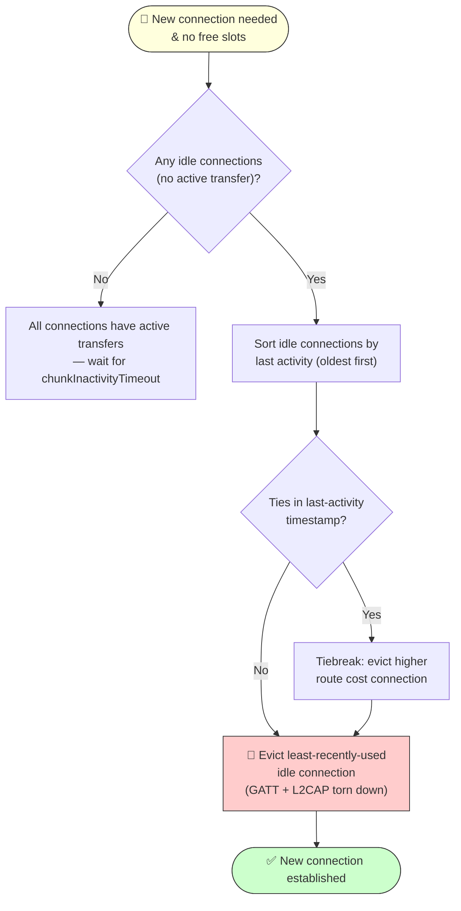

### Connection Role Tie-Breaking

Since every device operates as both BLE central and peripheral, two devices discovering each other could both try to connect simultaneously — creating duplicate connections. A **deterministic tie-breaking rule** prevents this:

| Condition | Central (initiator) | Peripheral (waits) |
|-----------|---------------------|-------------------|
| Peer in lower power mode | Us | Peer |
| Peer in higher power mode | Peer | Us |
| Same power mode | Higher key hash | Lower key hash |

**Power-mode-aware role assignment:** The higher-power device acts as central (initiator), letting the lower-power device use peripheral slave latency to save energy. Both sides compute the same result from advertisement data — no coordination needed.

**Comparison method:** Key hashes are compared as unsigned byte arrays using **lexicographic (left-to-right) byte comparison**. The peer with the lexicographically higher 8-byte key hash acts as central. Both platforms must use identical comparison logic — a cross-platform golden test vector is included in Phase 0 conformance tests.

**Edge cases:**
- **Identical truncated key hashes:** Astronomically unlikely with 8 bytes (64-bit collision resistance), but if it happens, detect the duplicate during Noise XX handshake (same static key on both sessions) and tear down the second connection.
- **One side doesn't see the other's advertisement** (e.g., iOS background overflow): The device that can see the ad connects regardless of the tie-breaking rule. If a connection already exists (the other side connected first), the new connection is rejected at the GATT level.
- **On-demand connections for message delivery** bypass the tie-breaking convention — if a peer has data to send and needs to connect to a specific peer, it initiates regardless of the tie-breaking result. Tie-breaking only governs **mutual-discovery races** (when both sides see each other's advertisement simultaneously), not one-sided reconnection needs. There is no duplicate risk because the other side is not simultaneously trying to connect.

**Simultaneous connection race:** If both peers initiate connections simultaneously (both scanning at the same time), both connections may complete including Noise XX handshake. After handshake, each peer evaluates the tie-breaking rule. The peer in the wrong role (should not be Central per the rule) closes its outbound connection. The correct-role connection survives. `DUPLICATE_CONNECTION_RESOLVED` diagnostic (INFO) emitted with `{peerKey, keptRole, closedRole}`.

### Payload Constraints

- **Maximum message size:** ~100KB (text content + profile photos)
- **BLE MTU reality:** Negotiated MTU is typically 244–512 bytes per write
- At 244 bytes/chunk, a 100KB payload requires **~410 chunks** for a direct (single-hop) transfer. Multi-hop routed transfers use more chunks due to the `routed_message` envelope overhead (43–123 bytes per chunk depending on hop count).

### Chunking & Reassembly

> 📋 **Byte layouts:** See [wire-format-spec.md](wire-format-spec.md) for chunk and SACK header formats.

The library handles fragmentation transparently. Consuming apps send a message; the library chunks, transmits, and reassembles on the other side.

**Design details:**
- Each chunk carries a **sequence number** and **message ID**
- The **first chunk** (sequence number 0) additionally carries the **total chunk count** (2 bytes, little-endian, uint16). This allows the receiver to: (a) pre-allocate a reassembly buffer, (b) detect transfer completion vs. connection drop, and (c) report accurate progress to the consuming app. Subsequent chunks omit this field, saving 2 bytes per chunk.
- Receiver sends **selective ACKs (SACK)** — SACK uses a 128-bit bitmask (two uint64 fields, see chunk_ack wire format above).
- **Progress callbacks** exposed to the consuming app (`onTransferProgress`)
- **Resumable transfers:** On connection drop, the receiver reports the **total bytes received** (byte offset) rather than a chunk sequence number. The sender resumes from that byte offset, chunked at whatever size the new connection negotiates. This enables seamless resume across transport mode changes — a transfer started on GATT (244-byte chunks) can resume on L2CAP (4096-byte chunks) or vice versa, since chunks are simply byte ranges of the E2E ciphertext. After N failed resume attempts, restart the full transfer. Resume vs. restart behavior is **configurable** by the library consumer.

**Encryption pipeline (order of operations):**
1. E2E encrypt the payload (Noise K one-shot — see §5)
2. Chunk the ciphertext into BLE-sized pieces
3. Transmit chunks within the hop-by-hop Noise XX transport session

Chunks are raw byte ranges of the E2E ciphertext — there is no per-chunk AEAD overhead. Integrity is verified once on full reassembly + decryption.

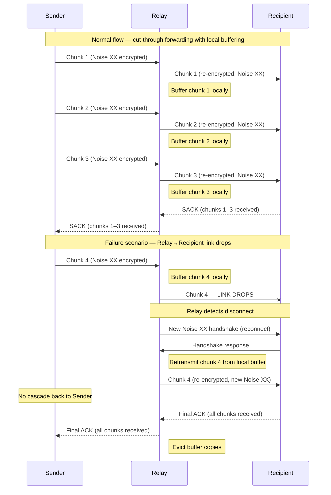

Per-chunk ACKs for 410 chunks add ~2 seconds of radio overhead. SACK reduces this while enabling precise retransmission of only missing chunks. The SACK window **adapts to connection quality** (GATT mode only):
- **Initial SACK interval:** every 8 chunks
- **On 2 consecutive ACK timeouts** (retransmissions needed): halve the interval (multiplicative decrease, minimum every 2 chunks)
- **On 4 consecutive clean ACK rounds** (no retransmissions): increase interval by 2 (additive increase, maximum every 16 chunks)
- **On reconnect:** reset to initial interval (every 8 chunks)
- **AIMD** (Chiu & Jain, 1989): additive increase / multiplicative decrease avoids oscillation in the interference-prone 2.4 GHz band.

```
// SACK AIMD pseudocode (GATT mode only)
var sackInterval = 8              // chunks between SACKs
var consecutiveTimeouts = 0
var consecutiveCleanRounds = 0

fun onAckTimeout():
    consecutiveCleanRounds = 0
    consecutiveTimeouts++
    if consecutiveTimeouts >= 2:
        sackInterval = max(sackInterval / 2, 2)   // multiplicative decrease
        consecutiveTimeouts = 0

fun onCleanAckRound():
    consecutiveTimeouts = 0
    consecutiveCleanRounds++
    if consecutiveCleanRounds >= 4:
        sackInterval = min(sackInterval + 2, 16)   // additive increase
        consecutiveCleanRounds = 0

fun onReconnect():
    sackInterval = 8
    consecutiveTimeouts = 0
    consecutiveCleanRounds = 0
```

**Single-chunk messages:** Messages that fit in a single chunk still use the standard SACK format (chunk_ack with dual bitmask). No special fast-path — the uniform code path minimizes branching complexity for negligible overhead (31-byte SACK vs. a custom single-chunk ACK).

**L2CAP mode differences:** On L2CAP, chunk sizes increase to per-power-mode negotiated sizes (1024–8192 bytes), and L2CAP's credit-based flow control replaces SACK. See the GATT vs. L2CAP comparison table below for a full summary. App-level NACK with `bufferFull` still applies for concurrent transfer cap and buffer limits (see §4).

### Concurrent Transfers & Backpressure

Multiple chunked transfers can be in-flight simultaneously on a single BLE connection. **Interleaving strategy:** Simple round-robin — each active transfer sends one chunk per round. Fair and predictable. The 100KB max message size limits worst-case starvation to ~8 seconds at GATT rates (100KB / ~12KB/s). Weighted scheduling deferred to post-v1 if needed. Each chunk carries a `messageId`, so the receiver demuxes by message ID. The SACK window applies **per transfer** (GATT mode only).

**Per-power-mode concurrent transfer limits:**

| Power Mode | Max Concurrent Transfers |
|------------|------------------------|
| Performance | 8 |
| Balanced | 4 |
| PowerSaver | 1 |

(tracks BLE radio time + relay buffer memory: 8×100KB=800KB at Performance, 1×100KB at PowerSaver)

A peer NACKs with a `bufferFull` reason code when **either** limit is hit: concurrent transfer cap reached OR buffer memory full. The sender receives an explicit rejection and can retry later or try an alternate route.

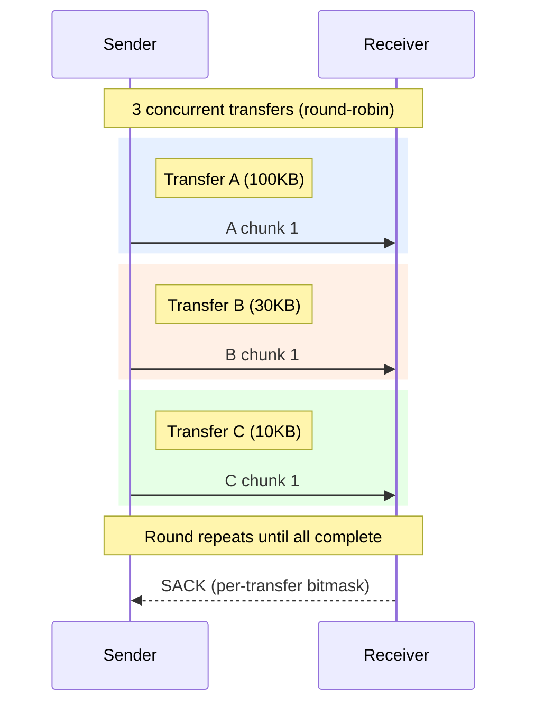

**Chunk inactivity timeout:** 30 seconds (configurable) — see §5 DoS Protection for details.

**Transport-mode summary:**

| Aspect | GATT Mode | L2CAP Mode |
|--------|-----------|------------|
| Chunk size | MTU-dependent (244–512 bytes) | 1024–8192 bytes (per power mode) |
| Flow control | App-level SACK (64-bit bitmask) | L2CAP credit-based (automatic) |
| Backpressure | NACK with `bufferFull` | L2CAP credits + NACK for app-level limits |
| Concurrent transfer limit | Per-power-mode (8/4/1) | Same limits apply |
| Throughput (100KB) | ~5–10 seconds | ~1–2 seconds |

### Expected Latency (Estimates)

Based on BLE physical characteristics (3–5ms per GATT write, ~50–200ms connection overhead, ~10ms Noise XX decrypt per hop):

| Scenario | Estimated Latency | Notes |
|----------|------------------|-------|
| 1KB direct (1 hop) | 50–200ms | Single GATT write + decrypt |
| 1KB routed (2 hops) | 200–500ms | 2× hop latency + relay decrypt/re-encrypt |
| 1KB routed (4 hops) | 500ms–2s | Cumulative hop latency; BLE variability dominates |
| 100KB direct (1 hop, GATT) | 4–8s | ~410 chunks × ~10–20ms per chunk + SACK rounds |
| 100KB direct (1 hop, L2CAP) | 1–3s | ~25 chunks at 4096 bytes; credit-based flow |
| 100KB routed (2 hops, GATT) | 8–20s | Cut-through helps; bottleneck is slowest link |
| 1KB routed (2 hops, PowerSaver) | 5–15s | Route available via Babel Updates; Hello-triggered discovery ~3s + handshake (8s) |

These are estimates to be validated with real-device measurements during Phase 1. PowerSaver mode adds latency due to longer scan/advertising intervals.

**PowerSaver mode warning:** When all peers are in PowerSaver mode, latency increases due to low scan duty cycles. For time-sensitive messaging, consider `customPowerMode` override or an app-level push notification fallback.

### 3.1 Message Flow

#### Outbound Unicast

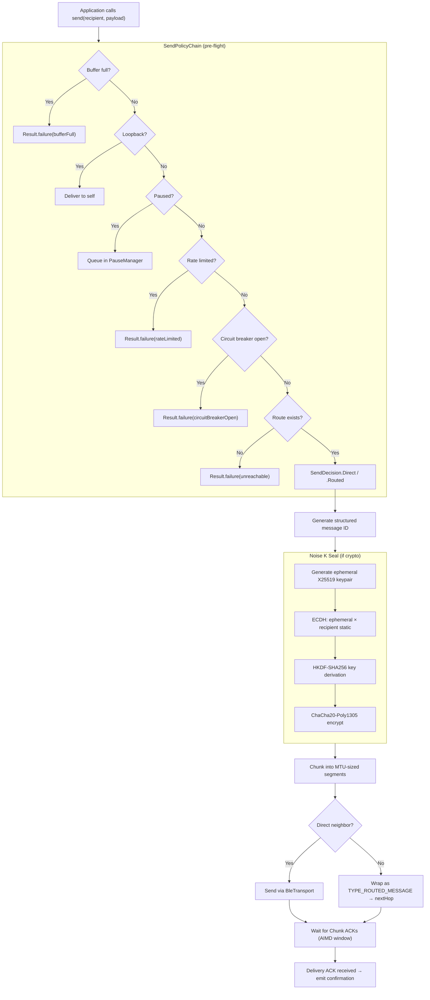

#### Inbound Unicast

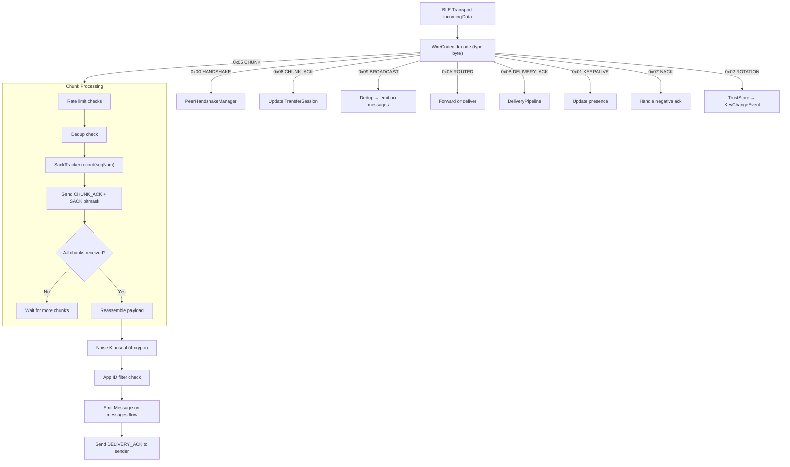

#### Routed Message Forwarding

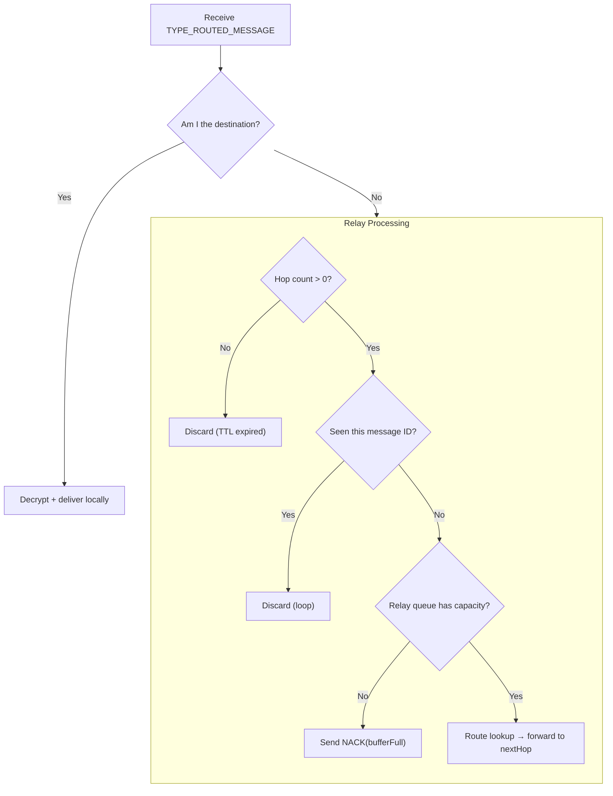

---

## 4. Mesh Routing

### Hybrid Architecture: Babel Routing (RFC 8966 adapted for BLE)

Neighbor discovery uses periodic Hello messages. Multi-hop routes are
propagated via Update messages with a **feasibility condition** that
guarantees loop-freedom at all times (D(B) < FD(A), per EIGRP/DUAL).
See [routing-protocol-analysis.md](routing-protocol-analysis.md)
for the full evaluation of 7 routing RFCs.

### Route Propagation Protocol

Routes are propagated via two wire message types on GATT connections:
- **Hello (0x03)**: Periodic neighbor liveness announcement carrying the sender's
  peer ID and sequence number.
- **Update (0x04)**: Route advertisement carrying destination, metric, sequence
  number, and the destination's 32-byte Ed25519 public key (key propagation).

**Hello → triggered Update flow:**
When a peer receives a Hello from a **new** neighbor (not yet in the presence
table), it responds with its full routing table as a batch of Update messages.
Hellos from known neighbors are treated as keepalives only — no Update flood.

**Feasibility condition (loop prevention):**
Each peer tracks a **feasibility distance** (FD) per destination — the minimum
metric it has ever advertised. An incoming Update is accepted only if:
- The Update's sequence number is strictly newer than the existing route, OR
- The Update's sequence number is the same AND `metric < FD`

This guarantees loop-freedom at all times (RFC 8966 §2.4, derived from EIGRP DUAL).

**Route retraction:**
When a destination becomes unreachable (neighbor lost, route expired), an
Update with `metric = 0xFFFF` (infinity) is sent to all neighbors. This
provides faster, more reliable convergence than explicit route error messages.

**Periodic full Update:**
Every 4× Hello interval, the peer bumps its local sequence number and sends
a full routing table dump to all neighbors. This is a safety net — triggered
Updates handle most topology changes in real time.

**On-demand fallback:**
If no proactive route exists when `send()` is called, a Hello is broadcast
to all neighbors, triggering Update responses that install routes. This
covers the initial cold-start case before periodic Updates have propagated.

```mermaid
sequenceDiagram
    participant A as Peer A
    participant B as Peer B (relay)
    participant C as Peer C

    Note over A,C: A and B are neighbors; B and C are neighbors

    A->>B: Hello (seqNo=1)
    Note over B: New neighbor A → send full routing table
    B->>A: Update(dest=C, metric=1, seqNo=1, pubkey=C_key)
    Note over A: Feasibility check: metric < FD? → Accept
    Note over A: Install route: C via B (cost=1+linkCost)
    Note over A: Register C's public key for E2E encryption

    B->>A: Update(dest=B, metric=0, seqNo=1, pubkey=B_key)
    Note over A: Install direct route to B

    Note over A,C: A can now send E2E-encrypted messages to C via B
    A->>B: RoutedMessage(dest=C, Noise K encrypted)
    B->>C: Forward (re-encrypted hop-by-hop)
```

**Route cache with TTL:** Routes expire after `routeCacheTtlMillis` (default
300 seconds). Expired routes are lazily removed on lookup. The next send to
an expired destination triggers a fresh route discovery.

### RouteCoordinator

`RouteCoordinator` sends periodic Babel Hello messages (which double as
keepalive heartbeats) and periodic full routing table Updates.

Keepalive/Hello intervals vary by power mode — see §7 Power Management table.

### Hop Limits

- **Default max hops:** **10** (configurable)
- **Rationale:** At ≤10 hops, the mesh covers a wide area while keeping per-message relay traffic bounded; higher values increase reach but reduce reliability and increase latency.

### Routing Algorithm: Babel (Loop-Free Distance Vector)

MeshLink uses Babel (RFC 8966) adapted for BLE mesh. Routes are
propagated via Hello/Update messages with a feasibility condition
that guarantees loop-freedom at all times.

**Core operations in `RoutingEngine`:**

- `handleHello(sender, seqNo)` — processes an incoming Hello. If the sender
  is a new neighbor, responds with full routing table as Update messages.
- `handleUpdate(destination, metric, seqNo, publicKey)` — processes an
  incoming Update. Checks the feasibility condition and installs/updates
  the route if accepted. Registers the destination's public key.
- `buildRetraction(destination)` — creates an Update with `metric=0xFFFF`
  (unreachable) for broadcasting when a neighbor is lost.

**Route cache:** Routes are stored in a time-bounded cache. Each entry
records the destination, next-hop neighbor, cost, sequence number, and a
TTL timestamp. Entries expire after `routeCacheTtlMillis` (default 300
seconds). Expired entries are lazily evicted on the next lookup.

**Pending message queue:** When `MeshLink.send()` is called for a destination
with no cached route, the message is placed in a pending queue and a Hello
is broadcast to all neighbors (triggering Update responses). When an Update
installs the needed route, `DispatchSink.onRouteDiscovered()` fires and all
queued messages for that destination are drained and sent.

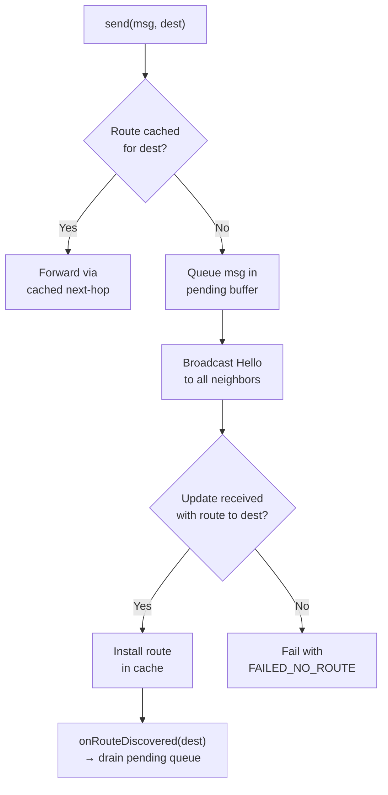

### Route Metric: Composite Link Quality (ETX-Weighted)

Pure hop count is insufficient for BLE — a 2-hop route through strong links outperforms a 1-hop route through a flaky connection. MeshLink uses a **composite route metric** inspired by BATMAN's Transmit Quality (TQ) and Babel's Expected Transmission Count (ETX):

**Per-link cost formula:** `link_cost = RSSI_base_cost × loss_rate_multiplier × freshness_penalty + stability_penalty`

The three input signals and their concrete values:

1. **RSSI base cost** (linear formula — eliminates tier-boundary flapping):

   `base_cost = max(1, round((-RSSI - 50) / 5))`

   | RSSI | Base Cost | Notes |
   |------|-----------|-------|
   | −50 dBm | 1 | Excellent |
   | −60 dBm | 2 | Good |
   | −70 dBm | 4 | Fair |
   | −80 dBm | 6 | Weak |
   | −90 dBm | 8 | Marginal |

   Linear formula prevents 2× cost jumps at arbitrary tier boundaries (e.g., -74 dBm vs -76 dBm was cost 2 vs cost 4). The `routeCostChangeThreshold` (30%) still dampens minor fluctuations.

2. **Loss rate multiplier** (from Chunk ACK retransmission ratio on active Transfers): `1 + (loss_rate × 10)` — so 0% loss = ×1.0, 5% loss = ×1.5, 20% loss = ×3.0

3. **Stability penalty:** `max(0, 3 − consecutive_stable_intervals)` — new links start at +3, decays to 0 after 3 consecutive stable keepalive intervals (no GATT disconnects). Penalizes recently-flapping connections.

4. **Freshness penalty** (derived from last measurement age):
   - Last loss measurement within 2× `keepaliveIntervalMillis`: `freshness_penalty = 1.0` (proven quality)
   - Last loss measurement older than 2× `keepaliveIntervalMillis`: `freshness_penalty = 1.5` (unknown quality)
   - This biases routing toward links with recent, proven quality data. Idle links that haven't been tested recently appear 50% more expensive, preventing the routing table from favoring untested paths. Precedent: BATMAN-adv V probes idle links to feed estimation logic; Babel (RFC 8966 §3.5.2) decays idle links toward "unknown quality."

**Cost range:** ~1 (excellent/reliable/stable) to ~30 (marginal+loss+new). Typical operational range assumes ≤20% loss — links with higher loss are functionally unusable.

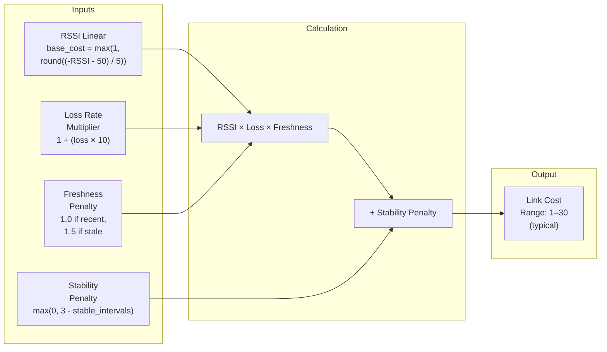

**Route cost** = sum of per-link costs along the path. Update messages carry the **cumulative metric** from the destination. The route cache selects the route with the **lowest total cost** (not just lowest hop count) when multiple routes are available.

**Fallback:** If link quality data is unavailable (new Neighbor, no Transfers yet), cost defaults to 1.0 per hop (equivalent to hop count). Link quality improves route selection over time as data accumulates.

### Route Expiry

Routes in the route cache expire after `routeCacheTtlMillis` (default
300 seconds). Expired entries are lazily removed on the next route lookup. If a
message needs to be sent to an expired destination, a fresh route discovery is
triggered automatically.

**Power mode interaction:** Route cache TTL is not affected by power mode
transitions. The short, fixed TTL ensures routes stay fresh regardless of the
device's power state.

### Route Failure Recovery

**Route failure recovery:** Broken routes are detected via delivery timeout and removed from the route cache immediately. The next send attempt to the same destination triggers a fresh route discovery. Route retractions (metric=0xFFFF) propagate failure information to neighbors for fast convergence.

### Multipath Routing (Backup Routes)

MeshLink maintains **up to 2 routes** per destination in the Routing Table:

| Route | Selection Criteria |
|-------|-------------------|
| **Primary** | Lowest route cost with highest sequence number (best path) |
| **Backup** | Second-lowest route cost, via a **different Next-Hop** than primary |

The backup route must use a different Next-Hop — two routes through the same Neighbor provide no redundancy if that Neighbor fails.

**Failover behavior:**
1. Primary route fails (GATT disconnect, delivery timeout) → instantly switch to backup
2. Promote backup to primary. **Backup routes are used regardless of age** — a stale backup is better than no route. If the backup points to a peer that has moved, the forwarding attempt fails fast (BLE connection timeout ~5s), and the message is buffered. Route cache TTL expiry cleans up truly stale entries.
3. Wait for the next route discovery to find a new backup
4. If no backup exists → buffer the message and wait for route discovery (up to buffer TTL)

**Best-effort multi-path:** MeshLink does NOT maintain explicit backup path state — backups are a natural consequence of the route cache, which may store alternative routes from Babel Updates via different neighbors. If neither primary nor backup succeeds, the message is buffered for TTL duration and a fresh route discovery is initiated. No proactive backup path probing or maintenance is performed.

**Interaction with route failure:** When a route is detected as broken (delivery timeout, GATT disconnect), the backup (if it exists and doesn't use the same failed link) becomes primary immediately. A fresh route discovery restores full route knowledge within `routeDiscoveryTimeoutMillis`.

**Routing table authority:** The route cache is the sole authority for next-hop selection, even when a direct GATT connection exists to the destination. The composite route cost already accounts for direct link quality — a poor direct link (Marginal RSSI, high loss) will have a higher cost than a relay path through strong links. Bypassing the route cache for direct connections would undermine the quality-aware routing that the route cache provides.

### Topology Change Handling

With Babel, topology changes are handled via triggered Updates and route
retractions:

| Event | Action |
|-------|--------|
| New Neighbor discovered (GATT + Noise XX complete) | Neighbor added to connection table. No route exchange needed — routes are discovered on demand when messages are sent. |
| Neighbor transitions to Gone (Presence Eviction) | All cached routes using that neighbor as next-hop are invalidated. Route retraction Updates sent to remaining neighbors. |
| Route failure (delivery timeout) | Cached route removed. Hello broadcast triggers Update-based rediscovery on next send attempt. |

**Low background routing traffic:** Babel generates periodic Hello messages
(~60 bytes per neighbor per Hello interval) and full routing table Updates
every 4× Hello interval. This is ~0.06% of BLE bandwidth — negligible.
Triggered Updates on topology changes provide fast convergence without
waiting for periodic intervals.

### Route Settling Time & Discovery Rate Limiting

**Discovery rate limiting:** To prevent discovery storms, a peer sends at most **one
Hello broadcast per destination per `routeDiscoveryTimeoutMillis` window**. If a
second send to the same destination arrives while discovery is already in
progress, the message is queued in the pending buffer and drained when the
route is installed via Update.

**Exceptions (immediate rediscovery):**
- **Route failure** (delivery timeout, GATT disconnect) — immediately invalidates
  the cached route and allows a fresh discovery on the next send attempt.

### Loop Prevention: Visited List

Each routed message carries a **Visited List** — the public key (or truncated hash) of every peer that has forwarded this message. A peer that sees itself in the visited list drops the message. **Relay processing sequence:** (1) receive message, (2) check visited list for own hash → if present, DROP (loop detected), (3) **add own hash** to visited list, (4) look up next-hop in routing table, (5) forward message with updated visited list. The relay adds its hash **before forwarding** — this ensures the next relay sees the current relay in the visited list, preventing loops via asymmetric return paths. The dedup set handles concurrent multipath copies arriving at the same relay simultaneously.

The visited list uses **8-byte SHA-256-64 key hashes** (SHA-256 truncated to 64 bits of Curve25519 public key digests) rather than full 32-byte public keys. At 4 hops max, this costs **32 bytes** (4 × 8 bytes). Collision risk at 64 bits (~2³² birthday bound) is negligible for any practical mesh size (far exceeding any realistic number of mesh devices). The hop counter provides a secondary backstop.

**Hash collision risk:** SHA-256-64 collision probability is ~N²/2⁶⁴, negligible for meshes ≤10,000 peers. No mitigation implemented. A `VISITED_LIST_LOOP_DETECTED` diagnostic is emitted whenever a message is dropped due to visited-list match, carrying `{messageId, matchedHash, hopCount}` for forensic analysis.

**Origin peer Visited List:** The origin sender transmits with `visited_count=0` — it does not add itself to the visited list. The origin's identity is already encoded in the `sender` field of the routed_message envelope. The first relay receives V=0, adds its own hash (V=1), and forwards. This saves 8 bytes on single-hop messages.

### Message Deduplication

With multi-hop routing and store-and-forward, the same message can arrive at a peer via multiple paths. Every peer maintains a **recently-seen message ID set**, bounded by **both time and count** (whichever limit is hit first):

- **Time bound:** entries older than `maxHops × bufferTTL` are evicted (default: 10 × 5 min = 50 min). Each relay starts its own independent TTL from the moment it receives a message (no shared clock required), so a message can theoretically survive `maxHops × bufferTTL` total. The dedup time bound must cover this maximum lifespan. The 50-minute dedup window (`maxHops × bufferTTL` = 10 × 5 min) covers the theoretical maximum lifespan of a message traversing the full relay chain — one `bufferTTL` per hop, sequentially. This ensures that even messages spending the maximum buffer time at each relay are caught by dedup on redelivery, preventing duplicates after app restart or during partition heal.
- **Count bound:** default maximum 10,000 entries (configurable via `dedupMaxEntries`). Rationale: at 30 msg/s sustained, 10,000 entries provide ~333 seconds (5.5 min) of coverage — slightly above the 5-minute bufferTTL. Memory: 20 bytes × 10,000 = 200KB (acceptable). Beyond 30 msg/s, earliest entries evict before TTL; duplicate delivery handled by app-layer message ID dedup.
- On receiving any message (routed, broadcast, or buffered), check if `messageId` is in the seen set
- If seen → drop silently (do not forward, do not deliver to app)
- If new → add to seen set, process normally

This is critical to prevent duplicate delivery to the consuming app and redundant mesh bandwidth usage.

**Dedup persistence:** In-memory only. On crash, messages from the last few seconds may be redelivered — consuming apps should deduplicate by messageId. Disk persistence deferred to post-v1.

**Concurrency model:** The dedup set is **in-memory** — all lookups hit the in-memory `HashMap` directly (zero contention). DeliveryPipeline owns the dedup set and processes operations serially within its coroutine scope.

**Clock handling:** Dedup TTL uses **monotonic system uptime** (`SystemClock.elapsedRealtime()` on Android, `ProcessInfo.systemUptime` on iOS), immune to user clock changes.

**Clock source rule (applies to all timers):** All operational timers in the library (buffer TTL, dedup window, route cache TTL, sweep timers, chunk inactivity timeout, handshake timeout, SACK retransmission, engine circuit breaker) use **monotonic clock** — immune to NTP jumps, timezone changes, and user clock manipulation. The only exception: replay counter 30-day per-sender expiry uses wall-clock (requires calendar-scale duration; monotonic resets on reboot). **NTP jumps never affect library behavior** beyond replay counter housekeeping.

**Dedup eviction:** LRU — oldest entries evicted first regardless of sender.

**Dedup capacity scaling:** At sustained mesh-wide rates up to ~30 msg/s (~90 active senders), the 10,000-entry dedup set provides full 5-minute TTL coverage. Beyond this, earliest entries may evict before TTL expiry, resulting in rare duplicate delivery handled by app-layer message ID dedup. At 50 peers × 20 msg/min = ~17 msg/s, the dedup set comfortably provides >10 minutes of coverage — 2× the default `bufferTTL`.

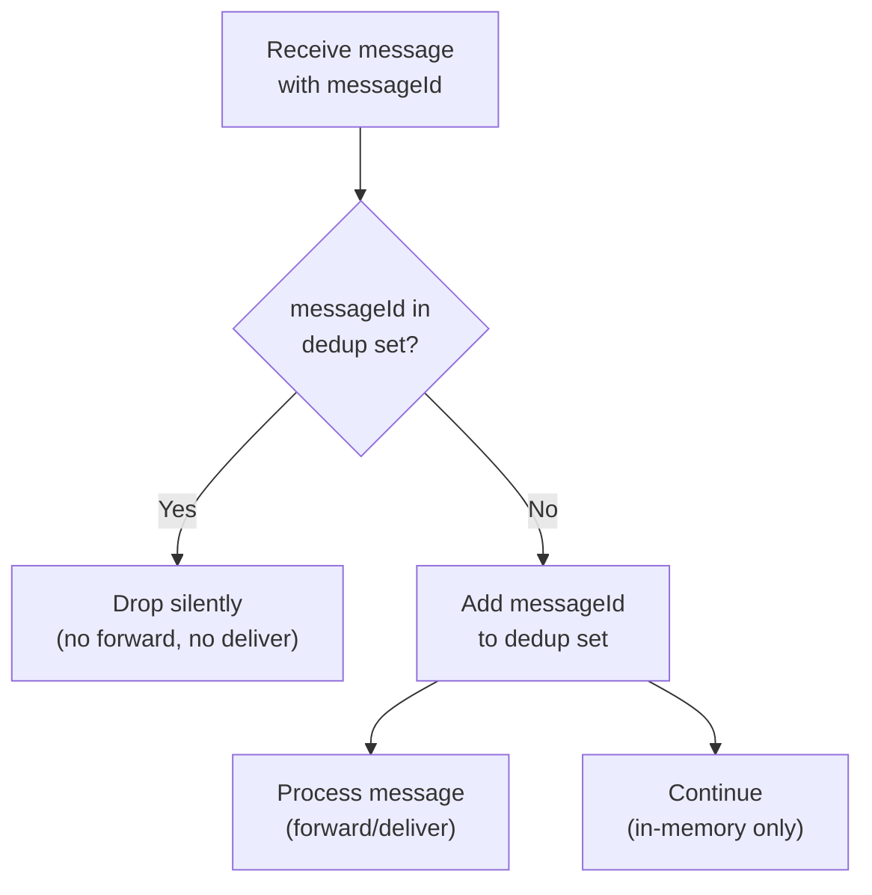

### Message Buffering (Store-and-Forward)

When the recipient is temporarily unreachable, mesh nodes buffer encrypted messages:

- **Who buffers:** Any peer in the mesh (messages are E2E encrypted — buffering peers cannot read content)
- **Default TTL:** 5 minutes (configurable by library consumer)
- **Per-peer independent TTL:** Each peer starts its own 5-minute countdown from the moment it receives the message. No shared clock is needed — TTL is purely local. This means a message can theoretically survive up to `maxHops × bufferTTL` (default 20 minutes) across the full relay chain. **No wire-format TTL.** Per-peer buffer TTL + visited-list loop prevention + 20-min dedup window provide sufficient message lifetime bounds.
- **Buffer size:** Fixed default **1,048,576 bytes (1 MB)**, configurable via `bufferMaxSize` (min 256KB, max 8MB). Covers 10× 100KB messages. No auto-adaptive sizing in v1 — avoids platform-specific memory queries and non-deterministic behavior.

**OOM handling:** If buffer allocation fails, emit `BUFFER_OOM` diagnostic and retry with half the configured size (floor: 256KB).

**Low-memory response:** On OS memory warning (`TRIM_MEMORY_RUNNING_CRITICAL` on Android, `didReceiveMemoryWarning` on iOS), the library performs **tiered memory shedding**:
1. **Flush relay buffers** — evict all relay message buffers (own-outbound preserved). **Active cut-through relay transfers are exempt** — only their idle buffer copies (completed relays) are evicted. Relay senders will retry via SACK.
2. **Shrink dedup set** — evict oldest 50% of dedup entries. Risk: some recently-seen messages may be redelivered as duplicates (acceptable under memory pressure).
3. **Drop lowest-priority connections** — reduce active connections to 50% of current power mode limit, evicting idle connections LRU-style (active transfers evicted last). Active cut-through transfers that were exempt from tier 1 ARE evicted at this tier — a **NACK (`chunk_ack` with bitmask=0)** is sent to the sender so they retry immediately instead of waiting for `chunkInactivityTimeout`.

Each tier is triggered only if the previous tier was insufficient. A `memoryPressure` diagnostic event is emitted at each tier.

**Engine state is NOT shed under memory pressure.** Routing cache and peer table are naturally bounded by `routeCacheTtlMillis` and BLE range. Shedding engine state provides negligible relief compared to the buffer (256KB–8MB configurable, typically 512KB–4MB at runtime) and dedup set (200KB) targeted by the 3 tiers. Route cache TTL expiry and sweep timers already evict stale entries. Post-v1: if Wi-Fi transport expands reachability to 1000+ peers, LRU eviction may be added.

- **Buffer eviction policy** (when buffer is full, applied in tier order):

  | Eviction Tier | Description | Order within tier |
  |---------------|-------------|-------------------|
  | Tier 1 | Messages with no known route | Lowest priority first, then lowest remaining TTL, then FIFO tiebreaker |
  | Tier 2 | Relay traffic with known routes | Lowest priority first, then lowest remaining TTL, then FIFO tiebreaker |
  | Tier 3 | Own outbound messages | Lowest priority first, then lowest remaining TTL, then FIFO tiebreaker |

  Within each tier, messages are sorted **priority ascending** (low before normal before high), then **TTL remaining ascending**. **Relay cap overflow:** When relay traffic hits 75%, new relay messages evict the lowest-value existing relay message.

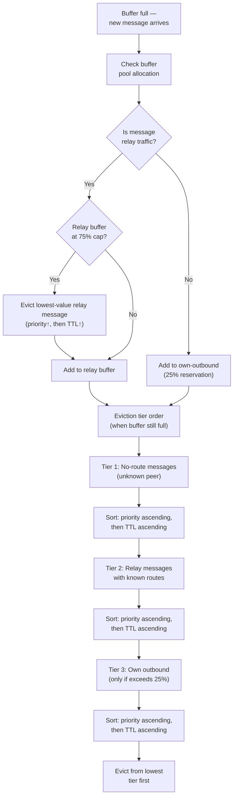

- The `bufferTTL` is a maximum, not a guarantee — early eviction under memory or capacity pressure is expected.
- **Metadata exposure accepted for v1:** Buffering peers can observe sender/recipient public keys, message sizes, and timestamps. A malicious peer could build a social graph of "who talks to whom." This tradeoff is documented and deferred to post-v1.

**Relay buffer accounting:** The buffer pool is a **shared pool** for both own-outbound messages and relay-forwarded traffic, with a **75% relay cap**. Relay traffic may use up to 75% of the configured pool; the remaining **25% is reserved for the device's own outbound messages** — guaranteeing the device can always queue at least one full 100KB message regardless of relay load. The cap is soft: if no own-outbound messages are queued, relay traffic may use the full pool. The cap only activates when both own-outbound and relay traffic compete for space.

**Buffer eviction policy:** When the relay buffer is full, messages are evicted by **priority first** (lowest priority evicted first), then **TTL** (closest to expiry evicted first), then **FIFO** (oldest arrival first). This prevents priority inversion where high-priority messages are evicted before low-priority ones simply because they have shorter TTL. Precedent: Bluetooth Mesh spec §3.5.3.4 uses priority+TTL composite key; Thread (OpenThread) uses priority+remaining_lifetime.

**Sort key:** `(priority ASC, remaining_ttl_ms ASC, arrival_time ASC)`. Priority uses the existing `message_priority` field (0=low, 1=normal, 2=high). Within the same priority level, exact remaining TTL in milliseconds determines order — no bucketing. FIFO (arrival order) breaks ties when both priority and remaining TTL are identical.

### Relay Forwarding Model: Cut-Through with Local Buffer

Relay nodes use **cut-through forwarding** — chunks are forwarded to the next hop as they arrive, without waiting for full message reassembly. This minimizes latency (pipeline effect) and is the primary forwarding mode.

**Local buffer for reliability:** While forwarding, the relay **keeps a copy** of all forwarded chunks in its buffer. If the next-hop BLE connection drops mid-transfer:
1. The relay reconnects to the next hop (with a fresh Noise XX handshake)
2. The relay retransmits chunks from its local buffer — **no cascading restart** back to the original sender
3. The buffer copy is evicted once the next hop ACKs the final chunk (transfer complete) or when the buffer TTL expires

**Why cut-through with buffer:** Memory: 100KB × max 16 connections = 1.6MB worst-case. Typical occupancy is much lower (most transfers complete without retry).

**Relay buffer copy eviction:** Evicted at the **chunk inactivity timeout (30s)** or on receiving the **final chunk ACK** from the next-hop — whichever comes first. Relay buffer copies count toward the 75% relay cap in the main buffer pool.

**Battery death mid-transfer:** If a receiving device's battery dies during a multi-chunk transfer, the reassembly buffer and any unflushed dedup entries are lost. The sender times out (30s chunk inactivity) and retries the entire message. Since the original transfer never completed delivery, this is a bandwidth cost (re-sending chunks), not a correctness issue — no duplicate delivery occurs at the application layer.

**Hop-by-hop re-encryption:** Each chunk arriving at a relay is encrypted under the inbound Noise XX session. The relay decrypts it (revealing the E2E ciphertext bytes, NOT the plaintext) and re-encrypts under the outbound Noise XX session before forwarding. This is a per-chunk operation but involves only symmetric crypto (ChaCha20-Poly1305), which is fast.

---

## 5. Security

### Two-Layer Encryption Architecture

MeshLink uses two distinct encryption layers to secure messages over multi-hop routes:

| Layer | Scheme | Purpose | Scope |
|-------|--------|---------|-------|
| **End-to-end (E2E)** | Noise K (`Noise_K_25519_ChaChaPoly_SHA256`) | Encrypt payload so only the final recipient can read it; authenticates sender | Sender → Recipient |
| **Hop-by-hop** | Noise XX (`Noise_XX_25519_ChaChaPoly_SHA256`) | Encrypt transport between adjacent peers | Peer → Adjacent Peer |

### E2E Layer: Noise K (One-Shot, 0-RTT, Sender-Authenticated)

The sender knows the recipient's static Curve25519 public key (exchanged during discovery/handshake). Using the **Noise K pattern** (sender = initiator), the sender:
1. Generates an ephemeral Curve25519 keypair (`e`)
2. Computes DH(e, rs) + DH(s, rs) where `rs` = recipient's static Curve25519 key, `s` = sender's static Curve25519 key
3. Derives a symmetric key from the DH outputs via the Noise KDF chain (HKDF with SHA-256)
4. Encrypts the sealed payload with ChaCha20-Poly1305 using the derived key
5. Output: `ephemeral_pubkey(32 bytes) + ciphertext(N + 16 bytes AEAD tag)`

**Preconditions:** Sender has the recipient's Curve25519 public key (from the peer table, populated during Noise XX handshake, derived from Ed25519). Recipient has the sender's Curve25519 public key (same source). Both keys must be present before encryption/decryption is attempted — messages to unknown peers fail at send time with `recipientKeyUnknown`.

The recipient decrypts by: loading the sender's static Curve25519 key from the peer table, computing the same DH operations with their own static private key and the ephemeral key from the message, deriving the same symmetric key, and decrypting. If decryption succeeds, the sender is authenticated.

**Properties:**
- **Confidentiality:** Recipient-only decryption
- **Sender authentication:** Built into Noise K handshake
- **Sender forward secrecy:** Ephemeral key per message
- **Recipient forward secrecy:** Session-key mixing — after Noise XX handshake, a 32-byte session secret (derived from the shared chaining key) is mixed into the per-message HKDF key derivation. Session secrets are memory-only; deleted on restart. Compromising the static key without the session secret cannot decrypt past messages from that session.
- **No server/prekey distribution needed**
- **Prerequisite:** Recipient must know sender's public key (via Noise XX handshake)

**Edge case — message before route discovery:** Messages to recipients who lack the sender's public key are dropped (not buffered — buffering unverifiable messages is an attack vector). The sender's retry mechanism handles recovery; route discovery and handshake propagate keys before retry timeout.

**Ed25519 key derivation:** The Curve25519 key is derived from the Ed25519 identity key (see Identity section above). Invalid Ed25519 public keys from peers are rejected during TOFU verification before conversion is attempted.

**Sealed payload layout (Noise K):**

| Offset | Size | Field |
|--------|------|-------|
| 0 | 8 bytes | Replay counter (uint64, little-endian) |
| 8 | 1 byte | Flags (bit 0: appId present, bits 1–7: reserved (must be 0; receivers MUST silently ignore non-zero reserved bits for forward compatibility)) |
| 9 | 0 or 8 bytes | App ID hash (`SHA-256-64(appId.toUTF8())`; present only when flags bit 0 = 1) |
| 9 or 17 | N bytes | Message data (plaintext) |

The sender's identity is authenticated by the Noise K handshake itself — no explicit public key or signature in the payload. This saves 96 bytes per message compared to the Noise N + signature approach.

**Recipient verification:** Noise K decryption succeeds only if the sender's static key matches the key used during encryption. The recipient retrieves the sender's static Curve25519 key from the peer table and uses it in the Noise K decryption. Failed decryption = sender authentication failure.

**Note on broadcasts:** Broadcast messages do NOT use Noise K (no single recipient). Broadcasts are **Ed25519-signed but unencrypted** — the Ed25519 signature and sender public key are required in the broadcast envelope (see §6).

```mermaid
flowchart LR
    subgraph Sender
        A["Plaintext\nmessage"] --> A2["Compress\n(zlib)"]
        A2 --> B["E2E encrypt\n(Noise K)"]
        B --> C["Chunk\nciphertext"]
        C --> D["Hop-by-hop encrypt\n(Noise XX)"]
        D --> E["BLE transmit"]
    end

    subgraph Relay
        G["Receive"] --> H["Hop-by-hop decrypt\n(Noise XX inbound)"]
        H --> I["E2E ciphertext\n(opaque)"]
        I --> J["Hop-by-hop re-encrypt\n(Noise XX outbound)"]
        J --> K["Forward"]
    end

    subgraph Recipient
        L["Receive"] --> M["Hop-by-hop decrypt\n(Noise XX)"]
        M --> N["Reassemble\nchunks"]
        N --> O["E2E decrypt\n(Noise K)"]
        O --> O2["Decompress\n(zlib)"]
        O2 --> P["Plaintext\nmessage"]
    end

    E --> G
    K --> L

    style I fill:#f9f,stroke:#333,stroke-width:2px
    style Relay fill:#fff3cd,stroke:#856404
```

**Payload compression:** When `compressionEnabled = true` (default), payloads are compressed with raw DEFLATE (RFC 1951) **before** E2E encryption (compress-then-encrypt). Compression wraps the payload in a 1-byte envelope: `0x00` prefix for uncompressed payloads (below `compressionMinBytes`, default 128 bytes) or `0x01` + 4-byte LE original size + raw DEFLATE data. The envelope is transparent to relays — it sits inside the E2E ciphertext. Platform implementations use `java.util.zip.Deflater(BEST_SPEED, true)`/`Inflater(true)` with instance reuse (JVM/Android), Apple's `COMPRESSION_ZLIB` which already produces raw DEFLATE (Apple), and `deflateInit2` with `windowBits = -15` for raw DEFLATE (Linux). See [wire-format-spec.md § Compression Envelope](wire-format-spec.md#compression-envelope-inside-encrypted-payload) for the binary layout.

### Hop-by-Hop Layer: Noise XX

Uses `Noise_XX_25519_ChaChaPoly_SHA256` for mutual authentication with session-level forward secrecy between adjacent nodes.

**Hash function choice:** SHA-256: hardware-accelerated on all modern ARM64 devices via ARM Crypto Extensions (2–5 GB/s), natively available on all target platforms (Java JCA, Android, iOS CryptoKit), and provides equivalent security at 128-bit truncation for identifier purposes. No third-party crypto library required.

Each BLE GATT connection between two mesh nodes follows a strict **connection establishment sequence** before the link is usable:

1. **BLE connect** — OS-level GATT connection (`connectionTimeout`, default 10s)
2. **MTU negotiation** — request maximum MTU; reject if effective MTU < 100 bytes (`MTU_TOO_SMALL` diagnostic)
3. **GATT service discovery** — `discoverServices()` → `discoverCharacteristics()` (10s timeout; failure → disconnect + `DISCOVERY_TIMEOUT` diagnostic). If the MeshLink service UUID (`0x7F3A`) is not found among discovered services → disconnect + `SERVICE_NOT_FOUND` diagnostic.
4. **Noise XX handshake** — mutual authentication + key exchange (`handshakeTimeout`, default 8s)

**Total budget:** 23 seconds maximum from scan to encrypted session. Each step must complete before the next begins. Failure at any step → disconnect + appropriate diagnostic event. No partial-step retry — reconnection occurs via normal BLE discovery.

After the Noise XX handshake completes, all data flowing over that connection (chunks, control messages, forwarded envelopes) is encrypted with the resulting session transport keys.

Noise XX provides mutual authentication, session-level forward secrecy, and simplicity with no server required. Battle-tested in WireGuard and Lightning Network. See [Appendix A](#appendix-a-decision-records) for alternatives evaluated.

**Noise XX handshake payload sequencing:** Each side exchanges version, capability, and L2CAP PSM within the encrypted handshake messages:

| Message | Direction | Encrypted? | Payload |
|---------|-----------|------------|---------|
| Message 1 (`→ e`) | Initiator → Responder | No | Ephemeral key only (no payload) |
| Message 2 (`← e, ee, s, es`) | Responder → Initiator | Yes (responder authenticated) | `version(2) + capability(1) + l2cap_psm(2)` = 5 bytes |
| Message 3 (`→ s, se`) | Initiator → Responder | Yes (both authenticated) | `version(2) + capability(1) + l2cap_psm(2)` = 5 bytes |

Both payloads are encrypted and use the **blanket little-endian encoding rule**: `version` = uint16 LE (major×256 + minor), `capability` = 1 byte (bit 0 = L2CAP, bits 1–7 reserved; unknown bits silently ignored per §12 Protocol Governance & Versioning), `l2cap_psm` = uint16 LE (`0x0000` = no L2CAP support). **Forward-compatible payload extension:** Receivers MUST accept payloads ≥5 bytes and silently ignore any trailing bytes beyond the first 5. This allows minor versions to append new fields (e.g., max-chunk-size hint) without a major version bump. After Message 3, both peers know each other's protocol version, L2CAP capability, and PSM. Version negotiation rules (§12 Protocol Governance & Versioning) apply to the exchanged versions. If version negotiation fails (gap > 1 major version), the connection is torn down immediately.

**Extension model:** Capability bits (8 flags in the capability byte) are the sole mechanism for feature negotiation. Both peers AND their capability bytes; features requiring unsupported bits are disabled for that session. No TLV encoding — the 8-bit capability field provides sufficient feature flags for v1–v3. The reserved 5th payload byte is set to `0x00` by v1 peers and ignored if non-zero. Capability byte exhaustion (all 8 bits used) is addressed at the next major version bump.

**Payload framing:** The Noise framework delivers handshake payloads as discrete `ByteArray` blobs — they are length-delimited by the Noise protocol itself. There is no risk of trailing bytes polluting the BLE read buffer. Receivers read the first 5 bytes `{version, capability, PSM}` and silently discard any trailing bytes in the same blob.

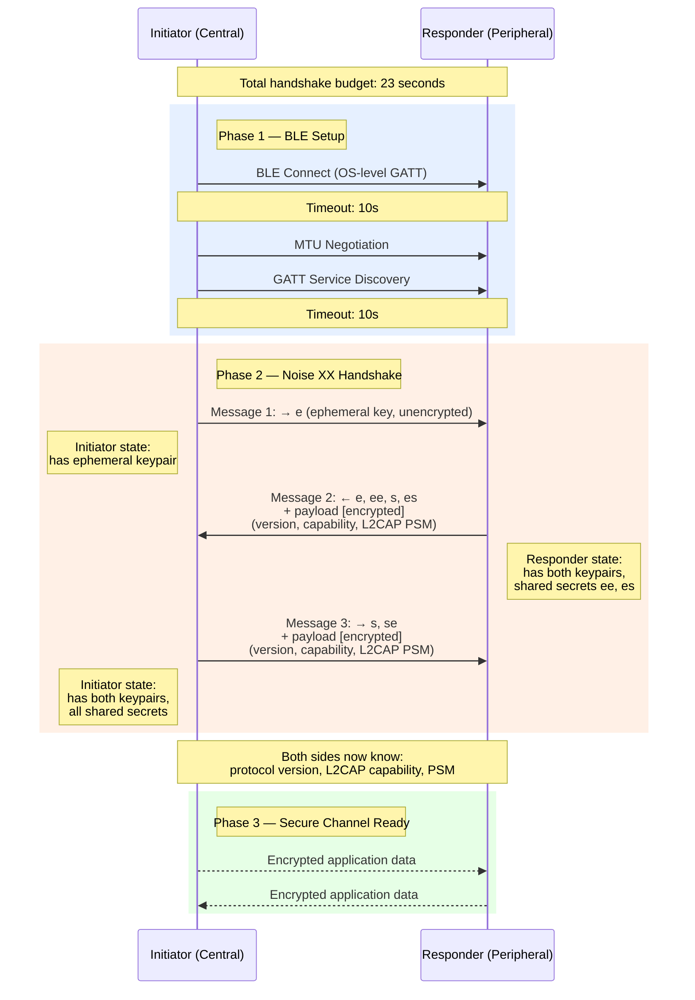

**Noise XX failure recovery:** If the handshake fails mid-way (partial bytes exchanged, invalid message, or `handshakeTimeout` expires after 8 seconds): discard all Noise state for that session, disconnect the GATT connection, and let normal BLE discovery re-establish contact. No immediate retry — the next connection attempt occurs when BLE scanning re-discovers the peer's advertisement. This avoids handshake storms when a peer is temporarily misbehaving. 8s tolerates real-world BLE 2.4 GHz congestion where GATT write-with-response latency can spike to 500ms-2s under WiFi interference. **Per-message failure behavior:** Message 1 invalid/corrupt → responder silently disconnects (no Noise state created). Message 2 invalid → initiator discards Noise state + disconnects + emits `HANDSHAKE_FAILED` diagnostic. Message 3 invalid → responder discards Noise state + disconnects + emits `HANDSHAKE_FAILED`. In all cases, the peer is NOT blocklisted — the next BLE discovery triggers a fresh handshake attempt.

### Replay Protection

A malicious relay could record and replay a `RoutedMessage` envelope. To prevent this, the E2E encrypted payload includes a **replay counter** (uint64) per sender. The recipient maintains a **64-counter sliding window** per sender (DTLS-style, per RFC 6347 §4.1.2.6): track the highest-seen counter N and a 64-bit bitmap for counters [N−63, N]. Accept any counter in this range whose bit is unset. Reject counters < N−63 as too old, or any counter whose bit is already set as replayed. This tolerates message reordering from multi-path routing (gap typically 1-3 messages) while maintaining replay protection. The replay counter store is **global across all connections**, keyed by the sender's Ed25519 public key (not by connection). This prevents cross-connection replay attacks — if the same sender connects via two different relay paths, the same counter window applies. Cost: 16 bytes per sender in the peer table (8 bytes highest counter + 8 bytes bitmap).

**Persistence requirement:** Replay counter persistence uses an **asymmetric strategy** optimized for the different risk profiles of outbound vs. inbound counters:

- **Outbound (sender's) counter — pre-increment persist:** The counter is written to platform secure storage (EncryptedSharedPreferences / Keychain) **before** the message is sent. Sequence: `persist(counter+1) → increment in memory → send`. If the process crashes after persist but before send, the counter jumps by 1 (the receiver's sliding window tolerates gaps). If the process crashes before persist, the counter is unchanged and the message was never sent. This eliminates any replay vulnerability window. Cost: 1 synchronous write per outbound message (~1-5ms on mobile, negligible relative to BLE latency).

- **Inbound (per-sender highest-seen) counter — periodic persist:** The per-sender sliding window state is flushed to secure storage **every 1 second**. Worst-case replay window on crash: 1s of messages. Cost: ~1 additional write/second per active sender (negligible on modern flash). Defense-in-depth: the dedup set provides backup duplicate detection.

This creates **defense-in-depth**: replay counter (primary) + dedup set (backup). Both must fail simultaneously for a duplicate to reach the consuming app after a crash.

**Timing side-channel analysis:** All cryptographic operations (Curve25519 DH, ChaCha20-Poly1305 AEAD) use platform crypto constant-time implementations (Java JCA for JVM/Android, iOS CryptoKit for iOS). The pure Kotlin Ed25519/X25519 fallback (Android API 26–32) uses constant-time field arithmetic. BLE transport jitter (~5ms) makes sub-microsecond timing attacks on peer table lookups impractical. No additional constant-time mitigations are required for v1. Revisit if a lower-jitter transport (Wi-Fi Direct) is added post-v1.

**Physical tamper resistance:** Physical device compromise (flash memory access, counter reset) is outside the threat model. An attacker with physical access can extract the Ed25519 private key, making counter manipulation redundant. Apps requiring tamper resistance should use hardware-backed keystores (Android StrongBox, iOS Secure Enclave) for identity storage — MeshLink supports this via the platform secure storage abstraction.

**Counter store eviction policy:** Per-sender replay counter store: **1,000 entries** (configurable via `replayCounterMaxEntries`, LRU) with **30-day** inactivity threshold (measured in **monotonic uptime**, consistent with buffer and dedup TTLs). On app relaunch after reboot, all persisted entries' last-activity timestamps are reset to "now" (monotonic) — the 30-day window restarts from each reboot. The LRU capacity (1,000 entries) provides a hard eviction backstop regardless of time. Rationale: at 30 msg/s sustained with 50 unique senders, 1,000 entries cover the full 5-minute bufferTTL. Memory: 16 bytes × 1,000 = 16 KB (negligible). Beyond 50 senders, oldest entries evict; brief replay window for rare senders — acceptable. Evicted senders' messages are accepted regardless of counter value. Apps in adversarial environments should add application-layer deduplication.

### Denial-of-Service Protection

A malicious peer in BLE range could flood the mesh with fake messages, exhausting dedup sets and buffers on honest peers. MeshLink mitigates this with two mechanisms:

**Per-sender-per-neighbor rate limiting:**

| Aspect | Detail |
|--------|--------|
| Limit | 20 messages/min per originating sender, per neighbor (`peerRateLimit`) |
| Window | Monotonic-clock 60-second sliding window |
| Enforcement | At the **relay** (earliest forwarding point), not final destination |
| Scope | **User-level messages** only (routed_message + broadcast) |
| Exempt | Route control (Hello, Update, keepalive), chunk_ack, delivery_ack, handshake (control-plane) |
| Counting | Per logical message (complete payload), not per chunk — keyed on first-seen `messageId` |
| Overflow | NACK + `rateLimitHit(peer, sender)` diagnostic (once per sender per 60s window) |

Rationale: 20/min = 4× typical app messaging rate (~5 msg/min). At 50 senders × 20 msg/min = ~17 msg/s — well within mesh capacity. An attacker must generate new device keys (expensive) to exceed the per-sender limit. The rate limit is keyed on `(neighbor, sender)` — a flood from one sender 2 hops away does not consume the relay neighbor's quota for other senders.

**High-frequency apps (IoT sensors):** Apps sending >20 messages/min should increase `peerRateLimit` accordingly. The default (20/min) targets chat apps (~5 msg/min × 4× headroom). IoT apps emitting 1 reading/second need `peerRateLimit = 120` (2× actual rate for headroom).

**Chunk inactivity timeout:** If no new chunk is received for an in-progress transfer within **30 seconds** (configurable), the incomplete transfer is dropped and the reassembly buffer is freed. **Timer semantics:** The 30-second timer **resets on each received chunk** (last-chunk, not first-chunk). This means slow but progressing transfers stay alive — only truly stalled transfers time out. Each relay in a multi-hop path runs its **own independent** 30-second timer for the transfer segment it's processing. The timeout is measured on the **receiver side** for both GATT and L2CAP, even if the sender's L2CAP credits are temporarily exhausted. This prevents chunk flooding attacks where a sender starts transfers it never intends to complete.

**Per-neighbor aggregate rate limit:** In addition to per-sender limits, each peer caps **total incoming user-level messages from any single neighbor** at `neighborRateLimit` (default: **100 messages/min**, configurable). Applied after per-sender limits. Excess messages dropped with `NEIGHBOR_RATE_LIMIT_HIT(neighbor)` diagnostic. Control-plane messages are exempt. This prevents coordinated denial-of-sleep attacks where multiple senders route through a single neighbor to exhaust the target's battery (e.g., 10 senders × 20 msg/min = 200/min, capped at 100/min aggregate).

**NACK rate limiting:** To prevent amplification attacks (attacker floods with many fake sender IDs, causing the peer to emit a NACK for each), outgoing NACKs are rate-limited to **10 per second per neighbor**. NACKs beyond this threshold are silently dropped — the attacker receives no feedback, limiting the attack's effectiveness.

**Residual risk:** A coordinated attack from multiple BLE devices could still overwhelm a peer (each attacker gets its own 20 msg/min quota). BLE's physical proximity requirement (~30m range) limits the practical attack surface, but this should be revisited if MeshLink is deployed in adversarial environments.

### Sybil Attack Mitigation

An attacker with physical access to multiple devices can generate many valid Ed25519 identities and flood the mesh with Sybil peers. MeshLink mitigates this with two mechanisms:

**Handshake rate limiting:** New Noise XX handshakes are rate-limited to **1 per second per BLE MAC address range**. This forces Sybil devices to spend real time establishing connections. TOFU-pinned peers (already trusted) are exempt from the rate limit — only initial handshakes with unknown peers are throttled. Configurable via `handshakeRateLimit`.

**Per-neighbor routing table cap:** Routes learned through any single neighbor are capped at 30% of the routing table (see §4 Routing Algorithm). This prevents a Sybil cluster from dominating path selection by flooding routes through a single relay.

### Routing Manipulation Mitigation

Babel route signing prevents key forgery in Update messages but does not prevent relay nodes from manipulating mutable routing fields (metric inflation, Update suppression). MeshLink mitigates routing manipulation via a **hybrid reputation system**:

**Statistical correlation (normal/low priority messages):** Each peer maintains a **local-only reputation score** per relay, tracking delivery success rates across all paths through that relay over time. If a relay appears disproportionately on failed routes vs. successful routes, it is deprioritized in path selection. Reputation scores are never shared — this prevents reputation poisoning attacks where a malicious peer broadcasts false scores to isolate a legitimate relay. Detection requires sufficient data points (~20-50 messages through a relay), so convergence time is ~10-30 minutes at typical messaging rates.

**Routing accountability:** Local-only reputation tracking per relay based on delivery success rates (SACK completion, delivery ACK receipt). No per-hop signed ACKs in v1 — the BLE proximity requirement limits attack surface. Post-v1: signed forwarding ACKs for adversarial environments.

### Identity

**Decision:** Static Ed25519 keypair generated on first launch. The Ed25519 public key IS the identity. A Curve25519 keypair is derived from the Ed25519 key (via the standard birational map) for use in Noise protocol handshakes.

- No usernames, no registration, no central authority
- **No multi-device support** — one key lives on one device, period
- **Key loss = identity loss** — if the user loses their device, they become a new identity on the network. No recovery mechanism.
- Private key stored in platform secure storage:
  - **Android:** `EncryptedSharedPreferences` (backed by Android Keystore master key). Note: Android Keystore does not natively support X25519 key agreement — the raw Curve25519 key bytes are generated by the Noise library and stored encrypted.
  - **iOS:** Keychain Services

**Crypto initialization:** On `start()`, the library initializes the platform crypto backend (JCA provider verification on JVM/Android, CryptoKit availability on iOS). If initialization fails (rare — some emulators or exotic architectures), the library emits `fatalError(retryable: false)` and returns `Result.Failure(CryptoInitFailed)`. The library never starts without a working crypto backend.

**Crypto init failure:** If platform crypto initialization fails, `start()` returns `Result.Failure(CryptoError.INIT_FAILED)` with the underlying platform error. MeshLink cannot operate without cryptography — there is no fallback mode. **Minimum requirements:** ARM64 (all modern iOS/Android devices since 2015). x86/x64 emulators supported. ARM32-only devices unsupported.

**Key storage failure recovery:** If platform secure storage fails (corrupted, permission denied, quota exceeded) during identity key store (first launch) or load (restart):
1. Retry the storage operation **3 times** with 100ms delay between attempts
2. If all retries fail: emit `fatalError(retryable: true)` — the consuming app can call `start()` again after the user frees storage or resolves permissions
3. **Never silently regenerate identity** — identity loss must be explicit and visible to the consuming app. Silent regeneration would break TOFU trust for all existing peers.

**Exception classification for retries:**
- **IOException** (disk full, filesystem corruption) → retry up to 3× with exponential backoff (100ms, 500ms, 2s)
- **SecurityException / KeyStoreException** (permission denied, hardware keystore locked) → immediate failure, no retry
- After all retries exhaust → `Result.Failure(PersistenceError.WRITE_FAILED)` propagated to caller via `start()` or `rotateIdentity()`. The old key remains valid if rotation fails (no data loss).

**Key Rotation:**
```kotlin
meshLink.rotateIdentity()  // generates new Ed25519 keypair, broadcasts rotation announcement
```
- Generates a new Ed25519 keypair and derives new Curve25519 key
- Signs a **rotation announcement** with the OLD private key: `{oldPubKey, newPubKey, timestamp, signature}`
- **Rotation sequence (strict ordering):**
  1. Broadcast the rotation announcement to all connected neighbors
  2. Wait for local neighbor delivery (write-with-response on Control Characteristic)
  3. **Accept messages encrypted with old key** until all old-key Noise XX sessions are torn down (event-driven, not time-based)
  4. Tear down all active Noise XX sessions using the old key
  5. Securely erase the old private key from memory (never persisted post-rotation)
  6. Re-establish Noise XX sessions with connected neighbors using the new key
- Peers in `softRepin` mode automatically accept the new key
- Peers in `strict` mode fire `onKeyChanged(peer, oldKey, newKey)` — the consuming app must call `repinKey(peer)` to accept
- **Warning:** Peers not reachable during rotation will reject future messages until they receive the announcement (via broadcast or direct contact). Undecryptable messages are **dropped** — the sender retries after the announcement propagates the new key.
- **In-flight message impact:** Relays are unaffected (forward opaquely). Only the **destination** is affected if it hasn't received the rotation announcement → Noise K unseal fails → message dropped. The sender's retry mechanism (`bufferTTL`=5min) exceeds announcement propagation (~10-30s), so recovery is automatic.
- **No post-rotation send hold** — the ~30s drop window is acceptable for this rare, user-initiated operation.
- **Old-key session teardown:** After broadcasting the rotation announcement, old-key Noise XX sessions are kept alive for active transfers. Hard timeout: **75 seconds**. After the hard timeout, all remaining old-key sessions are forcibly closed regardless of transfer state — in-flight transfers are terminated (senders retry with new key via SACK resume). The rotating peer initiates teardown. Old key is erased only after all old-key sessions are closed. **Grace period interaction:** Key rotation old-key session grace (75s) is independent from connection eviction grace (30s). If a power mode downgrade occurs during key rotation, connections with old-key sessions receive the **longer** of the two grace periods to avoid cascade failures. Specifically: eviction grace = `max(evictionGracePeriod, remaining_rotation_grace)`.

**`rotateIdentity()` API:**
```kotlin
suspend fun rotateIdentity(): Result<PublicKey>
```
Behavior: (1) Generate new Ed25519 keypair, (2) store new private key in secure storage alongside old key, (3) sign rotation announcement with **old** key: `{oldPubKey, newPubKey, signature}`, (4) broadcast announcement to all connected neighbors, (5) return `Result.Success(newPublicKey)` once announcement is sent. Old-key sessions get a 75-second grace period (see key rotation teardown). Failure: `Result.Failure(keyStorageFailed)` on secure storage write failure; `IllegalStateException` if not in `running` state.

**Rotation announcement wire format (carried within rotation 0x02):**

| Offset | Size | Field |
|--------|------|-------|
| 0 | 32 bytes | Old Ed25519 public key |
| 32 | 32 bytes | New Ed25519 public key |
| 64 | 4 bytes | Rotation sequence number (uint32, little-endian; must be > current seq for this origin) |
| 68 | 64 bytes | Ed25519 signature over bytes [0, 68) using the OLD private key |

Total: 132 bytes. Receivers verify the signature against the old public key (which must match their pinned key for this peer).

**Concurrent sends during rotation:** `rotateIdentity()` takes effect immediately — it does NOT wait for in-flight transfers to complete. Messages currently being sent use the old key; recipients accept both old and new keys during the rotation grace period (75 seconds). `KEY_ROTATION_WITH_INFLIGHT(activeTransfers: N)` diagnostic emitted if transfers are active at rotation time. If a recipient receives a message encrypted with an unknown key during a rotation window, the message is buffered for up to one keepalive interval pending rotation announcement arrival; on timeout, `onTransferFailed(messageId, keyRotationPending)` fires on the sender side (via delivery ACK timeout).

**TOFU interaction with rotation:** When a peer receives a rotation announcement signed by a pinned key, the new key is auto-accepted in **both** `strict` and `softRepin` modes (signed rotations are trusted transitions, not compromise indicators). `onKeyChanged` callback fires in both modes.

**v1 scope:** Single-device identity. Each device has its own keypair. Multi-device identity sync is deferred to post-v1.

### Trust Model: Trust-on-First-Discover (TOFU)

When a device first discovers a peer's public key in the mesh, it **pins that key** — associating it with the peer identity. This is analogous to SSH's `known_hosts` model. Key pins are **persisted to platform secure storage** (Keychain on iOS, EncryptedSharedPreferences on Android) so they survive app restarts — without persistence, TOFU would reset on every relaunch, defeating its purpose.

**TOFU pinning trigger:** Key pinning occurs **only after a successful Noise XX handshake** — NOT on route discovery. Public keys learned via Babel Updates are treated as **routing candidates** (used for route selection and address resolution) but are NOT trusted for TOFU pinning until mutual authentication via Noise XX confirms the peer actually holds the corresponding private key. This prevents a malicious relay from racing to inject a forged key via route discovery before the legitimate peer's announcement arrives. Once a key is pinned via handshake, subsequent announcements for that peer are validated against the pinned key.

- **Default behavior (`strict`):** If a previously-pinned peer appears with a different public key (e.g., user reinstalled the app), messages from that peer are **rejected**. The library invokes the **`onKeyChanged(peer, oldKey, newKey)`** callback and the consuming app must call **`repinKey(peer)`** to explicitly accept the new key. This follows the SSH model: key changes are treated as potential MITM attacks until the user (or app) confirms.
- **Alternative mode (`softRepin`):** Silently accept the new key and re-pin. Suitable for apps where UX is prioritized over security (e.g., casual social apps). Enabled via `trustMode = .softRepin` in configuration.
- **Security hook:** The **`onKeyChanged`** callback fires in both modes. In strict mode, the app must act on it. In softRepin mode, it's informational.
- **No verification ceremony in the library itself** — the library does not implement safety number comparison or QR code verification. These are the consuming app's responsibility if needed.

**Tradeoff:** Strict mode forces apps to handle key changes explicitly; `softRepin` available for convenience-prioritized apps.

**Duplicate identity detection:** If a peer observes the same Ed25519 public key advertised from two different BLE MAC addresses simultaneously, it emits `onSecurityWarning(DUPLICATE_IDENTITY, pubkey)`. The library does not resolve the conflict — the app/user decides (e.g., revoke and `rotateIdentity()`). This detects key theft but cannot prevent it.

**Key storage requirement:** Ed25519 private keys MUST be stored in platform secure storage (Android Keystore via EncryptedSharedPreferences, iOS Keychain). This is a security requirement, not a suggestion — storing keys in plaintext files or shared preferences would allow trivial key extraction and identity cloning. Post-v1: hardware key attestation could bind keys to specific devices, preventing cloning entirely.

### Metadata Protection — Deferred

v1 accepts that routing and buffering nodes learn:
- Sender and recipient public keys
- Message sizes and timestamps
- Communication frequency patterns
- Correlation between BLE advertisements (truncated key hash) and Noise XX handshake identities — an eavesdropper observing both can link advertisement activity to encrypted connection sessions

Potential post-v1 mitigations:
- Rotating sender/recipient pseudonyms (unlinkable headers)
- Fixed-size message padding (prevents size-based traffic analysis)
- Onion-style routing (each hop only knows next hop, not origin/destination)

**L2CAP-specific threat model (accepted risks):**

1. **Passive BLE sniffing on insecure L2CAP:** An attacker with a Bluetooth sniffer can observe raw L2CAP frames. Noise XX ciphertext is opaque, but **traffic analysis** is possible — frame sizes, timing, and which devices exchange data reveal communication patterns. **Accepted risk:** same exposure as GATT; BLE-level encryption (pairing) would mitigate but conflicts with the no-pairing mesh discovery model.

2. **L2CAP frame-dropping downgrade attack:** Without BLE-level encryption, an attacker can intercept the BLE connection and selectively drop L2CAP frames. This causes Noise XX nonce desynchronization → L2CAP teardown → GATT fallback (a throughput downgrade). The attacker cannot read or modify content (Noise XX prevents this) but can force the slower transport. **Mitigation:** The diagnostic stream emits `suspiciousL2capDrops(peer, count)` when repeated L2CAP teardowns occur to the same peer in a short window. Detection only — prevention would require BLE-level encryption (pairing).

**Route poisoning (accepted risk):** A malicious peer physically present in BLE range could advertise artificially low route costs, attracting traffic as a blackhole. Route cost sanity validation (§4) catches trivial attacks (cost < link cost). Sophisticated attacks with plausible costs are accepted as a v1 risk: BLE's physical proximity requirement limits the attack surface, E2E encryption prevents content access, and the attacker can only deny service. Post-v1 mitigation: reputation scoring based on delivery success rate per relay.

**Replay window shift (accepted risk):** A theoretical attack where a sender transmits a message with an artificially high counter value, shifting the recipient's sliding window forward and causing legitimate messages with "normal" counters to be rejected. This requires possession of the sender's private key (to produce valid Noise K ciphertext). At that point, the attacker has full impersonation capability — replay window manipulation is the least concern. Key compromise is addressed by `rotateIdentity()`.

---

## 6. Messaging Features

### Modes

| Mode | Description |
|------|-------------|
| **1:1** | E2E encrypted message to a specific recipient (Noise K — sender authenticated) |
| **Broadcast** | **Signed** (Ed25519) but unencrypted message relayed hop-by-hop up to `broadcastTtl` hops (default 2) |

**Broadcast propagation model:** Broadcasts relay hop-by-hop. Each receiving peer re-sends the broadcast to all its neighbors (except the source), decrementing a hop counter. The broadcast is dropped when hop counter reaches 0 or dedup detects a duplicate. This bounds amplification: at `broadcastTtl=2` with 5 neighbors, a single broadcast generates ~10-15 relay messages. The `broadcastTtl` config parameter (default 2, range 1–`maxHops`) controls reach vs. overhead. `broadcastTtl` is configurable in the range **1–`maxHops`** (default 2). Setting `broadcastTtl > maxHops` is rejected by config validation.

**Broadcast rate limiting:** Broadcasts have a **separate rate limit** of **10 broadcasts per minute per sender** (configurable via `broadcastRateLimit`), independent of the 20 msg/min direct message quota. This prevents broadcast-heavy apps from starving direct messages and limits mesh-wide amplification. At 10 broadcasts/min × TTL=2 × 5 neighbors ≈ 100-150 relay messages/min — acceptable on BLE.

**Outbound broadcast rate limit:** The `broadcastRateLimit` is also enforced **locally on the sending device** — `broadcast()` returns an error (`broadcastRateLimitExceeded`) if the consuming app exceeds the configured rate. This prevents a buggy or misbehaving consuming app from flooding the mesh at the source, before airtime is wasted. Without this, each remote peer would independently drop excess broadcasts via its inbound rate limit, but BLE airtime would already be consumed.

**Broadcast signing:** Ed25519-signed (sender identity key) for authenticity and integrity without confidentiality:

**Broadcast envelope wire format:**

| Offset | Size | Field |
|--------|------|-------|
| 0 | 16 bytes | Message ID (128-bit random) |
| 12 | 8 bytes | Origin peer ID (truncated key hash) |
| 20 | 1 byte | Remaining hop count (set to `broadcastTtl` by sender, decremented by each relay; drop when 0) |
| 21 | 8 bytes | App ID hash (`SHA-256-64(appId.toUTF8())`; zero-filled if no appId) |
| 29 | 1 byte | Flags (bit 0: `HAS_SIGNATURE` — signature + signerPublicKey present; bits 1–7: reserved) |
| 30 | 64 bytes | Ed25519 signature (present only if `flags & 0x01`) |
| 94 | 32 bytes | Signer Ed25519 public key (present only if `flags & 0x01`) |
| 30 or 126 | N bytes | Payload (unencrypted, plaintext; remaining bytes) |

When signed, the signature covers `messageId + origin + appIdHash + payload`. Receivers verify using the signer public key from the signature block. The remaining hop count is **not** in the signed region (it must be mutable for relay decrement), but relays cannot forge a higher TTL than the sender originally set. The `broadcastTtl` config parameter on the *receiver* side caps accepted values: broadcasts with remaining hops > local `broadcastTtl` are clamped (not rejected) to prevent legitimate high-TTL broadcasts from being dropped.

**Broadcast size constraint (GATT):** On the GATT data plane, broadcasts must fit in a single GATT write. Max broadcast payload = MTU − 1 (type prefix) − 12 (messageId) − 8 (origin) − 1 (hop count) − 8 (appIdHash) − 1 (flags) − 64 (signature) − 32 (signer key) = MTU − 127 bytes (signed) or MTU − 31 bytes (unsigned). At typical 244-byte MTU, max signed payload is 117 bytes. On L2CAP, the length-prefix framing supports broadcasts up to 100KB (subject to `maxMessageSize`). `broadcast()` returns `Result.Failure(messageTooLarge)` if the payload exceeds the current transport's capacity.

**Per-hop TTL clamping:** Each relay clamps the remaining broadcast TTL: `remaining_ttl = min(remaining_ttl - 1, local_broadcastTtl)`. A relay with `broadcastTtl=1` limits propagation to its immediate neighbors only. Different paths through the mesh may produce different propagation radii — this respects each peer's resource constraints.

**No group messaging in v1.** Broadcast covers 'announce to everyone nearby'; proper group conversations (key agreement, membership) deferred to post-v1. **No v1 preparation for groups** — no group key fields, no reserved group types, no membership lists. Clean break: v2 group messaging will build from scratch. Existing v1 mechanisms (opaque relay forwarding, reserved wire format types 0x0C–0xFF, Noise XX capability byte) provide sufficient extensibility hooks without pre-building group primitives. YAGNI.

**No broadcast self-delivery:** The sender's `onMessageReceived` callback does **not** fire for broadcasts the sender originated — the sender already has the content. The dedup set filters by message ID. **Self-send exception:** Unicast `send(ownPubKey)` delivers asynchronously to `onMessageReceived` as a convenience for echo/testing. No BLE activity occurs for self-send.

### Message Ordering

**Message ordering:** MeshLink provides **no ordering guarantee** — not per-connection, not per-sender, not per-path. Messages from the same sender may arrive out of order due to multi-path routing, relay delays, or retransmission timing. Apps requiring ordered delivery must implement their own sequencing (e.g., application-level sequence numbers). The replay window protects against replays but does not enforce ordering.

### Persistence

**Decision:** Ephemeral — messages exist only in transit.

- The library does not persist messages to disk
- Short-lived mesh buffering (5-min default TTL) bridges temporary disconnections
- **The consuming app may implement its own persistence layer** on top of the library's message delivery callbacks — this is explicitly out of scope for the library

### Delivery Confirmation

**Decision:** Configurable per message, with sensible defaults.

- **DirectMessage:** Delivery ACK **enabled by default** — sender receives confirmation when the recipient's device has received and decrypted the message. Can be disabled globally via `deliveryAckEnabled = false` in `MeshLinkConfig`.
- **Broadcast:** No delivery ACK (fire-and-forget by definition — cannot ACK to all recipients)

**Delivery ACK routing:** Reverse-path unicast. On failure (2 attempts × 2s timeout = 4s total), the ACK is buffered and retried on the next available route to the destination. No flood fallback — avoids metadata exposure to local neighborhood.

**ACK authentication:** Delivery ACKs carry a **recipient Ed25519 signature** (64 bytes) over the message ID and recipient peer ID, preventing relay nodes from forging ACKs. The signed ACK wire format is:

| Field | Size | Description |
|-------|------|-------------|
| Message ID | 12 bytes | Structured ID of the acknowledged message |
| Recipient peer ID | 8 bytes | Truncated key hash of the recipient |
| Flags | 1 byte | Bit 0: `HAS_SIGNATURE` (signature + signer pubkey present) |
| Recipient signature | 64 bytes | Ed25519 signature over `(messageId ‖ recipientPeerId)` (present only if flags bit 0 set) |
| Signer public key | 32 bytes | Recipient's Ed25519 public key (present only if flags bit 0 set) |

The hop-by-hop Noise XX session still protects ACKs in transit. The signature adds 64 bytes but prevents a critical attack: a malicious relay silently dropping messages while forging delivery ACKs back to the sender.

**ACK signature verification:** The sender verifies the delivery ACK's Ed25519 signature using the **signer public key from the ACK envelope**, cross-checked against the **recipient's public key from the local peer table** (canonical trust anchor). On verification failure, retry with the recipient's **previous key** (if a key rotation was observed within the last keepalive cycle). Both fail → drop + `INVALID_ACK_SIGNATURE` diagnostic.

**Why default-on:** Users expect delivery ACKs for 1:1 messages; overhead is justified for the UX.

**Two-tier delivery semantics:**
- **`onTransferProgress(messageId, progress)`** — tracks chunk ACKs (SACK). This is a **relay-level, unsigned optimization hint**. SACK forgery by a malicious relay could report false progress but cannot fake delivery.
- **`onMessageDelivered(messageId)` / `onDeliveryConfirmed(messageId)`** — fires ONLY on receipt of a **signed delivery ACK** from the recipient (Ed25519 signature). This is cryptographic proof of delivery.
- **`onTransferFailed(messageId, reason)`** — fires if the delivery ACK is not received within `bufferTTL`.

**Strict single-signal rule:** Each messageId receives **exactly one terminal callback** — either `onDeliveryConfirmed` or `onTransferFailed`, never both. Once `onTransferFailed` fires for a messageId, that ID is **tombstoned**. If a late delivery ACK arrives after the tombstone (e.g., via a slow relay path), it is silently dropped + a `lateDeliveryAck(messageId)` diagnostic event is emitted for observability. This mirrors promise/future semantics: resolve exactly once.

Apps should rely on `onDeliveryConfirmed` for delivery ACK verification, not SACK completion.

---

## 7. Power Management

### Automatic 3-Tier Power Modes

Power modes are selected **automatically** — the library consumer does not choose a mode. Battery level and charging state determine the active mode, with the following precedence chain:

1. **`customPowerMode`** (highest priority): If set, overrides everything — battery and charging state are ignored
2. **Charging state**: If plugged in and no custom override, use Performance mode regardless of battery level
3. **Battery-based tier** (default): Select mode from battery percentage thresholds

| Power Mode | Battery Level | Scan Duty Cycle | Advertising Interval | Presence Timeout | Sweep Interval | Keepalive Interval |
|------------|--------------|-----------------|---------------------|-----------------|----------------|-----------------|
| **Performance** | >80% (or charging) | 80% | 250ms | 2.5s | 1.25s | 5s |
| **Balanced** | 30–80% | 50% | 500ms | 5s | 2.5s | 15s |
| **PowerSaver** | <30% | ~17% | 1000ms | 10s | 5s | 30s |

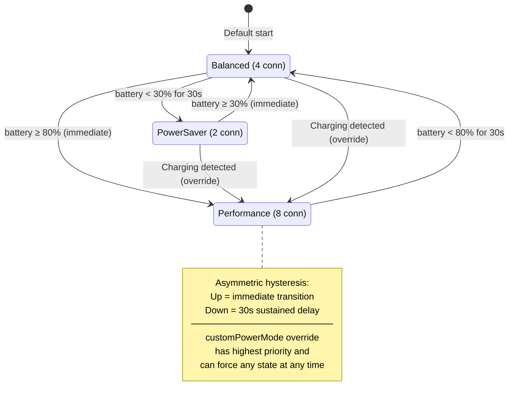

**Ratios:** Presence Timeout = 10× advertising interval. Sweep Interval = 5× advertising interval. All values are defined in `PowerProfile` per mode and used by the transport and routing layers.

### Scanning Duty Cycle Implementation

Scanning uses **fixed-window duty cycling** (e.g., 10-second cycle: 8s scan + 2s idle in performance mode).

- **Android:** Hardware-level control via `ScanSettings.setScanWindow()` / `setScanInterval()`
- **iOS foreground:** Software-level start/stop scanning on a timer (CoreBluetooth offers no hardware-level scan timing control)
- **iOS background:** Carved out entirely — CoreBluetooth controls scanning; the power mode system does NOT apply to iOS background scanning

The duty cycle targets apply to: foreground on both platforms, background on Android. iOS background is platform-controlled.

### Advertising Intervals

Advertising intervals adapt to the current power mode per the table above. Each device includes its **power mode** (2-bit field, bit-packed with protocol version — see §3 Protocol Versioning & Advertisement Layout) in the BLE advertisement payload so receivers can adjust their presence timeouts accordingly. Note: `peerPresenceTimeout` and `peerPresenceSweepInterval` are **derived values** (10× and 5× the advertising interval respectively, per the power mode table in §7), not independently configurable parameters.

### Connection Limits Per Power Mode

Connection limits scale with power mode. A single, platform-independent limit is used per mode.

| Power Mode | Max Connections |
|------------|----------------|
| Performance | 8 |
| Balanced | 4 |
| PowerSaver | 2 |

These limits are **shared across both BLE roles** (central + peripheral): e.g., 3 outbound + 1 inbound = 4 total slots consumed. The connection manager enforces the combined count, not per-role limits.

### BLE Connection Parameters

BLE connection parameters (connection interval, slave latency, supervision timeout) are managed via a **request-and-respect** strategy — the library requests optimal parameters based on activity state, but the OS makes the final decision:

- **Active transfer:** Request 15ms connection interval, 0 slave latency (maximum throughput)
- **Idle connection:** Request 100ms connection interval, 4 slave latency (power savings)

The OS may refuse or adjust these requests — actual negotiated values are **logged via diagnostic events** for debugging. Both iOS and Android have final authority over BLE connection parameters.

This avoids the fragility of per-power-mode parameter tables while still optimizing for the two dominant use cases (transferring data vs. maintaining presence).

### Power Mode Transitions

When battery level crosses a threshold and the power mode changes:

1. **Scan/advertising parameters** update immediately to the new mode
   - **Advertising restart gap:** Updating the advertisement payload (with the new power mode bits) requires briefly stopping and restarting the BLE advertiser (~100ms). During this window the device is invisible to scanners. At the advertising intervals used (250ms–2000ms), this gap is shorter than one advertising interval and will not trigger false presence evictions.
2. **BLE connection parameters** are re-requested based on activity state (active transfer: 15ms/0; idle: 100ms/4). The OS makes the final decision for existing connections.
3. **Connection eviction:** Lowest-priority connections are evicted to the new mode's limit.
   - **Grace period:** Connections with in-flight relay transfers are deferred up to **30 seconds** (`evictionGracePeriod`). If the transfer completes early, the slot is released immediately. Eviction uses the standard connection eviction priority (active transfer > LRU > route cost). The `evictionGracePeriod` (default 30 seconds) is intentionally set to match the `chunkInactivityTimeout` (default 30 seconds) so that connection drain aligns with transfer timeout semantics — a transfer that has been idle for the full grace period would have timed out anyway.
   - **Slot accounting:** New mode's budget is enforced immediately. Grace-period connections are second-class — evictable by any new connection request (lowest priority score first). They count toward `active_connections` but do not block new connections.
   - **Memory pressure override:** OS memory warning cancels all grace periods and evicts immediately (OOM kill > lost transfer).
   - **Failure handling:** If `BLE.disconnect()` fails → wait 500ms + retry once → if still fails, queue message in own-outbound buffer (25% cap) + emit `EVICTION_FAILED` diagnostic. No force-close or hardware reset (unpredictable BLE stack behavior on Android).

**Inbound connections during downgrade:** Accepted (BLE stack cannot selectively reject at connection level). If accepting exceeds the new budget, the existing connection with the lowest priority score is evicted. If the newcomer has lower priority than all existing connections and the budget is full, the newcomer is disconnected after handshake with `CONNECTION_REJECTED` diagnostic.

**Hysteresis:** Two layers prevent mode flapping:
1. **Level-based dead zone (±2%):** Downward crossings require the battery to drop 2% below the threshold; upward crossings require rising 2% above. A device at 79% stays in Performance (threshold 80-2=78). Configurable via `deadZonePercent`.
2. **Time-based delay (30s):** After leaving the dead zone, downward transitions require the battery to remain below for 30 seconds continuously. Upward transitions are immediate.

**Cascading transitions during grace:** Once a 30-second grace period starts, further **downward** transitions do NOT shorten or cancel it — the timer runs to completion regardless of additional battery drops. The 30-second window is already short enough that further power savings are negligible. However, an **upward** transition (e.g., charger plugged in) **cancels the grace period immediately** — the higher power mode provides sufficient connection slots, making the grace period unnecessary.

Connections are evicted by lowest priority (see §3 Connection Priority).

---

## 8. Presence Detection

### Advertising-Based Presence Detection

Peer presence is determined by **when we last saw their BLE advertisement**, not by whether a GATT connection is active.

**Mechanism:**
1. The scanner tracks the **last-seen advertisement timestamp** per peer
2. A **sweep timer** runs at `peerPresenceSweepInterval` (per power mode table)
3. Peers whose last-seen timestamp exceeds `peerPresenceTimeout` are marked as **gone** and evicted from the peer table

### Per-Peer Adaptive Timeout

Since peers may be in different power modes (advertising at different intervals), the presence timeout for each peer is:

```
timeout(peer) = max(own_mode.presenceTimeout, peer_mode.presenceTimeout)
```

The peer's power mode is read from the 2-bit field in their advertisement payload. This prevents a performance-mode device (2.5s timeout) from falsely evicting a PowerSaver-mode peer (advertising every 1–2s). **Unknown power mode fallback:** If a peer advertises an unrecognized power mode value (e.g., a future v2 mode), the adaptive timeout formula uses the **Balanced mode timeout (5s)** as the default for the unknown peer mode. This moderate default avoids premature eviction in most cases, with the 2-consecutive-sweep rule providing additional safety margin.

**Eviction hardening:** A peer is marked **gone** only after **2 consecutive sweep intervals** with no advertisements exceeding the adaptive timeout (not just 1). This prevents false evictions from transient RF interference in congested environments (30%+ packet loss).

**Sweep evaluation atomicity:** When the sweep timer fires, the presence module takes an **atomic snapshot** of all peer last-seen timestamps before evaluating eviction. Advertisements arriving during evaluation update the live timestamp but do not affect the current sweep's snapshot. Combined with 2-sweep eviction hardening, this prevents race-induced false evictions without blocking BLE callback processing.

**Sweep counter rule:** Any advertisement received from a peer during a sweep interval — regardless of timing within the interval — resets the consecutive-miss counter to zero. The counter increments only when an entire sweep interval passes with **zero** advertisements from the peer. This simple rule avoids false evictions from advertising intervals that don't align with sweep cadence.

### Three-State Peer Lifecycle

| State | Trigger | Meaning |
|-------|---------|---------|
| **Connected** | BLE advertisement seen + GATT connection active | Peer is reachable and we have an active channel |
| **Disconnected** | GATT connection drops | Peer may still be in range (still advertising) but the connection was lost |
| **Gone** | Sweep timer evicts (last-seen > timeout) | Peer is no longer in range; removed from peer table and routing table |

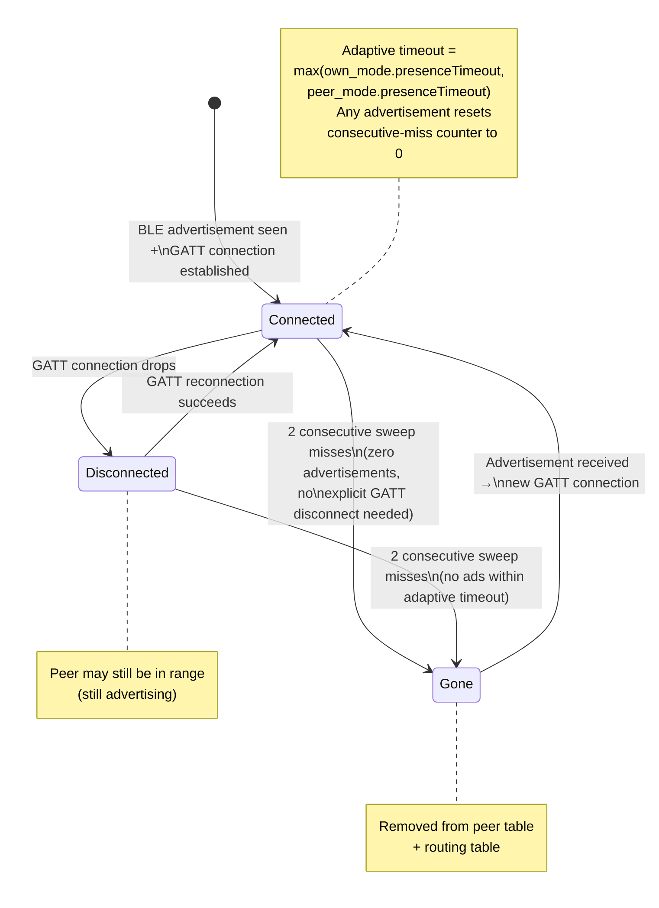

A GATT disconnect immediately transitions a peer to **disconnected** (strong signal), but the peer is NOT evicted until the sweep timer confirms no advertisements have been received within the timeout window.

---

## 9. Platform Constraints & Implementation Notes

> **Note:** This section contains platform-specific implementation guidance for
> Android and iOS BLE transports. It is forward-looking and guides platform
> development rather than describing current shared-code behavior.

### Dual-Role BLE Requirement

Every MeshLink device simultaneously operates as both a **BLE peripheral** (advertising, GATT server — accepting inbound connections) and a **BLE central** (scanning, GATT client — initiating outbound connections). This is supported on both platforms but must be explicitly accounted for:

- Connection limit budgets must cover both inbound and outbound connections
- The BLE stack manages two state machines concurrently (peripheral manager + central manager)
- On some Android devices, simultaneous advertising + scanning + GATT server + GATT client can strain the BLE stack — the hardening phase must test across a range of devices

### Android

- **Foreground service** for reliable background BLE operation
- Full mesh participation expected in both foreground and background
- Android's BLE stack is more permissive with background execution

**Foreground service:** The library ships an abstract `MeshLinkService` base class that the consuming app subclasses. The consuming app overrides `createNotification()` to control branding (title, text, icon, notification channel ID). The library manages the foreground service lifecycle (start/stop, BLE scanning, Doze wake locks, scan scheduling). The consuming app declares the subclassed service in its own `AndroidManifest.xml`. `MeshLink.start()` validates that it is called from a `MeshLinkService` context. The consuming app can update the notification content at any time via `MeshLink.updateNotification(config)`.

**Reactive BLE connection limit discovery:** Android does not expose a reliable API for the actual per-device BLE connection limit (it varies by OEM and firmware). MeshLink starts with the configured connection slot budget for the current power mode. When a connection attempt fails with `GATT_ERROR` or `CONNECTION_FAILED`, the effective slot budget is reduced by 1. The discovered limit is persisted per device model (`manufacturer + model string → maxConnections`) so subsequent sessions start at the correct limit. First-run cost: a few transient connection failures, covered by existing retry logic.

### Android Background Execution: Doze & App Standby

**Doze mode:** When the device is idle (screen off, not moving), Android restricts background execution. MeshLink's foreground service is **mostly exempt** from Doze restrictions — BLE scanning and advertising continue. However:
- Some OEMs (Samsung, OnePlus, Xiaomi) have aggressive battery optimizers that may kill foreground services
- The consuming app should guide users to exempt MeshLink from battery optimization (`Settings > Battery > Battery Optimization > MeshLink > Don't Optimize`)

**Required permissions:**
- `FOREGROUND_SERVICE` — required for background BLE
- `FOREGROUND_SERVICE_CONNECTED_DEVICE` — Android 14+ foreground service type
- `BLUETOOTH_SCAN`, `BLUETOOTH_ADVERTISE`, `BLUETOOTH_CONNECT` — Android 12+ runtime permissions
- `REQUEST_IGNORE_BATTERY_OPTIMIZATIONS` — optional; allows showing the system "ignore battery optimization" dialog directly

**App Standby buckets:** Android classifies apps into usage buckets (Active, Working Set, Frequent, Rare, Restricted). A foreground service prevents the app from entering Rare/Restricted buckets. No additional handling needed if the foreground service is running.

**OEM workarounds:** The library documents known OEM issues in its API reference and recommends consuming apps link to [dontkillmyapp.com](https://dontkillmyapp.com) in their troubleshooting UI.

**OEM BLE stack variants:** Some Android OEMs (Samsung, Huawei, Xiaomi) run parts of the BLE stack in a separate system process. This is transparent to MeshLink — the standard Android BLE API (`android.bluetooth.le`) handles cross-process dispatch via Binder IPC. BLE callbacks arrive on a Binder thread in the app's process regardless of OEM implementation, and are dispatched into the engine system via the `BleTransport` abstraction.

**Foreground service death detection:** The abstract `MeshLinkService` base class exposes an `onServiceStateChanged(running: Boolean)` callback, surfacing the service's `onDestroy()` signal. The library does not attempt automatic service restart — OEM battery optimizer workarounds are a moving target (see dontkillmyapp.com). The consuming app implements its own restart logic using this callback.

**Service restart contract:** `MeshLinkService` uses `START_STICKY` — Android automatically restarts the process after a crash. On restart:
1. The library calls `onServiceRestarted(reason: RestartReason)` before resuming mesh operations
2. The app can override this callback to re-configure, check permissions, or update the notification
3. Default behavior (if not overridden): immediate `start()` with last-known configuration
4. **Crash loop circuit breaker:** 3 crashes within 5 minutes → stop auto-restart, emit `SERVICE_CRASH_LOOP` diagnostic, require manual `start()` from the app

**BLE radio sharing:** MeshLink uses standard BLE APIs and does not monopolize the radio. The OS manages scan/advertise time-sharing across apps. On devices with many active BLE peripherals, consider PowerSaver mode to reduce radio contention.

**OEM device incompatibilities:** Some Android devices (notably Samsung and OnePlus models) may negotiate MTU below the 100-byte minimum or have unreliable L2CAP stacks. MeshLink handles both gracefully: MTU < 100 → `MTU_TOO_SMALL` diagnostic + connection rejected; L2CAP failure → 3 retries then GATT-only for the session. Monitor `MTU_TOO_SMALL` and `transportModeChanged` diagnostics in your crash reporter to identify affected device models in your user base.

### iOS — The Hard Problem

iOS imposes severe restrictions on background BLE:

| Constraint | Impact |
|------------|--------|
| Background scanning throttled | Discovery intervals increase from ~1s to ~10–15s+ |
| Advertising data limited | Custom service UUIDs move to "overflow" area, only visible to actively scanning iOS devices |
| App suspension | iOS can suspend/terminate the app under memory pressure with no warning |
| Two backgrounded iOS apps | Mutual discovery can take **10–15 minutes** |

**Decision:** Best-effort background operation using **BLE State Preservation and Restoration**. When iOS terminates the app, CoreBluetooth saves BLE state and relaunches it. This does NOT guarantee continuous mesh participation.

**On relaunch:** The library starts from `uninitialized` state (same codepath as cold start). The app calls `MeshLink(context) { config }` + `start()`. CoreBluetooth-restored connections get fresh Noise XX handshakes. Identity keypair, TOFU key pins, replay counters, and dedup set are restored from secure storage; all other state is rebuilt via Babel route propagation on first neighbor contact.

See **Restart semantics** table in §10 for full crash recovery state.

**Buffered message loss:** The library does NOT persist buffered messages — `send()` is "accepted for best-effort delivery," NOT "guaranteed delivery." Apps should track pending messages until `onMessageDelivered(messageId)` fires.

**Dedup edge case:** On crash or app termination, the in-memory dedup set is lost. Messages received shortly before the crash may be redelivered on relaunch. The replay counter (persisted) provides backup duplicate detection. Apps requiring exactly-once delivery should implement application-layer deduplication.

**State Preservation restore contract:** After iOS relaunches the app via BLE State Preservation:
1. CoreBluetooth provides restored `CBPeripheral`/`CBCentral` handles (live BLE connections)
2. The library auto-resumes — the app does NOT need to call `start()` again
3. Noise XX sessions are **re-negotiated** on each restored connection (session keys are NOT persisted — fresh handshake provides forward secrecy)
4. Encrypted sessions resume in ~200ms (vs. ~3s for full discovery+connect from cold start)
5. `STATE_PRESERVATION_RESTORED(connectionCount: N)` diagnostic emitted on resume

**BLE initialization timeout:** CoreBluetooth has a **30-second timeout** on relaunch. If BLE is not ready, `onDiagnostic(BLE_INIT_SLOW, elapsed)` fires and retries continue (not fatal).

**iOS background degradation:**

| Suspension Duration | Impact | Reconnection Time |
|---|---|---|
| < 30s | None (grace period) | Instant |
| 30s – 5 min | In-flight transfers lost | 5–15s (Babel route propagation) |
| 5 min – 2 hr | All buffered messages + transfers lost | 5–15s (full routing rebuild via Babel) |
| > 2 hr | All state lost except identity/TOFU | 5–15s (equivalent to cold start) |

**Recommendation:** For time-sensitive messaging, implement a push notification channel. MeshLink handles reconnection automatically on wake (~5–15s). BLE State Preservation is unreliable for suspensions >5 minutes.

**Alternatives rejected:** Silent push notifications, Notification Service Extension, BGProcessingTask, and foreground-only operation were all considered and rejected — all require internet connectivity or are unsuitable for real-time mesh operation.

---

## 10. Library API Design

### Quickstart

See [Integration Guide § Quick Start](integration-guide.md#quick-start) for minimal integration examples.

**Primary async interfaces:**
- `meshLink.peers: Flow<Peer>` — emits peer discovery and loss events. New subscriptions **replay current known peers**, then incremental updates (`onPeerDiscovered` / `onPeerLost`). **Subscription is thread-safe via `MutableStateFlow`** — replay of current state and subsequent deltas are naturally race-free with concurrent eviction/discovery events.
- `meshLink.messages: Flow<Message>` — **forward-only event stream (no replay)**. Only messages received *after* subscription are delivered. Each `Message` carries `sender: PublicKey`, `payload: ByteArray`, `messageId: MessageId`, `isBroadcast: Boolean`. **Delivered via `MutableSharedFlow`** — new subscribers immediately start receiving without race conditions.
- `meshLink.diagnostics: Flow<DiagnosticEvent>` — optional diagnostic stream (zero cost when unsubscribed; see Diagnostic Stream section below). **Delivered via `MutableSharedFlow`.** Implemented as a single `MutableSharedFlow(extraBufferCapacity=256, onBufferOverflow=DROP_OLDEST)` — all subscribers share one buffer. A slow subscriber causes DROP_OLDEST for all subscribers (surfacing the problem rather than hiding it). On iOS, exposed as `AsyncStream` with a bounded 256-element channel.

On iOS, `.peers` and `.messages` are exposed as `AsyncStream<Peer>` and `AsyncStream<Message>` via thin Swift extensions.

**Subscription lifecycle guidance:** Collect `.peers` and `.messages` in a **ViewModel** (Android) or **ObservableObject** (iOS), not directly in Activity/Fragment/View. ViewModel scoping ensures the subscription survives configuration changes (rotation, theme switch) and is cancelled exactly when the user navigates away. If collected in an Activity, the subscription is cancelled on every rotation and re-subscribing to `.peers` replays the full peer list unnecessarily.

### API Error Semantics

**Kotlin:** Public suspend functions return `Result<T>` for expected failures (peer not found, buffer full, message too large, `libraryShuttingDown`). No exceptions are thrown for operational errors. `IllegalStateException` is thrown only for API misuse (e.g., calling `send()` before `start()`, calling `start()` in `terminal` state). The `libraryShuttingDown` error is returned (not thrown) when a library method is called during the `stop()` drain window or after `stop()` completes but before `start()` is called again — this race between app callbacks and shutdown is legitimate and unpreventable. This ensures consuming apps never need try/catch for normal operation — they pattern-match on `Result.Success` / `Result.Failure`.

**Swift:** Public async functions use Swift's native `throws` pattern. Expected failures throw typed errors (`MeshLinkError.noRoute`, `.recipientKeyUnknown`, `.bufferFull`, `.messageTooLarge`). API misuse throws `MeshLinkError.invalidState`.

**Async failure delivery:** Some failures are inherently asynchronous (delivery timeout after `bufferTTL`, connection drops during transfer). These are delivered via `onTransferFailed(messageId, reason)` callback/Flow, not via the `send()` return value. The `send()` return indicates only whether the message was **accepted for delivery** (queued successfully), not whether it was delivered.

### Configuration API

See [Integration Guide § Configuration](integration-guide.md#configuration) for configuration DSL, presets, and validation.

### Primary: Async Streams (KMP Kotlin Flow)

- **Shared API:** Kotlin `Flow` defined once in the KMP shared module
- **Android:** Consumed directly as Kotlin Flow (native)
- **iOS:** Kotlin/Native compiles Flow to an Objective-C/Swift-compatible framework. Thin Swift extensions wrap Flow into `AsyncStream` / `AsyncSequence` for idiomatic consumption.

### Secondary: Callback Wrappers

Convenience APIs using listener patterns for consumers who don't use async streams. Defined in the shared module as `MeshLinkListener` callback interface. **Callbacks are a thin wrapper** that internally subscribes to the same underlying Flow. Both Flow and callbacks can be active simultaneously — they share the same stream, so there is no risk of double-delivery. Unsubscribing from Flow does not affect active callbacks, and vice versa.

### App-Level Topic Filtering

`appId` is an **immutable config parameter** set at construction via `MeshLink.configure { appId = "com.mycompany.meshchat" }`. The library computes `SHA-256-64(appId.toUTF8())` internally — the 8-byte hash is what appears in the wire format (fixed size, no length prefix needed). The 8-byte appId hash is independent of the 12-byte peer ID size. Recommended format: reverse-domain notation. To change the appId, create a new MeshLink instance. When set:
- Outbound messages include the 8-byte appId hash in the payload envelope
- Inbound messages with a non-matching appId hash are **silently dropped** at the recipient (not delivered to the app)
- **AppId drives pre-connection filtering** — the BLE advertisement carries a 16-bit mesh hash of the `appId`. Peers with non-matching mesh hashes never connect. `appId = null` (mesh hash `0x0000`) connects to all peers.
- As a second layer, inbound messages with a non-matching appId hash are silently dropped at the recipient
- Apps that don't configure an appId receive all messages (backward compatible)

**Self-send:** If the app calls `send(ownPublicKey, payload)`, the message is delivered locally via loopback — `onMessageReceived` fires with the message without touching the network. No encryption, routing, or BLE activity occurs. The callback is dispatched **asynchronously on the `coroutineContext`** (same behavior as BLE-delivered messages), preventing re-entrant hazards if the callback calls back into the library. This enables apps to use a uniform message handling path regardless of sender.

**Replay counter interaction:** Self-send loopback does not increment the sender's replay counter — no cryptographic state is mutated. Messages arriving via wire with sender=self are impossible by design (the visited list contains the peer's own key hash, causing the message to be dropped before reaching replay validation).

**Dedup interaction:** Self-send loopback **bypasses the dedup set entirely** — the message goes directly from `send()` → TransferEngine → `.messages` Flow. No messageId is inserted into the dedup pool. Self-messages cannot consume dedup quota or pollute the mesh dedup set. The API generates a fresh MessageId for every `send()` call, so duplicate self-sends are impossible through the public API.

### Key Events

```
onPeerDiscovered(peer: Peer)       // New device found in mesh
onPeerLost(peer: Peer)             // Device no longer reachable
onMessageReceived(message: Message) // Incoming decrypted message
onDeliveryConfirmed(messageId: ID)  // ACK received (if requested)
onTransferProgress(messageId: ID, progress: Float) // Chunked transfer progress
onTransferFailed(messageId: ID, reason: ErrorCode, failureContext: FailureContext)  // Transfer failed with context (NO_ROUTE, HOP_LIMIT, ACK_TIMEOUT, BUFFER_FULL, PEER_OFFLINE)
onKeyChanged(peer: Peer, oldKey: PublicKey, newKey: PublicKey) // Peer's identity key changed (optional)
onIdentityRotated(oldKey: PublicKey, newKey: PublicKey) // Own identity key was rotated via rotateIdentity()
onSecurityWarning(type: SecurityWarningType, detail: Any)  // Security event (e.g., DUPLICATE_IDENTITY)
onLibraryRestarted()                                    // Library restarted after iOS State Preservation relaunch
fatalError(retryable: Boolean, reason: String, detail: Any?)  // Unrecoverable error; library stopping. Sources: engine circuit breaker, crypto init failure, key storage failure.
```

### Diagnostic Stream (Optional)

An optional `MeshLink.diagnostics → Stream<DiagnosticEvent>` for transport and mesh observability. **Zero performance cost when not subscribed.** Uses the same SharedFlow configuration described in Primary Async Interfaces above. **Overflow detection:** Each `DiagnosticEvent` carries a `droppedCount: Int` field — `0` when no events were dropped, `N` when N events were dropped since the last successfully emitted event. This is implemented via a single atomic counter (increment on drop, read-and-reset on emit) with zero cost when no overflow occurs. Apps needing independent buffering should fan out from a single collector in app code. Each `DiagnosticEvent` carries `timestamp: Long` (monotonic millis), `type: String`, `droppedCount: Int`, and `payload: Map<String, Any>`. A convenience `DiagnosticEvent.toJson(): String` method is provided for quick serialization. Export (Crashlytics, dashboards, disk) is the consuming app's responsibility. Events include:

| Event | Trigger |
|-------|---------|
| `l2capFallback(peer)` | L2CAP channel failed, fell back to GATT |
| `l2capRestored(peer)` | L2CAP channel re-established after fallback |
| `suspiciousL2capDrops(peer, count)` | Repeated L2CAP teardowns to same peer (possible downgrade attack) |
| `rateLimitHit(peer, sender)` | Per-sender rate limit triggered |
| `routeChanged(destination, oldNextHop, newNextHop)` | Primary route changed |
| `peerEvicted(peer)` | Peer marked gone by sweep |
| `bufferPressure(usedBytes, totalBytes)` | Buffer usage exceeds 80% |
| `transportModeChanged(peer, oldMode, newMode)` | Data plane switched between L2CAP and GATT |
| `routeDiscoveryReport` | Periodic: route table size, cache hit rate, Hello/Update counts |
| `bleInitSlow(elapsed)` | CoreBluetooth initialization exceeded 30s timeout on iOS app relaunch via State Preservation |
| `evictionFailed(peer)` | BLE.disconnect() failed during connection eviction; message queued for retry |
| `restarted(reason)` | Library restarted after stop→start; reason is `"user"` (normal) or `"crash_recovery"` (after fatalError) |
| `lateDeliveryAck(messageId)` | Signed delivery ACK arrived after messageId was already tombstoned (onTransferFailed already fired) |
| `bleStackUnresponsive(silenceDuration, suggestedAction)` | Emitted when the library is in `started` state, actively scanning/advertising, and zero BLE callbacks arrive within 60 seconds. Re-emitted every 60s while the condition persists. `suggestedAction: RESTART_BLUETOOTH`. Triggers automatic BLE stack recovery (teardown → 5s cooldown → re-initialize, up to 3 attempts/hour). |

**Recovery action:** On `BLE_STACK_UNRESPONSIVE`, the library automatically tears down all BLE resources and re-initializes after a **5-second cooldown**. Up to **3 restart attempts per hour** are permitted. After 3 failed attempts, the library emits `BLE_STACK_FATAL` diagnostic and **stops all BLE operations** — routing continues on cached state, but no new connections or advertisements are made. The app can call `stop()` + `start()` to force a manual reset.

Not intended for business logic — purely for debugging, monitoring, and diagnostics.

**DiagnosticEvent structure:**
```kotlin
data class DiagnosticEvent(
    val code: DiagnosticCode,        // enum of all event types
    val severity: Severity,           // FATAL, ERROR, WARN, INFO
    val monotonicMillis: Long,           // millis since boot
    val wallClockMillis: Long,           // epoch millis
    val droppedCount: Int,           // 0 if no drops since last event
    val payload: Map<String, Any>    // event-specific key-value pairs
)
```
**Severity levels:** `FATAL` = library entered terminal state; `ERROR` = operation failed, app should act; `WARN` = degraded but functional; `INFO` = observability, no action needed. Apps can filter by severity without knowing every event code. New codes in future versions are automatically filtered correctly.

**Unknown destination:** If the app calls `send()` with a public key that has never been discovered (no route exists), `send()` returns `Result.Success` (message accepted for buffering). The message is **buffered for `bufferTTL`** (default 5 minutes). If the peer appears via route discovery within the TTL window, the message is delivered normally. If the TTL expires without the peer appearing, `onTransferFailed` is emitted with reason `peerNotFound`. Apps should check `meshHealth().connectedPeers` before sending to provide appropriate UX (e.g., "No peers nearby — message will be queued for 5 minutes").

**Delivery deadline:** If `onDeliveryConfirmed` has not fired within `bufferTTL` (default 5 minutes) after `send()`, the library fires `onTransferFailed(messageId, DELIVERY_TIMEOUT)`. The sender always receives a definitive callback — never silent failure. This deadline applies regardless of whether the message was buffered, relayed, or delivered directly.

**No explicit relay backpressure API.** The library manages relay traffic automatically via concurrent transfer limits, NACK with `bufferFull`, and the 75/25 buffer split. Exposing app-level relay throttling would create tragedy-of-the-commons — apps selfishly disabling relay would undermine mesh connectivity. Apps can reduce own sending rate in response to `bufferPressure`; relay decisions remain internal to the library.

**Buffer pressure notification:** Relay buffer pressure is reported exclusively through the diagnostic stream (`BUFFER_PRESSURE_HIGH` at 80% capacity). No dedicated listener callback is provided — apps that need to react to buffer pressure should filter `diagnosticStream`. This keeps the `MeshLinkListener` API focused on messaging events.

### Error Model

Errors use a **two-tier structure**: a broad category + a specific code.

| Category | Code | Retryable | Library Auto-Retries | App Guidance |
|----------|------|-----------|---------------------|--------------|
| **Network** | `noRoute` | Yes (transient) | No (async delivery) | Fires via `onTransferFailed` after `bufferTTL` expiry if peer never appears. `send()` itself returns `Result.Success` (message queued). |
| **Network** | `recipientKeyUnknown` | Yes (transient) | No (async delivery) | Recipient discovered via route discovery (route exists) but Curve25519 key not yet received. Fires via `onTransferFailed` if key never arrives within `bufferTTL`. Distinct from `noRoute` (no path) — the peer is known but secure channel not yet established. App can show "establishing secure channel..." |
| **Network** | `hopLimitExceeded` | No | No | Message can't reach destination within hop limit. Inform user peer is too far. |
| **Network** | `bufferFull` | Yes (transient) | Yes (with backoff) | Mesh is congested. Library retries automatically; app sees error only after all retries exhausted. |
| **Network** | `rateLimitExceeded` | Yes (after cooldown) | No | App is sending too fast. Back off for 60+ seconds. |
| **Network** | `connectionDropped` | Yes (transient) | Yes (reconnect + retry) | Transient BLE issue. Library handles reconnection automatically. |
| **Network** | `allRetriesExhausted` | No (terminal) | N/A (all retries done) | Delivery failed after all attempts. Inform user; offer manual retry. |
| **Crypto** | `handshakeFailed` | Yes (on reconnect) | Yes (via reconnection) | Noise XX handshake failed. Usually transient; library reconnects. |
| **Crypto** | `decryptionFailed` | No | No | Message corrupted or from unknown sender. Investigate if persistent. |
| **Crypto** | `signatureInvalid` | No | No | Broadcast or delivery ACK has invalid signature. Possible tampering. |
| **Crypto** | `replayDetected` | No | No | Duplicate message with reused counter. Silently dropped; logged. |
| **Timeout** | `sendTimeout` | Yes | Yes (up to `maxRetries`) | Transfer took too long. Library retries; app sees error after exhaustion. |
| **Timeout** | `ackTimeout` | Yes | No | Delivery ACK not received. Message may or may not have been delivered. |
| **Timeout** | `connectionTimeout` | Yes | Yes (reconnect) | BLE connection couldn't be established. Library retries connection. |
| **Validation** | `messageTooLarge` | No | No | Payload exceeds `maxMessageSize`. Split or reduce payload before sending. |
| **Initialization** | `permissionDenied` | Yes (after grant) | No | Bluetooth permissions not granted. `start()` checks permissions before BLE init. `missing: List<String>` identifies which permissions. App requests permissions, then retries `start()`. |
| **Initialization** | `cryptoInitFailed` | No | No | Platform crypto initialization failed (rare — exotic architecture or broken emulator). Library cannot start. |
| **Initialization** | `keyStorageFailed` | Yes (retryable) | Yes (3 retries) | Platform secure storage (Keychain/EncryptedSharedPreferences) read/write failed. App can retry `start()` after storage freed. |

**API misuse detection:** If `send()` (or any public API method) returns the same failure reason 5 or more consecutive times, a one-shot `API_MISUSE(method, reason, count)` diagnostic is emitted, then the counter resets. No throttling or blocking is applied — the rejection path is trivially cheap.

**`onTransferFailed(messageId, reason, failureContext)`** — `failureContext` provides the immediate cause: `NO_ROUTE` (destination unknown), `HOP_LIMIT` (exceeded maxHops), `ACK_TIMEOUT` (delivery ACK not received within bufferTTL), `BUFFER_FULL` (local buffer exhausted), `PEER_OFFLINE` (destination not reachable). Post-v1: opt-in routing trace via flags bit 1 (reserved) for full path visibility.

`send(peer, ByteArray(0))` returns `Result.Failure(messageEmpty)`. Zero-byte messages are rejected — they have no semantic meaning and would waste a round-trip.

**Zero-byte payload rejection:** Both `send()` and `broadcast()` reject zero-byte payloads with `Result.Failure(messageEmpty)`. Zero-byte messages have no semantic meaning and waste bandwidth (~100+ bytes of envelope overhead for zero payload). Apps that need presence signaling should use the built-in presence detection system.

**Recommended outbox pattern for reliable messaging:**

```kotlin
// Recommended outbox pattern for reliable messaging
val outbox = mutableMapOf<MessageId, OutboxEntry>()

val messageId = meshLink.send(to = recipient, payload = data).getOrThrow()
outbox[messageId] = OutboxEntry(data, recipient, sentAt = now())

// In MeshLinkListener:
override fun onDeliveryConfirmed(messageId: MessageId) {
    outbox.remove(messageId)  // confirmed — safe to forget
}
override fun onTransferFailed(messageId: MessageId, reason: Reason, context: FailureContext) {
    val entry = outbox[messageId] ?: return
    if (entry.retryCount < MAX_RETRIES) {
        entry.retryCount++
        meshLink.send(to = entry.recipient, payload = entry.data)  // retry
    } else {
        outbox.remove(messageId)
        alertUser("Message failed after ${MAX_RETRIES} retries")
    }
}
```

### Library Lifecycle

**State Machine:** The library has 6 states with strict transition rules:

| State | Description |
|-------|-------------|
| `uninitialized` | Constructed, not yet started |
| `running` | `start()` succeeded, mesh active |
| `paused` | `pause()` called, thin overlay active |
| `stopped` | `stop()` completed, clean shutdown |
| `recoverable` | `start()` failed with `fatalError(retryable: true)` — `start()` allowed again |
| `terminal` | `start()` failed with `fatalError(retryable: false)` — library permanently dead |

**Transition rules:**
```
start():   valid from {uninitialized, stopped} → running | recoverable | terminal
pause():   valid from {running} only → paused
resume():  valid from {paused} only → running
stop():    always safe — no-op if {uninitialized, stopped, terminal}; idempotent (second call returns immediately)
           from {running, paused, recoverable} → stopped
All other transitions → IllegalStateException (start() from terminal is not allowed — terminal is permanent)
```

`stop()` **never throws** — it is always safe to call, even on dead or uninitialized instances. Calling `stop()` multiple times is a no-op after the first call. `start()`, `pause()`, and `resume()` are strict about requiring a valid source state. **`stopped` is restartable** — calling `start()` from `stopped` re-initializes the library with the same config (see **Restart semantics** below). **`terminal` is permanent** — `start()` from `terminal` throws `IllegalStateException`; the consuming app must create a new `MeshLink` instance. Config changes always require a new instance (config is immutable after construction).

| Method | Behavior |
|--------|----------|
| `start()` | Initialize library in strict sequential order (see below). Returns `Result.Failure` on init error (state → `recoverable` or `terminal` based on `retryable` flag). |
| `stop()` | Graceful shutdown: (1) reject new API calls with `Result.failure(libraryShuttingDown)` — not an exception, since the race between app callbacks and shutdown is legitimate and unpreventable; (2) **best-effort transfer flush** — active transfers get up to the 5s drain timeout to complete (at ~15KB/s GATT, most in-flight transfers finish); (3) fire `onTransferFailed` for any transfers still in progress after timeout; (4) disconnect all peers, clear buffer, release BLE resources. `stop()` is synchronous — no further callbacks fire after return. |
| `pause()` | Stop scanning and advertising; keep existing GATT connections alive; continue forwarding buffered messages if possible |
| `resume()` | Re-enter active mode: resume scanning/advertising at the current power mode's parameters |

**`start()` initialization order** (strict sequential, fail at first error — no partial state to clean up):
1. **Permission check** → `Result.Failure(permissionDenied(missing))` → recoverable
2. **Platform crypto init** (JCA provider verification / CryptoKit availability) → `Result.Failure(cryptoInitFailed)` → terminal
3. **Key load/generate** (Keychain / EncryptedSharedPreferences; generate Ed25519 if first run) → `Result.Failure(keyStorageFailed)` after 3 retries → recoverable
4. **Derive Curve25519** from Ed25519 via birational map, cache in memory
5. **Construct modules** via `MeshLink` orchestrator (constructor injection)
6. **BLE stack init** (detect iOS CB State Preservation restored peripherals; fast-path reconnection)
7. **Start scan/advertise** at current power mode parameters

Construction (`MeshLink(context) { config }`) is side-effect-free — no filesystem I/O, no BLE, no key generation. All initialization happens in `start()`.

**Identity key storage:** Keys are explicitly **excluded from platform backup**. iOS: `kSecAttrAccessibleAfterFirstUnlockThisDeviceOnly` (excluded from iCloud backup). Android: explicit `android:fullBackupContent` exclusion rules for EncryptedSharedPreferences. New device = new identity, always. This prevents duplicate identity scenarios after backup/restore.

**Keychain accessibility requirement:** All MeshLink Keychain items use `kSecAttrAccessibleAfterFirstUnlock` — keys are available in background after the user unlocks the device once post-reboot. No separate Keychain timeout; Keychain reads are bundled into the 30-second BLE initialization window. Keys are unavailable before first device unlock after reboot — the library cannot operate in this state.

**Library upgrade behavior:** On library version bump, non-critical persisted state (routing table) is discarded and rebuilt from scratch. Identity keys and TOFU pins are preserved (format-stable raw Ed25519 bytes). No migration code is required. A `LIBRARY_UPGRADED(oldVersion, newVersion)` diagnostic is emitted on first `start()` after upgrade.

**Persistence failure policy (criticality-based):**
- **Identity key + TOFU pins:** `fatalError(retryable: true)` after 3 retries (cannot operate without identity)
- **Replay counter:** Retry 3×, then `PERSIST_FAILED` diagnostic + continue in-memory (dedup set provides backup duplicate detection)
- **Dedup set:** No persistence — in-memory only. No disk failure possible.
- **Pre-flight check:** On `start()`, query available disk space. Emit `LOW_DISK_SPACE` diagnostic if < 1MB free (early warning, non-blocking).

**Shutdown contract:** `stop()` is synchronous: it signals all engines to shut down, waits for pending callbacks on the callback pool to complete (with a 5-second timeout to prevent indefinite blocking), then returns. After `stop()` returns, no further callbacks will fire. This prevents dangling state from callbacks executing after the app assumes the library is stopped.

**Two-phase shutdown:** After `stop()` returns (5-second timeout), any callbacks still executing operate on **invalidated-but-not-freed** library state. If a lingering callback attempts to call any library method, it receives `LibraryShutdownException`. Callback pool threads are **daemon threads** — they won't prevent process exit. The 5-second timeout is the contractual deadline; callbacks blocking beyond 5 seconds are best-effort with no crash guarantee but no undefined behavior either.

**No separate suspend mode** — the automatic power mode system handles low-power scenarios based on battery level.

**Error semantics on misuse:** All public API methods validate state before executing:
- `send()` / `broadcast()` before `start()` → throws `IllegalStateException`
- `start()` when already running or paused → throws `IllegalStateException`
- `start()` in `terminal` state → throws `IllegalStateException` (non-retryable failure is permanent)
- `start()` in `recoverable` state → re-attempts initialization, returns `Result<Unit>` (may succeed or fail again)
- `send()` / `broadcast()` after `stop()` completes → returns `Result.Failure(libraryShuttingDown)` (see API Error Semantics above)
- `send()` / `broadcast()` during `stop()` drain window → returns `Result.Failure(libraryShuttingDown)` (see API Error Semantics above)
- `send()` / `broadcast()` while paused → **queued silently** in buffer, sent on `resume()` (not rejected — pausing is a valid buffering state)
- `pause()` when already paused → no-op (idempotent)
- `resume()` when not paused → no-op (idempotent)
- `stop()` when already stopped / uninitialized / terminal → no-op (always safe)
- Concurrent `start()` from multiple threads → first thread wins (atomic CAS on state), second thread throws `IllegalStateException`

**fatalError dual signal:** When `start()` fails (cryptoInitFailed, keyStorageFailed) or an engine circuit breaker triggers, the app receives **both**: (1) `Result.Failure` from the `start()` return for programmatic control flow, and (2) a `fatalError` diagnostic event on `.diagnostics` for observability/monitoring. Two channels, two audiences — no conflict. Apps that don't subscribe to diagnostics never see the second signal.

Fail-fast behavior ensures developers catch integration mistakes immediately during development, not silently in production.

**Calling library methods from callbacks:** Calling `send()`, `broadcast()`, or other thread-safe methods from within `onMessageReceived` or any other callback is **fully supported**. The call dispatches to the MeshLink coroutine scope — no re-entrancy risk (engines process operations sequentially), no deadlock risk. This enables the common "receive → reply" pattern without requiring the developer to context-switch threads.

**Restart semantics (stop → start):** Calling `start()` after `stop()` is always valid — no restriction on restart cycles. The library emits `onDiagnostic(RESTARTED, reason)` where reason is `"user"` (normal stop→start) or `"crash_recovery"` (start after fatalError).

| State | After stop → start |
|-------|-------------------|
| Ed25519 identity | Restored from secure storage |
| Replay counters | Restored (write-ahead, no gap) |
| TOFU trust store | Restored from secure storage |
| Dedup set | Empty — in-memory only, not persisted (recent messages may be redelivered) |
| Routing table | Rebuilt via Babel Hello/Update exchange on first neighbor contact |
| Active transfers | Lost — senders retry |
| Buffered messages | Lost — senders retry |
| Engine state | Fresh (all engines restarted) |

No attempt to resume active transfers — sender retry via SACK/timeout is the correct recovery path.

**Thread safety:** All public API methods (`send`, `broadcast`, `pause`, `resume`, `stop`, `meshHealth`) are **thread-safe** for concurrent calls from multiple threads. Internally, all method calls are dispatched to the MeshLink coroutine scope — the engine pattern provides serialization without explicit locks. No external synchronization is required by the consuming app.

**`send()` ordering and backpressure:** Concurrent `send()` calls are dispatched to the MeshLink coroutine scope. Ordering guarantee: **FIFO within a single thread**. No ordering guarantee across threads — cross-thread ordering is inherently non-deterministic. If the message buffer is full, `send()` returns `Result.Failure(bufferFull)` **immediately** (non-blocking) — the app decides whether to retry, drop, or alert the user. `send()` never suspends or blocks the calling coroutine.

**`send()` API surface:** Minimal: `send(recipient: PublicKey, payload: ByteArray): Result<MessageId>`. On Swift, the external parameter label is `to:` per Swift naming conventions: `send(to: PublicKey, payload: Data) throws -> MessageId`. No metadata parameters, no priority hints, no builder pattern. The payload is opaque bytes — the app encodes its own content type, priority, or metadata within the payload. This keeps the API surface minimal for v1; ergonomic additions (tags, options) can be added in minor versions without breaking changes.

**`pause()` behavior:**

| Aspect | While Paused |
|--------|-------------|
| Scanning | Stopped |
| Advertising | Stopped |
| Existing connections | Kept alive |
| Keepalive exchanges | Continue on existing connections (routing table stays fresh) |
| Relay forwarding | Continues (don't break the mesh for other peers) |
| Own outbound sends | Queued in buffer, sent on `resume()` |
| Inbound messages for this device | Queued in buffer (up to buffer limit), delivered in order on `resume()` |
| Sweep timer | Stopped (no evictions — can't discover new ads to confirm presence) |

**`resume()` behavior:** Restart scanning + advertising. Run one immediate sweep cycle to update presence state. Flush any queued own-outbound messages. Deliver all queued inbound messages to the consuming app in arrival order.

**Pause is a thin overlay.** Pause suppresses exactly two things: BLE scanning/advertising and own-outbound sends. All other subsystems operate normally:
- Buffer eviction, memory shedding, and power mode transitions apply unchanged during pause
- Own-outbound messages queued during pause follow normal buffer rules (25% cap, subject to memory shedding)
- Paused connections are NOT exempt from power mode connection limit changes — if battery drops and power mode downgrades, connections are evicted normally during pause. `onPeerLost` fires during pause for evicted peers. On `resume()`, the library scans and reconnects to evicted peers naturally. The existing 30-second eviction grace period for active relay transfers applies unchanged during pause — relay transfers are not expedited or cancelled due to pause state.
- `stop()` after `pause()` performs best-effort flush of queued sends (same as normal shutdown)
- Active relay transfers **complete normally** during pause — no interruption
- Connection slots are **released immediately** on relay transfer completion (same rule as non-paused)
- New inbound relay transfers are accepted during pause (the peer remains a good mesh citizen)
- New outbound connections are NOT initiated (no scanning), but inbound connections from neighbors are accepted

**Slot release during pause:** When a relay transfer completes during `pause()`, the connection slot is released immediately. No new outbound connections are initiated, but slot accounting returns to normal. If no other transfers use the connection, it becomes eligible for normal idle eviction.

### Concurrency Model

MeshLink uses an **engine/coordinator pattern** with three categories of modules:

| Category | Modules | Responsibility |
|----------|---------|----------------|
| **Stateful Engines** | SecurityEngine, RoutingEngine, TransferEngine, DeliveryPipeline | Own domain state, return sealed result types |
| **Coordinators** | PowerCoordinator, RouteCoordinator, PeerConnectionCoordinator | Orchestrate multi-step workflows |
| **Policy Chains** | SendPolicyChain, BroadcastPolicyChain, MessageDispatcher | Apply rules, produce decisions |

**Design principle:** Engines return sealed result types; the caller (MeshLink orchestrator) pattern-matches and dispatches effects. No module sends messages directly to another module.

**Thread safety:** All mutable state is confined to a single coroutine scope per engine. Engines expose suspend functions; callers invoke them sequentially from the MeshLink coroutine scope. No locks, no shared mutable state between modules.

**Routing table concurrency:** RoutingEngine processes operations sequentially within its coroutine scope — Hello/Update handling and forwarding lookups are serialized by construction. No concurrent access, no locking required.

See [diagrams.md § Engine & Coordinator Data Flow](diagrams.md#8-engine--coordinator-data-flow) for the module interaction diagram.

**API callback threading:** All callbacks to the consuming app (`onMessageReceived`, `onPeerDiscovered`, `onTransferProgress`, diagnostic events) are dispatched on the **`coroutineContext`** passed to the `MeshLink` constructor (default `EmptyCoroutineContext`, which uses `Dispatchers.Default`). The consuming app can specify `Dispatchers.Main` for UI-driven apps, or leave the default for background services/non-UI consumers. This follows the pattern used by Retrofit, OkHttp, and Firebase SDKs. The callback dispatcher provides two guarantees:
1. **Exception isolation:** All callbacks are wrapped in try/catch. If a callback throws, the exception is logged via the diagnostic event system and the callback is skipped — exceptions never propagate into the engine system.
2. **Blocking tolerance:** A callback that blocks (e.g., synchronous DB write) only stalls the callback dispatcher, not the mesh engine. Engines continue processing regardless of callback latency.

The consuming app can override the dispatcher at initialization:

```kotlin
val meshLink = MeshLink(
    transport = transport,
    coroutineContext = Dispatchers.Main  // optional, defaults to EmptyCoroutineContext
)
```

### Configuration Surface

All configurable parameters (public API and internal constants) are documented
in the [API Reference § MeshLinkConfig](api-reference.md#meshlinkconfig) with
defaults, bounds, and descriptions. The `MeshLinkConfig` data class validates
all constraints at construction time.

### Mesh Health API

`meshHealth()` returns a snapshot of current mesh connectivity for production diagnostics:


```kotlin
data class MeshHealthSnapshot(
    val connectedPeers: Int,             // Active GATT connections
    val reachablePeers: Int,             // Peers in routing table (may not be directly connected)
    val bufferUtilizationPercent: Int,   // Combined buffer usage percentage (0–100)
    val activeTransfers: Int,            // In-flight chunk transfers (own + relay)
    val powerMode: PowerMode,            // Current power mode
    val avgRouteCost: Double = 0.0,      // Average route cost across all routing table entries
    val relayBufferUtilization: Float = 0f,  // 0.0–1.0, current relay buffer usage
    val ownBufferUtilization: Float = 0f,    // 0.0–1.0, current own-outbound buffer usage
    val relayQueueSize: Int = 0,         // Number of messages in the relay forwarding queue
)
```

This enables apps to implement health indicators, adaptive behavior (reduce sending when mesh is congested), and diagnostic logging. **Computation model:** `meshHealth()` is a suspending function that queries each relevant engine (RoutingEngine, TransferEngine, DeliveryPipeline) on-demand. The snapshot is **always fresh** — no caching, no staleness window. Typical latency: ~1-5ms. Concurrent `meshHealth()` calls each receive their own independently-computed snapshot.

**Reactive API:** In addition to the pull-based `meshHealth()`, a `meshHealthFlow: Flow<MeshHealthSnapshot>` (Android) / `AsyncStream<MeshHealthSnapshot>` (iOS) emits on significant state changes: peer connects/disconnects, transfer starts/completes, power mode change, buffer crosses 25/50/75% thresholds. Throttled to max **2 emissions per second**. Use `meshHealthFlow` for reactive UI updates; use `meshHealth()` for one-shot background checks.

**PeerInfo fields in MeshHealthSnapshot:** Each peer entry includes: `publicKey`, `lastSeen`, `connectionState`, `routeCost: Int` (composite link quality metric from §4), `hopCount: Int` (number of hops to reach peer). Route cost and hop count provide debugging visibility into "why can't I reach peer X?" without exposing internal routing tables.

---

## 11. Testing Strategy

### Three-Layer Approach

| Layer | Tool | Purpose |
|-------|------|---------|
| **Unit / protocol tests** | `BleTransport` interface with in-memory mock | Test protocol correctness (chunking, encryption, routing, dedup) without BLE hardware. Instant, deterministic, runs in CI. |
| **Integration tests** | Full BLE simulator with configurable latency, packet loss, connection drops, MTU limits | Test timing-dependent behavior, connection management, power mode transitions, presence detection. Simulates multi-peer meshes. |
| **End-to-end validation** | Physical device lab (3+ phones) | Validate real-world BLE behavior, iOS background constraints, cross-platform interop. Manual or semi-automated. |

**Virtual Mesh Simulator (v1):** An in-process `VirtualMesh` that creates N simulated peers, each with their own engine system, connected through a simulated BLE transport. All `BleTransport` calls route through the virtual mesh — the mesh engine doesn't know it's simulated. Configurable per-link parameters:
- Latency (5–50ms per hop)
- Packet loss rate (0–100%)
- Random connection drops
- MTU negotiation
- L2CAP support toggle per peer
- RSSI simulation per link
- Power mode per peer

**Virtual time model:** VirtualMesh uses an **injectable clock** (`TestCoroutineScheduler` on Kotlin, equivalent test clock on Swift) instead of wall-clock time. All internal timers (route cache TTL, sweep timers, chunk inactivity timeouts, buffer TTLs, hysteresis) use the injected clock. Tests advance time programmatically:

```kotlin
val mesh = VirtualMesh(peers = 5, topology = Topology.Line)
mesh.advanceTime(30.seconds)    // triggers all timers scheduled within 30s
mesh.advanceUntilIdle()         // fast-forward until no pending events
```

This makes timeout-dependent tests complete in milliseconds (not minutes), eliminates flaky timing races, and enables deterministic reproducibility via seeded RNG. Real wall-clock testing is reserved for Firebase Test Lab physical device tests.

**Real-BLE test harness (via Firebase Test Lab):** Real Android/iOS device testing in CI via Firebase Test Lab for BLE-specific regression and validation. VirtualMesh handles ~95% of tests (unit, integration, protocol conformance); real devices catch BLE-specific edge cases (MTU negotiation failures, iOS background killing, Android vendor-specific GATT bugs). This dual strategy balances test speed with real-world confidence.

**Confidence tiers:**
| Tier | Trigger | Scope | Action on Failure |
|------|---------|-------|------------------|
| **Tier 1** | Every commit / PR | VirtualMesh (all unit + integration + conformance tests) | Gates merge — PR cannot land until green |
| **Tier 2** | Nightly (scheduled) | Firebase Test Lab: 3 reference devices (Pixel 6a, Samsung Galaxy S21, iPhone 12) | Creates GitHub issue with failure logs; does not block development |
| **Tier 3** | Pre-release (manual trigger) | Full 9+ device matrix (diverse OEMs, OS versions, low-end devices) | Gates release — release cannot ship until green |

**Flaky test tolerance (Tier 2/3):** A test must fail 2-of-3 runs to be flagged as a failure. Single failures are logged but not actioned — BLE hardware tests are inherently noisy. Tier 1 (VirtualMesh) has no flaky tolerance — it is deterministic by design.

**VirtualMesh simulation fidelity:** VirtualMesh models ALL BLE behaviors, built incrementally per phase:
- **Phase 0–1:** Configurable latency, packet loss, topology (multi-hop), MTU negotiation, connection limits
- **Phase 2:** Noise XX/K handshake simulation, nonce desync on frame loss
- **Phase 3:** Advertising collisions, scan miss rates, keepalive timing, route convergence
- **Phase 5:** iOS background killing + state preservation relaunch, Android Doze mode, L2CAP credit exhaustion, OEM-specific BLE quirks (Samsung, OnePlus)

Firebase Test Lab covers real-device BLE testing that VirtualMesh cannot model (RF interference, hardware-specific timing, thermal throttling).

**Physical test rig (automated):** A static rack test setup with programmable RF attenuators for deterministic, CI-triggered BLE testing under controlled conditions:
- 5-7 physical devices (mix: Samsung, Pixel, OnePlus for OEM diversity + 2-3 iPhones for iOS)
- Devices mounted in a shielded enclosure (prevents external RF interference)
- Programmable RF attenuators between device pairs (simulate distance, signal degradation, link quality tiers)
- CI runner with USB hubs connected to all devices (adb for Android, ios-deploy for iOS)
- **Appium** for cross-platform test automation — the reference app exposes a test mode UI that Appium drives to trigger scenarios (send N messages, rotate keys, switch power modes) and collect diagnostics
- Test instrumentation lives in the **reference app only** — the MeshLink library ships no test mode APIs. The library stays production-clean; the reference app adds test scenario runners and diagnostic collectors on top.

This rig runs as a Tier 3 pre-release gate, complementing Firebase Test Lab (Tier 2) with controlled RF conditions and OEM diversity.

### Release Acceptance Criteria

These are **release gates** — tests that fail these thresholds block release. Measured on mid-range reference devices (Pixel 6a / iPhone 12).

**Protocol correctness (Phase 0–3):**
- 100% conformance test pass rate (byte-exact wire format, encryption round-trip). Phase 0 includes 3 mandatory MeshLink-specific Noise K test vectors (minimal payload, 100KB max payload, compressed payload with replay counter) plus official [cacophony](https://github.com/haskell-noise/cacophony/tree/master/vectors) base vectors.
- Zero known message loss in VirtualMesh at ≤5% packet loss

**Performance (Phase 4–5):**
- 1KB 1-hop latency: ≤500ms (p95)
- 100KB 1-hop L2CAP: ≤5s (p95)
- 100KB 4-hop GATT: ≤30s (p95)
- Battery: ≤target ± 20% tolerance (e.g., Balanced ≤6%/hr, not hard 5%/hr)

**Reliability (Phase 5, VirtualMesh):**
- 100KB over 3 hops at 10% packet loss: ≥95% delivery success rate
- 50-peer mesh route discovery: ≤5s per destination

**Real-device (Phase 5–6, Firebase Test Lab):**
- Cross-platform interop: Android↔iOS 1:1 + broadcast pass
- iOS background: message delivery within 60s after app relaunch

---

## 12. Risks & Post-v1 Roadmap

### Critical Risks

1. **iOS background BLE reliability** — must validate on real devices; simulator behavior differs significantly from physical hardware
2. **Protocol drift between implementations** — KMP shared module eliminates this risk for ~85% of the codebase. The `BleTransport` platform implementations must still pass conformance tests.
3. **100KB multi-hop reliability** — resumable chunked transfers over 3–4 BLE hops need extensive real-device testing
4. **Mesh scalability** — routing table overhead and deduplication set size in dense meshes (50+ devices) need profiling
5. **Dual-role BLE stack stability** — simultaneous peripheral + central operation stresses some Android BLE stacks; requires broad device testing matrix
6. **E2E Noise K sender authentication** — the Noise K handshake binds the sender's static key to the message; the recipient must have the sender's public key (from Noise XX handshake) to decrypt. Ensure the consuming app has a way to pin/trust public keys to prevent impersonation

### Post-v1 Candidates

- Metadata protection (rotating pseudonyms, message padding)
- Group messaging with group key agreement
- Per-message forward secrecy (Double Ratchet layered on top of Noise sessions)
- Multi-device key synchronization
- Larger payload support (>100KB) with progressive download
- Mesh analytics/diagnostics API for consuming apps
- ~~Per-message compression~~ ✅ **Implemented** — raw DEFLATE (RFC 1951) payload compression with configurable `compressionEnabled` (default `true`) and `compressionMinBytes` (default 128). Compress-then-encrypt envelope inside E2E payload. See §5.
- Sliding window ACK window size auto-tuning based on connection quality (v1 includes basic halve/double; post-v1 adds bandwidth estimation, RTT-based adjustment, and per-peer adaptive profiles)
- Onion-style routing for metadata protection (each hop only knows next hop)
- Multi-Point Relay (MPR) broadcast optimization — select a minimum subset of Neighbors that covers all 2-hop Peers, and only relay broadcasts through MPRs. Reduces broadcast traffic by up to 75% in dense meshes (20+ Peers). Adapted from OLSR.
- Congestion-aware route selection — add a "load" field to Peer Announcements (buffer utilization %, active Transfer count). Factor load into route cost to proactively route around busy Relays instead of discovering congestion via NACK.
- Neighbor Unreachability Detection (NUD) — active keepalive probing of Neighbors to detect failures faster than passive Advertisement timeout + 2 sweep intervals. Reduces failure detection to 1–2 probe intervals at the cost of additional BLE traffic.
- Network coding at Relays — XOR-based coding to improve throughput when multiple flows share the same Relay. Significant implementation complexity for marginal BLE bandwidth gain.

### Protocol Governance & Versioning

- **Library versioning:** Semver (MAJOR.MINOR.PATCH). Library version is **decoupled from protocol version** — library v3.0 may still speak protocol v1 if no wire format changes occurred.
- **Protocol versioning:** Integer major.minor, exchanged during Noise XX handshake. Major = breaking wire format. Minor = backward-compatible feature addition.
  - **Version negotiation:** Both peers compute `min(local, remote)` deterministically after exchanging versions in the Noise XX handshake. Major mismatch → downgrade to the older version; gap exceeding one major version → disconnect. Minor mismatch → operate at `min(local, remote)` feature set. Unknown capability bits are silently ignored (`UNKNOWN_CAPABILITY_BITS` diagnostic emitted).
  - **N−1 backward compatibility:** Each major version MUST accept connections from the previous major version (e.g., v2 speaks v1 to v1 peers, v3 drops v1). After rollout reaches >95%, the next release may drop N−1. Major versions are rare (every 1–2 years).
- **Change proposals:** Protocol changes are proposed via **RFC-style documents in GitHub Discussions**, reviewed by maintainers, and merged only with maintainer approval. Wire format changes require a major protocol version bump.
- **Migration guides:** A formal migration guide is **mandatory** with every major protocol version bump. The guide covers: what changed, breaking API changes (if any), rollout timeline recommendation, wire format diff summary. Minor version bumps require only a changelog entry.
- **Version support policy:** MeshLink supports the current and previous major protocol version (N and N−1). When version N+1 ships, version N−1 is dropped. No calendar-based support commitment — the consuming app controls rollout pace. VirtualMesh interop tests verify N↔N−1 compatibility in CI.

---

## Appendix A: Decision Records

Key architectural decisions with alternatives evaluated.

### A1. Cross-Platform Strategy

**Chosen: Kotlin Multiplatform.** Single codebase for protocol logic (~85%), eliminates protocol drift. Proven in production (Cash App, Netflix). Tradeoff: Kotlin/Native debugging on iOS is harder; Swift interop has rough edges.

**Rejected:** Separate native implementations (2× maintenance, drift risk), Rust core + FFI (complexity, barrier to contribution), C/C++ core (memory safety risks).

### A2. Transport Layer

**Chosen: Hybrid GATT + L2CAP CoC** with GATT as guaranteed fallback.

| Transport | Throughput | Verdict | Key Reason |
|-----------|-----------|---------|------------|
| RFCOMM (BT Classic) | 100–200 KB/s | ❌ | iOS blocks for third-party apps (MFi-only) |
| Wi-Fi Direct | High | ❌ | Shorter battery life, less universal |
| BLE GATT | 10–50 KB/s | ✅ Control + fallback | Universal (iOS 11+/Android 5+), no pairing |
| BLE L2CAP CoC | 50–150 KB/s | ✅ Preferred data | 3–10× faster, credit-based flow control, no pairing |
| Extended Advertisements | N/A | ❌ | iOS gives no developer control |

L2CAP provides 3–10× throughput over GATT with built-in flow control. Insecure L2CAP (no BLE pairing) is safe because MeshLink encrypts at the app layer (Noise XX). GATT is always available as fallback for devices with broken L2CAP stacks (Samsung, OnePlus).

### A3. Routing Strategy

**Chosen: Babel (RFC 8966, adapted for BLE).** Loop-free at all times via feasibility condition. Native composite metrics. Heterogeneous timer support maps to PowerProfile. Key propagation via Update messages. Tradeoff: ~60 bytes/5s Hello overhead (0.06% BLE bandwidth). See [routing-protocol-analysis.md](routing-protocol-analysis.md).

**Rejected:** AODV (no loop-free guarantee during convergence, RREQ flooding expensive), flooding (bandwidth waste), gossip (idle overhead), proactive DSDV (continuous gossip).

### A4. Hop-by-Hop Encryption

**Chosen: Noise Protocol XX.** No server needed, forward secrecy, simple spec, battle-tested (WireGuard, Lightning Network). Tradeoff: no per-message ratcheting.

**Rejected:** TOFU alone (no forward secrecy, MITM at first contact), Signal Protocol X3DH + Double Ratchet (requires prekey distribution server).


