# MeshLink — Visual Diagrams

Reference diagrams for the MeshLink BLE mesh networking library. All diagrams are authored in Mermaid and correspond to specifications in [design.md](./design.md).

---

## 1. Library State Machine

The 6-state lifecycle governing the `MeshLink` instance. `stopped` is restartable; `terminal` is permanent.

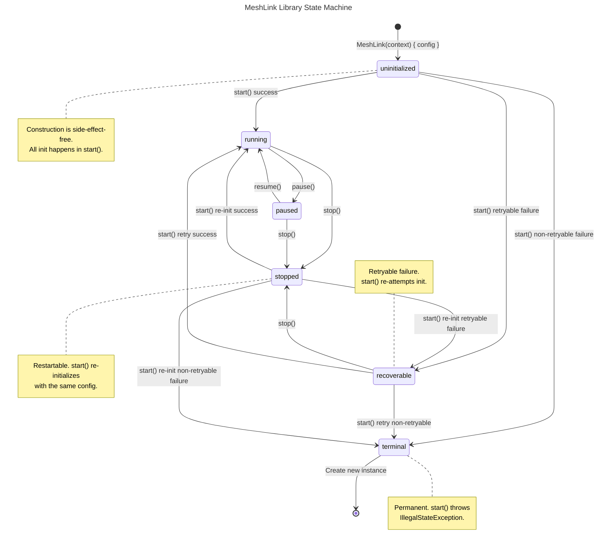

---

## 2. Wire Format — Routed Message (Noise K Sealed Payload)

Byte layout of the E2E encrypted payload inside a `routed_message` (0x05).

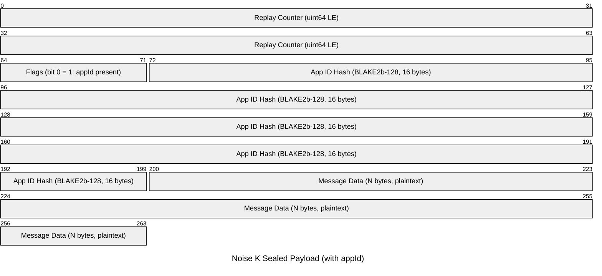

**Variant without appId** (flags bit 0 = 0):

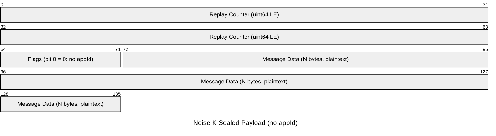

### Broadcast Envelope Wire Format

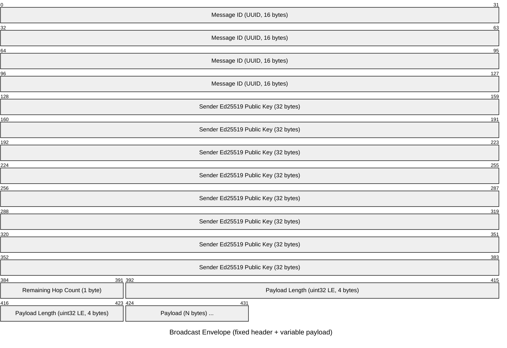

> **Note:** After the payload, a 64-byte Ed25519 signature covers bytes \[0, 53+N). Signature starts at byte offset 53+N. Total envelope = 117+N bytes.

### GATT Message Type Prefix

| Code | Type |
|------|------|
| 0x00 | broadcast |
| 0x01 | handshake |
| 0x02 | gossip |
| 0x03 | chunk |
| 0x04 | chunk_ack |
| 0x05 | routed_message |
| 0x06 | delivery_ack |
| 0x07 | resume_request |
| 0x08–0xFF | reserved |

---

## 3. Architecture Overview

The actor-based internal architecture with transport, security, and routing layers.

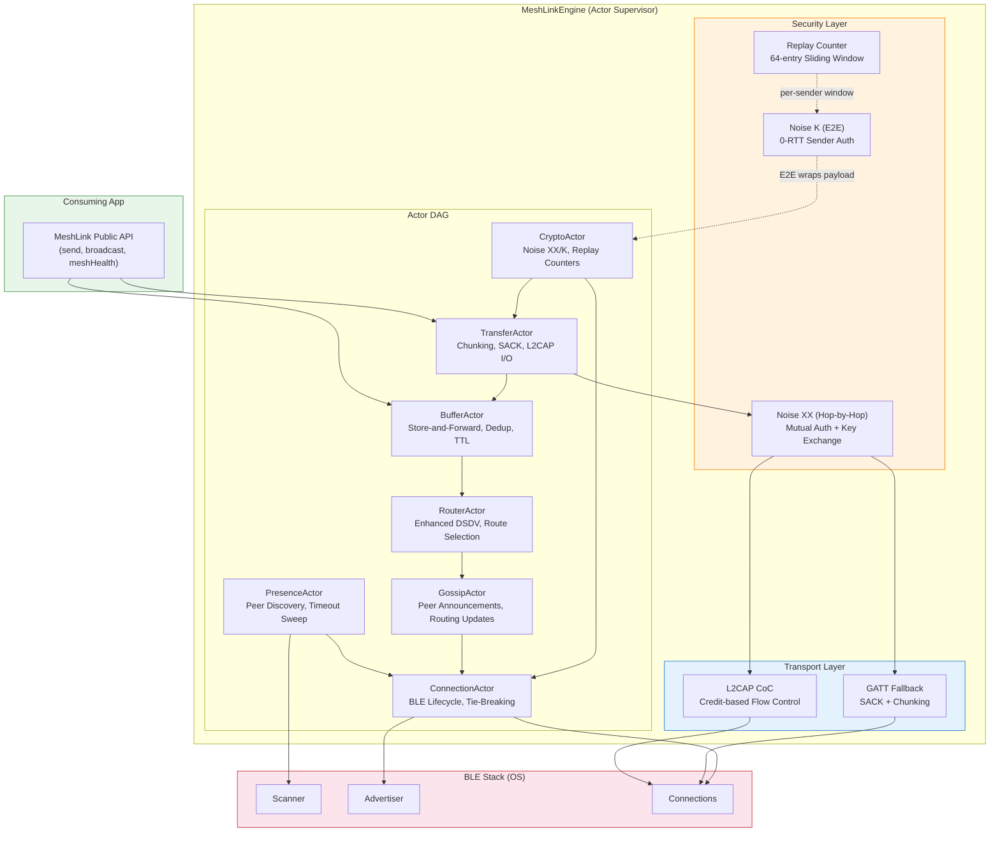

---

## 4. Implementation Phase Dependencies

Gantt chart showing the 7 implementation phases and their dependency relationships.

```mermaid
gantt
    title MeshLink Implementation Phases
    dateFormat X
    axisFormat %s

    section Foundation
        Phase 0 - Protocol Spec & Test Infra   :done, p0, 0, 1

    section Transport
        Phase 1 - BLE Transport (GATT + L2CAP) :active, p1, 1, 2

    section Crypto
        Phase 2 - Encryption & Key Storage     :p2, 2, 3

    section Mesh & Power (Parallel)
        Phase 3 - Mesh Routing & Gossip        :p3, 3, 5
        Phase 5 - Power Mgmt & Hardening       :p5, 3, 5

    section API
        Phase 4 - Public API & Messaging       :p4, 5, 6

    section Release
        Phase 6 - Integration Testing & Docs   :p6, 6, 7
```

### Phase Dependency Graph

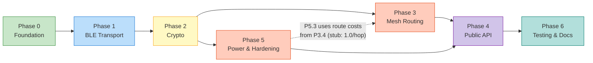

---

## 5. Multi-Hop Routed Message Flow

Sequence diagram showing a direct message from Sender → Relay → Recipient with delivery ACK.

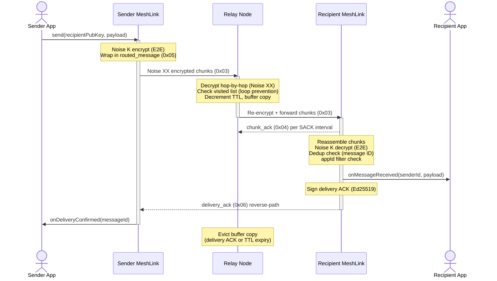

---

## 6. Noise XX Handshake

The 3-message mutual authentication handshake establishing a hop-by-hop encrypted session.

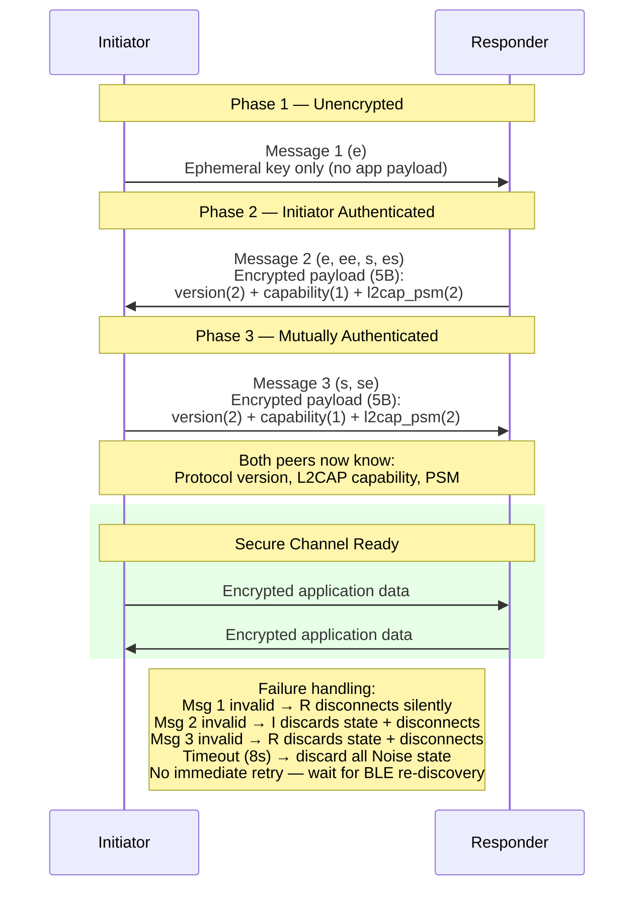

---

## 7. Power Mode Transitions

The 3-tier automatic power management system with battery-driven transitions.

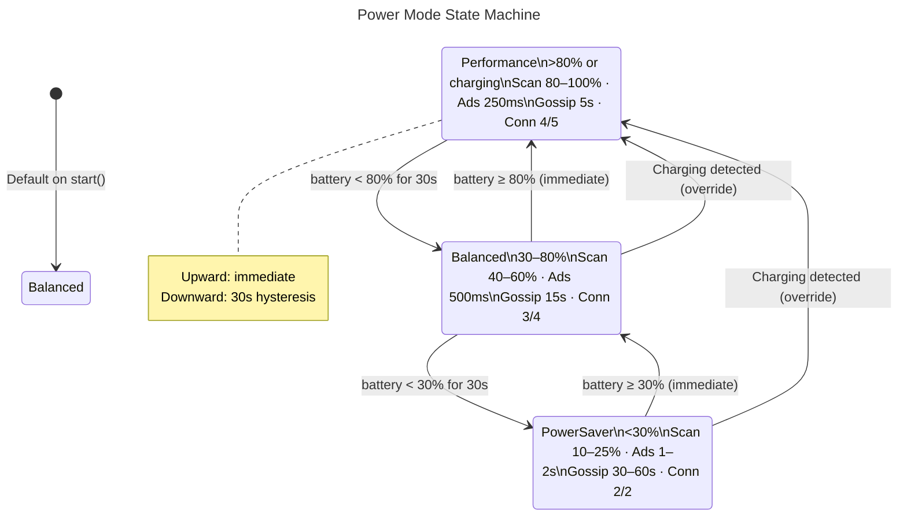

---

## 8. GATT Chunking & SACK Flow

The chunk transfer sequence with selective acknowledgement, relay buffering, and resume-on-disconnect.

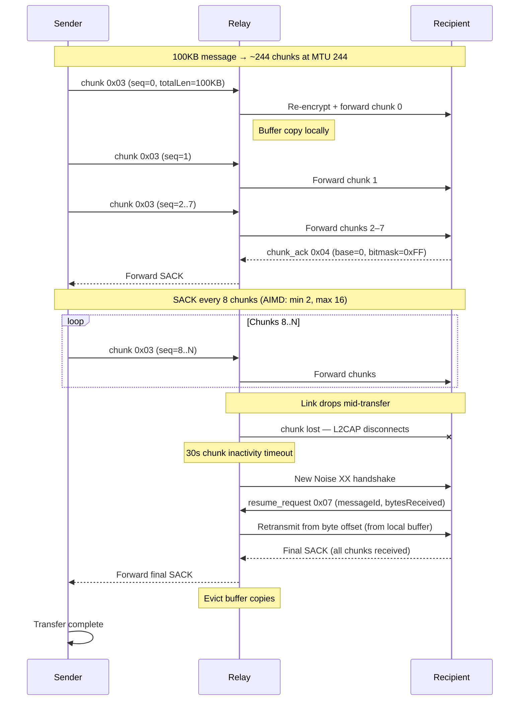

---

## 9. Actor DAG & Message Flow

The 7-actor supervision hierarchy with strict downstream-only message flow.

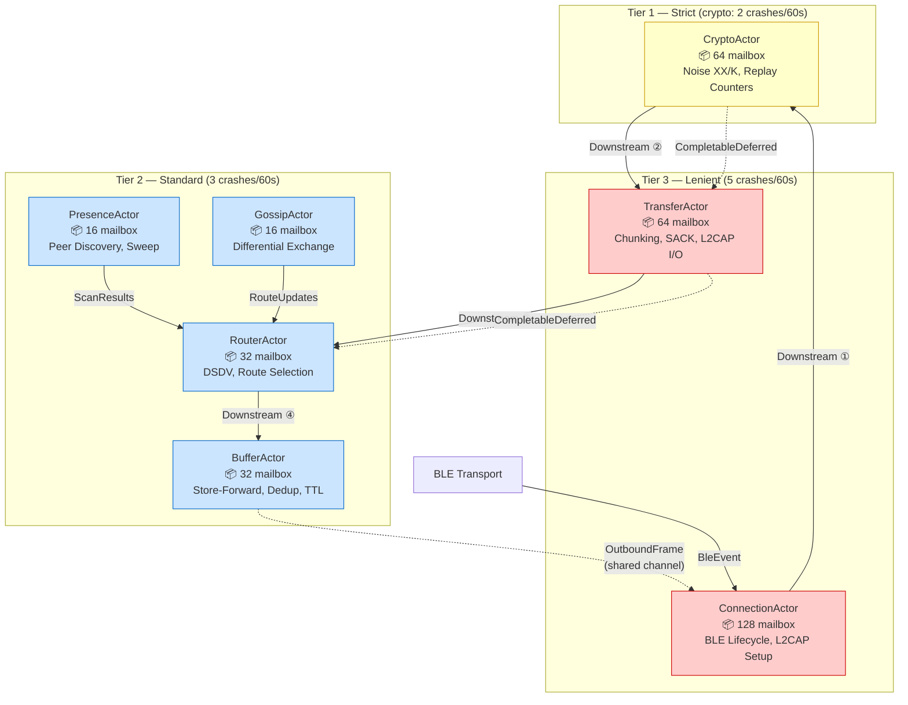

> **DAG invariant:** Downstream actors NEVER send to upstream actors. Reverse communication uses `CompletableDeferred` response channels only. Enforced by code review + compile-time lint.

---

## 10. Gossip Protocol Exchange

Differential gossip exchange between neighbors with split horizon and triggered updates.

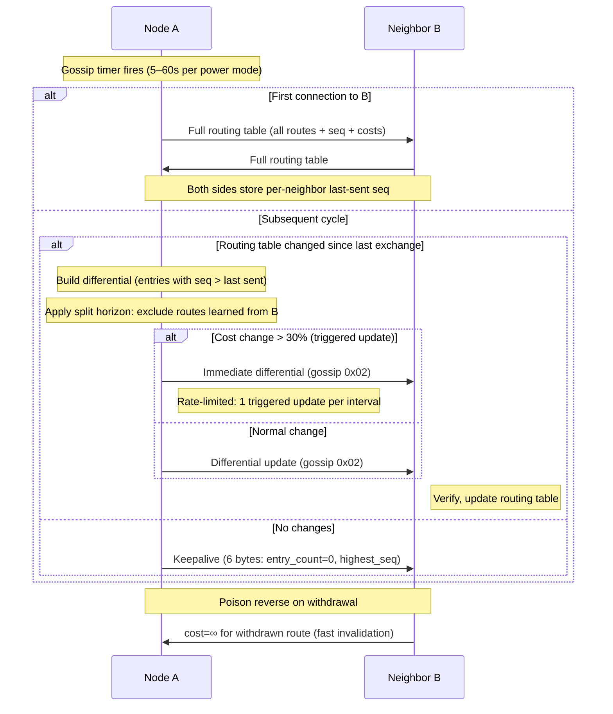

---

## 11. TOFI Trust Model

Trust-on-First-Discover key pinning with strict/softRepin modes and signed rotation handling.

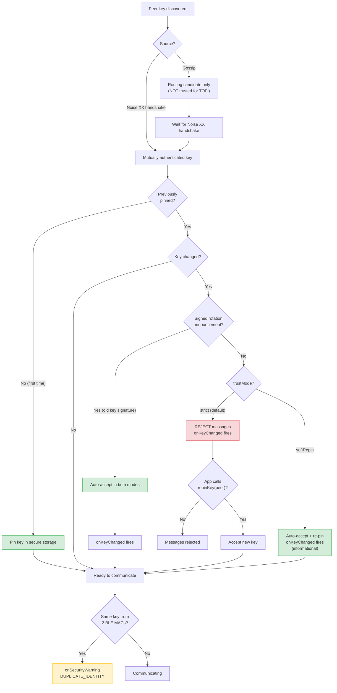

---

## 12. Key Rotation Sequence

Identity key rotation with gossip announcement, grace period, and old-key teardown.

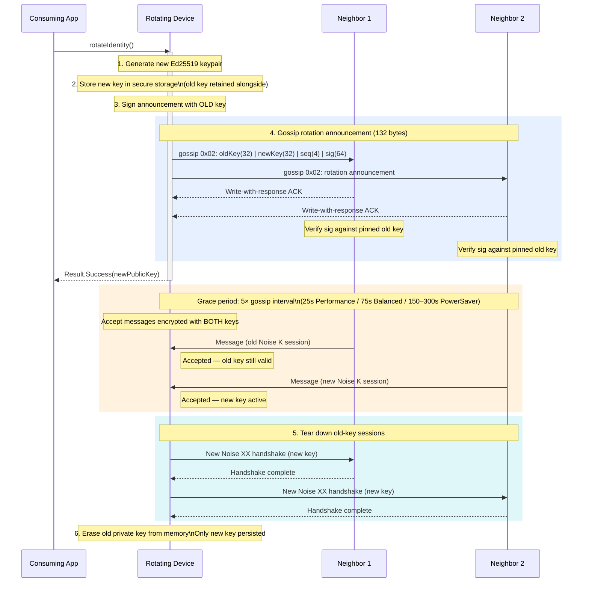
