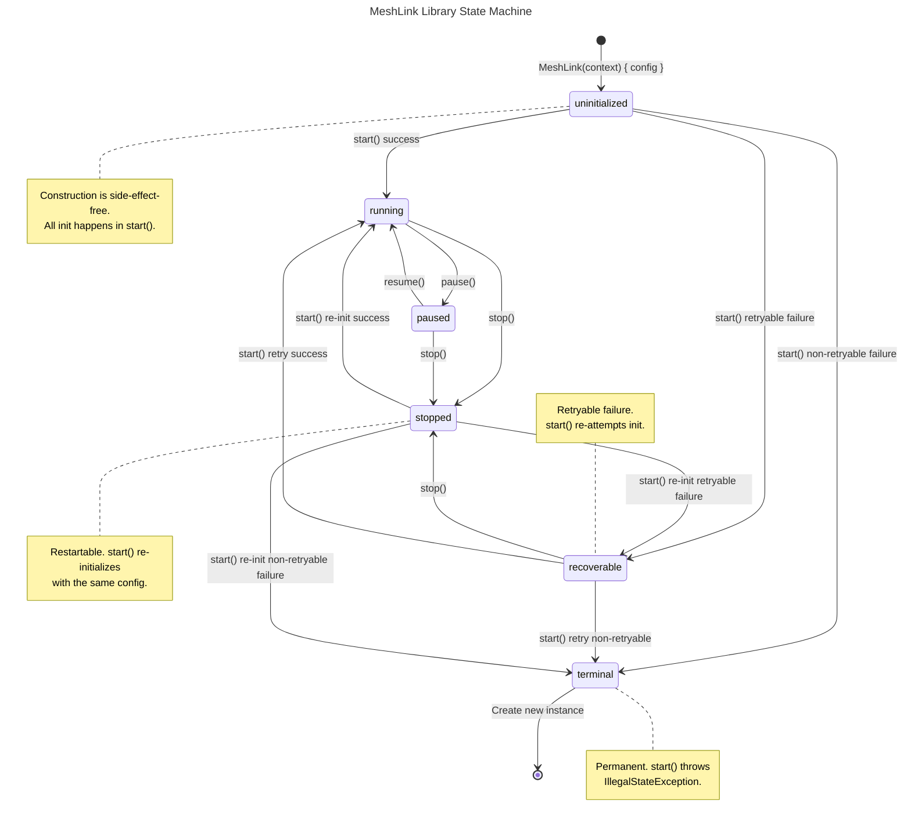
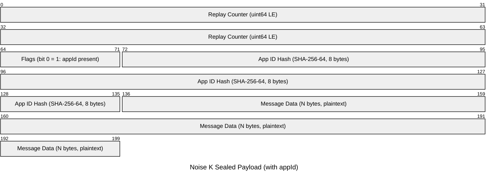
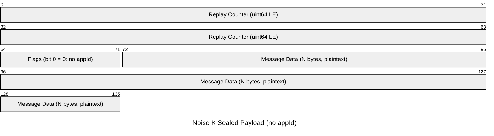
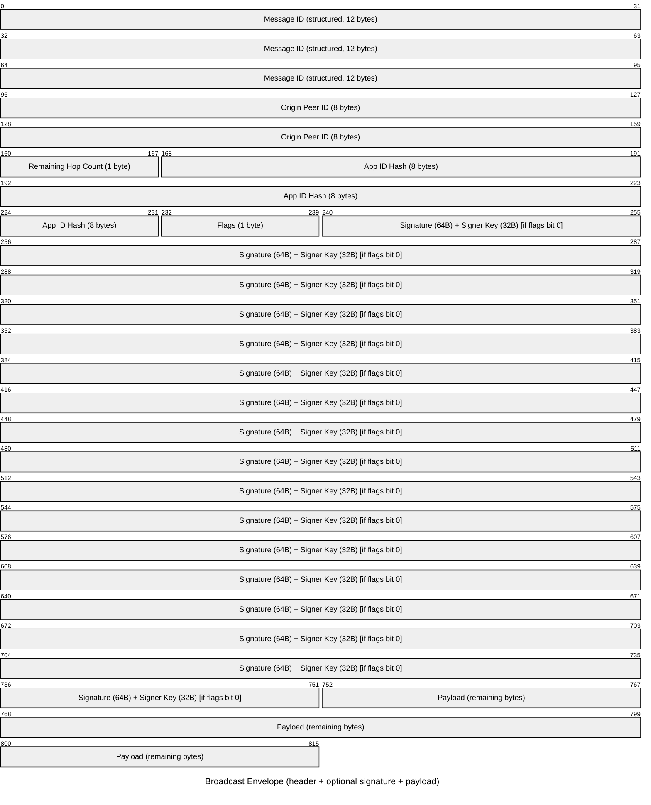
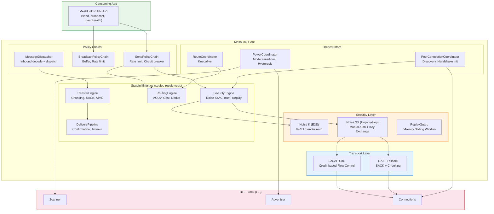
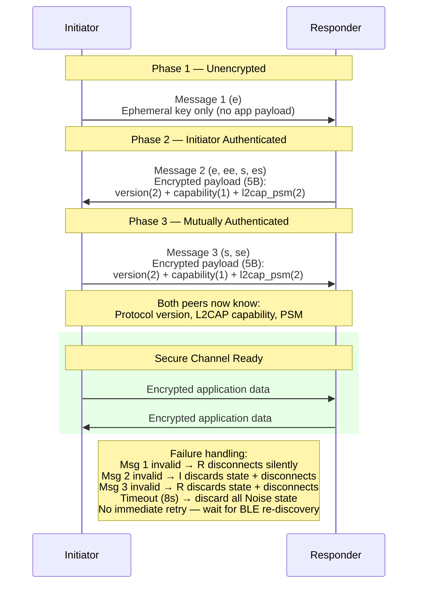
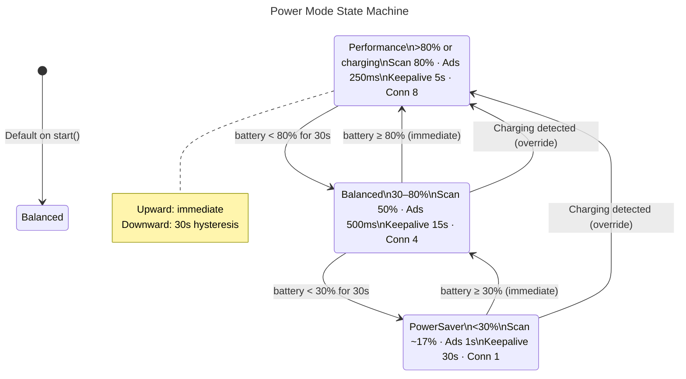
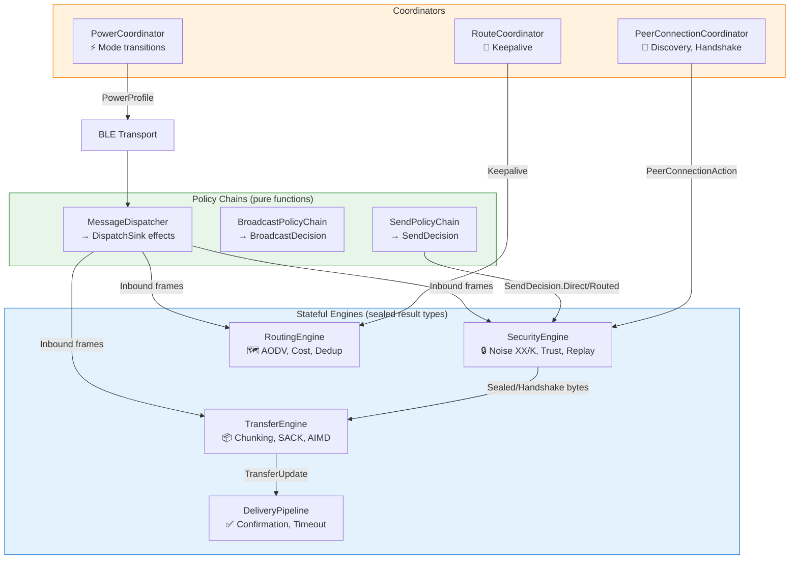
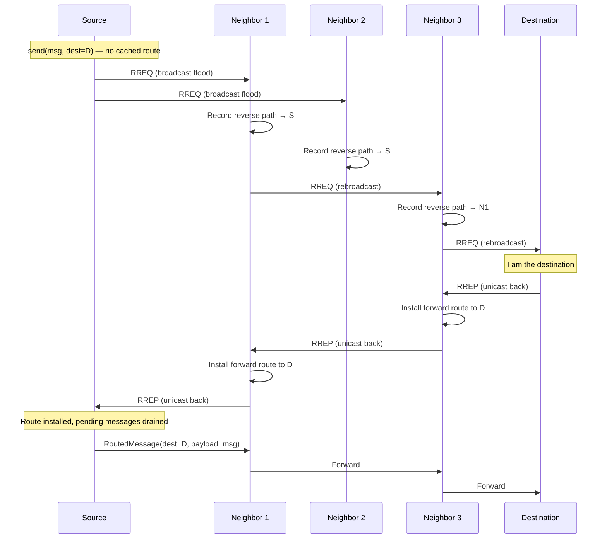
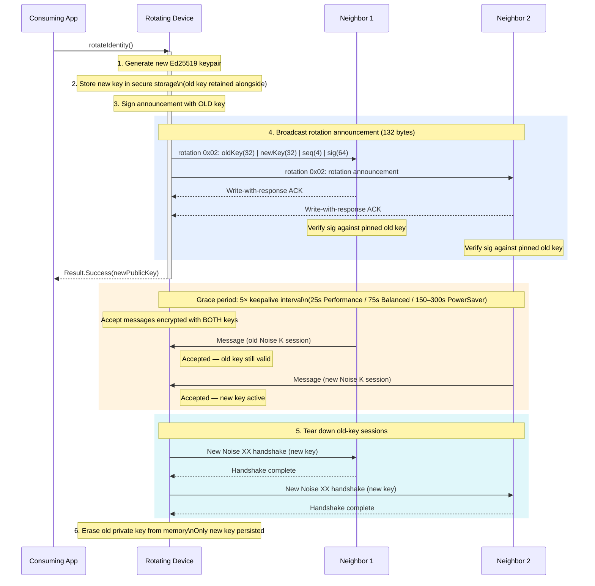

# MeshLink — Visual Diagrams

Reference diagrams for the MeshLink BLE mesh networking library. All diagrams
use [Mermaid](https://mermaid.js.org/) and render natively on GitHub. If
diagrams don't render in your viewer, paste them into the
[Mermaid Live Editor](https://mermaid.live).

## Contents

1. [Library State Machine](#1-library-state-machine) — 6-state lifecycle
2. [Wire Format — Routed Message](#2-wire-format--routed-message-noise-k-sealed-payload) — Noise K sealed payload byte layout
3. [Architecture Overview](#3-architecture-overview) — Engine/coordinator layers
4. [Multi-Hop Routed Message Flow](#4-multi-hop-routed-message-flow) — Sender → Relay → Recipient sequence
5. [Noise XX Handshake](#5-noise-xx-handshake) — 3-message mutual authentication
6. [Power Mode Transitions](#6-power-mode-transitions) — Battery-driven mode state machine
7. [GATT Chunking & SACK Flow](#7-gatt-chunking--sack-flow) — Selective ACK and resume-on-disconnect
8. [Engine & Coordinator Data Flow](#8-engine--coordinator-data-flow) — Sealed result types, unidirectional flow
9. [AODV Route Discovery](#9-aodv-route-discovery) — On-demand RREQ flood and RREP unicast
10. [TOFU Trust Model](#10-tofu-trust-model) — Key pinning with strict/softRepin modes
11. [Key Rotation Sequence](#11-key-rotation-sequence) — Broadcast announcement, grace period, teardown

---

## 1. Library State Machine

The 6-state lifecycle governing the `MeshLink` instance. `stopped` is restartable; `terminal` is permanent.

---

## 2. Wire Format — Routed Message (Noise K Sealed Payload)

Byte layout of the E2E encrypted payload inside a `routed_message` (0x0A).

**Variant without appId** (flags bit 0 = 0):

### Broadcast Envelope Wire Format

> **Note:** When signed, the signature covers `messageId + origin + appIdHash + payload`. The signature block (64-byte Ed25519 signature + 32-byte signer public key) is present only when `flags & 0x01`.

### GATT Message Type Prefix

| Code | Type |
|------|------|
| 0x00 | handshake |
| 0x01 | keepalive |
| 0x02 | rotation |
| 0x03 | route_request (RREQ) |
| 0x04 | route_reply (RREP) |
| 0x05 | chunk |
| 0x06 | chunk_ack |
| 0x07 | nack |
| 0x08 | resume_request |
| 0x09 | broadcast |
| 0x0A | routed_message |
| 0x0B | delivery_ack |
| 0x0C–0xFF | reserved |

---

## 3. Architecture Overview

The engine/coordinator architecture with transport, security, and routing layers.

---

## 4. Multi-Hop Routed Message Flow

Sequence diagram showing a direct message from Sender → Relay → Recipient with delivery ACK.

---

## 5. Noise XX Handshake

The 3-message mutual authentication handshake establishing a hop-by-hop encrypted session.

---

## 6. Power Mode Transitions

The 3-tier automatic power management system with battery-driven transitions.

---

## 7. GATT Chunking & SACK Flow

The chunk transfer sequence with selective acknowledgement, relay buffering, and resume-on-disconnect.

---

## 8. Engine & Coordinator Data Flow

The engine/coordinator architecture with sealed result types and unidirectional data flow.

> **Design principle:** Engines return sealed result types; the caller pattern-matches and dispatches effects. No engine sends messages directly to another engine. `MeshLink` is the sole wiring layer.

---

## 9. AODV Route Discovery

On-demand route discovery using RREQ flood and RREP unicast. Routes are
established only when a message needs to be sent — no proactive routing
overhead.

---

## 10. TOFU Trust Model

Trust-on-First-Discover key pinning with strict/softRepin modes and signed rotation handling.

---

## 11. Key Rotation Sequence

Identity key rotation with broadcast announcement, grace period, and old-key teardown.

