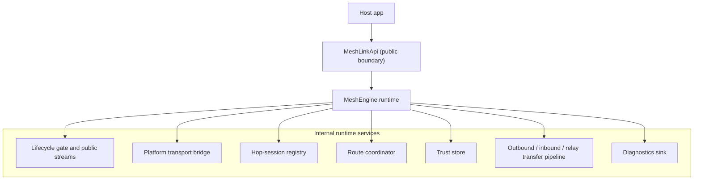
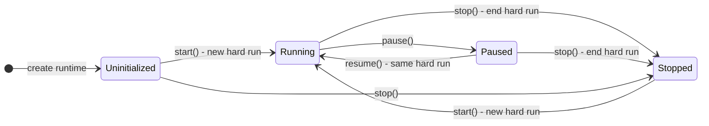
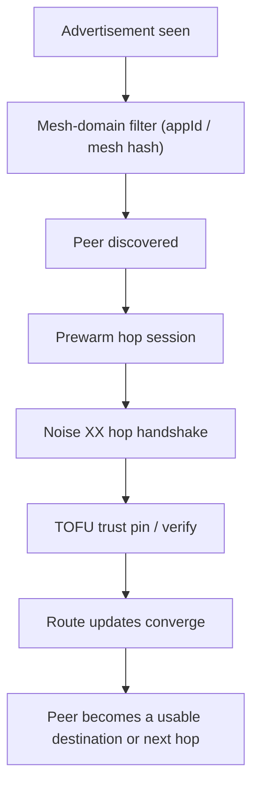
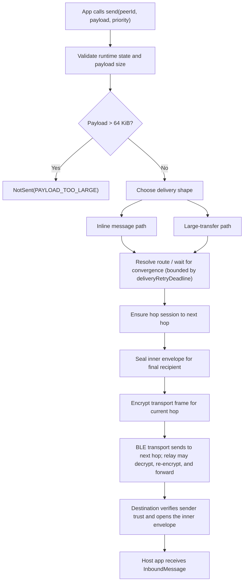
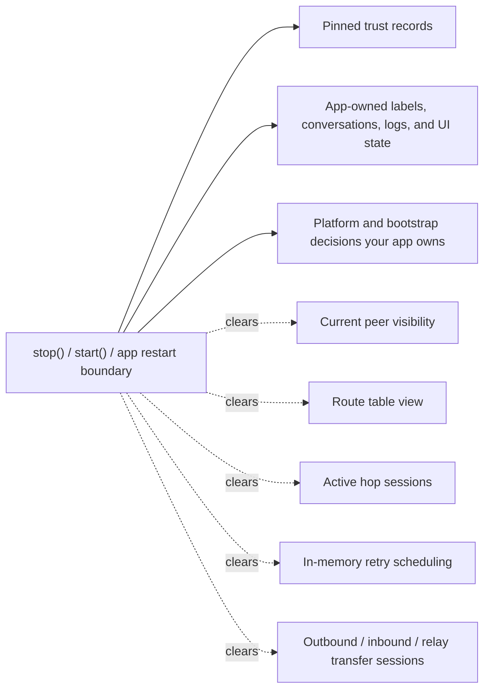
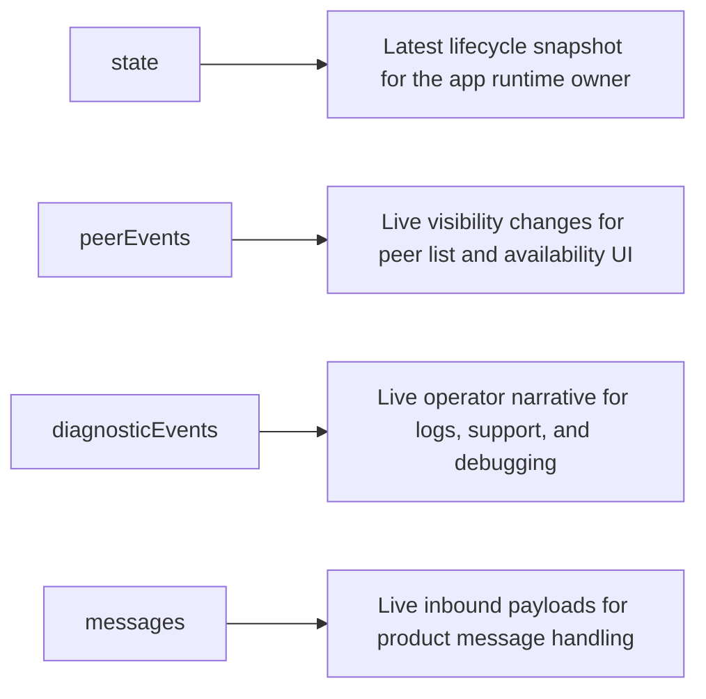
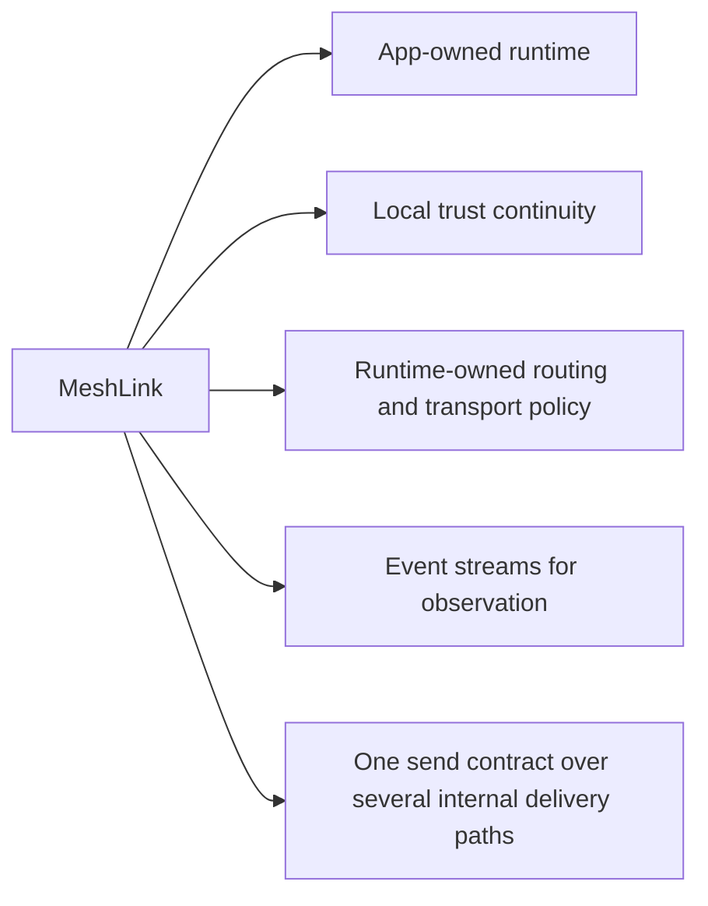

# About how MeshLink works

This page explains the MeshLink runtime model for engineers who need to predict
what the library will do after they create it, start it, pause it, send through
it, or reset trust.

It is intentionally an explanation page. It builds the mental model behind the
public API and the integration guides.

It does not show setup steps. For those, use
[How to integrate MeshLink into a host app](../how-to/integrate-meshlink-into-a-host-app.md).
For the exact public surface, limits, and result types, use the
[MeshLink SDK API reference](../reference/meshlink-sdk-api.md).
For lifecycle, stream, delivery, persistence, and power tables, use the
[MeshLink runtime behavior reference](../reference/meshlink-runtime-behavior.md).
For a shorter integration-rationale companion, use
[About integrating MeshLink well](about-integrating-meshlink.md).

## MeshLink is a runtime, not a utility function

The most important thing to understand is that MeshLink is not shaped like a
"send a packet" helper. It is a long-lived runtime that owns discovery,
transport sessions, routing, trust continuity, transfer state, diagnostics, and
power policy.

That structure has two practical consequences.

First, the library wants one app-owned runtime per mesh domain, not one runtime
per screen and not one runtime per send.

Second, the visible API is intentionally smaller than the internal machinery.
The host app does not choose bearer details, route propagation rules, handshake
steps, or retry wakeups directly. It observes the runtime and drives only the
public control points.

## Creation is not transport start, but it is not entirely inert

Creating a MeshLink runtime does **not** begin scanning, advertising, peer
collection, or payload delivery. Those begin only after `start()`.

But creation is still meaningful work. At construction time, MeshLink sets up
its runtime surface, prepares its subsystem graph, and may prepare the local
identity and platform-owned bootstrap dependencies that later transport and
trust work rely on.

That is why robust integrations treat runtime creation as app-owned service
initialization work, not as something to do inside a transient UI callback.

## One runtime can contain multiple hard runs

MeshLink distinguishes between runtime construction and an active mesh run.
Internally, `start()` begins a new hard run. `pause()` and `resume()` move
within that run. `stop()` ends it.

The important distinction is that `pause()` is a soft boundary and `stop()` is
a hard boundary.

- **Pause / resume** keeps the same run identity but suspends active transport
  work.
- **Stop / start** ends the old run, invalidates in-flight waiting work, and
  starts again from a fresh volatile runtime view.

This is why repeated lifecycle calls are modeled as result values rather than
exceptions. MeshLink expects the host app to drive lifecycle idempotently.

`send()` is different: calling it while MeshLink is not `Running` is an API
misuse and fails as an invalid state transition.

## The public lifecycle methods have visible side effects

The runtime methods are small at the API boundary, but they are not small in
what they trigger internally.

| Call | What changes immediately | What does **not** change automatically |
|---|---|---|
| create runtime | assembles the runtime graph and prepares platform/bootstrap state | no active transport, no discovery, no message flow |
| `start()` | starts transport work, begins a hard run, emits lifecycle diagnostics, and applies the startup power policy, including the automatic startup performance window when that mode is enabled | it does not replay past peer, diagnostic, or message events to late collectors |
| `pause()` | stops active transport collection and clears the current volatile peer / route / session view | it does not delete persisted trust records |
| `resume()` | restarts transport work inside the same hard run | it does not create a new trust baseline or a new mesh domain |
| `stop()` | aborts transfers, clears volatile runtime state, ends the hard run | it does not implicitly forget peers or erase app-owned conversation state |
| `forgetPeer(peer)` | deletes pinned trust for one peer, clears related session state, retracts related route visibility, and can emit `PeerEvent.Lost` | it does not clean up your app's labels, history, or UX state unless you do that too |
| `updateBattery(...)` | can change the effective transport policy and emit power diagnostics | it does not help at all if your app never feeds real battery snapshots |

Those side effects are deliberate. MeshLink is trying to keep transport and
coordination policy inside the runtime instead of pushing it outward into every
host app.

## Discovery, trust, and routing form one pipeline

A peer is not "usable" just because the radio saw it once. MeshLink moves a
peer through several internal stages before the host app gets a stable delivery
experience.

### `appId` is the first routing decision

Before trust or delivery matters, MeshLink uses `appId` as a mesh-domain
boundary. Devices on different `appId`s should not behave as one logical mesh.

That is why a mismatched `appId` looks like "nothing happens" rather than like
an authentication failure later. The devices are filtered apart before the
higher layers become relevant.

### Trust is continuity, not global identity proof

MeshLink uses trust on first use (TOFU).

On the first verified contact with a peer, MeshLink pins that peer's identity
material locally. On later contact, the same peer must present the same keys.
If not, MeshLink fails closed.

This matters because trust is not just a security detail. It changes delivery
semantics:

- first contact can establish trust
- later contacts refresh trust continuity
- mismatched identity blocks delivery instead of silently replacing trust

### Routing is MeshLink-owned infrastructure

MeshLink adapts Babel-style ideas so routes can converge and retract as the
radio topology changes.

The host app does not tell MeshLink which next hop to use. It only names the
final `PeerId`. From there, MeshLink owns route selection, route freshness, and
route withdrawal.

That separation is why route change diagnostics are so important: the app is
outsourcing route reasoning to the runtime, so the runtime has to narrate what
it is doing.

## Sending a message is a pipeline, not one operation

A call to `send()` is only the public front door. Internally, MeshLink still
has to choose a delivery shape, establish or reuse sessions, find a route, and
possibly relay or transfer in chunks.

Several details are easy to miss if you think of `send()` as one atomic action.

### Inline versus transfer delivery

Small payloads go through the inline message path. Larger payloads move through
chunked transfer sessions. For some strong direct links, MeshLink may still use
a larger inline send when the transport budget says that is safe.

That means payload size is not just a performance concern. It can change which
internal subsystem becomes responsible for the delivery.

### Retry is bounded and in memory

If the route is not immediately available, MeshLink can wait for topology change
signals and retry within the configured `deliveryRetryDeadline`.

That retry window is useful, but it is intentionally temporary:

- it is in memory only
- it belongs to the current hard run
- it disappears on stop or app restart

So MeshLink gives you short-lived transport resilience, not durable job-queue
semantics.

### Relay is hop-by-hop outside and end-to-end inside

MeshLink uses hop sessions between adjacent peers, but the application payload
stays sealed for the final recipient.

A relay can therefore:

- decrypt the current hop frame
- read enough routing metadata to forward correctly
- re-encrypt for the next hop
- avoid learning the final plaintext payload

For large transfers, MeshLink prefers cut-through behavior when it can, because
waiting for full reassembly at every hop would make BLE relays much slower.

## The persistence boundary is one of the most important design choices

A lot of integration confusion comes from not knowing what MeshLink treats as
volatile and what it treats as continuity.

This is why `stop()` feels stronger than "stop scanning". It is the boundary at
which MeshLink intentionally abandons volatile transport work.

It is also why `forgetPeer()` is not a cosmetic cleanup. Forgetting a peer
changes trust continuity and therefore changes what future delivery attempts can
mean.

## The four public streams solve four different problems

A lot of host apps become harder to reason about because they try to treat one
stream as the answer to every question.

MeshLink deliberately does not do that.

Two stream properties matter a lot in practice.

### `state` is snapshot-oriented

`state` is the lifecycle snapshot. New collectors can ask, "What is the runtime
state right now?" and receive the current answer immediately.

### The event streams are live and non-replaying

`peerEvents`, `diagnosticEvents`, and `messages` are live event streams, not
historical archives.

That means:

- attach long-lived collectors before `start()` when you need full-session
  visibility
- do not expect late subscribers to see earlier events
- do not treat these streams as durable audit storage

Diagnostics are especially important here: they are the best explanation of
what the runtime is doing, but they are still runtime events, not a guaranteed
persistent ledger. Under sustained backlog, diagnostics should be treated as
best-effort rather than lossless archival output.

## The subtle side effects integrators usually notice late

Most MeshLink surprises are not "bugs" so much as design consequences that were
not modeled explicitly in the host app.

### `SendResult.Sent` is not a user-level acknowledgement

`Sent` means MeshLink completed the delivery path it owns. It does **not** mean:

- the receiving app persisted the content
- the receiving UI surfaced it to a human
- a business transaction completed
- the user read anything

If your product needs that stronger meaning, it must add an application-level
receipt or response.

### Trust reset is a product event, not a transport detail

Calling `forgetPeer()` mutates the continuity model. It is not the same kind of
thing as retrying a packet or clearing a stale spinner.

If the app forgets a peer, the app also needs an opinion about what should
happen to:

- human-readable peer labels
- chat or activity history
- support notes
- the user's explanation of why this peer is "new again"

### Automatic power mode depends on app honesty

`PowerMode.Automatic` is only as real as the battery data the host app feeds
into MeshLink.

If the app never calls `updateBattery()`, the runtime can still honor startup
and current-policy behavior, but it cannot react correctly to the real battery
state later.

### Pause and stop change the runtime view, not just radio activity

A pause or stop is not merely "turn Bluetooth work off for a moment." MeshLink
also clears the volatile peer / route / session view tied to the active run.

That is why UI surfaces often see apparent peer disappearance around runtime
boundaries. The runtime is telling the truth: the current mesh view really was
cleared.

## Why these behaviors imply specific best practices

The best practices around MeshLink are not arbitrary rules. They fall straight
out of the runtime model.

### Own one long-lived runtime per mesh domain

Because MeshLink owns discovery, trust, routing, and transfer state, creating a
new runtime per send throws away exactly the continuity that makes the library
valuable.

### Collect event streams before startup and keep them app-owned

Because the event streams are live and non-replaying, screen-local collectors
attached late will miss the beginning of the story. Long-lived app ownership is
how you keep the full session visible.

### Treat `PeerId` as an opaque routing handle

Because MeshLink owns route selection and trust continuity, `PeerId` should be
used as a stable handle, not mined for user-visible meaning. Your app can layer
friendly naming on top of it, but the runtime should remain the source of truth
for the transport identity.

### Keep diagnostics separate from payload handling

Because messages answer "what content arrived" while diagnostics answer "what
was the mesh doing," mixing them makes both worse. Operator reasoning belongs
with diagnostics, not with product message history.

### Make trust reset explicit and explainable

Because forgetting a peer changes identity continuity, the app should treat it
like a deliberate user or support action. Hidden trust mutation is confusing for
users and terrible for debugging.

### Keep platform-specific logic at the edges

Because MeshLink is shared-first, platform code should stay near bootstrap:
Android context setup, iOS crypto installation, and optional native transport
bridges. After that, lifecycle, streams, and delivery reasoning should stay as
shared as possible.

## The simplest reliable mental model

If you want one compact way to think about MeshLink, use this:

That model explains most of the library's side effects:

- why creation belongs to an app-owned service boundary
- why start / pause / resume / stop matter so much
- why diagnostics are first-class
- why trust reset is significant
- why `Sent` is not the same thing as "the other user saw it"

## Related docs

- [About integrating MeshLink well](about-integrating-meshlink.md)
- [How to integrate MeshLink into a host app](../how-to/integrate-meshlink-into-a-host-app.md)
- [How to structure a robust MeshLink integration](../how-to/structure-a-robust-meshlink-integration.md)
- [MeshLink SDK API reference](../reference/meshlink-sdk-api.md)
- [The trust model](trust-model.md)
- [Understanding Babel routing](understanding-babel-routing.md)
- [Cut-through relay](cut-through-relay.md)
- [Power management](power-management.md)
- [About the L2CAP-first transport posture](why-l2cap-first.md)
- [Discovery identity hash and privacy trade-offs](privacy-pseudonyms.md)
