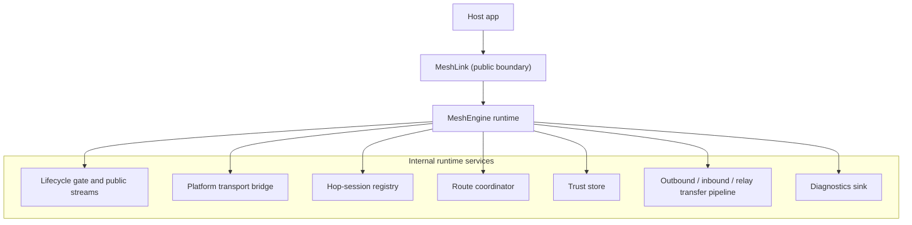
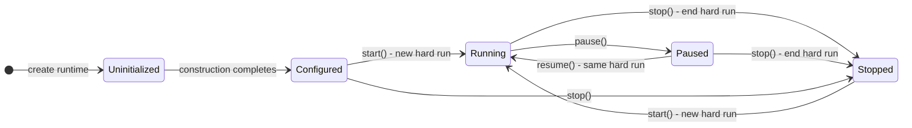
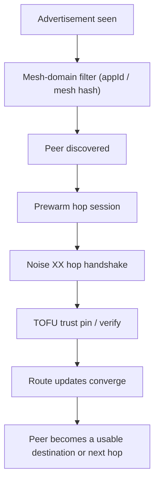
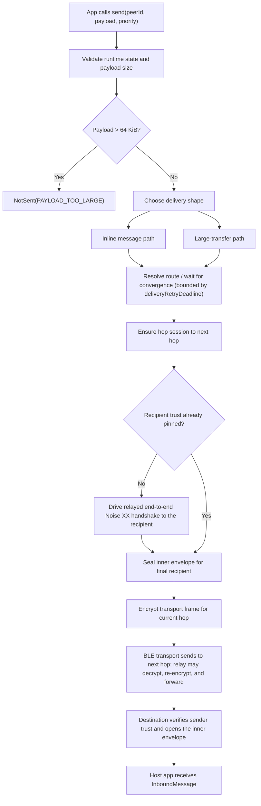
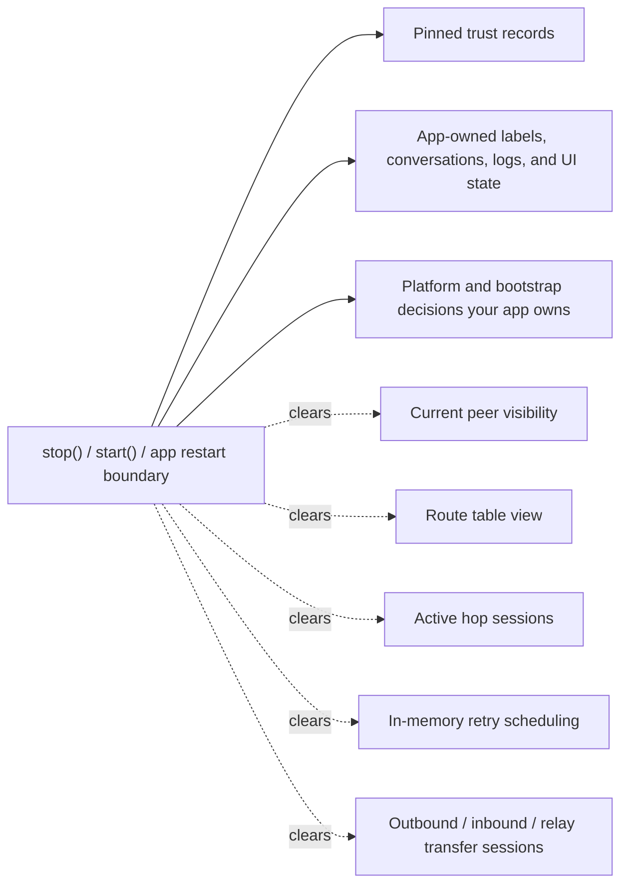
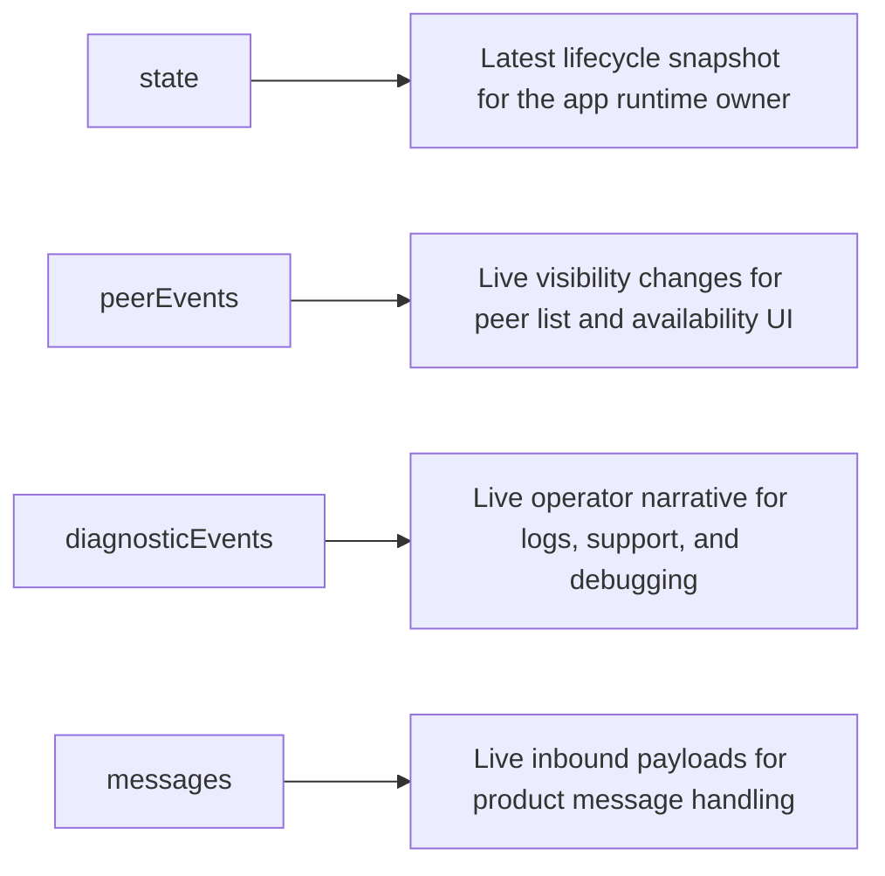
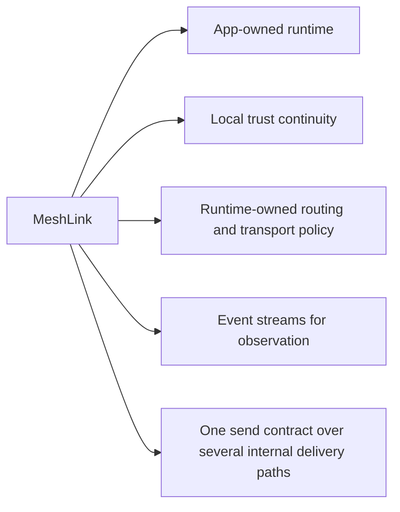

# About how MeshLink works

This page explains the MeshLink runtime model for engineers who need to predict
what the library will do after they create it, start it, pause it, send
through it, or reset trust.

It is an explanation page. Use the other docs when the job is different:

- setup steps — [How to integrate MeshLink into a host app](../how-to/integrate-meshlink-into-a-host-app.md)
- exact public surface — [MeshLink SDK API reference](../reference/meshlink-sdk-api.md)
- exact lifecycle, stream, and delivery facts — [MeshLink runtime behavior reference](../reference/meshlink-runtime-behavior.md)
- shorter integration guidance — [About integrating MeshLink well](about-integrating-meshlink.md)

## MeshLink is a runtime, not a send helper

The most important thing to understand is that MeshLink is a long-lived runtime.
It owns discovery, transport sessions, routing, trust continuity, transfer
state, diagnostics, and power policy.

Two consequences fall straight out of that design:

- the app usually wants one runtime per mesh domain, not one runtime per screen
  and not one runtime per send
- the public API stays smaller than the internal machinery, so the host app
  observes runtime behavior instead of choosing bearer, route, or handshake
  details directly

## Runtime creation and hard runs are different boundaries

Creating a MeshLink runtime does **not** begin scanning, advertising, peer
collection, or payload delivery. Those begin only after `start()`.

Creation still matters. MeshLink sets up its runtime surface, prepares its
subsystem graph, and may prepare local identity and platform bootstrap state.
That is why runtime creation belongs in an app-owned service boundary rather
than in a transient UI callback.

MeshLink also distinguishes between runtime construction and an active mesh run.
Construction begins in `Uninitialized`, completes in `Configured`, `start()`
begins a new hard run, `pause()` and `resume()` stay inside that run, and
`stop()` ends it.

A useful way to think about the lifecycle boundaries is:

| Boundary | What it means |
|---|---|
| create runtime | starts in `Uninitialized` while the runtime surface is being built, then returns a configured runtime object once construction completes |
| `pause()` | a soft boundary inside the current hard run |
| `stop()` | a hard boundary that ends the current run and abandons volatile transport state |

That is also why repeated lifecycle calls return result values rather than
throwing. MeshLink expects the host app to drive lifecycle idempotently.

`send()` is different: calling it while MeshLink is not `Running` is API misuse
and fails as an invalid state transition.

## Discovery, trust, and routing form one pipeline

A peer is not usable just because the radio saw it once. MeshLink moves a peer
through a pipeline before the host app gets a stable delivery experience.

Three pieces of that pipeline matter especially often in host apps:

### `appId` is a mesh boundary, enforced twice

Before trust or delivery matters, MeshLink uses `appId` as the mesh-domain
boundary, enforced at two independent layers:

1. **Discovery filter.** Devices with different `appId`s are filtered apart at
   the BLE advertisement layer before the higher layers become relevant. This
   filter uses a compact 16-bit hash of `appId` and exists purely to avoid
   wasting radio time connecting to unrelated meshes; it is not a security
   boundary and different `appId`s can collide in this hash.
2. **Cryptographic handshake binding.** `appId` is also mixed into every Noise
   XX handshake (hop-to-hop and end-to-end) as the handshake prologue, before
   any key material is exchanged. Two peers configured with different
   `appId`s derive different handshake transcripts and fail authentication
   outright, even if they somehow reach the handshake stage (for example
   because of a discovery-hash collision, or because the host app performs its
   own out-of-band pairing). This means mesh isolation is a real cryptographic
   guarantee, not just a discovery convenience.

That is why an `appId` mismatch usually looks like "nothing is happening"
rather than like an authentication failure later — but if a handshake attempt
does reach a peer with a different `appId`, it fails closed instead of quietly
authenticating across mesh boundaries.

### Trust is continuity, not global identity proof

MeshLink uses trust on first use (TOFU). On first verified contact, it pins a
peer's identity locally. On later contact, the same peer must present the same
keys. If not, MeshLink fails closed.

Trust can only ever come from an **authenticated Noise XX handshake
completion** — never from route-gossip metadata, and never from a sender's
self-asserted claims inside a message envelope. Concretely:

- for an adjacent peer (a direct radio link), the hop-to-hop handshake pins
  trust
- for a peer that is several hops away, MeshLink transparently drives a
  **relayed end-to-end Noise XX handshake** to that peer (relays forward
  opaque handshake frames without terminating them) and pins trust only from
  that handshake's outcome
- inbound messages must present a sender identity that already has trust
  pinned through one of the above; an envelope cannot bootstrap trust for
  itself

That changes delivery semantics in a practical way:

- first contact can establish trust
- later contacts refresh trust continuity
- mismatched identity blocks delivery instead of silently replacing trust
- the very first `send()` to a new multi-hop peer pays the cost of a
  round-trip end-to-end handshake before the message can be sealed; if that
  peer is unreachable, the send resolves as `SendResult.NotSent(UNREACHABLE)`
  instead of silently falling back to a less-verified trust source

### Routing is runtime-owned infrastructure

The host app names the final `PeerId`. From there, MeshLink owns route
selection, route freshness, and route withdrawal.

That is why route diagnostics matter so much. The app is outsourcing route
reasoning to the runtime, so the runtime has to narrate what it is doing.

## Sending is a pipeline, not one operation

A call to `send()` is only the public front door. Internally, MeshLink still
has to choose a delivery shape, establish or reuse sessions, find a route, and
possibly relay or transfer in chunks.

Three practical details are easy to miss:

- small payloads use the inline path, while larger payloads can move through
  chunked transfer sessions
- retries are bounded by `deliveryRetryDeadline`, stay in memory, and disappear
  on stop or app restart
- relays work hop-by-hop on the outside while the application payload stays
  sealed for the final recipient; when the final recipient has no trust
  pinned yet, MeshLink drives an end-to-end handshake to that recipient
  through the relays before it can seal a payload for them

So MeshLink gives the app one send contract over several internal delivery
paths.

## Persistence is selective

A lot of integration confusion comes from not knowing what MeshLink treats as
continuity and what it treats as volatile runtime state.

That is why `stop()` feels stronger than "stop scanning". It is the boundary at
which MeshLink intentionally abandons volatile transport work.

It is also why `forgetPeer()` is not cosmetic cleanup. Forgetting a peer changes
trust continuity and therefore changes what future delivery attempts can mean.

## The four public streams answer different questions

MeshLink deliberately does not collapse everything into one stream.

Two stream facts matter a lot in practice:

- `state` is snapshot-oriented, so new collectors immediately get the current
  lifecycle state
- `peerEvents`, `diagnosticEvents`, and `messages` are live, non-replaying event
  streams, so late collectors can miss earlier events

That is why long-lived app-owned collectors are usually a better fit than
screen-local collectors when you need full operator visibility.

## What this model means for host apps

Several integration consequences fall directly out of the runtime model.

### `SendResult.Sent` is not a user-level acknowledgement

`Sent` means MeshLink completed the delivery path it owns. It does **not** mean
that the receiving app persisted the content, showed it to a user, or completed
a business action.

If your product needs that stronger meaning, add an application-level receipt
or response.

### Trust reset is a product event

Calling `forgetPeer()` changes identity continuity. If the app forgets a peer,
it also needs an opinion about labels, history, support notes, and how the user
understands that peer becoming "new again".

### Automatic power mode depends on app input

`PowerMode.Automatic` is only as real as the battery data the host app feeds
into MeshLink. If the app never calls `updateBattery()`, the runtime cannot
react correctly to real battery state changes later.

### Pause and stop clear the current runtime view

A pause or stop is not just "turn Bluetooth work off for a moment". MeshLink
also clears the volatile peer, route, and session view tied to the active run.
That is why UI surfaces often see peers disappear around runtime boundaries.

## The simplest reliable mental model

If you want one compact way to think about MeshLink, use this:

That model explains most of the library's behavior:

- why creation belongs in an app-owned service boundary
- why start, pause, resume, and stop matter so much
- why diagnostics are first-class
- why trust reset is significant
- why `Sent` is not the same thing as "the other user saw it"

## Related docs

- [About integrating MeshLink well](about-integrating-meshlink.md)
- [How to integrate MeshLink into a host app](../how-to/integrate-meshlink-into-a-host-app.md)
- [How to structure a robust MeshLink integration](../how-to/structure-a-robust-meshlink-integration.md)
- [MeshLink SDK API reference](../reference/meshlink-sdk-api.md)
- [The trust model](trust-model.md)
- [Understanding Babel routing](understanding-babel-routing.md)
- [Cut-through relay](cut-through-relay.md)
- [Power management](power-management.md)
- [About the L2CAP-preferred transport posture](why-l2cap-first.md)
- [Discovery identity hash and privacy trade-offs](privacy-pseudonyms.md)
