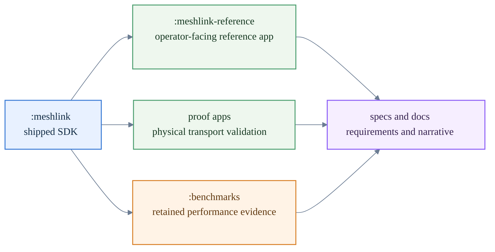
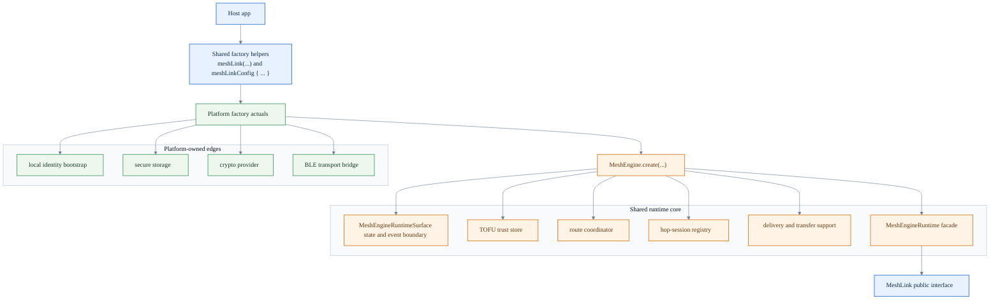
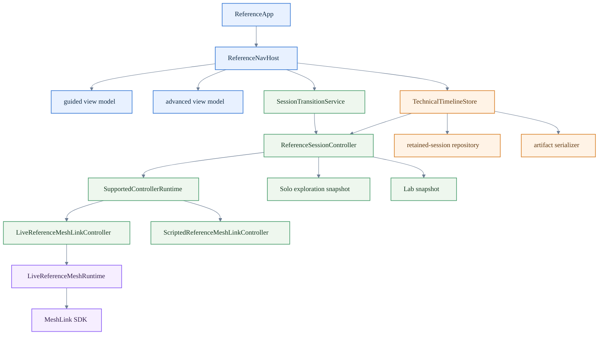
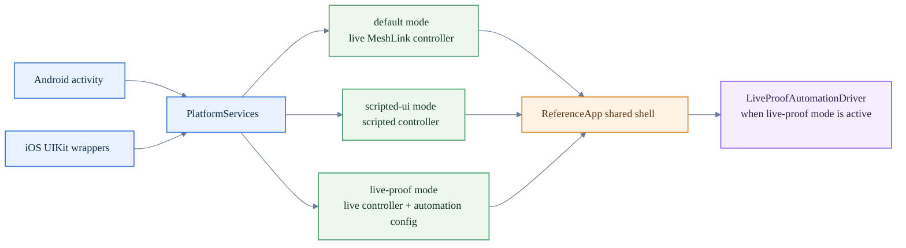

# About the repository architecture

This page explains why the MeshLink repository is split the way it is and how
its major modules fit together.

It is an explanation page. Use the other docs when the job is different:

- exact module and source-set lookup —
  [Repository layout reference](../reference/repository-layout.md)
- contributor commands and verification bundles —
  [Contributor build, test, and verification reference](../reference/contributor-reference.md)
- SDK API facts — [MeshLink SDK API reference](../reference/meshlink-sdk-api.md)
- SDK runtime semantics —
  [MeshLink runtime behavior reference](../reference/meshlink-runtime-behavior.md)
- reference-app evaluation flow —
  [How to evaluate MeshLink with the reference app](../how-to/evaluate-meshlink-with-the-reference-app.md)
- reference-app and test boundaries —
  [Reference app and test architecture](reference-app-and-test-architecture.md)

> Quick orientation:
> - the reference app is the human-facing surface for evaluation and review
> - the proof apps are the transport-validation surfaces kept separate from it
> - the repository split keeps SDK, app, and evidence concerns independently testable

## How the repository is organized
- proof-surface chooser and validation-boundary explanation —
  [About proof validation surfaces](about-proof-validation-surfaces.md)

## The repository separates one product SDK from several evidence surfaces

The most important structural choice in the codebase is that the shipped SDK,
the operator-facing reference app, the proof apps, and the benchmarks are not
the same thing.

That split keeps four concerns from bleeding into each other:

- `:meshlink` stays the source of truth for public SDK behavior
- the reference app can be product-like without becoming the normative
  transport benchmark harness
- the proof apps can keep proof-only and benchmark-only behavior without
  redefining the product-facing evaluation surface
- benchmarks can preserve performance evidence without dragging benchmark logic
  into the SDK public boundary

This matters because the repository is doing two jobs at once:

1. shipping a reusable Kotlin Multiplatform SDK
2. retaining enough evidence to prove that the SDK behaves correctly on real
   Android and iOS hardware

The codebase shape reflects that dual responsibility.

## The SDK keeps the public surface small and pushes platform glue outward

The shared SDK is intentionally organized around one common public API and one
much richer internal runtime.

A few code-level consequences fall out of that structure.

### The public API is common, but construction is platform-aware

The common factory helpers stay small, but the platform actuals own the
platform-specific setup.

On Android, the platform factory requires explicit bootstrap input so it can
obtain the application context and wire Android storage and transport.
On iOS and JVM, the default factory can construct the runtime without that
extra caller-supplied bootstrap step.

That choice keeps the developer-visible API mostly shared while still allowing
Android to be strict about the extra information it actually needs.

### The runtime is assembled in phases instead of one monolithic constructor

`MeshEngine.create(...)` delegates into a staged assembly process that builds:

- the published runtime surface
- the foundation services
- the session and handshake phase
- the transfer and inbound phase
- the facade operations that back the public `MeshLink` interface

That is why the codebase has many narrowly scoped `MeshEngine*Support` and
`MeshEngineRuntime*Assembly` types. They are not accidental fragmentation.
They are how the repository keeps routing, handshake, delivery, retry, and
transfer concerns testable without turning the public API into a mirror of the
internal machinery.

### Platform code stays at the edges

The shared module owns routing, trust, transfer, diagnostics, and most runtime
behavior. Platform code is concentrated around secure storage, crypto provider
installation, BLE transport glue, and the factory seam that connects those
pieces.

That is the repository-level expression of the project rule that shared logic
belongs in common code and platform source sets should mostly hold actuals and
platform glue.

## The reference app is built around session ownership and evidence ownership

The reference app looks like a navigation problem from the outside, but the
code says otherwise. Navigation is only one layer. The real center is the
session and evidence model.

Several important design choices are visible in that graph.

### The root composable stays thin on purpose

`ReferenceApp` only applies theme and hands off to `ReferenceNavHost`.
The shell does not try to own session policy, storage, export logic, or live
MeshLink orchestration directly.

That keeps the UI root stable while the deeper session or automation model can
change independently.

### Session boundaries are not delegated to navigation alone

`ReferenceNavHost` decides which surface is visible, but
`SessionTransitionService` decides whether moving to a different surface means
one of these things:

- a normal supported-surface switch inside the same session
- a boundary confirmation that closes a supported session
- the start of an alternative **Solo exploration** or **Lab** session
- a follow-up supported session after an ended or alternative session

This matters because the app has stricter semantics than a normal tabbed UI.
Moving between **Guided first exchange**, **Advanced controls**,
**Solo exploration**, **Lab**, **Technical timeline**, and **Recent history**
is not just a visual routing event. It can change what counts as authoritative
proof, whether automatic retention is allowed, and whether full-payload export
is still available.

### The timeline store is the evidence hub

`TechnicalTimelineStore` is more than a screen-specific store.
It mirrors the live controller snapshot, opens retained sessions, applies
filters, writes exports, and keeps track of the last export path.

That centralization explains why the timeline and history surfaces feel so
load-bearing in this codebase. They are not decorative diagnostics. They are
how the reference app turns one runtime session into retained evidence.

### The session controller deliberately swaps controller shapes

`ReferenceSessionController` can point the app at:

- a supported live controller backed by the real MeshLink SDK
- an ended supported-session snapshot
- a **Solo exploration** snapshot
- a **Lab** snapshot

`SupportedControllerRuntime` hides the details of starting, closing, and
rebinding the active supported controller. That keeps the rest of the shell from
having to know whether it is looking at a live SDK-backed controller or a
static alternative-session snapshot.

## Automation is a first-class mode, not a second app

The codebase does not build a separate hidden automation application. Instead,
Android and iOS entry points choose different `PlatformServices` shapes and
still render the same shared shell.

This is a strong architectural choice for a repository like this.

It means:

- manual evaluation, scripted UI automation, and live proof automation all pass
  through the same session-boundary and export logic
- automation is less likely to drift into a fake success path that humans never
  exercise
- platform-specific startup code stays responsible for selecting mode,
  filesystem location, readiness blockers, and automation config
- the shared app shell remains the thing being validated, not bypassed

That explains why the Android host activity and the iOS entry points spend so
much effort choosing the right platform-services variant. They are selecting the
control surface behind the same UI, not selecting a different UI.

## The build shape is intentionally asymmetric

At first glance, the repository can look slightly uneven:

- the reference app has a shared Gradle module plus a nested Android app module
  plus a native iOS project
- the proof apps are separate Android and iOS hosts instead of one shared app
- benchmarks live in their own JVM module

That asymmetry comes from deployment and evidence needs, not from neglect.

### The reference app uses one shared shell and two native hosts

The shared reference-app code is a Kotlin Multiplatform library module because
that is where Compose UI, session state, export logic, and automation support
can stay aligned across Android and iOS.

Android still needs an application module to package and launch that shell.
The current AGP 9 shape therefore uses a nested Android host module.

iOS still needs a native Xcode project because signing, schemes, simulator and
physical-device workflows, and XCTest or UI-test targets all live there.
The iOS host project therefore consumes the shared framework instead of trying
to replace native iOS project structure entirely.

### The proof apps remain separate on purpose

The proof apps are not just smaller copies of the reference app. They are proof
fixtures: dedicated transport-validation surfaces. That makes it useful for
them to carry proof-only or benchmark-oriented behavior without redefining the
reference app's supported product-like surfaces.

Keeping them separate preserves a clean boundary between:

- evaluating the SDK as a coherent operator-facing experience
- proving transport behavior on physical devices

Inside those proof apps, the code now follows the same architectural instinct.
The Android proof activity stays a thin app surface while launch parsing,
permission rules, benchmark framing, and runtime ownership sit behind narrower
helpers. The iPhone proof app still presents one view model to SwiftUI, but
benchmark-only mode switching, launch parsing, and transport-log capture no
longer compete inside one undifferentiated file.

### Benchmarks stay out of the product surface

The benchmark module exists so performance evidence can be retained and rerun
without making the SDK or the reference app pretend that benchmark code is part
of ordinary product behavior.

That is the same architectural theme again: the repository is careful about
which surface is normative for which kind of claim.

## The repository shape matches the project's governance posture

The codebase structure also reinforces several governance rules that appear
throughout the docs and plan artifacts:

- only `:meshlink` is treated as the shipped SDK surface
- app-level dependencies used by the reference app do not leak into the shipped
  SDK module
- proof-only transport work stays outside the main evaluation surface
- performance evidence and release posture are retained separately from the
  public SDK API docs
- contributor documentation mirrors the codebase's actual module and host split

So the repository layout is not just a build convenience. It is part of how the
project keeps product behavior, evaluation behavior, and evidence behavior from
being confused with one another.

## Related docs

- [Repository layout reference](../reference/repository-layout.md)
- [Contributor build, test, and verification reference](../reference/contributor-reference.md)
- [MeshLink SDK API reference](../reference/meshlink-sdk-api.md)
- [MeshLink runtime behavior reference](../reference/meshlink-runtime-behavior.md)
- [MeshLink reference app overview](../../meshlink-reference/README.md)
- [About proof validation surfaces](about-proof-validation-surfaces.md)
