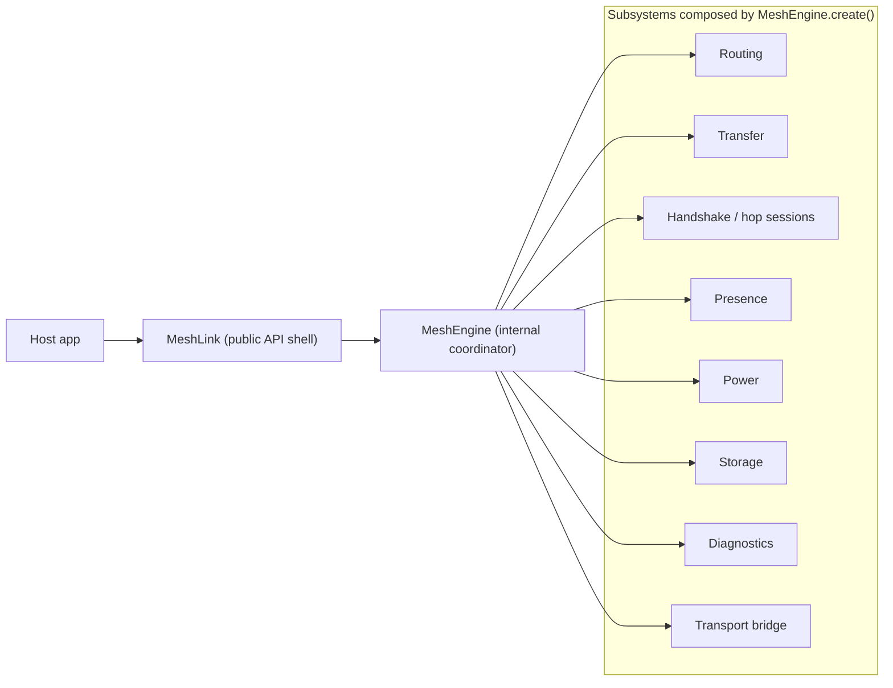

# The MeshEngine coordinator pattern

## The pattern

MeshLink keeps a strict top-level split:

- **`MeshLink`** is the public boundary
- **`MeshEngine`** is the internal coordinator
- **subsystems** own routing, transfer, handshake, power, presence, storage,
  diagnostics, and transport-specific work

## Why the split exists

### `MeshLink` is the API boundary

`MeshLink` implements `MeshLink` and keeps a narrow job:

- own the public lifecycle surface
- expose factory entry points
- hold top-level runtime ownership such as the coroutine scope
- delegate real work into `MeshEngine`

It does **not** embed routing, transfer, trust, or handshake policy directly.

### `MeshEngine` is the wiring layer

`MeshEngine.create()` builds the subsystem graph and wires the pieces together.
That makes one place responsible for composition instead of scattering
cross-subsystem knowledge through the public shell.

The recent runtime refactors keep that wiring layer honest in two ways:

- runtime policy decisions such as retry deadlines, TTL selection, and inline
  payload thresholds now sit behind dedicated policy modules instead of hiding
  inside assembly code
- transfer-session mutation bookkeeping now sits behind dedicated registries so
  support helpers do not all reach into the same shared maps

That is the practical version of the pattern: assembly should read as
composition, while policy and lifecycle mutation stay local to the modules that
own them.

## Why not expose subsystems directly?

That alternative looks simpler at first, but it makes three things worse.

### 1. Coupling

If the public shell talks directly to `DeliveryPipeline`, `TrustStore`,
`RouteCoordinator`, and other internals, those internal interfaces become much
harder to change safely.

### 2. Coordination

Real operations often span multiple subsystems. For example, forgetting a peer
is not just a trust-store action. It can also affect routing, pending delivery,
presence, and diagnostics. `MeshEngine` is where that coordination belongs.

### 3. Testing

A thin public shell plus an internal coordinator is easier to test than a shell
that knows every subsystem detail. The public layer stays small, and the engine
can be exercised with the virtual harness.

## Constructor injection, not a service locator

Subsystems receive their dependencies through constructors. The graph stays
visible in `MeshEngine.create()`.

That gives MeshLink three benefits:

- the dependency graph is explicit
- subsystem tests can use focused fakes and mocks
- there is no hidden global lookup path that makes coupling harder to see

## Why diagnostics fit this pattern well

`DiagnosticSink` is injected everywhere that needs to emit runtime signals. That
lets subsystems report what they know without depending on each other.

The result is one aggregated diagnostics stream for the host app without a
central "god object" that has to understand every event in advance.

## When to add a new subsystem

Add a new subsystem when it owns a distinct reason to change and has clear
internal responsibilities.

A good default path is:

1. create the subsystem in its own package
2. inject its dependencies explicitly
3. wire it in `MeshEngine.create()`
4. expose only the coordinator methods the public API actually needs

That keeps new capability local instead of teaching the public shell about one
more internal detail.

## Related docs

- [About how MeshLink works](about-how-meshlink-works.md)
- [MeshLink runtime behavior reference](../reference/meshlink-runtime-behavior.md)
- [About the repository architecture](about-the-repository-architecture.md)
- [Repository layout reference](../reference/repository-layout.md)
