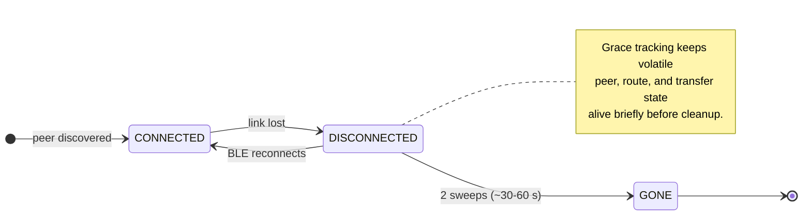

# The Peer Lifecycle Model

## The problem

In a BLE mesh, peers appear and disappear constantly. Phones move out of range,
operating systems suspend BLE work, and connections drop under interference. The
mesh has to smooth that churn into something a host app can reason about.

The naive approach is to forget a peer as soon as a BLE link drops. That causes:

- route flapping on momentary interference
- transfer sessions being abandoned unnecessarily
- noisy found/lost churn when a peer disappears briefly and returns

## The three-state model



### Connected

- Active BLE link
- Hello messages exchanged for neighbor discovery
- Transfers may be in progress
- Route entries remain live
- The host app sees `PeerEvent.Found(..., CONNECTED)` or
  `PeerEvent.StateChanged(..., CONNECTED)`

### Disconnected

- BLE link was lost
- A grace period is active because the peer may return quickly
- Routes can degrade before they are fully retracted
- Transfers can pause instead of being abandoned immediately
- The host app sees `PeerEvent.StateChanged(..., DISCONNECTED)` rather than an
  immediate `Lost`

### Gone

- The grace window expired without reconnection
- MeshLink cleans up ephemeral state such as presence, routes, and pending
  transfer work tied to the peer
- Pinned trust state remains, so a future reconnection with the same identity is
  still recognized
- `PeerEvent.Lost` is emitted to the host app

## Why two sweeps?

A single-sweep eviction would fire at exactly one cleanup interval. In
practice, that means the grace period depends on when the disconnect happened
relative to the sweep timer.

Two sweeps avoid that edge:

1. a sweep might run almost immediately after the disconnect
2. or it might run near the end of the interval

Requiring two sweeps guarantees a bounded grace window instead of a nearly zero
one. In the current model, that means roughly 30–60 seconds of grace rather
than an arbitrary first sweep.

## Intentional stop is different from accidental loss

The `CONNECTED → DISCONNECTED → GONE` path describes unexpected loss:
interference, movement, OS suspension, or a dropped BLE link. An intentional
local stop is different because the departing peer knows it is leaving.

On the live Android BLE proof path, relying only on platform disconnect
callbacks was not enough. Physical multi-device evidence showed that disconnect
signals could be asymmetric: one neighbor could learn about the departure while
another kept stale reachability long enough to preserve bad routes.

The current Android proof/runtime path handles intentional stop more directly:

1. the stopping peer broadcasts a runtime-private self-withdrawal to direct
   peers
2. receivers treat that as an immediate reachability withdrawal for the direct
   peer and routes learned through it
3. BLE disconnect callbacks and sweep-based cleanup still run afterward as
   backstops

This keeps the public API unchanged. The explicit withdrawal remains private
control-plane behavior inside the runtime.

## MeshStateManager

`MeshStateManager` is the internal cleanup loop that drives this lifecycle.
Conceptually, it:

- runs on a fixed interval
- checks peers that are currently disconnected
- increments internal grace tracking for those peers
- evicts peers whose grace window has expired
- coordinates cleanup across routing, transfer, and presence state

The important public point is that host apps do not need to implement their own
peer-loss timer just to smooth normal transport churn.

## Why "Gone" is not a public state

The public API exposes only:

```kotlin
enum class PeerConnectionState { CONNECTED, DISCONNECTED }
```

There is no public `GONE` value. When a peer reaches the internal gone state:

- MeshLink emits `PeerEvent.Lost`
- the peer is removed from active runtime state
- the app should treat it as unavailable until it is found again

Exposing `GONE` publicly would suggest there is still something actionable about
that peer. There is not. Once the peer is gone, the next meaningful public
signal is a new `Found`.

## The seqNo interaction

When a peer reconnects, the route has to come back with fresher routing state.
If the reconnect path reuses stale sequence information, differential routing
can suppress propagation to neighbors even though the route is valid again.

That is why reconnect logic needs a fresh seqno progression when it re-installs
reachability. Without it, the local node can look healed while neighboring
nodes keep stale route knowledge.

## Impact on the consuming app

From the app's perspective, the right model is still simple:

```kotlin
meshLink.peerEvents.collect { event ->
    when (event) {
        is PeerEvent.Found -> addPeerToUi(event.peerId)
        is PeerEvent.StateChanged -> updatePeerState(event.peerId, event.state)
        is PeerEvent.Lost -> removePeerFromUi(event.peerId)
    }
}
```

The app does not need to manage grace periods itself. MeshLink handles the
transport churn internally and surfaces cleaner `Found`, `StateChanged`, and
`Lost` transitions.
