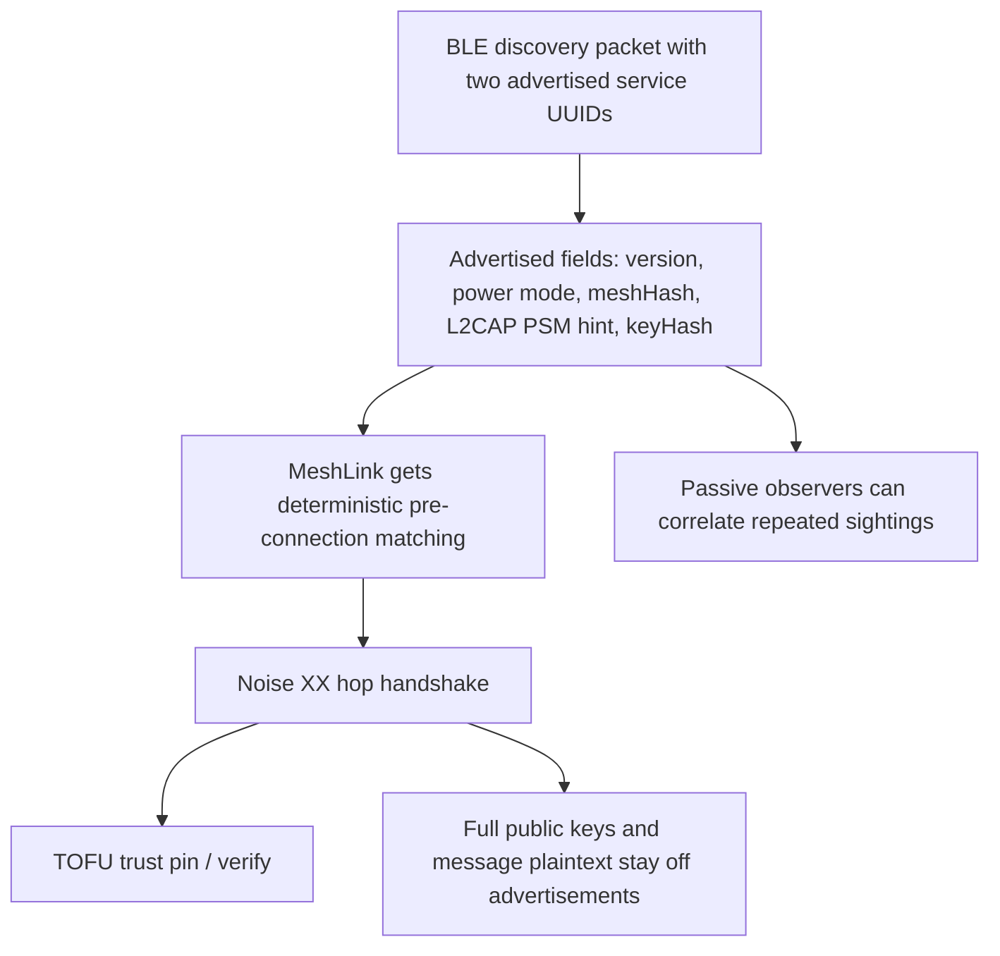

# Discovery identity hash and privacy trade-offs

## The current decision

MeshLink no longer uses rotating advertisement pseudonyms. Instead, discovery
uses two advertised service UUIDs in a single packet:

- a fixed 32-bit discovery UUID: `4d455348`
- a second 128-bit service UUID whose 16 raw bytes carry the MeshLink discovery
  payload

That payload contains:

- protocol version bits
- power-mode bits
- a 16-bit `meshHash`
- the L2CAP PSM hint
- a 12-byte `keyHash`

`keyHash` is the first 12 bytes of:

```text
SHA-256(Ed25519Pub || X25519Pub)
```



## What this changes for privacy

This is a deliberate trade-off.

A passive observer can now correlate repeated sightings of the same device more
easily than with rotating pseudonyms, because `keyHash` is stable for a given
identity. In return, MeshLink gets a deterministic, compact discovery hint that
fits in one advertisement packet and aligns with its direct TOFU trust model.

## What remains protected

Even with a stable discovery hint:

- full public keys are not advertised directly
- message plaintext never appears in advertisements
- hop-to-hop and end-to-end session keys are still established after discovery
- trust decisions still depend on the authenticated Noise XX session, not only
  on the advertised `keyHash`

## Why keep the 12-byte key hash

The 12-byte prefix is small enough to fit the advertisement contract while still
being stable enough for deterministic initiation and peer matching. It is a
hint, not the canonical trust-store record.

## Mesh hash isolation

The 16-bit `meshHash` remains the public application-isolation filter derived
from `appId`. Devices with different mesh hashes do not attempt to connect.

## Resulting trade-off

MeshLink now optimizes for:

- deterministic discovery
- single-packet advertising without scan response
- pre-connection filtering for protocol version, power mode, mesh, and L2CAP
  availability

That comes at the cost of weaker unlinkability than the earlier
rotating-pseudonym design.
