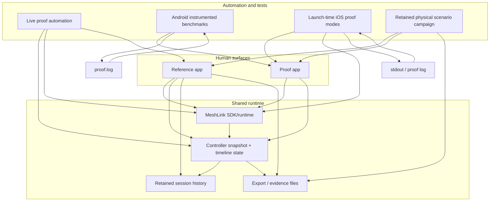
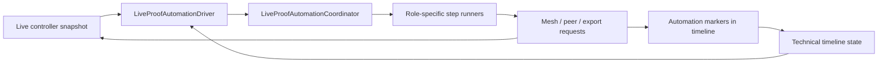
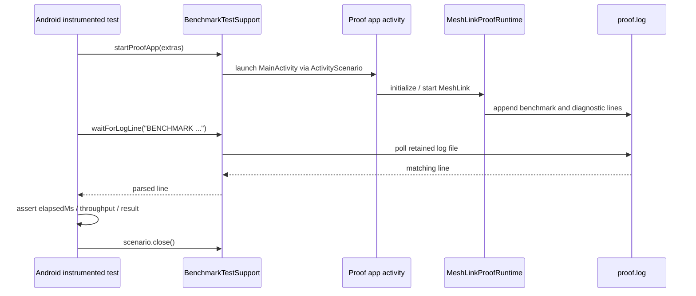
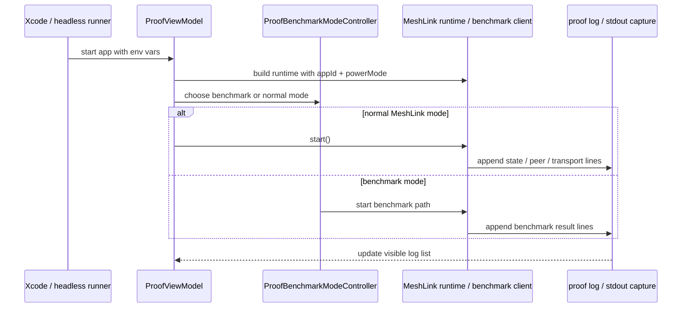

# Reference app and test architecture

This page explains how the MeshLink reference app works and how the related
automated tests execute.

It is written for a reader landing cold. The goal is to show where the user
experience lives, where the runtime state lives, and where the tests and proof
runs attach.

If you are new here, read in this order:
1. The short version
2. The choose-your-path matrix
3. The FAQ
4. The file map appendix

## Who should read which section

| If you want to... | Read this section |
|---|---|
| get the 30-second model | The short version and At a glance |
| choose the right surface | The choose-your-path matrix |
| clear up wording or intent | The FAQ |
| find the files behind a layer | The file map appendix |

## README-style excerpt

> MeshLink uses three related surfaces:
> - the reference app for guided evaluation and operator review
> - the proof apps for transport validation and benchmark runs
> - the automation and tests for reproducible scripted execution
>
> If you only need the basics, start with the short version and then the choose-your-path matrix.

## At a glance

| Surface | What it is for | What it proves |
|---|---|---|
| Reference app | Human evaluation and operator review | The product-like experience, timeline evidence, and retained history |
| Proof apps | Transport validation and benchmark runs | Thresholds, retained logs, and real-device evidence |
| Automation/tests | Reproducible scripted execution | That the same claims can be driven and observed mechanically |

## The short version

MeshLink has three related surfaces:

1. **The reference app** — the product-like Android and iOS experience for
   guided evaluation, runtime inspection, retained history, and exports.
2. **The proof apps** — focused Android and iOS hosts used for transport
   validation, retained evidence, and benchmark-oriented runs.
3. **The automation/tests** — app-driven automation, Android instrumented
   benchmarks, and retained physical campaigns that read the app’s own state
   and logs.

If you only need the one-screen summary, use this table:

| Surface | Primary goal | Typical evidence |
|---|---|---|
| Reference app | Explain the product-like experience | guided exchange, timeline, history, export |
| Proof apps | Prove transport and runtime thresholds | retained logs, benchmark results, physical runs |
| Automation/tests | Reproduce claims mechanically | scenario logs, parsed benchmark lines, retained JSON |

The reference app is what a human uses to understand MeshLink. The proof apps
and benchmark runners are what we use to prove timing, throughput, and retained
physical behavior.

## System overview

## What the reference app is doing

The reference app is not a benchmark harness. It is the shared, product-like
experience that an evaluator or integrator can open on Android and iOS.

The app is organized into clearly separated surfaces:

- **Guided first exchange** — the shortest path to a first successful proof
- **Solo exploration** — a non-authoritative path when only one device is
  available
- **Advanced controls** — lifecycle, power, peer, trust, and send controls
- **Technical timeline** — lifecycle, peer, diagnostic, message, and export
  evidence in one place
- **Recent history** — retained sessions separated from the live session
- **Lab** — proof-only or benchmark-only behavior kept away from the normal
  product path

The shared runtime owns the important state:

- session lifecycle
- peer discovery and peer trust
- message send / receive events
- retained history
- export actions
- timeline entries

The platform code mainly provides:

- app launch and lifecycle hooks
- platform permissions and device services
- the native shell UI around the shared model

## How the reference app automation works

The reference app includes an in-app automation layer in shared code. That is a
key design choice: the automation reads the same snapshot and timeline state the
human sees.

The automation path is roughly:

1. the app emits a live controller snapshot and timeline state
2. the automation driver watches for state changes
3. the automation coordinator decides which step should happen next
4. role-specific step runners request mesh actions, peer actions, or export
   actions
5. the timeline records explicit automation markers

### Reference-app automation diagram

### What this means in practice

For a guided direct-proof run, the automation is looking for things like:

- readiness blockers clearing
- peer discovery
- peer selection or peer targeting
- mesh start or resume
- send request
- delivery / receipt evidence
- completion markers

For a passive role, the automation waits for the peer and timeline state to
reach the expected phase, then records completion markers once the proof is
observable.

The important thing is that the reference app automation does not invent a
parallel world. It drives the same live runtime state that the operator UI is
showing.

## How the Android proof app tests execute

The Android proof app is a small activity-based host with a runtime object
behind it.

### App side

`MainActivity` renders a simple operator UI:

- current state
- known peers
- start / stop control
- send hello control
- live logs

`MeshLinkProofRuntime` owns the behavior:

- initializes the MeshLink runtime
- checks Bluetooth readiness before starting
- starts and stops MeshLink
- tracks known peers and peer events
- handles auto-send and benchmark paths
- appends diagnostic and benchmark logs
- persists a rolling `proof.log`

That retained log matters because the tests assert against it.

### Test side

The benchmark tests live under `meshlink-proof/android/src/androidTest/...`
and are standard instrumented JUnit tests.

They use a shared support helper that does four jobs:

1. **launches the activity** with intent extras such as app id, power mode,
   payload size, and benchmark flags
2. **ensures runtime permissions** are available before launch
3. **waits for a log line** to appear in `proof.log`
4. **parses the line** for elapsed time, throughput, or result status

The tests themselves follow an Arrange → Act → Assert pattern:

- clear the log
- launch the proof app in the desired mode
- wait for the benchmark line
- assert the timing/result threshold
- close the scenario and clear the log

### Android benchmark test flow

### What gets asserted

The tests are verifying the app’s own retained evidence, not a guessed UI state.

Typical checks include:

- startup under a time bound for cold start
- transport latency under a threshold
- throughput above a threshold
- power mode diagnostics showing the expected scan / interval profile
- benchmark result lines reporting `Sent`

## How the iOS proof app executes benchmark-like runs

The iOS proof app is a SwiftUI host with a view model that owns the runtime.

### App side

`ProofApp` installs the crypto and transport bridges at launch.

`ContentView` is the visible shell:

- state text
- peer list
- start / stop controls
- send hello control
- live logs

`ProofViewModel` owns the app behavior:

- reads launch configuration from environment variables
- builds the MeshLink runtime
- clears the retained log on startup
- binds state and peer flows
- handles start / stop / send
- switches into benchmark mode when requested

### Benchmark mode selection

`ProofLaunchConfig` reads launch-time environment variables such as:

- app id
- power mode
- benchmark payload size
- battery / charging hints
- cold-start flag
- auto-send flag
- transport telemetry flag
- benchmark transport selection

`ProofBenchmarkModeController` decides whether the app should run:

- normal MeshLink mode
- GATT prototype mode
- GATT notify prototype mode

If a benchmark mode is selected, the controller starts the matching benchmark
path and logs a clear failure when required configuration is missing.

### iOS log capture

When running in normal `meshLink` mode with telemetry enabled, the app can
capture stdout into the proof log so the same retained evidence stream contains
both runtime and transport detail.

### iOS execution model diagram

## How the physical scenario campaign fits in

The retained physical campaign sits above the apps.
It is used when you want repeatable evidence from real devices, not just a human
walkthrough.

The campaign:

- discovers the fleet
- records which devices are available
- plans a scenario order
- runs the scenarios in a stable order
- writes retained JSON and HTML artifacts
- makes fallback choices explicit instead of hiding them

The campaign is especially important for direct-guided release review because it
retains the evidence trail in files that can be audited later.

## Practical distinction to keep in mind

If you are trying to answer **“does the product-like experience make sense?”**,
start with the **reference app**.

If you are trying to answer **“is the transport fast / reliable / within
threshold?”**, use the **proof apps and benchmark tests**.

If you are trying to answer **“can we retain auditable evidence from a real
fleet?”**, use the **physical scenario campaign**.

## A one-page cheat sheet

Use this when deciding what to open first.

| If you want to... | Open or run | Why |
|---|---|---|
| understand the product-like experience | Reference app | It shows guided evaluation, timeline, retained history, and exports |
| inspect runtime state and operator controls | Advanced controls / Technical timeline | They expose the live state the operator would act on |
| prove transport performance | Proof app + benchmark tests | They assert thresholds against retained logs |
| retain real-device evidence | Physical scenario campaign | It writes audited JSON / HTML artifacts from actual devices |
| understand how the layers fit | This doc + [About proof validation surfaces](about-proof-validation-surfaces.md) | These explain the architectural split and choice of surface |

## Choose-your-path matrix

Use this when you are unsure which surface to open.

| Your goal | Open or run | You should expect |
|---|---|---|
| Understand the product-like experience | Reference app | Guided exchange, live timeline, retained history, and exports |
| Prove timing or throughput | Proof app + benchmark tests | Retained log lines with parsed latency or throughput thresholds |
| Retain real-device evidence | Physical scenario campaign | Audited JSON / HTML artifacts from actual devices |
| Understand the layered architecture | This doc + [About proof validation surfaces](about-proof-validation-surfaces.md) | A clear explanation of where each surface fits |

## FAQ

| Question | Short answer |
|---|---|
| Is the reference app a benchmark harness? | No. It is the product-like evaluation surface for guided exchange, runtime controls, timeline evidence, and retained history. |
| Why are there separate Android and iOS proof apps? | Because the launch and transport seams differ by platform, and each proof app exposes the most direct way to prove the same claim. |
| Why do the tests read logs instead of scraping UI text? | Because timing, throughput, and retained evidence are more stable in retained logs and campaign artifacts than in transient UI rendering. |
| When should I use the physical scenario campaign? | Use it when you need auditable real-device evidence across a fleet, not just a local walkthrough or benchmark. |

## Common misconceptions

- The reference app is not the benchmark harness; it is the product-like shell for guided evaluation and operator review.
- The proof apps are not alternate product surfaces; they are focused hosts for transport validation and retained evidence.
- Reading retained logs is not a shortcut around verification; it is how this repository keeps timing and throughput assertions stable.

## File map appendix

This is the fuller map of the files most often involved in each layer.

### By platform

| Platform | Main files |
|---|---|
| Android proof app | `meshlink-proof/android/src/main/kotlin/ch/trancee/meshlink/proof/android/MainActivity.kt`, `meshlink-proof/android/src/main/kotlin/ch/trancee/meshlink/proof/android/MeshLinkProofRuntime.kt`, `meshlink-proof/android/src/main/kotlin/ch/trancee/meshlink/proof/android/ProofLaunchConfig.kt` |
| Android proof tests | `meshlink-proof/android/src/androidTest/kotlin/ch/trancee/meshlink/proof/android/BenchmarkTestSupport.kt`, `meshlink-proof/android/src/androidTest/kotlin/ch/trancee/meshlink/proof/android/ColdStartBenchmark.kt`, `meshlink-proof/android/src/androidTest/kotlin/ch/trancee/meshlink/proof/android/TransportPerformanceBenchmark.kt`, `meshlink-proof/android/src/androidTest/kotlin/ch/trancee/meshlink/proof/android/PowerProfileBenchmark.kt` |
| iOS proof app | `meshlink-proof/ios/ProofApp/ProofApp.swift`, `meshlink-proof/ios/ProofApp/ContentView.swift`, `meshlink-proof/ios/ProofApp/ProofViewModel.swift`, `meshlink-proof/ios/ProofApp/ProofBenchmarkModeController.swift` |
| iOS proof capture | `meshlink-proof/ios/ProofApp/ProofGattBenchmarkClient.swift`, `meshlink-proof/ios/ProofApp/ProofGattNotifyBenchmarkServer.swift`, `meshlink-proof/ios/ProofApp/ProofTransportLogCapture.swift` |
| Shared reference runtime | `meshlink-reference/src/commonMain/kotlin/ch/trancee/meshlink/reference/meshlink/LiveReferenceMeshRuntime.kt`, `meshlink-reference/src/commonMain/kotlin/ch/trancee/meshlink/reference/timeline/TechnicalTimelineScreen.kt`, `meshlink-reference/src/commonMain/kotlin/ch/trancee/meshlink/reference/session/JsonSessionHistoryRepository.kt` |
| Shared reference automation | `meshlink-reference/src/commonMain/kotlin/ch/trancee/meshlink/reference/automation/LiveProofAutomationDriver.kt`, `meshlink-reference/src/commonMain/kotlin/ch/trancee/meshlink/reference/automation/LiveProofAutomationCoordinator.kt`, `meshlink-reference/src/commonMain/kotlin/ch/trancee/meshlink/reference/automation/LiveProofAutomationDirectSenderStepRunner.kt` |

### By layer

| Layer | Main files |
|---|---|
| Reference app UI shell | `meshlink-reference/src/commonMain/kotlin/ch/trancee/meshlink/reference/advanced/AdvancedControlsScreen.kt`, `meshlink-reference/src/commonMain/kotlin/ch/trancee/meshlink/reference/advanced/AdvancedControlsOverviewSections.kt`, `meshlink-reference/src/commonMain/kotlin/ch/trancee/meshlink/reference/advanced/AdvancedControlsInteractionSections.kt`, `meshlink-reference/src/commonMain/kotlin/ch/trancee/meshlink/reference/timeline/TechnicalTimelineScreen.kt`, `meshlink-reference/src/commonMain/kotlin/ch/trancee/meshlink/reference/timeline/TechnicalTimelineSections.kt`, `meshlink-reference/src/commonMain/kotlin/ch/trancee/meshlink/reference/timeline/TechnicalTimelineRetentionSection.kt` |
| Reference app runtime seams | `meshlink-reference/src/commonMain/kotlin/ch/trancee/meshlink/reference/meshlink/LiveReferenceMeshRuntime.kt`, `meshlink-reference/src/commonMain/kotlin/ch/trancee/meshlink/reference/meshlink/LiveReferenceMeshControllerAssembly.kt`, `meshlink-reference/src/commonMain/kotlin/ch/trancee/meshlink/reference/meshlink/LiveReferenceMeshLinkController.kt`, `meshlink-reference/src/commonMain/kotlin/ch/trancee/meshlink/reference/navigation/SessionTransitionService.kt`, `meshlink-reference/src/commonMain/kotlin/ch/trancee/meshlink/reference/session/ExportPayloadPolicy.kt` |
| Reference automation | `meshlink-reference/src/commonMain/kotlin/ch/trancee/meshlink/reference/automation/LiveProofAutomationDriver.kt`, `meshlink-reference/src/commonMain/kotlin/ch/trancee/meshlink/reference/automation/LiveProofAutomationCoordinator.kt`, `meshlink-reference/src/commonMain/kotlin/ch/trancee/meshlink/reference/automation/LiveProofAutomationActions.kt`, `meshlink-reference/src/commonMain/kotlin/ch/trancee/meshlink/reference/automation/LiveProofAutomationDirectSenderStepRunner.kt`, `meshlink-reference/src/commonMain/kotlin/ch/trancee/meshlink/reference/automation/LiveProofAutomationPassiveBaselineStepRunner.kt`, `meshlink-reference/src/commonMain/kotlin/ch/trancee/meshlink/reference/automation/LiveProofAutomationLaunchMarkers.kt` |
| Android proof app runtime | `meshlink-proof/android/src/main/kotlin/ch/trancee/meshlink/proof/android/MainActivity.kt`, `meshlink-proof/android/src/main/kotlin/ch/trancee/meshlink/proof/android/MeshLinkProofRuntime.kt`, `meshlink-proof/android/src/main/kotlin/ch/trancee/meshlink/proof/android/ProofLaunchConfig.kt`, `meshlink-proof/android/src/main/kotlin/ch/trancee/meshlink/proof/android/ProofBenchmarkProtocol.kt`, `meshlink-proof/android/src/main/kotlin/ch/trancee/meshlink/proof/android/ProofBenchmarkTransport.kt` |
| Android proof tests | `meshlink-proof/android/src/androidTest/kotlin/ch/trancee/meshlink/proof/android/BenchmarkTestSupport.kt`, `meshlink-proof/android/src/androidTest/kotlin/ch/trancee/meshlink/proof/android/ColdStartBenchmark.kt`, `meshlink-proof/android/src/androidTest/kotlin/ch/trancee/meshlink/proof/android/TransportPerformanceBenchmark.kt`, `meshlink-proof/android/src/androidTest/kotlin/ch/trancee/meshlink/proof/android/PowerProfileBenchmark.kt` |
| iOS proof app runtime | `meshlink-proof/ios/ProofApp/ProofApp.swift`, `meshlink-proof/ios/ProofApp/ContentView.swift`, `meshlink-proof/ios/ProofApp/ProofViewModel.swift`, `meshlink-proof/ios/ProofApp/ProofGattBenchmarkClient.swift`, `meshlink-proof/ios/ProofApp/ProofGattNotifyBenchmarkServer.swift` |
| iOS benchmark modes and capture | `meshlink-proof/ios/ProofApp/ProofLaunchConfig.swift`, `meshlink-proof/ios/ProofApp/ProofBenchmarkModeController.swift`, `meshlink-proof/ios/ProofApp/ProofBenchmarkTransport.swift`, `meshlink-proof/ios/ProofApp/ProofTransportLogCapture.swift` |
| Retained physical campaign | `meshlink-reference/scripts/run_reference_release_campaign.py`, `meshlink-reference/scripts/run_headless_reference_live_proof.py`, `meshlink-reference/fleet-test-history/index.html` |

## Glossary

| Term | Meaning |
|---|---|
| [Reference app](#what-the-reference-app-is-doing) | The product-like Android and iOS experience used for guided evaluation and operator review. |
| [Proof app](#how-the-android-proof-app-tests-execute) | The focused host used for transport validation, benchmark paths, and retained evidence. |
| [Technical timeline](#what-the-reference-app-is-doing) | The retained event stream that shows lifecycle, peer, diagnostic, message, and export evidence. |
| [Advanced controls](#what-the-reference-app-is-doing) | The runtime control surface for lifecycle, peer, trust, power, and send actions. |
| [Retained history](#what-the-reference-app-is-doing) | Session data kept after a live run ends so evidence can be revisited later. |
| [Benchmark test](#how-the-android-proof-app-tests-execute) | An instrumented or scripted check that asserts latency, throughput, cold-start, or power thresholds. |
| [Physical scenario campaign](#how-the-physical-scenario-campaign-fits-in) | The higher-level retained run that executes scenarios on real devices and writes audited artifacts. |

## Related docs

## Related docs

- [How to evaluate MeshLink with the reference app](../how-to/evaluate-meshlink-with-the-reference-app.md)
- [About proof validation surfaces](about-proof-validation-surfaces.md)
- [Reference app runtime seams](reference-app-runtime-seams.md)
- [How to run the Android proof app](../../meshlink-proof/android/README.md)
- [How to build and run the iOS proof app](../../meshlink-proof/ios/README.md)
- [How to run the reference-app physical integration scenarios](../how-to/run-reference-app-physical-integration-scenarios.md)
