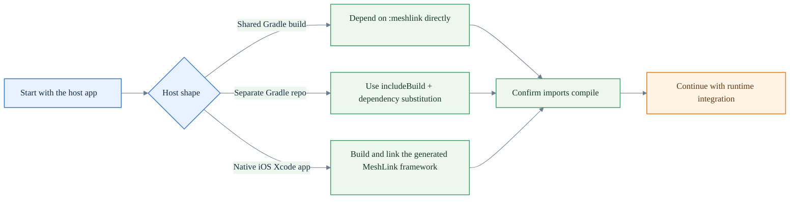

# How to add MeshLink to your app

This guide shows you how to add the current MeshLink SDK to an Android or iOS
host app from a local checkout of this repository.

If you need the repository's current release posture or the intended first
public release shape, use the [MeshLink release status reference](../reference/release-status.md).

Use it when you need to:

- add MeshLink to an Android Gradle app
- link the generated MeshLink framework into an iOS Xcode app
- confirm which installation paths are supported today

## Quick path picker

| If your host app... | Use this path |
|---|---|
| already shares the MeshLink Gradle build | depend on `project(":meshlink")` directly |
| lives in a separate Gradle repo | use a composite build with dependency substitution |
| is a native iOS Xcode app | call `:meshlink:embedAndSignAppleFrameworkForXcode` from an Xcode pre-build script |

## Installation flow at a glance



## 1. Know the current distribution shape

MeshLink is currently source-distributed from this repository checkout.

Use the [MeshLink release status reference](../reference/release-status.md) if
you need the intended first public release shape or the remaining release
blockers.

This repository does **not** yet publish:

- a Maven Central artifact
- a Swift Package Manager package
- a CocoaPods pod

The supported installation paths today are:

- Gradle source integration for Android or shared Kotlin code
- a Gradle-built Apple framework linked by Xcode for iOS

## 2. Confirm the host requirements first

| Host | Requirement |
|---|---|
| Android app | Android API 26+ |
| iOS app | iOS 14+ |
| Gradle build | JDK 21 or newer |
| iPhone device runs | Xcode with local signing access |

If you only need runtime bootstrap after the library is already wired in, skip
this guide and go straight to [How to integrate MeshLink into a host app](integrate-meshlink-into-a-host-app.md).

## 3. Add MeshLink to an Android app that already shares the MeshLink Gradle build

If your Android app already lives inside the same Gradle build as MeshLink,
depend on the module directly:

```kotlin
dependencies {
    implementation(project(":meshlink"))
}
```

That is the simplest path for apps inside this repository or any monorepo that
already shares the MeshLink build logic.

## 4. Add MeshLink to an Android app from a separate Gradle repo

If your Android app lives in a different Gradle repository, use a composite
build with an explicit substitution for the MeshLink module.

Your host app `settings.gradle.kts`:

```kotlin
includeBuild("<path-to-meshlink-repo>") {
    dependencySubstitution {
        substitute(module("ch.trancee.meshlink:meshlink")).using(project(":meshlink"))
    }
}
```

Your Android app module:

```kotlin
dependencies {
    implementation("ch.trancee.meshlink:meshlink")
}
```

This keeps MeshLink as the source of truth in one checkout while still letting
your host app resolve it like a normal module dependency.

## 5. Link MeshLink into an iOS Xcode app

For iOS, keep the MeshLink repository checked out locally and let Xcode call the
Gradle framework task before each build.

Add a pre-build script to your iOS app target:

```sh
if [ "YES" = "$OVERRIDE_KOTLIN_BUILD_IDE_SUPPORTED" ]; then
    echo "Skipping Gradle build task invocation due to OVERRIDE_KOTLIN_BUILD_IDE_SUPPORTED=YES"
    exit 0
fi

cd "<path-to-meshlink-repo>"
./gradlew :meshlink:embedAndSignAppleFrameworkForXcode
```

Then point Xcode at the generated framework output:

- **Framework Search Paths** → `"<path-to-meshlink-repo>/meshlink/build/xcode-frameworks/$(CONFIGURATION)/$(SDK_NAME)"`
- **Other Linker Flags** → `-framework MeshLink`
- **Runpath Search Paths** → `@executable_path/Frameworks`

After that, your Swift code can import the generated framework directly:

```swift
import MeshLink
```

If you need a concrete working example of that Xcode wiring, the bundled iOS
proof app and reference app both use this Gradle-driven framework pattern.

## 6. Install the required iOS bridge at app startup

Linking the framework is not the whole iOS setup.

Before you create a real MeshLink runtime on iOS, your app must install the
required native crypto bridge:

- `CryptoBridge` is required
- `BleTransportBridge` is optional and only needed for the iPhone-hosted
  GATT-notify side bearer

Use [How to use MeshLink from Swift](use-meshlink-from-swift.md) for the exact
Swift-facing API and bridge-install pattern.

## 7. Verify the install before you move on

A good install check is simple:

Android or shared Kotlin code should compile with:

```kotlin
import ch.trancee.meshlink.api.meshLink
import ch.trancee.meshlink.config.meshLinkConfig
```

Swift should compile with:

```swift
import MeshLink
```

Do not start debugging runtime behavior until the host app can compile and link
cleanly.

## 8. Continue with the right next guide

Once MeshLink is in your build:

- use [How to integrate MeshLink into a host app](integrate-meshlink-into-a-host-app.md) for runtime bootstrap, lifecycle, streams, send, and trust reset flows
- use [How to structure a robust MeshLink integration](structure-a-robust-meshlink-integration.md) when you want the architecture and operational checklist for a production-shaped host app
- use [How to use MeshLink from Swift](use-meshlink-from-swift.md) for Swift naming and Flow collection
- use [How to unblock MeshLink permissions on Android and iOS](unblock-meshlink-permissions.md) if startup or discovery stalls
- use [Your first MeshLink exchange](../tutorials/your-first-meshlink-exchange.md) for a short end-to-end lesson, then launch the matching [Android proof app](../../meshlink-proof/android/README.md) or [iOS proof app](../../meshlink-proof/ios/README.md) as the second-device proof peer
