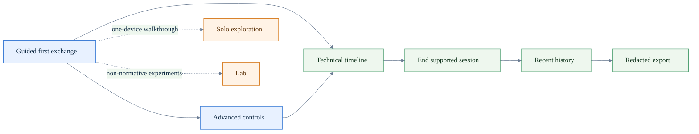

# How to evaluate MeshLink with the reference app

Use this guide when you want to evaluate MeshLink through the reference app as
one shared Android and iOS operator experience, not just as a transport proof
harness.

By the end of this guide you should be able to:

- install the Android and iOS reference app builds
- complete one **Guided first exchange**
- inspect **Advanced controls** and the **Technical timeline**
- retain one session and export one redacted artifact
- decide whether to stay in the reference app or switch to the proof apps or
  live-proof harness

If you need the app overview itself, use
[MeshLink reference app overview](../../meshlink-reference/README.md).
If you want the minimal SDK tutorial shape instead of the product-like
reference-app walkthrough, use
[Your first MeshLink exchange](../tutorials/your-first-meshlink-exchange.md).
If you already know you need retained physical evidence for direct and relay
scenarios, go straight to
[How to run the reference-app physical integration scenarios](run-reference-app-physical-integration-scenarios.md).
That path now includes a validated release-review campaign, retained `report-data.json`, the offline `release-review-report.html` reviewer surface, and the repo-visible fleet-test history report from milestone **M001**. The release-review campaign may fall back to Android-only direct-guided when mixed iOS live-proof is not supported, so use the release-review docs for the exact retained status vocabulary if you are comparing campaign artifacts.

## Before you start

This guide assumes **both devices run the reference app**.
Do not substitute one side with a proof app here.
If you need a host-app tutorial plus a proof peer, use
[Your first MeshLink exchange](../tutorials/your-first-meshlink-exchange.md)
instead.

You need:

- this repository checked out locally
- Xcode for the iOS host project
- an Android device running API 26+
- an iPhone running iOS 14+
- Bluetooth enabled on both devices
- an Apple development team available locally if you want to run on a physical
  iPhone

Current supported floor: Android API 26+, iOS 14+. See the release-status
reference for the why and the full matrix. The crypto contract is unchanged on
those floors; Android probes required primitives and iOS uses CryptoKit.

If one device is not ready yet, you can still use **Solo exploration** for a
non-authoritative walkthrough.

If discovery stalls because Android or iOS is still blocked on permissions or
the first Bluetooth prompt, fix that first with
[How to unblock MeshLink permissions on Android and iOS](unblock-meshlink-permissions.md).
On doze-sensitive Android devices, keep the screen awake during direct proof or
rely on the reference app's foreground wake-lock mitigation before treating a
slow discovery as a transport regression. For Android direct-guided proofs,
treat sender `proof.complete` as required, but use retained passive evidence as
the acceptance gate even when the passive role does not emit its own
`proof.complete` log on this host.

## Quick evaluation path

| Step | What to do | What to confirm |
|---|---|---|
| 1 | install the Android build | the app launches on the Android device |
| 2 | build and launch the iOS app | the app launches on the simulator or iPhone |
| 3 | open **Guided first exchange** on both devices | the surface names and flow shape match |
| 4 | complete one guided exchange | discovery, trust, and delivery evidence appear |
| 5 | inspect **Advanced controls** and the **Technical timeline** | operator-facing runtime details are visible |
| 6 | end the session and export redacted data | **Recent history** and the redacted export both work |

## Surface path at a glance

| Primary section | Surface | Use it when you want to... |
|---|---|---|
| Exchange | Guided first exchange | complete the supported first proof on two devices |
| Exchange | Solo exploration | walk the app on one device without claiming live proof |
| Controls | Advanced controls | inspect runtime state and send with more deliberate control |
| Evidence | Technical timeline | inspect live evidence, end the session, and start exports |
| Evidence | Recent history | reopen retained sessions after the live run ends |
| Lab | Lab | keep proof-only and benchmark-only behavior separate from the supported path |



Operational rules to keep straight while you evaluate:

- **Guided first exchange** and **Advanced controls** are two supported
  surfaces inside the same supported live session
- **Solo exploration** and **Lab** start their own separate session paths
  instead of inheriting the current supported live session
- full-payload export is only available from the supported live session before
  you end it; retained sessions stay redacted

For exact surface and export terminology, use the
[Glossary and acronym reference](../reference/glossary.md).

## 1. Install the Android reference app

```bash
./gradlew :meshlink-reference:installDebug
```

Launch the installed app on the Android device after the install completes.

## 2. Build and launch the iOS reference app

For the simulator:

```bash
xcodebuild \
  -project meshlink-reference/ios/ReferenceApp.xcodeproj \
  -scheme ReferenceApp \
  -destination 'generic/platform=iOS Simulator' \
  build
```

For a physical iPhone, pass your team at build time instead of storing it in
repo files:

```bash
xcodebuild \
  -project meshlink-reference/ios/ReferenceApp.xcodeproj \
  -scheme ReferenceApp \
  -destination 'id=<your-device-udid>' \
  DEVELOPMENT_TEAM=<your-team-id> \
  build
```

After the build succeeds, launch the `ReferenceApp` scheme from Xcode on the
chosen simulator or iPhone.

If iOS shows the first Bluetooth prompt on a physical device, allow it before
you continue.

## 3. Open Guided first exchange on both devices

Start in **Guided first exchange** on both platforms.

The expected flow is the same on Android and iOS:

1. readiness check
2. MeshLink start action
3. peer wait or peer selection
4. send proof action
5. timeline evidence review

If the flow names differ between platforms, stop and fix that before using the
app as reference evidence.

## 4. Complete one Guided first exchange

Use **Guided first exchange** to:

1. start MeshLink on both devices
2. wait for peer discovery
3. select the discovered peer
4. send the default first message
5. confirm that trust and delivery evidence appear in the timeline

A successful evaluation pass should show:

- a discovered peer on both devices
- a trust establishment event
- a delivery or inbound-message event
- a final guided outcome that clearly indicates success

## 5. Inspect Advanced controls and the Technical timeline

Open **Advanced controls** and confirm that it exposes the runtime information
a host-app integrator would care about:

- lifecycle controls
- the visible power mode
- the current configuration snapshot
- peer and trust state
- send controls with priority selection
- trust reset behavior

Then open the **Technical timeline** and verify that it gives you one
operator-facing place to inspect:

- lifecycle events
- peer events
- diagnostics
- inbound and outbound message evidence
- retained-session state and export actions
- whether the live-proof session is holding the device awake for direct proof

Use the filter controls when you want to isolate one kind of event.

## 6. End one session and export one redacted artifact

After the guided exchange succeeds:

1. open the **Technical timeline** and choose **End session**
2. open **Recent history**
3. verify the retained session appears separately from the live session
4. open the export chooser and select the redacted export

The default export should keep payload previews redacted and should not
silently switch to full-payload export. Retained sessions stay redacted, so
full-payload export is only available from the supported live session before it
ends.

## When to switch tools

Use the reference app when you need:

- a guided first proof for SDK evaluation
- a shared Android and iOS operator surface
- timeline evidence that is easy to walk through with another engineer

Switch to the proof apps or the live-proof harness when you need:

- retained transport-validation evidence
- physical Android ↔ iPhone proof runs
- proof-only or benchmark-only behavior that the reference app keeps separate
  from its main surfaces

For proof-specific workflows, use:

- [About proof validation surfaces](../explanation/about-proof-validation-surfaces.md)
- [How to run the Android proof app](../../meshlink-proof/android/README.md)
- [How to build and run the iOS proof app](../../meshlink-proof/ios/README.md)
- [Benchmarks and retained evidence](../../benchmarks/README.md)

## Optional: retain one headless live-proof run

Once the manual walkthrough works, retain one repeatable physical proof run:

```bash
python3 meshlink-reference/scripts/run_headless_reference_live_proof.py \
  --android-serial <your-android-serial> \
  --ios-device <your-iphone-udid> \
  --run-dir /tmp/reference_live_proof_attempt
```

The harness installs the Android debug build, rebuilds the iPhone app, runs the
physical guided exchange, and writes retained evidence into the chosen run
directory.

If you only need to verify the physical iPhone sender XCTest path, add:

```bash
  --ios-launch-mode xcuitest \
  --skip-android-completion-wait
```

That variant still launches the passive Android app so the iPhone can discover
a peer, but it stops after the sender UI test passes instead of waiting for an
Android retained export.

If you want the broader physical validation campaign instead of a single direct
proof, continue with
[How to run the reference-app physical integration scenarios](run-reference-app-physical-integration-scenarios.md).
That guide adds the constrained relay proof, the optional XCTest
permission-recovery path, and per-run `analysis.json` and `analysis.md`
artifacts.

## Expected outcome

After following this guide, you should be able to:

1. complete a **Guided first exchange**
2. explain the last trust or delivery outcome from the **Technical timeline**
3. inspect retained session history separately from the live run
4. export a redacted session artifact
5. tell when the reference app is the right tool and when the proof apps or
   live-proof harness are the better fit
