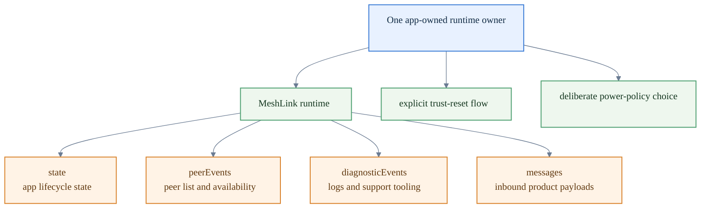

# How to structure a robust MeshLink integration

This guide shows you how to move from a working MeshLink demo to an integration
that stays predictable in day-to-day app use.

Use it when you want to:

- choose where MeshLink should live in your app architecture
- keep lifecycle, trust, and delivery behavior easy to reason about
- add the guardrails that make support and debugging simpler later

If you still need the basic bootstrap steps, use
[How to integrate MeshLink into a host app](integrate-meshlink-into-a-host-app.md).
If you want the reasoning behind these recommendations, read
[About integrating MeshLink well](../explanation/about-integrating-meshlink.md).

## Target integration shape

Aim for this steady-state shape before you worry about extra product features.
If you have one owner, one runtime, four clearly separated stream consumers,
and explicit trust and power decisions, most later debugging stays tractable.

## 1. Put MeshLink behind one long-lived owner

Create one app-owned MeshLink runtime for the mesh domain you are operating in.

Good owners include:

- an application service
- a controller
- a long-lived view model
- a shared app runtime object

Do **not** create a fresh runtime per screen visit or per send. You will lose
peer visibility, trust continuity, retry state, and diagnostics exactly when
you need them most.

## 2. Choose `appId` per environment

Treat `appId` as a mesh boundary, not as display text.

A practical default is:

- one production `appId`
- one staging `appId`
- one isolated `appId` for proof, lab, or test work

If devices are unexpectedly discovering each other, or failing to discover one
another, check `appId` first.

## 3. Clear platform prerequisites before `start()`

Make sure platform readiness is already handled before you start MeshLink.

- On Android, request the required Bluetooth and Nearby/Location permissions
  first.
- On iOS, install the required crypto bridge during app startup and clear the
  Bluetooth prompt before you debug discovery.

Treat these as startup prerequisites, not as later routing or trust bugs.

If you are blocked here, use
[How to unblock MeshLink permissions on Android and iOS](unblock-meshlink-permissions.md).

## 4. Give each public stream one job

Map the public streams to distinct responsibilities in app state:

- `state` → runtime lifecycle state
- `peerEvents` → peer presence and connectivity
- `diagnosticEvents` → logs, operator tooling, troubleshooting
- `messages` → inbound application payloads

Do not try to infer mesh health from `messages` alone. When discovery or
delivery looks wrong, `diagnosticEvents` is usually the first place to look.

## 5. Treat `PeerId` as opaque

Use `PeerId` as a stable routing handle.

A good pattern is:

- keep the `PeerId` in app state
- store your own human-friendly label next to it
- log the redacted string form when you need support visibility

Do not parse business meaning out of the `PeerId` itself.

## 6. Treat `SendResult.Sent` as transport success only

`SendResult.Sent` means MeshLink completed the delivery path it owns.

It does **not** mean that the remote app:

- persisted the payload
- showed it to a user
- completed a business action
- produced a user-visible acknowledgement

If your product needs stronger guarantees, add an application-level receipt or
response on top of MeshLink.

## 7. Make trust reset explicit

Only call `forgetPeer()` from a deliberate user or operator action.

When you do, decide what should also happen in your app:

- cached peer metadata
- conversation history labels
- trust-related UI state
- support logs or audit notes

Do not silently forget peers as part of ordinary retry logic.

## 8. Choose a power strategy on purpose

If you use `PowerMode.Automatic`, feed real battery updates into
`updateBattery()`.

If your app will not own battery observation, prefer a fixed power mode and
make that decision visible in your integration code.

For the policy model, read [Power management](../explanation/power-management.md).

## 9. Give diagnostics a home

At minimum, keep MeshLink diagnostics visible in development builds.

A stronger production-shaped pattern is to expose diagnostics in one or more of
these places:

- a hidden support screen
- an operator log surface
- structured app logging
- issue-reproduction notes

Keep diagnostics separate from payload archives. They should explain runtime
behavior without turning logs into message storage.

## 10. Verify with the right harness

Use the validation path that matches the question you are answering:

- first success path → [Your first MeshLink exchange](../tutorials/your-first-meshlink-exchange.md)
- host-app bootstrap → [How to integrate MeshLink into a host app](integrate-meshlink-into-a-host-app.md)
- guided evaluation and timeline review → [How to evaluate MeshLink with the reference app](evaluate-meshlink-with-the-reference-app.md)
- real-device validation → the proof apps and retained benchmark evidence

## Quick review checklist

Before you call the integration done, check that you have:

- one long-lived runtime owner
- one deliberate `appId` per environment
- platform readiness cleared before `start()`
- all four public streams wired to distinct responsibilities
- application-level receipts if your product needs stronger guarantees
- explicit trust reset UX or operator flow
- a visible diagnostics surface
- an intentional power-policy choice

## Related docs

- [How to add MeshLink to your app](add-meshlink-to-your-app.md)
- [How to integrate MeshLink into a host app](integrate-meshlink-into-a-host-app.md)
- [How to use MeshLink from Swift](use-meshlink-from-swift.md)
- [MeshLink SDK API reference](../reference/meshlink-sdk-api.md)
- [About integrating MeshLink well](../explanation/about-integrating-meshlink.md)
- [The trust model](../explanation/trust-model.md)
- [Power management](../explanation/power-management.md)
