# How to use MeshLink from Swift

This guide shows you how to call MeshLink from Swift through the generated
`MeshLink` Apple framework.

Use it when:

- your app code is Swift, not shared Kotlin UI or business logic
- your Xcode target already links the generated `MeshLink` framework
- you want the Swift-facing startup, lifecycle, flow-collection, and send
  patterns

In Swift, the Kotlin `MeshLink` interface is exposed as `MeshLink.MeshLinkRuntime` to
avoid a naming collision with the `MeshLink` framework module.

If your Xcode target does not yet link the generated framework, start with
[How to add MeshLink to your app](add-meshlink-to-your-app.md).
For the exact Kotlin-side public contract, use the
[MeshLink SDK API reference](../reference/meshlink-sdk-api.md).

## Swift integration path at a glance

```mermaid
%%{init: {"theme": "base", "themeVariables": {"background": "#ffffff", "primaryColor": "#E8F1FF", "primaryBorderColor": "#3A7BD5", "primaryTextColor": "#102A43", "lineColor": "#6B7C93", "secondaryColor": "#EEF7EE", "tertiaryColor": "#FFF3E6", "clusterBkg": "#F8FAFC", "clusterBorder": "#B8C4D6", "fontFamily": "Inter, ui-sans-serif, system-ui"}}}%%
flowchart LR
    Bridges["Install iOS bridges"] --> Config["Build MeshLinkConfig"]
    Config --> Runtime["Create one MeshLink runtime"]
    Runtime --> Flows["Bind AsyncSequence collectors"]
    Flows --> Start["Start the runtime"]
    Start --> Send["Send bytes and handle sealed results"]

    classDef step fill:#E8F1FF,stroke:#3A7BD5,color:#102A43,stroke-width:1.5px;
    classDef action fill:#EEF7EE,stroke:#4D9F70,color:#14361F,stroke-width:1.5px;
    class Bridges,Config,Runtime step;
    class Flows,Start,Send action;
```



## 1. Install the required iOS bridges at app startup

Before creating a MeshLink runtime, install the required crypto bridge.

```swift
import MeshLink
import SwiftUI

@main
struct ChatApp: App {
    init() {
        installMeshLinkCrypto()
    }

    var body: some Scene {
        WindowGroup {
            ContentView()
        }
    }
}
```

Use grouped callback objects so the bridge setup stays organized by
responsibility:

```swift
func installMeshLinkCrypto() {
    let callbacks = CryptoCallbacks(
        randomBytes: makeRandomBytes,
        hashes: HashCallbacks(
            sha256: sha256Bytes,
            hmacSha256: hmacSha256Bytes
        ),
        keyGeneration: KeyGenerationCallbacks(
            generateX25519KeyPair: generateX25519KeyPair,
            generateEd25519KeyPair: generateEd25519KeyPair
        ),
        x25519: x25519SharedSecret,
        ed25519: Ed25519Callbacks(
            sign: ed25519Sign,
            verify: ed25519Verify
        ),
        chacha20Poly1305: ChaCha20Poly1305Callbacks(
            seal: chacha20Poly1305Seal,
            open: chacha20Poly1305Open
        )
    )

    CryptoBridge.shared.install(callbacks: callbacks)
}
```

Bridge rules to keep in mind:

- X25519 and Ed25519 key pairs use 32-byte raw private and public keys
- Ed25519 signing returns the 64-byte raw signature format
- ChaCha20-Poly1305 sealing returns `ciphertext || tag`

The older flat `CryptoBridge.shared.install(...)` overload still exists, but
the grouped form is easier to maintain.

`BleTransportBridge` is optional. Install it only when you need the
iPhone-hosted GATT-notify bearer. Prefer `installData(...)` when the host app
can work directly with Swift `Data` or `NSData`, because it avoids an extra
per-byte bridge copy back into Kotlin.

Also make sure the app has a Bluetooth usage description and that the first-run
Bluetooth prompt is cleared before you debug discovery or delivery. If you need
that checklist, use
[How to unblock MeshLink permissions on Android and iOS](unblock-meshlink-permissions.md).

## 2. Build config and create the runtime

With SKIE enabled, the Kotlin config DSL appears as a global Swift function.

```swift
import MeshLink

func makeMeshLinkConfig() -> MeshLinkConfig {
    meshLinkConfig { builder in
        builder.appId = "com.example.chat.ios"
    }
}
```

Create the runtime with the top-level `meshLink(config:)` helper:

```swift
import MeshLink

final class MeshLinkService {
    let api: MeshLink.MeshLinkRuntime

    init() {
        api = meshLink(config: makeMeshLinkConfig())
    }
}
```

On iOS, you do not pass a platform context.

Two practical notes:

- keep the config example minimal unless you need non-default region or power
  settings
- enum case names come from SKIE-generated Swift enums, so do not rely on older
  bridge spellings such as `default_`

## 3. Start, stop, and collect streams with Swift async APIs

Suspend functions surface as Swift `async` APIs.

```swift
func startMesh(api: MeshLink.MeshLinkRuntime) async throws {
    let result = try await api.start()

    switch onEnum(of: result) {
    case .started:
        print("mesh.start() -> Started")
    case .alreadyRunning:
        print("mesh.start() -> AlreadyRunning")
    case .invalidState(let invalidState):
        print("mesh.start() -> InvalidState(\(invalidState.currentState))")
    }
}

func stopMesh(api: MeshLink.MeshLinkRuntime) async throws {
    let result = try await api.stop()
    print("mesh.stop() -> \(result)")
}
```

Use the same pattern for `pause`, `resume`, `send`, and `forgetPeer`.
Repeated lifecycle calls do not throw for expected idempotent cases. They
return the matching `Already*` or `InvalidState` result variant instead.

`StateFlow` and `Flow` values surface as `AsyncSequence` values:

```swift
func bindFlows(api: MeshLink.MeshLinkRuntime) {
    Task {
        for await state in api.state {
            print("state = \(state)")
        }
    }

    Task {
        for await event in api.peerEvents {
            switch onEnum(of: event) {
            case .found(let found):
                print("Peer found: \(found.peerId.value)")
            case .stateChanged(let changed):
                print("Peer state changed: \(changed.peerId.value) -> \(changed.state)")
            case .lost(let lost):
                print("Peer lost: \(lost.peerId.value)")
            }
        }
    }

    Task {
        for await diagnostic in api.diagnosticEvents {
            print("diagnostic = \(diagnostic)")
        }
    }

    Task {
        for await message in api.messages {
            print("message = \(message)")
        }
    }
}
```

Attach these long-lived tasks before you call `start()` if you need full-session
visibility. The event streams are live and non-replaying.

When the value is an `InboundMessage`, the framework also exposes
`receivedAtEpochMillis`, which you can reuse for arrival ordering, logging, or
UI timestamps.

## 4. Send bytes from Swift

SKIE improves naming and concurrency interop, but payloads still need a
`KotlinByteArray` conversion helper.

```swift
import Foundation
import MeshLink

extension Data {
    func toKotlinByteArray() -> KotlinByteArray {
        let kotlinBytes = KotlinByteArray(size: Int32(count))
        for (index, byte) in enumerated() {
            kotlinBytes.set(index: Int32(index), value: Int8(bitPattern: byte))
        }
        return kotlinBytes
    }
}

extension String {
    func toKotlinByteArray() -> KotlinByteArray {
        Data(utf8).toKotlinByteArray()
    }
}
```

Send with Swift async and switch on the sealed result through `onEnum(of:)`:

```swift
func sendHello(api: MeshLink.MeshLinkRuntime, peerId: PeerId) async throws {
    let result = try await api.send(
        peerId: peerId,
        payload: "hello mesh from Swift".toKotlinByteArray(),
        priority: .normal
    )

    switch onEnum(of: result) {
    case .sent:
        print("mesh.send() -> Sent")
    case .notSent(let notSent):
        print("mesh.send() -> NotSent(\(notSent.reason))")
    }
}
```

Default arguments are still not enabled for Swift, so pass every argument
explicitly unless maintainers opt into that interop later.

## 5. Handle results and optional battery updates

SKIE keeps the original Kotlin sealed classes available, but it also generates
Swift enums for exhaustive switching through `onEnum(of:)`.

```swift
let peerEventEnum = onEnum(of: somePeerEvent)
let startResultEnum = onEnum(of: someStartResult)
```

Use that pattern for public results and events.

If your app owns battery observation and you want automatic power mode to react,
feed battery snapshots into MeshLink:

```swift
api.updateBattery(snapshot: BatterySnapshot(level: 0.42, isCharging: false))
```

## 6. Keep the generated Swift surface at the app edge

A stable integration pattern is:

- install native bridges in app startup
- create one long-lived `MeshLink.MeshLinkRuntime`
- translate the generated Swift surface into app-owned view models or services
- keep product logic working with your own app models, not raw framework
  objects everywhere

That keeps generated Swift names and bridge-specific details from leaking
through the whole app.

## 7. What SKIE changes, and what it does not

In this repository, MeshLink uses SKIE's stable default features only.

What you get:

- suspend functions surface as `async`
- `Flow` and `StateFlow` surface as `AsyncSequence`
- the Kotlin `MeshLink` interface surfaces in Swift as `MeshLink.MeshLinkRuntime`
- global Kotlin functions lose the older `FileKt` or `*Kt` entry-point names
- sealed types are easier to switch over through `onEnum(of:)`

What you do **not** get by default:

- SwiftUI observing preview features
- Combine bridges
- automatic removal of the `KotlinByteArray` payload bridge
- default-argument interop unless maintainers opt in later

## Troubleshooting

- **Swift cannot import `MeshLink`** — the generated Apple framework is not
  linked into the Xcode target yet. Go back to
  [How to add MeshLink to your app](add-meshlink-to-your-app.md) and confirm
  the framework build and linker configuration first.
- **The runtime fails early or discovery never begins on iPhone** — make sure
  `CryptoBridge` is installed before runtime creation and clear the first-run
  Bluetooth prompt before debugging anything deeper.
- **Early peer, diagnostic, or message events are missing** — attach your
  `for await` tasks before you call `start()`.
- **Binary payload handling still feels awkward** — this is expected. SKIE
  improves Swift naming and concurrency interop, but it does not remove the
  need to convert payload data into `KotlinByteArray`.

## Related docs

- [How to add MeshLink to your app](add-meshlink-to-your-app.md)
- [How to unblock MeshLink permissions on Android and iOS](unblock-meshlink-permissions.md)
- [How to integrate MeshLink into a host app](integrate-meshlink-into-a-host-app.md)
- [How to structure a robust MeshLink integration](structure-a-robust-meshlink-integration.md)
- [MeshLink SDK API reference](../reference/meshlink-sdk-api.md)
- [MeshLink runtime behavior reference](../reference/meshlink-runtime-behavior.md)
- [Glossary and acronym reference](../reference/glossary.md)
- [Generated public API symbol tables](../reference/generated-public-api.md)
- [About integrating MeshLink well](../explanation/about-integrating-meshlink.md)
