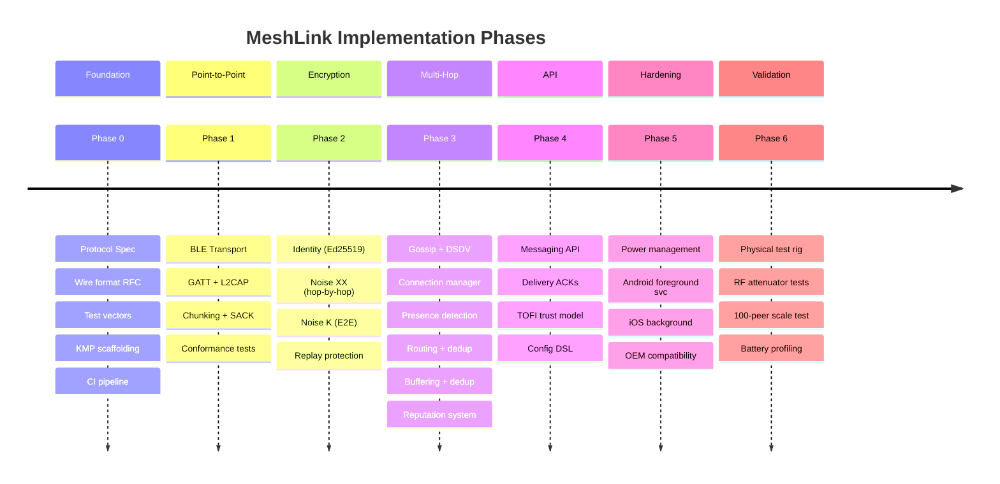
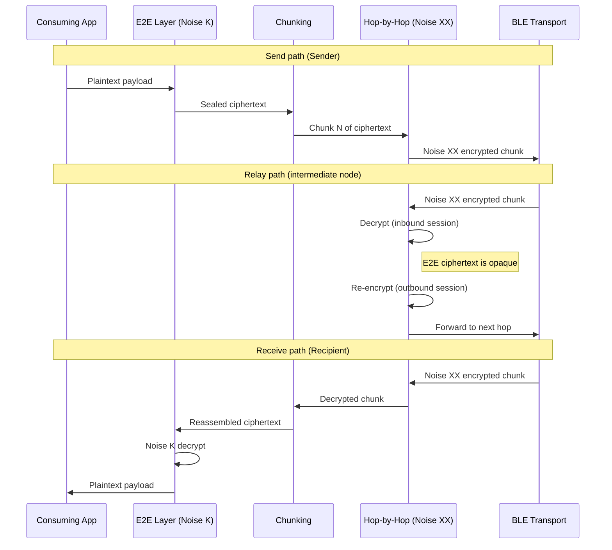
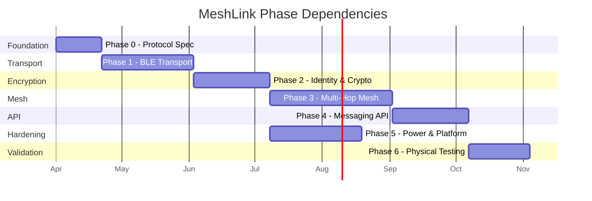

# MeshLink — Implementation Plan

> Phased plan to build the BLE mesh messaging library for Android and iOS.
> Each phase produces a working, testable vertical slice.
>
> **Cross-reference:** All implementation details derive from design.md §3–§13. Specific sections cited only where essential for context.



---

## Phase 0 — Foundation & Protocol Specification

Establish the shared protocol spec and project scaffolding before writing any platform code. This phase is the foundation everything else depends on.

### 0.1 Protocol Specification

- Define all wire formats using a **custom binary protocol** — no protobuf, no schema language. Each message type is documented as a **byte-offset table** in the RFC:
  - `HandshakeXX` — Noise XX hop-by-hop handshake messages (ephemeral keys, encrypted payloads)
  - `SealedMessage` — Noise K one-shot E2E encrypted envelope (ephemeral public key + ciphertext; sender authenticated by handshake)
  - `Chunk` — data chunk with message ID, sequence number, total chunks, payload bytes
  - `ChunkAck` — cumulative sliding-window acknowledgment with message ID and highest contiguous sequence number
  - `RoutingControl` — gossip messages (peer announcement with sequence number, topology update, buffer advertisement)
  - `RoutedMessage` — routed envelope with sender/recipient public keys, hop count, TTL, visited node list, E2E sealed message
  - `Broadcast` — broadcast envelope with sender public key, Ed25519 signature, hop count
  - `DeliveryAck` — delivery confirmation with message ID
  - `PeerAnnouncement` updated: now carries origin public key, sequence number, hop count, **cumulative route cost**, **Ed25519 signature over (origin_pubkey, sequence_number)** (prevents key forgery in gossip)
  - `PowerMode` — 2-bit enum (performance, balanced, power_saver) included in advertisement payload
  - `MessageId` — 128-bit UUID v4 (16 bytes), randomly generated by sender. Content-independent to prevent relay nodes from precomputing IDs.
  - `L2CAPCapability` — 1-byte capability bitmap exchanged during Noise XX handshake (bit 0: L2CAP CoC supported)
  - `L2CAPPsmExchange` — control message carrying the 2-byte little-endian PSM (Protocol/Service Multiplexer) for L2CAP channel establishment
  - `L2CAPFramedMessage` — length-prefixed message on L2CAP stream: 1-byte type + 3-byte little-endian length + payload
  - `ResumeRequest` (0x07) — sent on Control Characteristic after L2CAP→GATT fallback: messageId (16 bytes) + bytesReceived (4 bytes)
  - `L2CAPNonceDesync` — control signal triggering L2CAP teardown and GATT fallback on Noise XX decryption failure
  - `SealedPayloadLayout` — inner E2E payload (Noise K): replay counter (8) + flags (1, reserved) + message data (N)
- Write a prose **RFC document** covering all behavioral requirements from design.md §3–§11:
  - Encryption & authentication (Noise K E2E, Noise XX hop-by-hop, key derivation)
  - Routing (DSDV, multipath, triggered updates, settling time, holddown; routes expire naturally at 5× gossipInterval)
  - Gossip & presence (split horizon, poison reverse, suppression, eviction hardening)
  - Message transport (chunking, SACK, byte-offset resume, round-robin)
  - Deduplication & buffering (in-memory dedup set, fixed 1 MB buffer, TTL eviction)
  - Flow control & rate limiting (NACK, per-sender limits, concurrent transfer caps)
  - Power management (3-tier modes: Performance, Balanced, PowerSaver; hysteresis, charging precedence, connection limits)
- Define **test vectors** — exact byte-level golden outputs organized by category:
  - Wire format: all message types (HandshakeXX, SealedMessage, Chunk, SACK, RoutedMessage, Broadcast, DeliveryAck, PeerAnnouncement)
  - Cryptography: Ed25519 signature, Curve25519 derivation, sealed payload layout
  - Noise protocol: XX handshake transcript, K sealed message
  - Chunking: multi-chunk with byte-offset resume across MTU change, SACK bitmask gap detection
  - Adaptive congestion: SACK window transitions (halve/+2 AIMD/reset)
- **Noise K test vectors:** Reference the official Noise Protocol test vectors ([cacophony](https://github.com/haskell-noise/cacophony/tree/master/vectors)) for base Noise K verification. Additionally, 3 mandatory MeshLink-specific vectors with fixed test keys:
  1. **Minimal payload** — 1-byte message, verify sealed output matches expected bytes
  2. **100KB max payload** — full-size message, verify chunking + sealed envelope
  3. **Payload with replay counter** — message with non-zero replay counter, verify flags byte and counter encoding
- Define **fuzz testing suite** — adversarial input fuzzing for all binary message parsers. Malformed, truncated, oversized, and random byte sequences must never crash the parser or cause undefined behavior. Fuzz harnesses for: message type dispatch, chunk reassembly, L2CAP framing, handshake payloads, gossip announcements, and sealed payload parsing. Target: 10,000+ iterations per parser with no crashes.

### 0.2 Project Scaffolding

- **KMP shared module:** Kotlin Multiplatform project with `commonMain` (shared logic), `androidMain` (Android BLE + storage), `iosMain` (iOS BLE + storage via Kotlin/Native)
- **Android:** Kotlin/JVM target, Gradle, targeting API 26+ (BLE required APIs)
- **iOS:** Kotlin/Native target producing an XCFramework, minimum iOS 14 (required CoreBluetooth background APIs)
- **Shared tests:** `commonTest` module with all protocol conformance tests — runs on both JVM and Native targets
- **`BleTransport` interface:** Define as an `expect`/`actual` abstraction in the shared module. Includes GATT operations (advertise, scan, connect, read/write characteristics) AND L2CAP channel operations (publish channel, open channel, stream read/write). Phase 1 implements `actual` for both platforms + a mock for testing.
- **`SecureStorage` interface:** Define as `expect`/`actual`. Wraps EncryptedSharedPreferences (Android) / Keychain (iOS) for key material and replay counter persistence.
- **`BatteryMonitor` interface:** Define as `expect`/`actual`. Wraps BatteryManager (Android) / UIDevice.battery + ProcessInfo (iOS) for battery level and charging state.
- **Actor system scaffolding:** Define the 7-actor architecture in `commonMain`:
  - **Actor system (7 actors):** ConnectionActor, TransferActor, RouterActor, GossipActor, PresenceActor, CryptoActor, BufferActor
    - Each is a coroutine actor with typed `Channel<T>` mailbox
    - **Supervision:** Auto-restart on crash; tiered circuit breaker (monotonic-clock sliding window): CryptoActor=2 crashes/60s fatal; Router/Buffer/Presence/Gossip=3/60s; Connection/Transfer=5/60s
    - **In-flight messages:** Silently dropped on actor crash (consistent with best-effort delivery; senders recover via delivery ACK timeout)
    - **Crash history:** In-memory only (reset on app restart)
    - **Channel capacities:** Connection=128, Crypto/Transfer=64, Router/Buffer=32, Presence/Gossip=16
    - **Topology:** DAG-ordered unidirectional message flow; `MeshLinkEngine` factory creates actors in topological order via constructor injection
  - Platform-specific dispatchers for BLE callbacks (Android: coroutine dispatcher; iOS: Kotlin/Native freeze-safe dispatching into actors)
- **Crypto dependencies:** `ionspin/kotlin-multiplatform-libsodium` for primitives (Curve25519, Ed25519, ChaCha20-Poly1305). Noise Protocol state machine (XX + K patterns) implemented in `commonMain` as shared Kotlin code on top of libsodium primitives.
- **Virtual Mesh Simulator scaffolding:** `VirtualMesh` class in `commonTest`, creating N simulated peers in-process, with configurable per-link parameters (latency, packet loss, connection drops, MTU, L2CAP support toggle, RSSI, power mode). All `BleTransport` calls route through the virtual mesh.
- **VirtualMesh phased simulation fidelity:**
  - Phase 0–1: Configurable latency, packet loss, topology, MTU negotiation, connection limits
  - Phase 2: Noise XX/K handshake simulation, nonce desync on frame loss
  - Phase 3: Advertising collisions, scan miss rates, gossip timing, route convergence
  - Phase 5: iOS background killing + state preservation relaunch, Android Doze, L2CAP credit exhaustion, OEM-specific BLE quirks
- CI pipeline: build + test shared module on JVM and Native, run protocol conformance tests
- `test_virtual_time_advance`: create VirtualMesh → advanceTime(30s) → verify chunk inactivity timeout fires → advanceUntilIdle() → verify no pending events
- `test_diagnostic_backpressure_drop_oldest`: subscribe slow diagnostic consumer → emit 300 events → verify only latest 256 retained (44 oldest dropped)
- `test_parser_validation_complete`: verify complete validation rule set — V=0 valid, TotalLen ≤ 100KB, ChunkSeq in range, non-zero public keys, non-zero MsgID
- `test_reserved_message_type_drop`: verify message types 0x08–0xFF are dropped with UNKNOWN_MESSAGE_TYPE diagnostic
- `test_blanket_encoding_rule`: verify all multi-byte fields are unsigned little-endian in golden wire format vectors

### Deliverable
Protocol spec (binary wire format spec + RFC), empty but buildable projects on both platforms, CI green.

---

## Phase 1 — BLE Transport (Point-to-Point)

Get two devices talking over BLE — no mesh, no encryption, no routing. Just raw bidirectional byte transfer between two devices in range.

### 1.1 BLE Transport Interface & GATT Service

- Implement hybrid GATT + L2CAP transport.
- Platform implementations:
  - **Android:** BleAdvertiser, BleScanner, BleGattServer/Client, BleL2CAPClient/Server (API 29+)
  - **iOS:** CBPeripheralManager, CBCentralManager, CBL2CAPChannel (insecure publish)
  - In-memory mock for testing

### 1.2 Chunked Transfer Protocol

- Implement `Chunk` and `ChunkAck` binary messages over BLE characteristics
- MTU negotiation on connection
- Sender splits payload into chunks with **selective ACK (SACK)**: 64-bit bitmask, adaptive congestion avoidance (halve on 2 timeouts, +2 on 4 clean rounds (AIMD), reset on reconnect)
- **Byte-offset resume:** On reconnection, receiver reports total bytes received. Sender resumes from that byte offset at the new connection's chunk size (enables seamless GATT↔L2CAP resume).
- Progress callback wired up
- **Concurrent transfers:** Round-robin interleaving. SACK per transfer. Per-power-mode limits: Performance=8, Balanced=4, PowerSaver=2.
- **Chunk inactivity timeout:** `chunkInactivityTimeout`, default 30s
- **L2CAP data path:** power-mode chunk sizes (1024–8192), length-prefixed framing, credit-based flow control (no SACK), nonce desync → immediate GATT fallback
- **GATT fallback:** L2CAP open failure or mid-transfer drop → GATT with SACK. Resume from last acknowledged byte offset.
- **Concurrent transfer demuxing:** Decrypt-then-demux by message ID (zero metadata leakage)

### 1.3 Cross-Platform Conformance Tests

- `test_chunk_sequence_cross_platform`: 100KB payload → verify identical chunk sequences on both platforms
- `test_connection_drop_resume`: connection drop at chunk N → resume from N+1
- `test_mtu_negotiation`: MTU negotiation produces valid chunk sizes
- `test_concurrent_transfer_rr`: 3 concurrent transfers interleaved with round-robin on a single connection → all 3 complete correctly
- `test_concurrent_transfer_limit_nack`: concurrent transfer limit reached → NACK returned to sender
- `test_chunk_inactivity_timeout`: sender stops sending mid-transfer → reassembly buffer freed after 30s
- `test_sack_retransmit`: receiver sends 64-bit bitmask identifying received chunks → sender retransmits only gaps
- `test_sack_out_of_order`: chunks 1,2,5,6 received, 3,4 missing → SACK bitmask correctly marks gaps → sender retransmits only 3,4
- `test_l2cap_capability_both_peers`: both peers support L2CAP → L2CAP channel opened, data transferred
- `test_l2cap_capability_one_peer`: one peer lacks L2CAP → GATT fallback, data transferred
- `test_l2cap_framing_round_trip`: length-prefixed messages correctly framed and parsed on both platforms
- `test_l2cap_chunk_size`: 100KB payload chunked at 4096 bytes → ~25 chunks transferred via L2CAP
- `test_l2cap_fallback`: L2CAP channel fails mid-transfer → automatic GATT fallback, resume from last chunk
- `test_l2cap_android_retry`: simulate L2CAP open failure → 3 retries with backoff → mark GATT-only
- `test_l2cap_gatt_only_persistence`: after 3 failures, peer stays GATT-only for remainder of session; verify L2CAP NOT reattempted
- `test_l2cap_gatt_only_reset`: after session restart, L2CAP is retried for previously GATT-only peers
- `test_l2cap_gatt_concurrent`: mixed L2CAP and GATT peers in same session both transfer successfully
- `test_adaptive_sliding_window`: 2 consecutive ACK timeouts → window halves; 4 clean rounds → window doubles; reconnect → resets to 8
- `test_transport_mode_switch_resume`: transfer starts on GATT (244-byte chunks), connection drops, resumes on L2CAP (4096-byte chunks) from byte offset
- `test_l2cap_nonce_desync`: inject corrupted frame → L2CAP torn down → GATT fallback → transfer resumes
- `test_l2cap_partial_frame`: connection drops mid-frame → reconnect → new Noise XX handshake → no stale data from previous session
- `test_l2cap_chunk_size_negotiation`: Performance+PowerSaver pair → 1024-byte chunks; Performance+Performance → 8192-byte chunks
- `test_concurrent_transfer_demux`: decrypt-then-demux with 3 interleaved transfers on L2CAP → all complete correctly
- `test_eviction_failure_retry`: simulate BLE.disconnect() failure → verify 500ms retry → verify message buffered + EVICTION_FAILED diagnostic
- `test_oem_ble_callback_dispatch`: verify BLE callbacks from different threads are correctly dispatched into ConnectionActor via bounded channels
- `test_frozen_advertisement_format`: verify advertisement is exactly 17 bytes (1B version+power, 16B key hash) and never changes across simulated protocol versions
- `test_version_mismatch_skip_connection`: scan advertisement with unsupported major version → verify no GATT connection attempted
- `test_connection_establishment_sequence`: verify 4-step sequence (BLE connect → MTU negotiate → service discovery → Noise XX handshake) completes within 20s budget, each step waits for previous
- `test_mtu_too_small_rejection`: verify MTU < 100 bytes → disconnect + MTU_TOO_SMALL diagnostic
- `test_discovery_timeout`: verify service discovery timeout at 10s → disconnect + DISCOVERY_TIMEOUT diagnostic
- `test_gatt_write_retry`: verify 3 retries at 100/200/400ms on write error, then disconnect + WRITE_FAILED diagnostic
- `test_gatt_service_uuid`: verify service advertises with 16-bit UUID 0x7F3A
- `test_gatt_characteristic_uuids`: verify 4 characteristics use base UUID + offsets 0x0001–0x0004
- `test_ffi_channel_decoupling`: verify BLE events posted via `trySend()` are consumed serially by ConnectionActor; verify actor crash does not affect BLE event channel (events queue up)
- `test_ios_state_preservation_relaunch`: simulate iOS CB State Preservation relaunch; verify library starts from uninitialized, detects restored peripherals, fast-paths reconnection (skips scan)
- `test_start_permission_denied`: call `start()` without BLE permissions → returns `Result.Failure(permissionDenied(missing: ["BLUETOOTH_SCAN"]))`, state → recoverable; grant permissions, call `start()` again → succeeds
- `test_start_initialization_order`: verify start() initializes in strict order: permission→crypto→keys→derive→actors→BLE→scan; inject failures at each step, verify correct error and no partial state
- `test_gatt_control_write_with_response`: verify Control Write characteristic uses ATT Write Request (write-with-response); verify Data Write uses ATT Write Command (write-without-response)
- `test_scan_response_service_uuid`: verify scan response data contains service UUID 0x7F3A for iOS background discoverability
- `test_l2cap_backpressure_diagnostic`: simulate L2CAP write block >100ms → verify L2CAP_BACKPRESSURE diagnostic emitted with elapsed time
- `test_advertisement_service_data_format`: verify advertisement uses Service Data AD type (0x16) keyed by UUID 0x7F3A, not manufacturer-specific data
- `test_resume_golden_vectors`: Parametric test with scenarios: (1) drop after 1st chunk (10KB payload), (2) drop at 50% (100KB), (3) drop after final chunk sent but before ACK, (4) transport mode switch GATT→L2CAP with byte-offset resume, (5) payload exactly divisible by chunk size. All verify `bytesReceived` matches golden value on both platforms.
- `test_sealed_payload_golden_vector`: verify byte-identical sealed payloads across Android and iOS for same input; flags byte = 0x00 (reserved)
- `test_message_exactly_max_size`: send payload of exactly maxMessageSize bytes → verify chunking math correct, transfer completes
- `test_message_max_size_plus_one`: send payload of maxMessageSize + 1 bytes → verify Result.Failure(messageTooLarge)
- `test_message_zero_bytes`: send(peer, ByteArray(0)) → verify Result.Failure(messageEmpty)
- `test_chunking_exact_divisibility`: payload size exactly divisible by chunk size → verify correct chunk count (no empty trailing chunk)
- `test_sack_timeout_vs_gap`: send window of 8 chunks, receiver sends SACK with 2 gaps → verify window NOT halved (gaps are normal); simulate no SACK response within ackTimeout → verify consecutive timeout count incremented; 2 consecutive no-SACK timeouts → verify window halves
- `malformed_sack_base_seq_out_of_range` — send SACK with `base_seq > total_chunks` → verify frame rejected + `MALFORMED_MESSAGE` diagnostic emitted with `{reason: "sack_base_seq_overflow", baseSeq, totalChunks}`
- `test_chunk_inactivity_per_transfer`: 3 concurrent transfers on one connection; pause transfer A for 31s while B and C continue → verify only transfer A dropped; B and C unaffected

### Deliverable
Two devices (one Android, one iOS or same-platform pair) can discover each other and transfer a 100KB blob bidirectionally with resume-on-drop. L2CAP CoC used when both peers support it; GATT fallback verified via: (1) real devices without L2CAP support, or (2) simulated L2CAP failure mid-transfer.

---

## Phase 2 — Identity & Encryption

Layer two-tier encryption on top of the raw BLE transport from Phase 1: Noise K for E2E and Noise XX for hop-by-hop.



### 2.1 Key Generation & Storage

- Generate static **Ed25519 keypair** on first launch (the Ed25519 public key IS the device identity)
- Derive a **Curve25519 keypair** from the Ed25519 key via the RFC 8032 birational map (for Noise protocol handshakes)
- Store private key in platform secure storage:
  - **Android:** `EncryptedSharedPreferences` (backed by Android Keystore master key). Android Keystore does not natively support X25519 key agreement — raw key bytes are generated by the Noise library and stored encrypted.
  - **iOS:** Keychain Services
- **Exception classification for key storage retries:**
  - `IOException` (transient I/O failure) → retry up to 3× with exponential backoff (200ms, 400ms, 800ms)
  - `SecurityException` / `KeyStoreException` (non-transient security failure) → immediate failure, no retry → `fatalError(retryable: true)`

### 2.2 Noise XX Handshake (Hop-by-Hop)

Implement Noise XX (hop-by-hop) and Noise K (E2E) using libsodium primitives.

### 2.3 Noise K Encryption (End-to-End)

- Implement `Noise_K_25519_ChaChaPoly_BLAKE2b` one-shot encryption
- Sender generates ephemeral Curve25519 keypair per message, encrypts payload with recipient's static key
- Produces `SealedMessage` = ephemeral pubkey + ciphertext (sealed payload layout: `[8B counter | 1B flags | N bytes data]`)
- **Sender authentication built into Noise K** — no separate Ed25519 signature needed (saves 64 bytes vs. Noise N + signature)
- Recipient verifies sender by attempting Noise K decryption with the sender's gossip-distributed static key
- **Note:** Ed25519 signatures are still used for **broadcast messages** and **delivery ACKs**

### 2.4 Replay Protection

- Each device maintains a monotonic uint64 counter, incremented per outgoing message
- The counter is included inside the E2E encrypted payload
- Recipient tracks the highest-seen counter per sender public key; rejects any message with counter ≤ last seen
- Counter values are persisted to platform secure storage to survive app restarts
- **Persist both counters** to platform secure storage: sender's outgoing counter + recipient's per-sender highest-seen counter. Loss on crash could cause replay acceptance or legitimate message rejection.
- **Counter overflow:** uint64 counter will not overflow in practice (~585 billion years at 1 msg/sec). No overflow handling implemented.

### 2.5 Encrypted Chunked Transfer Pipeline

- Full pipeline: **E2E encrypt (Noise K) → chunk → transmit within hop-by-hop Noise XX session** *(LZ4 compression deferred post-v1)*
- Chunks are byte ranges of the E2E ciphertext — no per-chunk AEAD overhead
- Integrity verified once on full reassembly + E2E decryption

### 2.6 Conformance Tests

- Test vector: known keypairs + known ephemeral keys → verify identical Noise XX handshake transcript on both platforms
- Test vector: known keypairs → verify identical Noise K sealed message on both platforms
- Test: man-in-the-middle detection (Noise XX handshake with wrong static key fails)
- Test: E2E encrypted 100KB transfer round-trip (seal with Noise K → chunk → unseal)
- Test: replay rejection — same sealed message sent twice, second is rejected
- Test: Noise K sender authentication — decryption with wrong sender static key fails
- Test vector: known Ed25519 keypair → birational map → verify derived Curve25519 public key matches expected
- Test vector: known sealed payload → verify Noise K ciphertext matches expected output
- Test: signature verification failure — tampered message data → Ed25519 verification fails → message rejected
- Test: replay counter persistence — kill process → relaunch → send new message → verify outgoing counter resumes from persisted value (not reset to 0); verify incoming replay rejection still works with persisted per-sender counters
- `test_replay_window`: send messages with counters [1,2,5,3,4] → all accepted (reordering within 64-window); resend counter 3 → rejected as replayed; send counter with gap > 64 from highest → old counters below window rejected
- Test: write-ahead replay counter — kill process mid-message → restart → verify replay counter fully consistent (no gap)
- Test: self-send skips replay counter — send to self → verify replay counter not incremented → verify visited-list blocks wire self-messages
- `test_noise_xx_payload_exchange`: verify Message 2 (responder) and Message 3 (initiator) each carry 5-byte payload (version + capability + PSM)
- `test_noise_xx_failure_recovery`: verify handshake timeout → discard state → disconnect → no immediate retry
- `test_identity_excluded_from_backup`: on Android, verify EncryptedSharedPreferences backup exclusion; on iOS, verify Keychain item has `kSecAttrAccessibleAfterFirstUnlockThisDeviceOnly`
- `test_noise_xx_payload_extensible`: send handshake with 7-byte payload (5 standard + 2 unknown) → verify v1 peer accepts handshake and ignores trailing 2 bytes
- `test_noise_xx_psm_zero`: send handshake with PSM=0x0000 → verify peer skips L2CAP setup and uses GATT-only path
- `test_handshake_timeout_total`: simulate slow BLE link: Message 1 takes 3s, Message 2 takes 3s, Message 3 takes 3s (9s total) → verify handshake timeout fires at 8s (before Message 3 completes); verify state discarded + disconnect
- `test_recipient_key_unknown_error`: send to peer with route but no Curve25519 key → verify `recipientKeyUnknown` error returned (not `noRoute`)

### Deliverable
Same as Phase 1, but all communication is encrypted. Devices authenticate each other by static public keys.

---

## Phase 3 — Mesh Networking (Multi-Hop)

Extend point-to-point to multi-hop mesh. This is the most complex phase.

```mermaid
flowchart LR
    subgraph Sender["Sender (A)"]
        A1["App calls send(D, payload)"] --> A2["E2E encrypt\n(Noise K)"]
        A2 --> A3["Chunk ciphertext"]
        A3 --> A4["Look up route to D\nin routing table"]
        A4 --> A5["Next-hop = B"]
    end

    subgraph RelayB["Relay B"]
        B1["Receive chunk\n(Noise XX decrypt)"] --> B2["Dedup check\n(messageId)"]
        B2 --> B3["Add own hash\nto visited list"]
        B3 --> B4["Look up next-hop\nfor D → C"]
        B4 --> B5["Re-encrypt chunk\n(Noise XX outbound)"]
        B5 --> B6["Forward + buffer\n(cut-through)"]
    end

    subgraph RelayC["Relay C"]
        C1["Receive chunk"] --> C2["Dedup + visited check"]
        C2 --> C3["Next-hop for D = D\n(direct neighbor)"]
        C3 --> C4["Re-encrypt + forward"]
    end

    subgraph Recipient["Recipient (D)"]
        D1["Receive chunk\n(Noise XX decrypt)"] --> D2["Reassemble chunks"]
        D2 --> D3["E2E decrypt\n(Noise K)"]
        D3 --> D4["Deliver to app\n→ onMessageReceived"]
        D4 --> D5["Send DeliveryACK\nback to A"]
    end

    A5 --> B1
    B6 --> C1
    C4 --> D1
```



### 3.1 Peer Discovery & Gossip

- Implement gossip protocol per design.md §4: differential updates, split horizon + poison reverse, triggered updates (>30% cost change), settling time (1 gossip interval), and holddown timer (2× gossip interval).
- `PeerAnnouncement`: full public key, sequence number, hop count, cumulative route cost, Ed25519 signature over (pubkey, seq)
- **Gossip signature verification:** On receiving a `PeerAnnouncement`, verify the Ed25519 signature over `(origin_pubkey, sequence_number)` before accepting the route. Drop announcements with invalid signatures + emit diagnostic.
- **Per-neighbor routing table cap:** Routes from any single neighbor capped at 30% of table (min 60 routes). Reject excess routes from the same neighbor with lowest sequence number first.
- **Gossip auto-throttle:** When the routing table exceeds 100 entries, gossip interval automatically increases by 50% to reduce overhead at scale.

### 3.2 Connection Manager

- Implement connection management:
  - Hybrid persistent + on-demand strategy with priority scoring
  - Connection priority heuristic: protect connections with active transfers first, then LRU, then lowest route cost
  - Version negotiation in Noise XX handshake payload (major=disconnect, minor=negotiate down)
  - Deterministic tie-breaking: higher power mode → central; same mode → higher key hash → central

### 3.3 Advertising-Based Presence Detection

- Implement advertising-based presence detection per design.md §8: three-state lifecycle (Discovered→Active→Gone), adaptive timeout formula (`baseTimeout + hopCount × gossipInterval`), eviction hardening (require ≥2 missed sweeps).

### 3.4 Routing Table Construction (DSDV-Lite)

Implement Enhanced DSDV routing: route cost formula, visited-list loop prevention, primary+backup routes, triggered updates, split horizon, poison reverse. Routes expire naturally at 5× gossipInterval (no explicit RERR).

### 3.5 Message Deduplication

- Implement message deduplication per design.md §4: in-memory HashMap, bounded by 10k entries and `maxHops × bufferTTL` age, LRU eviction.
- **Dedup set is in-memory only.** On app restart the dedup set starts empty; consuming apps needing exactly-once delivery should implement app-layer deduplication.

### 3.6 Routed Message Forwarding (Data Plane)

- When sending a message to a peer N hops away:
  1. E2E encrypt the payload using Noise K with the recipient's static public key and sender's static key (from Phase 2)
  2. Look up next-hop neighbor in routing table
  3. Establish BLE connection to next-hop (or reuse existing)
  4. Forward the `RoutedMessage` envelope (E2E sealed message + routing metadata + visited list) over the hop-by-hop Noise XX session
  5. Next-hop checks deduplication, adds itself to visited list, looks up next-hop, and repeats
- **Hop limit enforcement:** message dropped if hop count exceeds `maxHops` (default: **4**, configurable)
- **E2E encryption:** relay nodes see the `RoutedMessage` envelope (sender/recipient public keys, hop metadata) but cannot read the inner `SealedMessage`

**Relay forwarding model:** Implement routed message forwarding per design.md §4: cut-through forwarding (stream chunks to next-hop while buffering locally), no cascading restart on upstream failure.

### 3.7 Message Buffering

Implement message buffering: fixed 1 MB buffer, 75/25 relay/own split, 3-tier eviction (no-route → relay → own), TTL-based expiry.

### 3.8 Routing Manipulation Mitigation

- Implement local reputation scoring per design.md §5: per-relay delivery success tracking, deprioritize at >50% failure rate over ≥20 samples, never gossip scores, reset on re-handshake. Handshake rate limiting: 1/sec for unknown peers (TOFI-pinned exempt).

### 3.9 Conformance Tests

- Test: A→B→C delivery (3 devices, B relays)
- Test: A→B with B offline → B buffers → B→C when C appears
- Test: hop limit enforcement (message dropped at max hops)
- Test: routing table convergence after topology change (device leaves/joins)
- Test: DSDV sequence numbers — stale route with lower seq number is rejected even if shorter
- Test: visited node list — loop detected and message dropped
- Test: deduplication — same message arriving via two paths is delivered once
- Test: presence detection (advertising timeout) — peer stops advertising → evicted after 2 consecutive timeout sweeps
- Test: presence detection (GATT disconnect) — GATT disconnect → peer marked disconnected, not gone
- Test: cross-mode presence — performance device correctly uses PowerSaver timeout for PowerSaver peer
- Test: advertisement includes power mode field, parseable by both platforms
- Test: connection role tie-breaking — higher power mode device always initiates; same mode → higher key hash initiates
- Test: tie-breaking comparison — known key hash pairs compared identically on Android (JVM) and iOS (Native) using lexicographic byte comparison
- `test_simultaneous_connection_race`: two VirtualMesh peers initiate connections simultaneously → verify both handshakes complete → verify wrong-role connection closed → verify `DUPLICATE_CONNECTION_RESOLVED` diagnostic emitted → verify single surviving connection matches tie-breaking rule
- Test: relay cut-through forwarding — chunks forwarded before full reassembly
- Test: relay local buffer — next-hop drops mid-transfer → relay retransmits from buffer, no restart from sender
- Test: chunk inactivity timeout at relay — incomplete inbound transfer dropped after 30s
- Test: per-sender-per-neighbor rate limit — 21st message in 1 minute from same (neighbor, sender) pair is NACKed; keyed on `(neighbor, sender)` to prevent relay quota exhaustion
- Test: route expiry — peer stops advertising → route soft-deleted after 5× gossip interval → revived on re-advertisement
- Test: route selection by cost — 2-hop route with cost 2.0 selected over 1-hop route with cost 3.0
- Test: link quality estimation — RSSI linear formula produces correct per-link costs
- Test: route expiry — unreachable peer's route expires at 5× gossipInterval → multipath failover to backup
- Test: multipath failover — primary route fails → instant switch to backup, no Gossip wait
- Test: backup route uses different Next-Hop than primary
- Test: triggered update — new Neighbor discovered → immediate Gossip to existing Neighbors
- Test: triggered update rate limiting — multiple triggers within 1 interval batched into single update
- Test: gossip suppression — stable topology (no changes) → keepalive heartbeats sent instead of full differential
- Test: gossip suppression resume — topology change after stable period → full differential resumes immediately
- Test: route settling time — flapping Peer (appear/disappear within 1 interval) → route never advertised
- `test_100kb_multi_hop_relay`: A→B→C→D 100KB transfer with simulated packet loss at B→C link → verify SACK-driven retransmit, cut-through relay buffering, and successful end-to-end delivery
- `test_100kb_multi_hop_relay_buffer_resume`: A→B→C 100KB transfer, C drops mid-transfer → C reconnects → transfer resumes from byte offset via relay B's buffer
- Test: route settling — withdrawal propagates immediately (no settling delay)
- Test: split horizon — route not advertised back to the Neighbor it was learned from
- Test: relay buffer cap — relay traffic exceeding 75% of buffer + own outbound 100KB → relay traffic capped at 75%, own outbound succeeds from reserved 25%
- Test: auto-adaptive buffer sizing — verify fixed 1 MB buffer allocation
- Test: buffer eviction ordering — when buffer is full, messages with no known route are evicted first, then oldest messages by TTL remaining
- `buffer_allocation_oom_evict_and_retry` — simulate `OutOfMemoryError` during buffer allocation → verify oldest message evicted, allocation retried once, message accepted. On double-fail → verify `bufferFull` NACK returned + `BUFFER_ALLOCATION_FAILED` diagnostic emitted
- `test_dedup_empty_on_restart`: populate dedup set → kill process → relaunch → verify dedup set is empty (dedup set is in-memory only — see §4 Message Deduplication); replay message → verify duplicate delivered (expected behavior); verify app-layer dedup recommendation documented
- Test: routed_message parser safety — V > maxHops → message rejected; V=255 with small buffer → rejected (no crash)
- Test: NACK rate limiting — flood node with 50 invalid messages in 1 second → max 10 NACKs emitted; rest silently dropped
- Test: route expiry reset — transition Performance→Balanced → verify route expiry timers recalculated with new interval
- Test: route cost sanity check — inject PeerAnnouncement with cost < local link cost → verify rejected
- Test: gossip overhead 50 peers — VirtualMesh with 50 peers → measure gossip traffic → verify ≤2 KB/s
- `test_gossip_signature_verification`: inject PeerAnnouncement with invalid Ed25519 signature → verify rejected + diagnostic emitted; malicious relay modifies origin pubkey → signature fails → route rejected
- `test_per_neighbor_routing_table_cap`: single neighbor advertises 100 routes (30% cap = 60) → verify only 60 accepted
- `test_handshake_rate_limiting`: 5 unknown peers attempt simultaneous handshakes → verify max 1/sec (takes ≥5s); TOFI-pinned peer handshakes not rate-limited
- `test_reputation_scoring`: relay drops 60% of messages over 30 samples → verify deprioritized in path selection; relay recovers → verify reputation resets after re-handshake
- Test: dedup scaling 30 msg/s — sustain 30 msg/s → verify full 5-min dedup coverage
- `test_actor_dag_no_reverse_edges`: verify no downstream actor sends to upstream actor's channel; all reverse communication uses CompletableDeferred
- `test_actor_restart_channel_cleanup`: verify crashed actor's old channel is closed, pending messages discarded, fresh channel created
- `test_circuit_breaker_tiered_thresholds`: verify CryptoActor first crash auto-restarts, second crash within 60s → fatal(retryable: false), Router/Buffer/Presence/Gossip=3/60s, Connection/Transfer=5/60s; verify monotonic clock used (immune to wall-clock adjustment)
- `test_circuit_breaker_sliding_window`: crash at T=0, T=30, T=90 → verify T=90 crash does NOT trigger fatal (T=0 has expired from 60s window)
- `test_circuit_breaker_crash_history_reset`: trigger fatalError via circuit breaker → restart app → verify crash count starts at 0
- `test_circuit_breaker_survives_stop`: crash ConnectionActor 4 times → stop() → create new MeshLink instance → start() → crash ConnectionActor once more → verify fatal triggered (crash count = 5, carried from previous instance in same process)
- `test_actor_crash_silent_drop`: inject crash in RouterActor while message in-flight → verify sender eventually receives onTransferFailed via delivery ACK timeout (message not silently lost from app perspective)
- `test_partition_heal_no_triggered_update`: reconnect two VirtualMesh partitions; verify routes from full exchange propagate via periodic gossip only (no triggered updates fired for those routes)
- `test_version_negotiation_independent_downgrade`: connect v1.0 and v1.2 peers → both independently compute min(v1.0) → verify feature set matches v1.0 capabilities
- `test_unknown_capability_bits_diagnostic`: peer sends capability byte with unknown bit 1 set → verify bit ignored + UNKNOWN_CAPABILITY_BITS diagnostic emitted
- `test_broadcast_ttl_propagation`: send broadcast with broadcastTTL=2 in 4-hop VirtualMesh line topology → verify reaches peers at hop 1 and 2 but not 3 or 4
- `test_broadcast_rate_limit`: single sender sends 15 broadcasts in 60 seconds → verify first 10 delivered (10/min limit), remaining 5 dropped with rateLimitHit diagnostic
- `test_broadcast_dedup`: send same broadcast to peer with 3 neighbors → verify each neighbor receives it once (dedup prevents duplicate relay)
- `test_l2cap_backpressure_fallback`: simulate 3 consecutive >100ms L2CAP write blocks within l2capBackpressureWindow (default 7s) → verify GATT fallback triggered + resume_request sent; verify L2CAP NOT retried until next fresh connection
- `test_l2cap_transient_block_no_fallback`: simulate single >100ms L2CAP block → verify no fallback (threshold not met)
- `test_replay_counter_pre_increment_persist`: crash process between persist and send → verify counter jumps by 1 on restart (gap acceptable) and next message accepted by receiver
- `test_replay_counter_inbound_periodic_persist`: receive 50 messages → crash before 1s periodic flush → verify replay window reset to last flushed state; verify dedup set catches duplicates in the gap
- `test_gossip_auto_throttle`: VirtualMesh with 120 routing table entries → verify gossip interval increases 50% automatically at >100 entries; reduce table to 80 → verify interval returns to normal
- `test_split_horizon_steady_state`: A learns route {X via B} → verify gossip to B omits route X; verify gossip to C includes route X
- `test_poison_reverse_on_withdrawal`: A changes route {X via B} to {X via C} → verify gossip to B sends cost=∞ for X; verify gossip to C sends new cost for X
- `test_chunk_timeout_resets_on_chunk`: send chunks with 25s gap between first and second → verify timeout does NOT fire; then pause 31s → verify timeout fires
- `test_visited_list_add_before_forward`: relay processes message → verify own hash added to visited list in forwarded copy; verify next relay sees it
- `test_backup_route_stale_failover`: set backup route with old sequence number → fail primary → verify backup used immediately → if backup peer moved, verify fail-fast + buffer
- `test_self_send_async_dispatch`: call send(ownPubKey) → verify onMessageReceived fires asynchronously on callbackDispatcher (not synchronously in send() callstack)
- `test_rate_limit_at_relay`: relay B receives flood from sender A → verify B drops excess at forwarding point; verify destination C never sees dropped messages
- `test_key_rotation_old_key_until_teardown`: rotate key → verify old key accepted while old Noise XX sessions still active → tear down sessions → verify old key erased
- `test_unknown_power_mode_timeout`: peer advertises unknown power mode bits → verify adaptive timeout uses Balanced (10s) as default
- `test_diagnostic_dropped_count`: emit 300 diagnostic events → verify subscriber sees droppedCount > 0 on events after buffer overflow
- `test_gossip_overhead_regression`: VirtualMesh 50 peers, stable topology → measure total gossip bytes over 5 minutes → fail if exceeds baseline × 1.2. Baseline recorded on first passing run and stored as golden value.
- `test_neighbor_aggregate_rate_limit`: 10 distinct senders route 20 msg/min each through neighbor B (200/min total) → verify B drops excess beyond neighborRateLimit (100/min) with NEIGHBOR_RATE_LIMIT_HIT diagnostic; per-sender limits still enforced independently
- `test_rate_limit_first_chunk_counting`: sender starts 25 transfers (first chunk only, then stalls) in 60s → verify rate limit hits at 20 (per-sender limit); verify retransmit of same messageId does NOT increment counter
- `test_gossip_keepalive_format`: stable topology → verify gossip messages are 11 bytes: `[0x02 | count=0 (uint16) | seq_hi (uint64 LE)]`; verify receiver distinguishes keepalive (count=0) from differential (count>0)
- `test_sliding_window_rate_limit`: sender sends 20 messages at T=0 (fills window), then 1 message at T=30 → verify rejected (window still full); 1 message at T=61 → verify accepted (oldest entry expired from sliding window); verify no boundary exploit possible
- `test_route_cost_freshness_penalty`: verify links with last measurement older than 2× gossipInterval get 1.5× freshness penalty; verify recent links get 1.0×

### Deliverable
Messages route across multiple BLE hops. Offline recipients receive buffered messages when they rejoin within TTL.

---

## Phase 4 — Messaging API & Features

Expose the mesh transport as a clean library API with messaging semantics.

### 4.1 Message Types

- **DirectMessage:** 1:1 E2E encrypted message to a specific public key (Noise K sealed message — sender authenticated by handshake)
- **Broadcast:** **signed** (Ed25519) but unencrypted message to all reachable mesh nodes — provides authenticity and integrity without confidentiality
- Message payload: arbitrary bytes (the library is payload-agnostic; the reference app uses it for text + photos)
- **No ordering guarantee** — messages may arrive out of order via different mesh paths; consuming app handles ordering if needed
- **Key rotation:** `rotateIdentity()` generates new keypair, signs rotation announcement with old key, gossips to all peers. Peers in `softRepin` auto-accept; `strict` peers fire `onKeyChanged`. Old key securely erased after announcement sent.

### 4.2 Delivery Acknowledgments

- Implement delivery ACK routing per design.md §6: reverse-path unicast, 2 attempts × 2s timeout, Ed25519-signed ACKs. Strict single-signal rule: exactly one terminal callback per messageId.

### 4.3 Async Stream API Surface

- Implement public API surface per design.md §11. Key interfaces: `send(recipient, payload, options)`, `broadcast(payload, options)`, `peers: Flow<List<Peer>>`, `messages: Flow<ReceivedMessage>`, `diagnostics: Flow<DiagnosticEvent>`. Platform mapping: Kotlin suspend + Flow → Swift async + AsyncStream.

### 4.4 Error Model

- Implement error model per design.md §11: `Result<T>` for expected failures, `IllegalStateException` for API misuse. No exceptions for operational errors.

### 4.5 Trust Model (TOFI)

- Implement TOFI trust model per design.md §5: strict (default) + softRepin modes, `onKeyChanged` callback, signed rotation auto-acceptance in both modes.

### 4.6 Configuration API

- Implement configuration API per design.md §11: Kotlin DSL + Swift struct initializer, per-field bounds validation, cross-field rules validated at build time (all violations returned at once). Presets: `lowLatency()`, `fileTransferOptimized()`, `powerOptimized()`.

### 4.7 Tests

- Integration test: send DirectMessage, verify receipt and E2E decryption
- Integration test: send with deliveryAck, verify ACK received
- Integration test: broadcast reaches all mesh nodes with valid Ed25519 signature
- Integration test: broadcast with forged signature is rejected
- Integration test: duplicate message (same messageId) delivered only once to app
- Integration test: send fails after max retries → correct error category + code surfaced
- Integration test: TOFI — first discovery pins key; subsequent connections use pinned key
- Integration test: key change triggers `onKeyChanged` callback
- Integration test: `stop()` gracefully flushes pending, `pause()` keeps connections
- API test: async stream emits correct events in order
- Integration test: delivery ACK takes reverse-path unicast when route exists
- Integration test: delivery ACK with forged Ed25519 signature is rejected
- Integration test: delivery ACK with mismatched recipient key is rejected
- Integration test: delivery ACK retries reverse-path on failure (no flood fallback)
- `test_key_rotation_while_peer_offline`: peer A rotates key → peer B comes online → B receives message from A with new key → decryption fails → message dropped → gossip delivers new key → A resends → B decrypts successfully
- Integration test: `appId` config param → messages with non-matching appId silently dropped at recipient
- Integration test: `appId = null` (default) → all messages received (no filtering)
- Integration test: changing appId requires new MeshLink instance (config is immutable)
- `test_callback_exception_isolation`: register onMessageReceived that throws RuntimeException → message delivered → exception logged as diagnostic event → library continues operating normally
- `test_callback_blocking_tolerance`: register onMessageReceived that blocks for 10s → actors continue processing (gossip, relay) without stalling → callback eventually completes
- `test_send_before_start`: call send() before start() → IllegalStateException thrown
- `test_double_start`: call start() twice → IllegalStateException on second call
- `test_send_after_stop`: call stop() then send() → IllegalStateException thrown (stopped is terminal)
- `test_start_after_stop`: call stop() then start() → IllegalStateException thrown (must create new instance)
- `test_thread_safe_concurrent_send`: call send() from 10 threads simultaneously → all messages queued successfully, no corruption
- `test_stop_drains_callbacks`: trigger 5 rapid message deliveries → call stop() → all 5 onMessageReceived callbacks complete before stop() returns
- `test_send_to_self_loopback`: send(ownPublicKey, payload) → onMessageReceived fires with the message → no BLE activity
- `test_send_to_unknown_peer`: send(unknownKey, payload) → message buffered → peer does NOT appear within 5 min → onTransferFailed(peerNotFound)
- `test_send_to_unknown_peer_late_arrival`: send(unknownKey, payload) → peer appears via gossip after 2 min → message delivered successfully
- `test_broadcast_no_self_delivery`: broadcast(payload) → sender's onMessageReceived does NOT fire → other peers receive it
- `test_message_ordering_not_guaranteed`: sender sends M1 then M2 via different paths → verify both arrive (order may vary) → document: no ordering guarantee
- `test_mesh_health_snapshot`: connect 3 peers → verify connectedPeers=2, reachablePeers≥2 → start transfer → verify activeTransfers=1 → verify relayBufferUtilization > 0 during relay
- Test: delivery deadline fires timeout — send message with no delivery ACK → verify onTransferFailed(DELIVERY_TIMEOUT) fires at bufferTTL
- Test: two-tier delivery callbacks — verify onTransferProgress fires on SACK (unsigned) and onDeliveryConfirmed fires only on signed delivery ACK
- Test: duplicate identity warning — two VirtualMesh peers with same pubkey → verify onSecurityWarning(DUPLICATE_IDENTITY)
- Test: battery death mid-transfer — kill receiving peer mid-transfer → restart → verify sender retries, no duplicate delivery at app layer
- `test_flow_callback_coexistence`: subscribe to both Flow and MeshLinkListener → verify single delivery per message (no double-delivery)
- `test_send_after_pause_queued`: call send() while paused → verify message queued → resume() → verify delivery
- `test_send_during_shutdown_throws`: call stop() then immediately send() → verify IllegalStateException
- `test_send_from_callback`: in onMessageReceived callback, call send() to reply → verify reply delivered to peer
- `test_concurrent_start_atomic`: call start() from 2 threads simultaneously → verify exactly 1 succeeds, 1 throws IllegalStateException
- `test_delivery_deadline_callback`: send with no reachable peer → verify onTransferFailed(DELIVERY_TIMEOUT) fires at bufferTTL
- `test_result_type_on_send`: send(validPeer, payload) returns Result.Success; send(before start) throws IllegalStateException; send(oversized payload) returns Result.Failure(messageTooLarge)
- `test_config_dsl_defaults`: construct MeshLinkConfig via default DSL block `MeshLink.configure { }` (no parameter overrides) → serialize to canonical form → compare against golden snapshot file. Any new parameter automatically fails until snapshot updated.
- `test_config_dsl_validation`: create config with maxMessageSize=0 → verify immediate IllegalArgumentException from setter, not runtime crash
- `test_config_cross_field_validation`: create config with ackWindowMax < ackWindowMin → verify build() returns invalidConfiguration(violations) listing all failing rules. Test all 7 cross-field rules.
- `test_config_immutability`: verify MeshLinkConfig has no mutable setters after construction; config object passed to MeshLink cannot be modified externally
- `test_config_struct_swift`: create MeshLinkConfig with custom values → verify start() uses them
- `test_config_presets`: verify `chatOptimized()`, `fileTransferOptimized()`, `powerOptimized()` return correct default overrides; verify individual overrides applied after preset
- `test_quickstart_snippet_compiles`: copy-paste Kotlin quickstart into a test class → verify it compiles and runs against VirtualMesh
- `test_crypto_init_failed_bad_libsodium`: mock libsodium init to return failure → call start() → verify Result.Failure(cryptoInitFailed) + fatalError diagnostic
- `test_key_storage_failure_retries`: mock Keychain/SharedPrefs to fail 2× then succeed → verify start() succeeds after 2 retries + logged diagnostics
- `test_key_storage_failure_exhausted`: mock storage to fail 3× → verify fatalError(retryable: true) + Result.Failure(keyStorageFailed)
- `test_state_machine_transitions`: verify complete 6-state machine: start() valid from {uninitialized, stopped, recoverable}; pause() from {running}; resume() from {paused}; stop() always no-op safe; all other transitions → IllegalStateException
- `test_terminal_state_permanent`: trigger cryptoInitFailed → verify start() throws IllegalStateException (terminal, non-retryable)
- `test_recoverable_state_retry`: trigger keyStorageFailed → verify start() re-attempts and can succeed on retry
- `test_delivery_ack_tombstone`: send with delivery ACK → let bufferTTL expire → onTransferFailed fires → inject late delivery ACK → verify silently dropped + lateDeliveryAck diagnostic emitted + onDeliveryConfirmed NOT fired
- `delivery_ack_replay_silently_dropped` — send valid signed delivery ACK, then replay the identical ACK → verify second ACK silently dropped + `lateDeliveryAck(messageId)` diagnostic emitted. Also test: ACK with invalid signature → verify rejection + diagnostic
- `test_self_send_bypasses_dedup`: send 100 self-messages → verify all delivered, dedup set size unchanged, no replay counter increment
- `test_flow_subscription_replay`: discover 3 peers → subscribe to .peers → verify subscriber receives all 3 current peers then incremental updates. Verify subscription is race-free with concurrent peer eviction.
- `test_diagnostic_shared_buffer`: subscribe 2 collectors to .diagnostics → slow-block one collector → emit 300 events → verify fast collector loses old events (shared buffer DROP_OLDEST affects all)
- `test_pause_power_eviction`: establish 5 connections in Performance mode → pause() → trigger power downgrade to Balanced (limit=3) → verify 2 connections evicted during pause + onPeerLost fires → resume() → verify scan restarts
- `test_fatal_error_dual_signal_contract`: mock libsodium init to fail → call start() → capture Result.Failure(cryptoInitFailed) AND verify fatalError diagnostic emitted on .diagnostics in same event cycle → verify neither signal suppresses the other
- `test_relay_opaque_forwarding_unknown_type`: create VirtualMesh with v1 relay between two endpoints → send routed_message wrapping unknown inner type (0x08) → verify v1 relay forwards opaquely without dropping → verify destination drops with UNKNOWN_MESSAGE_TYPE diagnostic
- `test_flow_peers_replay`: subscribe to `.peers` after peers exist → receive replay of current peers; subscribe to `.messages` after messages sent → receive nothing (forward-only)
- `test_send_fifo_per_thread`: call send() 10 times from single thread → verify messages dispatched in FIFO order to TransferActor
- `test_send_buffer_full_immediate`: fill buffer → call send() → verify immediate Result.Failure(bufferFull), non-blocking
- `test_mesh_health_on_demand_fresh`: call meshHealth() → verify snapshot reflects current state (not cached). Modify state → call again → verify snapshot updated
- `test_app_id_blake2b_hash`: configure `appId = "com.test.app"` via MeshLinkConfig → verify wire format contains BLAKE2b-128 hash, not raw string. Verify non-matching appId hash silently dropped at recipient.
- `test_rate_limit_control_exempt`: flood node with 100 chunk_acks in 1 minute from same sender → verify none rate-limited (control-plane exempt)
- `test_api_misuse_diagnostic`: call send() with oversized payload 10 times consecutively → verify API_MISUSE(send, messageTooLarge, 5) diagnostic emitted once at 5th call → send 5 more → verify second API_MISUSE emitted at 10th call (counter reset after first emission)
- `test_transfer_failed_context`: send to unknown peer with no route → verify onTransferFailed includes failureContext=NO_ROUTE; send to peer beyond maxHops → verify failureContext=HOP_LIMIT; send when buffer full → verify failureContext=BUFFER_FULL
- `test_rotate_identity_api`: call `rotateIdentity()` → verify returns `Result.Success(newPublicKey)`; verify rotation announcement signed with old key; verify peers receive announcement via gossip; verify TOFI auto-accepts signed rotation in both strict and softRepin modes; verify `IDENTITY_ROTATED` diagnostic emitted
- `test_tofi_pin_persistence_failure`: mock platform secure storage failure on key pin operation → verify 3 retries attempted → verify `fatalError(retryable: true)` emitted → restore storage → verify `start()` succeeds → verify TOFI pin applied correctly
- `test_rotate_identity_not_running`: call `rotateIdentity()` before `start()` → verify `IllegalStateException`
- `test_concurrent_rotations_nested` — Two sequential `rotateIdentity()` calls — verify both grace periods run independently and messages encrypted with each key are accepted during their respective windows.

### Deliverable
Clean, documented API on both platforms. Consuming apps can send/receive messages with a few lines of code.
- Implement `meshHealth()` returning `MeshHealthSnapshot` (connectedPeers, reachablePeers, avgRouteCost, relayBufferUtilization, ownBufferUtilization, activeTransfers, powerMode)
- Implement `meshHealthFlow: Flow<MeshHealthSnapshot>` reactive API — emits on significant state changes (peer connects/disconnects, transfer starts/completes, buffer threshold crossings), throttled to max 2 emissions/sec. Platform mapping: Kotlin `Flow`, Swift `AsyncStream`.

### 4.8 Reference App — Chat & Peer List

- **Chat screen:** Text + photo messaging between peers. Shows delivery status (sent/delivered/failed via delivery ACK). Minimal UI proving the API works.
- **Peer List:** Discovered peers with connection state, power mode, hop count, route cost.
- KMP shared UI logic with platform-specific rendering (Compose Multiplatform or SwiftUI thin layer).

---

## Phase 5 — Power Management & Platform Hardening

Implement the automatic power mode system and harden both platform implementations.

### 5.1 Power Mode Engine

Implement 3-tier automatic power system (Performance, Balanced, PowerSaver): battery thresholds → mode selection → scan/ad parameter adjustment → connection limit enforcement.

- **Android:** `BatteryManager` / `ACTION_BATTERY_CHANGED` broadcast
- **iOS:** `UIDevice.batteryLevel` / `UIDevice.batteryState` with notification observers

### 5.2 Scan Duty Cycle Controller

- **Android:** Hardware-level duty cycle via `ScanSettings.setScanWindow()` / `setScanInterval()`
- **iOS foreground:** Software-level start/stop scanning on a timer
- **iOS background:** No custom duty cycle — defer entirely to CoreBluetooth
- Fixed-window cycle per mode (e.g., 10s window: performance = 8s on / 2s off)

### 5.2a BLE Connection Parameters & Advertising Intervals

- **Per-mode BLE connection parameter negotiation:**
  - Android: `BluetoothGatt.requestConnectionPriority()` on mode transitions
  - iOS: Connection parameter request via `CBConnectPeripheral` options (limited control)
  - Parameters per mode: connection interval, slave latency, supervision timeout (per design §7)
- **Per-mode advertising interval adjustment:**
  - Performance: 100ms, Balanced: 250ms, PowerSaver: 1000ms (per design §7)
  - Android: `AdvertisingSetParameters.setInterval()`
  - iOS: `CBPeripheralManager.startAdvertising()` restart with new interval
  - Advertising restart gap during mode transition < 200ms

### 5.3 Connection Limit Enforcement & Priority Eviction

- Per-mode connection caps (performance: Android 4 / iOS 5, each lower tier -1)
- **Reactive BLE connection limit discovery (Android):**
  - Android does not expose a reliable API for the actual per-device BLE connection limit (varies by OEM/firmware)
  - Start with the configured slot budget; reduce by 1 on `GATT_ERROR` or `CONNECTION_FAILED`
  - Persist discovered limit per device model (`manufacturer + model string → maxConnections`)
  - First-run cost: a few transient connection failures, covered by existing retry logic
- On mode transition downward:
  - Calculate excess connections (`current - new_limit`)
  - Score all connections using priority heuristic (per §3.2): protect active transfers first, then LRU, then lowest route cost
  - **Graceful drain:**
    - Connections with active transfers are NOT evicted immediately
    - Power mode transition applies immediately to gossip interval, chunk size for new transfers, and route expiry timers
    - Connections without active transfers evicted down to the new slot budget
    - Active-transfer connections remain alive until transfer completes or `evictionGracePeriod` (default 30s) expires, whichever comes first
  - Evict lowest-scored connections without active transfers until at the new limit
- New connection attempts gated by current mode's limit
- **L2CAP channel lifecycle on power transitions:** When transitioning to PowerSaver mode, L2CAP channels are torn down alongside reduced connection count. When transitioning back to a higher power mode, L2CAP channels are re-established on reconnection if both peers support it.

### 5.4 iOS State Preservation & Restoration

- Implement `CBCentralManager` and `CBPeripheralManager` state restoration
- Handle `willRestoreState` delegate calls to resume BLE operations after app relaunch
- On restoration: re-enter the correct power mode based on current battery level
- Test: app terminated by iOS → CoreBluetooth relaunches app → pending transfers resume
- Document expected degraded behavior (longer discovery, potential message gaps)
- **State rebuild on relaunch:** All transient state (peer table, routing table, Noise XX sessions, dedup set) is rebuilt from scratch. Persisted state (identity keys, replay counters, TOFI pins) is restored from Keychain/EncryptedSharedPreferences. Gossip rebuilds routing tables; connections re-handshake Noise XX. Buffered outbound messages are lost — consuming apps should track pending messages in their own outbox until `onMessageDelivered(messageId)` fires. Dedup set starts empty; app-layer deduplication recommended.

### 5.5 Android Foreground Service

- Implement an **abstract `MeshLinkService` base class** that consuming apps subclass. The consuming app overrides `createNotification()` to control branding (title, text, icon, notification channel ID). The library manages the foreground service lifecycle (start/stop, BLE scanning, Doze wake locks, scan scheduling). The consuming app declares the subclassed service in its own `AndroidManifest.xml`.
- Handle Doze mode and battery optimization edge cases
- `MeshLink.start()` validates that it is called from a `MeshLinkService` context
- `MeshLink.updateNotification(config)` for runtime notification updates
- Service continues running if user dismisses notification (standard Android foreground service behavior)
- **Android Doze/App Standby:** Document required permissions (`FOREGROUND_SERVICE_CONNECTED_DEVICE` for Android 14+, `BLUETOOTH_SCAN/ADVERTISE/CONNECT` for Android 12+). Library's foreground service is mostly Doze-exempt. Guide consuming apps to link to dontkillmyapp.com for OEM workarounds.

### 5.6 Connection Management Hardening

- Connection pooling: reuse connections to known peers
- Exponential backoff on connection failures
- Handle BLE stack crashes (known issue on some Android devices) — detect and recover
- **BLE stack auto-recovery (BLE_STACK_UNRESPONSIVE):**
  - Detect: zero BLE callbacks for 60 consecutive seconds while library is started + scanning/advertising
  - Recover: tear down all BLE resources, wait 5s cooldown, re-initialize BLE stack
  - Limit: up to 3 restart attempts per hour (rolling window, monotonic clock)
  - After 3 failed attempts → emit `BLE_STACK_FATAL` diagnostic → stop all BLE operations
  - Each recovery attempt emits `BLE_STACK_RECOVERY(attempt, maxAttempts)` diagnostic
- **Low-memory tiered shedding logic:**
  - Tier 1: flush relay buffers (own-outbound preserved; active cut-through relays exempt)
  - Tier 2: shrink dedup set — evict oldest 50% of entries
  - Tier 3: drop lowest-priority connections to 50% of current mode limit (active transfers evicted; NACK sent)
  - Emit `memoryPressure(tier, action)` diagnostic at each tier

### 5.7 Library Upgrade Handling

- On `start()`, check stored library version marker against current version
- If version mismatch: emit `LIBRARY_UPGRADED(old, new)` diagnostic
- Identity keys + TOFI pins: no action (format-stable)
- Dedup set is in-memory only (see §4 Message Deduplication); no file to version.

### 5.8 Tests

- Test: battery level change triggers correct mode transition
- Test: charging state forces performance mode (unless customPowerMode set — precedence check)
- `test_hysteresis`: battery oscillating near threshold does NOT cause rapid mode toggling (30s delay on downward)
- `test_hysteresis_reset_on_upward_crossing`: battery oscillates [79%, 81%] every 20s for 2 minutes → device stays in Performance (timer resets on each upward crossing); battery stays at 79% for 30 continuous seconds → transitions to Balanced
- Test: mode transition evicts correct (lowest-priority) connections
- Test: connection renegotiation failure does not kill the connection
- Test: scan duty cycle matches target range per mode
- Test: iOS background — power mode system does NOT control scanning
- Test: relay importance score correctly identifies cut vertices
- `test_dual_role_ble`: simultaneous peripheral + central operation is stable under all power modes
- Test: advertising restart gap during power mode transition < 200ms
- Test: iOS termination → relaunch → peer/routing tables rebuild from gossip within 2 gossip cycles
- Test: per-sender-per-neighbor rate limit enforced — 20 msg/min default, NACK on excess *(Note: IoT devices may need a lower per-sender limit; configurable via `MeshLinkConfig`.)*
- Test: rate limit counts logical messages, not chunks (410-chunk transfer = 1 message)
- Test: pause/resume — pause → verify no scanning/advertising → incoming relay message forwarded → inbound message for this device queued → resume → verify scanning resumes + sweep runs + queued inbound messages delivered in order
- Test: Android foreground service — custom NotificationConfig applied → service survives notification dismissal
- `test_custom_power_mode_override`: set customPowerMode → verify battery-based transitions disabled AND charging override disabled → only manual mode changes apply
- `test_eviction_grace_period`: connection with active cut-through transfer deferred from eviction for up to 30s during power mode downgrade
- `power_downgrade_during_noise_xx_handshake` — initiate Noise XX handshake, trigger battery drop mid-handshake → verify handshake completes (not aborted). Post-handshake: if connection count exceeds new budget, lowest-priority connection evicted (not the just-completed handshake)
- `test_grace_period_slot_release`: power downgrade with 4 active relay transfers → grace period starts → transfer #3 completes at T+8s → slot released immediately → only 1 eviction needed (not 2)
- `test_circuit_breaker_recovery`: trigger 3 Tier-2 actor crashes in 60s → fatalError(retryable=true) emitted → app calls start() → library restarts successfully with persisted state; trigger 3 more crashes → fatalError(retryable=false) emitted (double-trip guard)
- `test_crypto_actor_single_crash_fatal`: inject single crash in CryptoActor → verify immediate fatalError(retryable=false)
- `test_connection_transfer_lenient_threshold`: trigger 4 crashes in ConnectionActor within 60s → verify library still running; trigger 5th → verify fatalError(retryable=true)
- `test_shutdown_best_effort_flush`: start 100KB transfer (60/90 chunks sent) → call stop() → verify transfer completes within 5s drain timeout → onDeliveryConfirmed fires
- `test_shutdown_transfer_timeout`: start very large transfer → call stop() → verify onTransferFailed fires after 5s timeout → library fully stopped
- `test_shutdown_library_shutting_down_error`: in onMessageReceived callback, call send() while stop() is in progress → verify Result.failure(libraryShuttingDown) returned (not exception)
- `test_stop_idempotent`: call stop() twice → verify second call returns immediately, no errors, no double-cleanup
- `test_stopped_restartable`: call stop() → call start() → verify library restarts successfully → verify `RESTARTED(reason="user")` diagnostic emitted → verify identity restored from secure storage → verify dedup set empty → verify gossip rebuilds routing table
- `test_low_memory_tiered_shedding`: simulate OS memory warning → verify relay buffers flushed first → dedup set shrunk by 50% → lowest-priority connections dropped → memoryPressure diagnostic events emitted at each tier
- Test: memory overrides grace period — trigger power downgrade grace period + OS memory warning simultaneously → verify connections evicted immediately
- Test: cut-through exempt tier-1 shedding — active relay transfer + tier-1 memory shedding → verify transfer not evicted; tier-3 → verify NACK sent
- Test: tiered buffer eviction — mix of no-route, relay, own messages with varying priorities → verify eviction order: no-route first (priority ascending, then remaining TTL ascending, then FIFO), relay second, own last; verify relay cap overflow evicts lowest-value relay message
- Test: pause thin overlay — pause → trigger memory shedding, power change, stop → verify normal rules apply (no special pause protection)
- Test: stopped is restartable — stop() → start() → verify restart succeeds with RESTARTED diagnostic; verify new MeshLink instance can also be created after stop()
- Test: two-phase shutdown — block a callback for 30s → call stop() → verify returns after 5s → verify LibraryShutdownException on callback's next library call
- Test: iOS BLE init timeout — simulate slow CoreBluetooth init (>30s) → verify BLE_INIT_SLOW diagnostic emitted, retry continues
- `test_backward_compat_v2_speaks_v1`: VirtualMesh with v1 and v2 peers → verify v2 peer speaks v1 protocol to v1 peer
- `test_grace_period_slot_accounting`: establish 5 connections in Performance mode (limit=5), all with active transfers → trigger downgrade to Balanced (limit=3) → verify grace-period connections stay alive → verify NO new connections allowed (active=5 > limit=3) → 2 transfers complete, connections close (active=3) → verify new incoming connection now accepted (active < limit)
- `test_grace_period_slot_accounting_mixed`: Power downgrade with mixed active/idle connections — verify idle connections evicted immediately, grace-period connections kept alive, slots freed as transfers complete.
- `test_cascading_downward_transitions_grace_timer` — Two rapid downward power transitions — verify grace timer does NOT reset on second transition; connections evicted when original timer expires.
- `test_grace_slot_recount_after_transfer_completion` — Grace period with completing transfers — verify slots freed on transfer completion and new connections accepted within budget.
- `test_replay_counter_persist_failure`: mock secure storage write failure → verify PERSIST_FAILED diagnostic emitted → verify library continues operating in-memory → verify dedup set catches duplicates as backup
- `test_low_disk_space_diagnostic`: mock available disk space < 1MB → call start() → verify LOW_DISK_SPACE diagnostic emitted → verify library starts successfully (non-blocking warning)
- `test_ble_stack_unresponsive`: start library → freeze all BLE callbacks (no scan results, no connection events) for 65 seconds → verify BLE_STACK_UNRESPONSIVE diagnostic emitted with silenceDuration ≥ 60s → verify re-emitted at 120s
- `doze_exit_during_l2cap_write_backpressure` — Android Doze wake during blocked L2CAP write — verify backpressure window correctly handles Doze-induced delays.
- `test_foreground_service_death_callback`: start MeshLinkService → simulate onDestroy() → verify onServiceStateChanged(running=false) callback fires → verify library emits SERVICE_STOPPED diagnostic
- `test_library_upgrade_state_handling`: replay counters with version marker V1 → simulate library version bump to V2 → call start() → verify LIBRARY_UPGRADED(V1, V2) diagnostic → verify dedup set starts empty (dedup set is in-memory only — see §4 Message Deduplication) → verify identity key preserved → verify TOFI pins preserved
- `test_reactive_connection_limit_persistence_key`: verify discovered limit is keyed by `manufacturer|model|SDK_INT`; simulate OS upgrade (SDK_INT change) → verify limit resets to default; verify `CONNECTION_LIMIT_DISCOVERED` diagnostic emitted with `{manufacturer, model, sdkInt, limit}`

### 5.x Reference App — Mesh Visualizer & Diagnostics

- **Mesh Visualizer:** Real-time graph of connected peers, routes, and link quality. Shows power mode per peer. Useful for demos and debugging.
- **Diagnostics Log:** Scrollable log of DiagnosticEvents with severity filtering (FATAL/ERROR/WARNING/INFO). Export to file.

### Deliverable
Library works reliably in background on both platforms (best-effort on iOS). Battery drain targets (measured on ≥3000mAh mid-range device, screen off):

| Mode | Target | Scenario |
|------|--------|----------|
| Performance | ≤8%/hour | 5 peers, 10 msg/min aggregate |
| Balanced | ≤5%/hour | 5 peers, 2 msg/min aggregate |
| PowerSaver | ≤1%/hour | 5 peers, idle (gossip only) |

---

## Phase 6 — Reference App & Documentation

Build a cross-platform reference app, publish developer documentation, and establish CI/device testing pipelines.

### 6.1 Reference App

- Built with **Compose Multiplatform** — single codebase for both Android and iOS
- **Debug mode:** Raw diagnostics, mesh topology visualizer, connection state inspector, message trace log
- **Demo mode:** Polished chat UI with peer list, 1:1 messaging, broadcast, delivery status indicators, transfer progress
- Demonstrates proper library integration patterns (initialization, lifecycle, background handling)
- Useful as both a development/testing tool and a showcase for potential adopters

### 6.2 Developer Documentation

- **Integration guide:** step-by-step setup for Android and iOS
- **API reference:** generated from code (KDoc / DocC)
- **Architecture guide:** how the mesh, encryption, and transport layers interact
- **Troubleshooting guide:** common BLE issues, iOS background gotchas, debugging tips

### 6.3 Protocol Documentation

- Publish the binary wire format spec and RFC as part of the repo
- Document the test vector format so third-party implementations can validate conformance

### 6.4 Real-BLE Test Harness (Firebase Test Lab)

- **Real Android/iOS device testing in CI** via Firebase Test Lab for BLE-specific regression and validation
- VirtualMesh handles ~95% of tests; Firebase Test Lab catches BLE-specific edge cases (MTU negotiation failures, iOS background killing, Android vendor-specific GATT bugs)
- Complements the automated VirtualMesh simulator for comprehensive coverage

### 6.5 Physical Test Rig (Appium + RF Attenuators)

- **Static rack test setup** with programmable RF attenuators for deterministic, CI-triggered BLE testing under controlled conditions:
  - 5-7 physical devices in a shielded enclosure (Samsung, Pixel, OnePlus + 2-3 iPhones)
  - Programmable RF attenuators between device pairs (simulate distance, signal degradation, RSSI tiers)
  - CI runner with USB hubs connected to all devices (adb for Android, ios-deploy for iOS)
- **Appium** for cross-platform test automation — the reference app exposes a test mode UI that Appium drives to trigger scenarios (send N messages, rotate keys, switch power modes) and collect diagnostics
- Test instrumentation lives in the **reference app only** — the MeshLink library ships no test mode APIs
- Runs as a Tier 3 pre-release gate, complementing Firebase Test Lab (Tier 2) with controlled RF conditions and OEM diversity

### 6.6 Load & Stress Testing

- **VirtualMesh stress test:** Simulate **50+ devices** with realistic topology (3–4 hop diameter), mixed power modes, and concurrent transfers. Verify:
  - Gossip convergence time at scale (all routes discovered within expected interval bounds)
  - Memory usage remains bounded (buffer pool, dedup set, routing table, replay counter store)
  - No message loss under sustained load (100+ messages across the mesh)
  - Dedup set and routing table performance don't degrade at scale
  - Power mode transitions under load don't cause cascading connection failures
- `test_major_version_disconnect`: v1 device meets v2 device → connection dropped immediately → both devices log version mismatch diagnostic event
- `test_cross_platform_l2cap_resume`: physical Android→iOS transfer, drop L2CAP mid-transfer → verify GATT fallback + resume completes with correct data (end-to-end integrity check via E2E decryption)
- `test_mesh_100_peers`: VirtualMesh with 100 peers → verify routing convergence, message delivery, and gossip stability at 2× design target. Correctness test, not performance.
- `test_interop_mixed_versions`: VirtualMesh with half peers at protocol vN, half at vN-1 → verify routing, messaging, and gossip all function correctly across version boundary

> **VirtualMesh limitation:** VirtualMesh validates logical correctness using virtual time. OS-level suspension timing (Android Doze, iOS background kill) is inherently non-deterministic and validated on the physical test rig only.

### 6.x Reference App — Test Mode

- **Test Mode API:** Hidden intent (Android) / URL scheme (iOS) exposing: send N messages, rotate key, force power mode, dump mesh state to JSON, trigger specific error conditions.
- **Appium integration:** Test mode API drives automated physical device testing from CI.

### Deliverable
Reference apps on both platforms, comprehensive documentation, published protocol spec.



---

## Phase Dependencies

```
Phase 0 (Foundation)
  └── Phase 1 (BLE Transport)
        └── Phase 2 (Encryption)
              ├── Phase 3 (Mesh Routing + Presence + Dedup)
              │     └── Phase 4 (Messaging API)
              │           └── Phase 6 (Reference App & Docs)
              └── Phase 5 (Power Management + Platform Hardening)
                    └── [merges into Phase 6]
```

Phases 3 and 5 can proceed **in parallel** after Phase 2 — the power mode engine (battery monitoring, scan duty cycle, connection limits) is independent of mesh routing logic. Within each phase, Android and iOS work can also proceed in parallel.

**Partial dependency: Phase 5.3 → Phase 3.4:** Connection eviction priority (§5.3) uses "lowest route cost" from the DSDV routing table built in Phase 3.4. When Phase 5 runs before Phase 3 completes, stub route cost as `1.0` per hop (equivalent to hop count). Refine to use actual DSDV route costs once Phase 3.4 merges.

**Note:** Multipath routing is implemented within Phase 3. Routes expire naturally at 5× gossipInterval (no explicit RERR). Link quality estimation depends on RSSI data from Phase 1's BleTransport interface and Chunk ACK data from Phase 1's chunking protocol — both available by the start of Phase 3.

---

## Acceptance Criteria

All phases must satisfy the conformance tests defined above. Cross-reference **design.md §12 (Acceptance Criteria)** for the full acceptance matrix including performance budgets, platform parity requirements, and security invariants that each phase deliverable must meet before sign-off.

---

## Risk Mitigations Per Phase

| Phase | Key Risk | Mitigation |
|-------|----------|------------|
| 0 | Custom binary format byte-offset errors between platforms | Exact byte-level golden test vectors for every message type; fuzz testing of parsers; KMP eliminates dual-implementation ambiguity. |
| 1 | BLE MTU/chunking fragile on real devices | Test on minimum 3 Android devices + 2 iOS devices; validate sliding-window ACK edge cases (window boundary, retransmit). *(LZ4 compression deferred post-v1.)* |
| 1 | Android L2CAP fragmentation | L2CAP reliability varies across Android OEMs (Samsung, OnePlus). 3-retry with exponential backoff; mark peer GATT-only on failure. GATT fallback is always available. |
| 2 | Noise library quality/availability varies; Noise K sender auth complexity | Evaluate libraries early; budget time for hand-rolling if needed (Noise spec is small); verify Curve25519 key derivation from Ed25519 key works consistently |
| 3 | Mesh routing correctness hard to verify; dedup set memory growth; presence flapping | Build a mesh simulator (software-only, mocked BLE) for rapid testing; bound dedup set size to configurable max; stress-test 2-sweep eviction hardening; routes expire naturally at 5× gossipInterval + multipath provides fast failover; link quality metric prevents routing through poor BLE links; triggered updates reduce convergence time |
| 4 | API design doesn't fit real consumer needs | Dogfood with reference app throughout; iterate API based on friction |
| 5 | Hysteresis tuning; iOS background unpredictable; dual-role BLE stability; priority eviction correctness | Real-device testing across 5+ Android models (Pixel 6+, Samsung S21+, OnePlus 9+) and iOS 15+ (iPhone 12, 13, 14; iPad Air 4+). Unit test priority scoring and hysteresis logic in isolation. Firebase Test Lab for BLE-specific scenarios. |
| 6 | Documentation drifts from code | Generate API docs from code (KDoc / DocC); integration guide tested against fresh project setup |
| Phase 1 | L2CAP nonce desync | Immediate L2CAP teardown + GATT fallback. Transfer resumes via byte-offset. |
| Phase 2 | Ed25519 cross-platform consistency | Birational map conversion tested with golden vectors. Both platforms must produce identical signatures. |
| Phase 3 | Dedup set loss on crash | Dedup is in-memory only (see §4 Message Deduplication). Consuming apps implement app-layer deduplication for exactly-once delivery. |
| Phase 4 | Delivery ACK never arrives | 2-second reverse-path retry timeout. Sender retries on next attempt. |
| Phase 5 | iOS duplicate after relaunch | Dedup set is in-memory only (see §4 Message Deduplication); app-layer deduplication recommended. |
| Phase 3 | Gossip poisoning (§5 threat model) | Signed gossip announcements (Ed25519) prevent key forgery. Route cost manipulation mitigated by local reputation tracking. Sybil mitigation via handshake rate limiting + per-neighbor routing table cap. |
| Phase 4 | Identity squatting/cloning (§5 threat model) | DUPLICATE_IDENTITY warning in v1; hardware key attestation post-v1. |
| Phase 1 | FFI event channel buffer exhaustion | Bounded per-actor channels with suspend-on-full semantics; ConnectionActor capacity=128 absorbs BLE bursts. Overflow suspends native sender (backpressure, not data loss). |
| Phase 1 | Backup exclusion user confusion (new device = new identity) | Document in setup guide and migration notes. Error message if duplicate identity detected on mesh. |
| Phase 1 | Advertisement format cross-platform parsing | Service Data AD type (0x16) parsing verified via golden test vectors on both platforms. |
| Phase 1 | GATT write-without-response silent data loss | SACK retransmission handles recovery. Conformance test verifies chunk delivery under simulated write loss. |

**CI/release process gating (not library tests — validated via CI pipeline configuration):**
- Tier 1 (VirtualMesh, every commit): gates merge — PR cannot land until green
- Tier 2 (Firebase 3-device nightly): creates GitHub issue on failure; does not block development
- Tier 3 (full 9+ device matrix, pre-release): gates release — release cannot ship until green

**Cross-reference to design.md §13 (Known Risks & Open Questions):** All critical risks from §13 are mitigated above — iOS background BLE reliability (Phase 5), protocol drift (Phase 0 KMP + test vectors), multi-hop reliability (Phase 3 mesh simulator + 100KB relay tests), dual-role BLE stability (Phase 5 real-device matrix), key derivation consistency (Phase 2 golden vectors).
