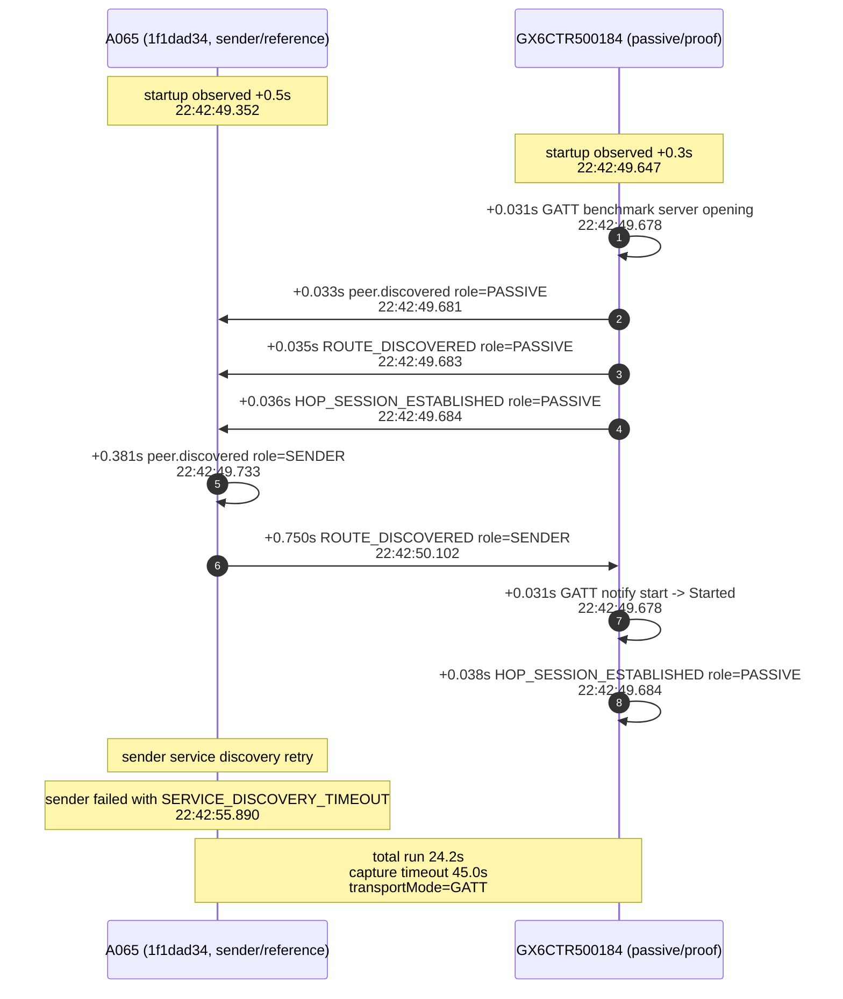

# Android direct-proof GX6 GATT pair sequence

Last verified: 2026-06-16

This note summarizes the latest attached-device pair tested in the Android direct-proof flow.

## Pair under test

- **First device (sender / reference app):** `A065` (`1f1dad34`)
- **Second device (passive / proof app):** `GX6CTR500184`
- **Observed transport mode:** `GATT`
- **Result:** route progression improved, but retained completion still did not arrive on this run

## Sequence diagram

## Timing summary

### Sender side (`A065`)

- Startup wait: **0.5s**
- Peer discovery: **0.381s** after startup
- Route discovery: **0.369s** after peer discovery
- Service discovery retry: **+1.506s** after route discovery
- Failure: **SERVICE_DISCOVERY_TIMEOUT**

### Passive side (`GX6CTR500184`)

- Startup wait: **0.3s**
- Passive peer discovery: **0.031s** after startup
- Passive route discovery: **0.002s** after peer discovery
- Passive hop established: **0.001s** after route discovery

## Outcome

The passive device reached the route stage quickly, but the sender-side GATT client never completed service discovery on this run. That kept the pair from reaching retained completion.
