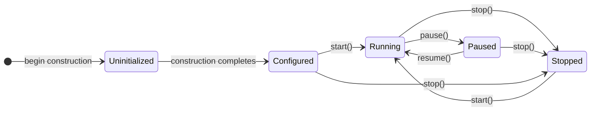
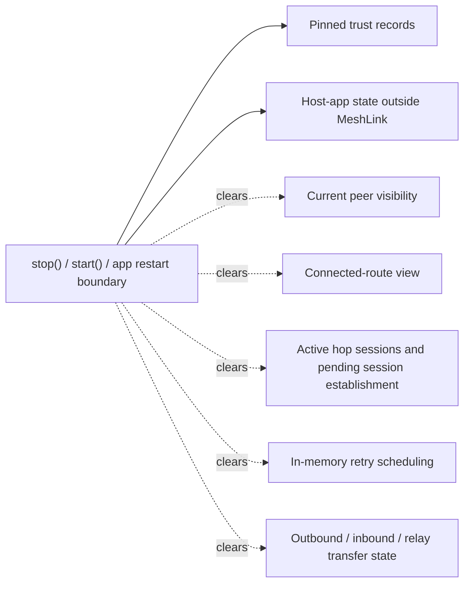
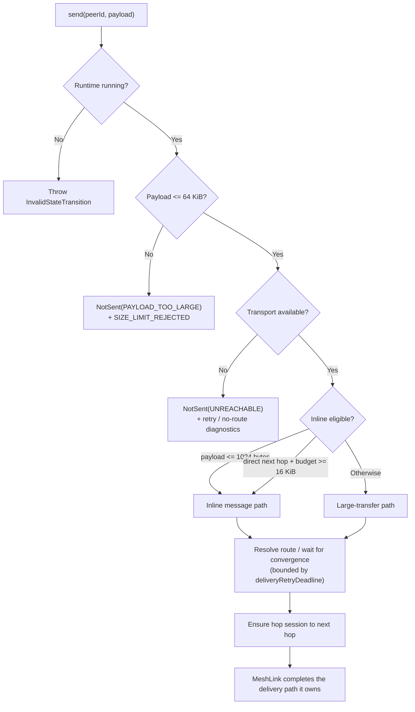

# MeshLink runtime behavior reference

This page describes MeshLink runtime semantics.

Use it when you need exact facts about:

- lifecycle boundaries
- stream behavior
- delivery-path selection
- persistence and trust-reset effects
- power-policy behavior
- operational limits

For setup steps, use
[How to integrate MeshLink into a host app](../how-to/integrate-meshlink-into-a-host-app.md).
For architecture and rationale, use
[About how MeshLink works](../explanation/about-how-meshlink-works.md).
For public types and signatures, use the
[MeshLink SDK API reference](meshlink-sdk-api.md).

## Quick lookup

| Need | Start here |
|---|---|
| lifecycle call validity and results | [Lifecycle transitions](#lifecycle-transitions) |
| what `pause()` or `stop()` clears | [Boundary effects](#boundary-effects) |
| whether streams replay | [Public stream semantics](#public-stream-semantics) |
| what persists across restart | [Persistence and volatility](#persistence-and-volatility) |
| how send-path choice works | [Send-path semantics](#send-path-semantics) |
| how trust and `forgetPeer()` behave | [Trust semantics](#trust-semantics) |
| how automatic power mode chooses a tier | [Power-policy semantics](#power-policy-semantics) |
| current limits and guarantees | [Operational limits and guarantees](#operational-limits-and-guarantees) |

## Runtime model

One constructed MeshLink runtime can span multiple hard runs.

A hard run begins on `start()` from `Configured` or `Stopped` and ends on
`stop()`.

## Lifecycle transitions

| Call | Valid starting state(s) | Success result | Other result(s) | Immediate runtime effects |
|---|---|---|---|---|
| `start()` | `Configured`, `Stopped` | `StartResult.Started` | `StartResult.AlreadyRunning` from `Running`; `StartResult.InvalidState(Paused)` from `Paused` | starts transport activity, starts a new hard run, emits `MESH_STARTED`, and applies the current power policy |
| `pause()` | `Running` | `PauseResult.Paused` | `PauseResult.AlreadyPaused` from `Paused`; `PauseResult.InvalidState(...)` from `Configured`, `Uninitialized`, or `Stopped` | pauses transport, stops transport event collection, clears the current volatile peer / route / pending-session view, and emits `MESH_PAUSED` |
| `resume()` | `Paused` | `ResumeResult.Resumed` | `ResumeResult.AlreadyRunning` from `Running`; `ResumeResult.InvalidState(...)` from `Configured`, `Uninitialized`, or `Stopped` | resumes transport inside the same hard run, refreshes the current power policy, and emits `MESH_RESUMED` |
| `stop()` | `Configured`, `Running`, `Paused` | `StopResult.Stopped` | `StopResult.AlreadyStopped` from `Stopped` | ends the current hard run, clears volatile runtime state, clears transfer state, and emits `MESH_STOPPED` |

## Boundary effects

| Area | Construction | `pause()` | `stop()` |
|---|---|---|---|
| Public lifecycle state | starts in `MeshLinkState.Uninitialized` during construction, then becomes `MeshLinkState.Configured` when construction completes | becomes `Paused` | becomes `Stopped` |
| Hard run | not started yet | remains active | ends |
| Transport activity | not started | paused | stopped |
| Transport event collector | not started | stopped | stopped |
| Discovery / peer collection | not started | current runtime view cleared | current runtime view cleared |
| Presence tracker | not started | cleared | cleared |
| Connected-route view | not started | cleared | cleared |
| Pending hop-session establishment | not started | completed as unreachable | completed as unreachable |
| Outbound / inbound / relay transfer maps | not started | retained | cleared |
| Committed local transfers | not started | not aborted by `pause()` | aborted with runtime-stopped semantics |
| Pinned trust | may be prepared or loaded | retained | retained |
| Public peer events | none yet | `PeerEvent.Lost` is emitted for peers removed from the current runtime view | `PeerEvent.Lost` is emitted for peers removed from the current runtime view |
| Lifecycle diagnostics | not emitted yet | emits `MESH_PAUSED` | emits `MESH_STOPPED` |
| Local identity preparation | may occur during construction | unchanged | unchanged |

## Runtime-gated waiting behavior

MeshLink gates retry and wait paths on the current hard run.

| Condition | Behavior |
|---|---|
| Runtime remains `Running` | waits and retry timers continue |
| Runtime enters `Paused` | active waits are interrupted and resume only after the runtime becomes `Running` again |
| Runtime ends its hard run | active waits terminate as hard-run ended |

`deliveryRetryDeadline` is measured against active running time. Paused time
does not continue the active wait budget.

## Public stream semantics

| Stream | Kind | Replay | Late-subscriber behavior | Notes |
|---|---|---:|---|---|
| `state` | `StateFlow<MeshLinkState>` | latest value only | new collectors receive the current state immediately | snapshot-oriented |
| `peerEvents` | hot `Flow<PeerEvent>` | none | collectors attached later can miss earlier peer events | event-oriented |
| `diagnosticEvents` | hot `Flow<DiagnosticEvent>` | none | collectors attached later can miss earlier diagnostics | bounded in-memory buffering; best-effort under backlog |
| `messages` | hot `Flow<InboundMessage>` | none | collectors attached later can miss earlier inbound messages | event-oriented |

### `PeerEvent` emission rules

| Condition | Emitted event |
|---|---|
| peer becomes visible to the current runtime view | `PeerEvent.Found(peerId, CONNECTED)` |
| already-visible peer becomes visible again without leaving the runtime view | `PeerEvent.StateChanged(peerId, CONNECTED)` |
| peer is removed from the current runtime view | `PeerEvent.Lost(peerId)` |

### `InboundMessage` delivery facts

| Field or behavior | Semantics |
|---|---|
| `originPeerId` | final sender identity carried through the MeshLink message envelope |
| `payload` | defensively copied on construction |
| `receivedAtEpochMillis` | records when MeshLink emitted the inbound message to the host app |
| `priority` | the delivery priority carried on the message |

## Persistence and volatility

## Send-path semantics

### Preconditions and delivery-mode selection

| Condition | Outcome |
|---|---|
| runtime state is not `Running` | `send()` throws `MeshLinkException.InvalidStateTransition` |
| payload size is greater than 64 KiB | returns `SendResult.NotSent(PAYLOAD_TOO_LARGE)` and emits `SIZE_LIMIT_REJECTED` |
| no transport is available | returns `SendResult.NotSent(UNREACHABLE)` and emits retry or no-route diagnostics |
| payload size is `<= 1024` bytes | inline message path |
| payload size is `> 1024` bytes and the next hop is the final destination and the transport delivery budget is at least `16 KiB` | inline message path |
| all other supported payloads | large-transfer path |

### Delivery-path facts

| Fact | Behavior |
|---|---|
| Maximum supported payload | `64 KiB` |
| Retry window | bounded by `deliveryRetryDeadline` |
| Retry persistence | in memory only |
| Retry survival across `stop()` or restart | does not survive |
| `SendResult.Sent` means | MeshLink completed the delivery path it owns |
| `SendResult.Sent` does not imply | remote app persistence, user visibility, read receipt, or application-level acknowledgement |

## Trust semantics

### Trust establishment and verification

| Condition | Behavior |
|---|---|
| first verified contact with a peer | MeshLink writes a trust record and emits `TRUST_ESTABLISHED` |
| later contact with the same verified keys | MeshLink refreshes `lastVerifiedAt` |
| later contact with different keys for the same trusted peer | MeshLink fails trust verification, emits `TRUST_FAILURE`, and does not overwrite the stored trust record |

### `forgetPeer(peerId)` effects

| Area | Behavior |
|---|---|
| persisted trust record for `peerId` | deleted |
| pending initiator handshake for `peerId` | completed as unreachable |
| route view for `peerId` | disconnected or retracted through routing mutation |
| presence view for `peerId` | removed if present |
| public peer events | `PeerEvent.Lost(peerId)` is emitted when the peer was visible |
| host-app data | unchanged unless the host app changes it |

## Power-policy semantics

### Requested modes

| `PowerMode` | Behavior |
|---|---|
| `Automatic` | MeshLink derives the effective tier from battery, charging state, bootstrap window, and tier history |
| `Performance` | MeshLink uses the performance tier |
| `Balanced` | MeshLink uses the balanced tier |
| `PowerSaver` | MeshLink uses the power-saver tier |

### Automatic-mode selection

| Input or condition | Effective behavior |
|---|---|
| runtime has just started and is still inside the bootstrap window | performance tier |
| device is charging | performance tier |
| battery level above `80%` with no higher-priority automatic override | performance tier |
| battery level below `30%` with no higher-priority automatic override | power-saver tier |
| battery level between those thresholds with no higher-priority automatic override | balanced tier |
| threshold oscillation near a boundary | hysteresis is applied to reduce tier flapping |

### Automatic-mode constants

| Constant | Value |
|---|---:|
| bootstrap duration | `30_000 ms` |
| performance threshold | `0.80` |
| power-saver threshold | `0.30` |
| hysteresis band | `0.02` |

### Tier profiles

| Tier | Advertisement interval | Connection interval | Scan duty cycle | Max connections | Chunk budget |
|---|---:|---:|---:|---:|---:|
| `PERFORMANCE` | `250 ms` | `100 ms` | `100%` | `7` | `4096 bytes` |
| `BALANCED` | `500 ms` | `250 ms` | `50%` | `5` | `2048 bytes` |
| `POWER_SAVER` | `1000 ms` | `500 ms` | `5%` | `3` | `512 bytes` |

### Regional clamps

| Region | Clamp |
|---|---|
| `EU` | advertisement interval is clamped to a minimum of `300 ms` |
| `EU` | scan duty cycle is clamped to a maximum of `70%` |

`POWER_MODE_CHANGED` diagnostics carry the effective values after clamping.

## Routing and relay facts

| Fact | Behavior |
|---|---|
| Route ownership | MeshLink resolves next-hop routing internally |
| Route diagnostics | route discovery, update, retraction, expiry, and convergence are emitted as diagnostics |
| Relay model | relays forward hop-by-hop while the application payload remains sealed end-to-end |
| Large relay transfer posture | cut-through forwarding is used when the next hop and transfer state permit it; full reassembly remains the fallback |

## Diagnostic categories

| Area | Representative codes |
|---|---|
| lifecycle | `MESH_STARTED`, `MESH_PAUSED`, `MESH_RESUMED`, `MESH_STOPPED` |
| trust and sessions | `TRUST_ESTABLISHED`, `TRUST_FAILURE`, `HOP_SESSION_ESTABLISHED`, `HOP_SESSION_FAILED` |
| routing | `ROUTE_DISCOVERED`, `ROUTE_UPDATED`, `ROUTE_RETRACTED`, `ROUTE_EXPIRED`, `ROUTE_CONVERGED`, `NO_ROUTE_AVAILABLE` |
| delivery and transfer | `DELIVERY_QUEUED`, `DELIVERY_RETRY_SCHEDULED`, `DELIVERY_RETRYING`, `DELIVERY_SUCCEEDED`, `DELIVERY_UNREACHABLE`, `TRANSFER_STARTED`, `TRANSFER_PROGRESS`, `TRANSFER_COMPLETED`, `TRANSFER_FAILED`, `SIZE_LIMIT_REJECTED` |
| transport and power | `TRANSPORT_MODE_CHANGED`, `POWER_MODE_CHANGED`, `TRANSPORT_FRAME_REJECTED` |

## Operational limits and guarantees

| Topic | Current behavior |
|---|---|
| public lifecycle parity | Android and iOS expose the same public states, events, diagnostics, and error categories |
| payload limit | `64 KiB` maximum |
| retry persistence | in memory only |
| transport selection ownership | MeshLink owns bearer, route, and next-hop selection behind one send contract |
| bearer posture | L2CAP is preferred when available; GATT stays enabled as a concurrent fallback/side bearer when supported |
| trust continuity | persisted locally; not replaced silently on mismatch |
| event replay | only `state` replays the latest value |
| malformed inbound frames | dropped and reported via `TRANSPORT_FRAME_REJECTED`; never crash the host app |

## Related docs

- [MeshLink SDK API reference](meshlink-sdk-api.md)
- [About how MeshLink works](../explanation/about-how-meshlink-works.md)
- [How to structure a robust MeshLink integration](../how-to/structure-a-robust-meshlink-integration.md)
- [The trust model](../explanation/trust-model.md)
- [Power management](../explanation/power-management.md)
