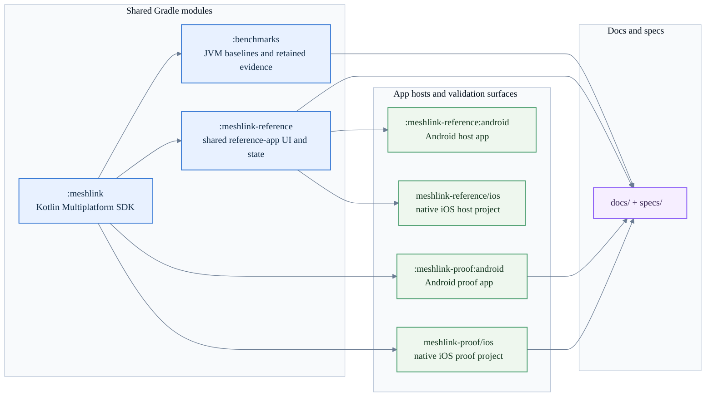

# MeshLink repository layout reference

This page describes the repository's modules, app hosts, source-set boundaries,
verification scripts, and documentation areas.

Use it to look up:

- which module owns shared SDK logic
- which module or host owns the reference app
- where the proof apps and benchmark harness live
- which scripts back documentation and physical validation
- where specs, RFCs, and contributor-facing docs are kept

For rationale and trade-offs, use
[About the repository architecture](../explanation/about-the-repository-architecture.md).
For contributor commands and verification bundles, use the
[Contributor build, test, and verification reference](contributor-reference.md).

## Quick lookup

| If you need to find... | Start here |
|---|---|
| the shipped SDK module | [Modules and app hosts](#modules-and-app-hosts) |
| the shared reference-app code | [Modules and app hosts](#modules-and-app-hosts) and [Shared source sets](#shared-source-sets) |
| the Android or iOS reference-app host | [Modules and app hosts](#modules-and-app-hosts) |
| the proof apps | [Modules and app hosts](#modules-and-app-hosts) |
| the benchmark harness | [Verification and automation scripts](#verification-and-automation-scripts) |
| contributor workflow scaffolding | [Contributor workflow scaffolding](#contributor-workflow-scaffolding) |
| the docs and spec areas | [Documentation and specification areas](#documentation-and-specification-areas) |
| the public SDK and reference-app entry points | [Platform entry points](#platform-entry-points) |

## Module relationship map

## Modules and app hosts

| Surface | Build shape | Internal dependencies | Primary concern |
|---|---|---|---|
| `:meshlink` | Kotlin Multiplatform library | none | Shared SDK code: public API, runtime engine, routing, trust, transfer, wire codecs, and platform abstractions |
| `:meshlink-reference` | Kotlin Multiplatform library | `:meshlink` | Shared reference-app shell, screens, session model, export logic, and automation support |
| `:meshlink-reference:android` | Android application module | `:meshlink-reference` | Android host application for the shared reference-app shell |
| `meshlink-reference/ios` | Native Xcode project | exported `MeshLinkReference` framework from `:meshlink-reference` | iOS host application, signing, simulator, device, and UI-test workflows |
| `meshlink-spm/` | Swift Package manifests | `:meshlink` XCFramework artifacts staged under `meshlink/build/swiftpm/` | SwiftPM local checkout and release binary-target packaging |
| `:meshlink-proof:android` | Android application module | `:meshlink` | Android proof and benchmark surface for physical validation |
| `meshlink-proof/ios` | Native Xcode project | exported `MeshLink` framework from `:meshlink` | iOS proof and benchmark surface for physical validation |
| `:benchmarks` | JVM benchmark module | `:meshlink` | Retained JVM performance baselines and benchmark tasks |

## Shared source sets

### `:meshlink`

| Source set | Main contents |
|---|---|
| `commonMain` | Public API, config DSL, diagnostics model, runtime engine, routing, trust, transfer, wire codecs, secure-storage abstraction, and transport contracts |
| `androidMain` | Android factory actuals, Android BLE transport, Android secure storage, and Android crypto provider glue |
| `iosMain` | iOS factory actuals, CoreBluetooth bridge glue, iOS secure storage, and iOS crypto provider glue |
| `jvmMain` | JVM factory actuals and JVM-side crypto or storage used by tests and benchmarks |
| `commonTest` | Shared protocol, routing, transfer, crypto, and public-surface tests |
| `androidHostTest` | Android-specific library tests |
| `iosTest` | iOS-specific library tests |
| `jvmTest` | Fast shared-library and codec tests on the JVM |

### `:meshlink-reference`

| Source set or host area | Main contents |
|---|---|
| `commonMain` | Compose shell, navigation, Guided first exchange, Advanced controls, Technical timeline, Recent history, export model, automation driver, live controller wrapper, and scripted controller wrapper |
| `androidMain` | Android platform-services factories, Android readiness guidance, and Android-specific host glue for the shared shell |
| `iosMain` | iOS platform-services factories and UIKit entry points for the shared shell |
| `commonTest` | Shared session-model, store, and UI-state tests |
| `androidHostTest` | Android-specific shared-module tests |
| `iosTest` | iOS-specific shared-module tests |
| `androidInstrumentedTest` | Shared-module Android instrumented tests |
| `android/src/main` | Android activity host and automation intent entry points |
| `android/src/androidTest` | Android host-app device tests |
| `ios/ReferenceApp` | Native iOS app wrapper around the shared Compose content |
| `ios/ReferenceAppTests` | iOS unit-test target |
| `ios/ReferenceAppUITests` | iOS UI-test target for the default self-validating workflow suite |
| `ios/ReferenceAppPhysicalUITests` | Dedicated iOS physical live-proof UI-test target kept out of the default scheme |

## Platform entry points

| Concern | Public or host-facing entry point | Notes |
|---|---|---|
| Shared SDK factory | `meshLink(config)` | Default factory on platforms that do not need extra bootstrap input |
| Android SDK factory | `meshLink(config, bootstrap)` + `meshLinkBootstrap(context)` | Android requires typed bootstrap input before factory creation |
| Reference app Android host | `MainActivity` in `:meshlink-reference:android` | Chooses normal, scripted-ui, or live-proof automation startup |
| Reference app iOS host | `createReferenceRootViewController()` / `createReferenceRootView()` | Wraps the shared Compose shell in UIKit containers |
| Reference app Android platform services | `createPlatformServices(...)` | Supplies Android bootstrap, storage, readiness guidance, and automation variants |
| Reference app iOS platform services | `createPlatformServices()` | Supplies iOS storage, readiness guidance, and automation variants |
| Android proof app host | Android proof `MainActivity` + `MeshLinkProofRuntime` | The activity stays a host surface; launch parsing, permission rules, benchmark framing, and runtime ownership live behind narrower proof-harness helpers. |
| iOS proof app host | `ProofApp` scheme + `ProofViewModel` | The view model stays host-facing while launch parsing, benchmark-only mode switching, and transport-log capture live behind narrower proof-harness helpers. |

## Verification and automation scripts

| Script or command surface | Purpose |
|---|---|
| `./gradlew verifyDocs` | Verifies markdown links and the rendered public-API appendix |
| `./scripts/run-reference-local-check.sh` | Runs the fast local reference-app verification bundle |
| `./scripts/run-agp9-verification.sh` | Runs AGP 9 invariant, cross-module build-shape verification, and the verified JVM smoke benchmark guard |
| `./gradlew verifyJvmSmokeBenchmarks` | Runs the JVM smoke benchmark suite and fails if any declared result is missing from the latest report |
| `scripts/check_agp9_invariants.py` | Checks the post-migration AGP 9 repository shape |
| `scripts/check_markdown_links.py` | Checks repository markdown relative links |
| `scripts/check_generated_public_api_reference.py` | Verifies the rendered public-API appendix stays in sync with the API dump |
| `meshlink-reference/scripts/run_headless_reference_live_proof.py` | Runs one headless physical guided proof for the reference app |
| `meshlink-reference/scripts/run_headless_reference_relay_proof.py` | Runs the constrained relay proof for the reference app |
| `meshlink-reference/scripts/run_headless_reference_physical_matrix.py` | Runs the broader physical reference-app matrix |
| `meshlink-reference/scripts/analyze_reference_physical_run.py` | Summarizes a retained physical reference-app run |
| `docs/reference/android-direct-proof-matrix-result.md` | Retains the canonical summary of the latest direct-proof matrix rerun |
| `benchmarks/scripts/run_headless_meshlink_benchmark.py` | Runs retained physical benchmark series |

## Contributor workflow scaffolding

| Area | Purpose |
|---|---|
| `AGENTS.md` | Agent-facing project instructions used by the repository's contributor automation workflows |
| `.agents` | Shared skill and reference corpus for agent-assisted maintenance; not used by the SDK or app runtime |
| ignored local workflow state | `.gsd/`, `.bg-shell/`, `.tmp-yamllint/`, `.specify/`, and `.pi/` are local workflow state and should stay untracked |

## Documentation and specification areas

| Area | Contents |
|---|---|
| `docs/tutorials` | Learning-oriented walkthroughs |
| `docs/how-to` | Goal-oriented task guides |
| `docs/reference` | Lookup-oriented SDK, runtime, contributor, and repository facts |
| `docs/explanation` | Architecture, rationale, and mental-model docs |
| `docs/tooling` | Build-tooling and migration docs |
| `docs/rfcs` | Retained protocol, routing, replay, compression, and crypto source material |
| `specs/ble-mesh-sdk` | Normative SDK spec, plan, tasks, research, and release framing |
| `meshlink-reference/README.md` | High-level reference-app overview |
| `meshlink-reference/fleet-test-history/` | Retained reference-app fleet history and campaign evidence bundles |
| `benchmarks/README.md` | Current retained benchmark posture |

## Related docs

- [Contributor build, test, and verification reference](contributor-reference.md)
- [About the repository architecture](../explanation/about-the-repository-architecture.md)
- [MeshLink documentation map](../README.md)
- [MeshLink reference app overview](../../meshlink-reference/README.md)
