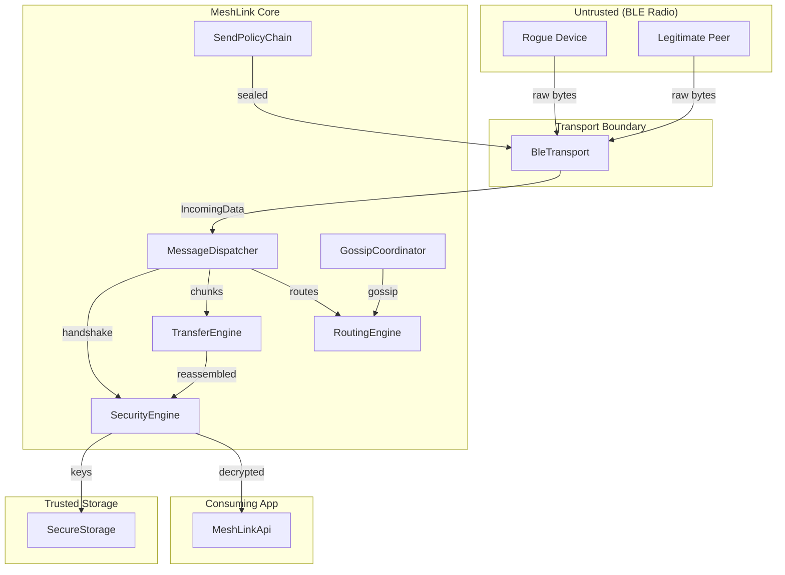

# MeshLink — Threat Model

> Updated: 2026-03-29 | Scope: Full repository | Branch: main

## Executive summary

All 10 identified threats have been mitigated (see [Remediation status](#remediation-status)).
The highest-risk category was **resource exhaustion via unauthenticated BLE
input** — an attacker within radio range could flood reassembly buffers,
exhaust deduplication state, or poison the routing table before completing a
handshake. These are now bounded by `maxConcurrentInboundSessions`, TTL-based
dedup, and mandatory route signing. Secondary risks (plaintext mode, weak PRNG,
broadcast amplification) are addressed by mandatory encryption, platform
CSPRNG, and `maxHops` capping. The cryptographic primitives are
well-implemented (constant-time operations, Noise protocol patterns,
RFC-validated).

---

## Scope and assumptions

### In-scope

- `meshlink/src/commonMain/` — shared protocol, crypto, routing, transport
- `meshlink/src/androidMain/` — Android BLE transport, secure storage
- `meshlink/src/appleMain/` — iOS/macOS BLE transport, Keychain storage
- `.github/workflows/` — CI/CD pipelines

### Out-of-scope

- `meshlink-sample/` — sample app (not shipped as library)
- `meshlink/src/commonTest/` — test infrastructure
- `docs/`, `README.md` — documentation (reviewed separately)

### Assumptions

| # | Assumption | Impact if wrong |
|---|-----------|-----------------|
| A1 | **Consumer app deployment** (festivals, hiking, chat) — casual attackers with off-the-shelf BLE hardware | If attacker is sophisticated (custom firmware, directional antenna), all proximity-based threats escalate |
| A2 | **Large mesh (100–500 peers)** — amplification and routing attacks are realistic | Smaller meshes reduce broadcast amplification severity |
| A3 | **Encryption should be mandatory** — plaintext mode is a vulnerability, not a feature | If plaintext is intentional, TM-002 downgrades to "medium" |
| A4 | **Library consumers follow integration guide** — configure rate limits, supply CryptoProvider | If defaults are used as-is, all rate-limiting gaps become critical |
| A5 | **No internet connectivity** — attack surface is BLE proximity only (~30–100m) | If bridged to internet (future feature), all threats escalate dramatically |

### Design decisions

- **No internet relay/bridging.** MeshLink is BLE-only by design. The threat surface is limited to Bluetooth radio proximity (~30–100m). If internet bridging is ever added, this threat model must be re-evaluated from scratch.
- **Configuration validation is enforced.** `MeshLinkConfig` validates all parameters at construction time (range checks, consistency constraints). See [API Reference § Configuration](api-reference.md#meshLinkConfig) for validation rules.

---

## System model

### Primary components

| Component | Type | Location | Role |
|-----------|------|----------|------|
| **MeshLink** | Orchestrator | `MeshLink.kt` (~830 lines) | Wiring layer connecting engines, coordinators, and transport |
| **SecurityEngine** | Stateful engine | `crypto/SecurityEngine.kt` | Noise XX/K seal/unseal, trust store, replay guard |
| **RoutingEngine** | Stateful engine | `routing/RoutingEngine.kt` | DSDV routing table, dedup, route cost validation |
| **TransferEngine** | Stateful engine | `transfer/TransferEngine.kt` | Chunking, reassembly, SACK, AIMD congestion control |
| **MessageDispatcher** | Policy chain | `dispatch/MessageDispatcher.kt` | Inbound frame decode, type dispatch, validation |
| **SendPolicyChain** | Policy chain | `send/SendPolicyChain.kt` | Outbound pre-flight checks (buffer, rate, circuit breaker) |
| **GossipCoordinator** | Orchestrator | `gossip/GossipCoordinator.kt` | Route advertisement, keepalive |
| **PeerConnectionCoordinator** | Orchestrator | `peer/PeerConnectionCoordinator.kt` | BLE discovery, handshake initiation |
| **BleTransport** | Platform I/O | `transport/BleTransport.kt` | BLE GATT + L2CAP I/O (Android/iOS implementations) |
| **SecureStorage** | Platform I/O | `storage/SecureStorage.kt` | Keychain (iOS) / Keystore (Android) key persistence |

### Data flows and trust boundaries

- **BLE Radio → BleTransport**: Raw bytes from any BLE device. No authentication, no encryption at this boundary. Channel: BLE GATT write / L2CAP CoC. Validation: none (type byte checked later in MessageDispatcher).

- **BleTransport → MessageDispatcher**: `IncomingData(peerId, data)` emitted via Kotlin Flow. Trust: peerId derived from BLE address only (spoofable). Rate limiting: none at this boundary.

- **MessageDispatcher → SecurityEngine**: Handshake messages dispatched for Noise XX processing. Broadcast/rotation messages dispatched for signature verification. Trust: signature verification occurs here. Validation: bounds checks on all wire format fields.

- **MessageDispatcher → TransferEngine**: Chunks dispatched for reassembly. Trust: no per-chunk authentication. Validation: sequence number bounds only.

- **SecurityEngine → SecureStorage**: Private keys persisted to platform secure storage. Trust: platform Keystore/Keychain. Encryption: AES-256-GCM (Android) / Keychain ACL (iOS).

- **GossipCoordinator → RoutingEngine**: Route updates from neighbors. Trust: optional signature verification. Validation: cost bounds, sequence number freshness, neighbor capacity cap.

- **MeshLink → Consuming App**: Decrypted messages, peer events, key changes emitted via Kotlin Flows. Trust: library → app boundary. Validation: none (app trusts library output).

#### Diagram

---

## Assets and security objectives

| Asset | Why it matters | Security objective |
|-------|---------------|-------------------|
| **Ed25519/X25519 private keys** | Identity and decryption capability; compromise enables impersonation and eavesdropping | Confidentiality, Integrity |
| **Plaintext message payloads** | User content (chat messages, files); privacy-critical | Confidentiality |
| **Routing table state** | Determines message delivery paths; poisoning enables blackhole/interception | Integrity, Availability |
| **Peer trust pins** | TOFI key bindings; tampering enables MITM | Integrity |
| **Reassembly buffers** | Memory resource; exhaustion causes DoS | Availability |
| **Deduplication state** | Prevents replay/amplification; exhaustion enables replay attacks | Integrity, Availability |
| **Replay counters** | Prevents message replay; reset/manipulation enables replay | Integrity |
| **Battery/power state** | Draining battery is a physical-world impact | Availability |

---

## Attacker model

### Capabilities

- **Physical proximity** (30–100m BLE range) with consumer BLE hardware (smartphone, Raspberry Pi)
- Can **advertise as a BLE peripheral** and **connect as a central** simultaneously
- Can **sniff BLE advertisements** (unencrypted discovery payloads)
- Can **send arbitrary bytes** to MeshLink GATT characteristics
- Can **join the mesh as a peer** (no invitation/enrollment required)
- Can **run multiple rogue peers** from a single device (multiple BLE addresses)
- Can observe **message timing and sizes** (traffic analysis)

### Non-capabilities

- Cannot break X25519/Ed25519/ChaCha20-Poly1305 (computationally infeasible)
- Cannot access device Keystore/Keychain without physical device compromise
- Cannot operate from outside BLE range (no internet bridge exists)
- Cannot modify firmware of legitimate peers' devices
- Cannot perform sustained attacks (casual attacker; limited time/motivation)

---

## Entry points and attack surfaces

| Surface | How reached | Trust boundary | Notes | Evidence |
|---------|------------|---------------|-------|----------|
| **BLE GATT write** | Any BLE device writes to GATT characteristic | Untrusted → Transport | No auth before accept | `BleTransport.kt` (Android:496, Apple:393) |
| **BLE advertisement** | Any device advertises matching UUID | Untrusted → Transport | 10-byte payload parsed without auth | `PeerConnectionCoordinator.kt` |
| **Chunk ingestion** | First byte = 0x03 in GATT write | Transport → TransferEngine | Creates reassembly state, no rate limit | `MessageDispatcher.kt:123` |
| **Route update** | First byte = 0x02 in GATT write | Transport → RoutingEngine | Signature optional | `MessageDispatcher.kt:91` |
| **Broadcast relay** | First byte = 0x00 in GATT write | Transport → all peers | Signature checked but relayed to all neighbors | `MessageDispatcher.kt:185` |
| **Handshake initiation** | First byte = 0x01 in GATT write | Transport → SecurityEngine | Rate limited (1/sec) but no peer pre-auth | `MessageDispatcher.kt:83` |
| **Rotation announcement** | First byte = 0x0A in GATT write | Transport → SecurityEngine | Signed by old key; no timestamp freshness check | `RotationAnnouncement.kt:91` |
| **Config defaults** | Consuming app uses `MeshLinkConfig()` | App → Library | All rate limits disabled by default | `MeshLinkConfig.kt:5-40` |

---

## Top abuse paths

**1. Memory exhaustion via chunk flooding**
Attacker → sends 1 chunk each for 100,000 different message IDs → TransferEngine creates 100,000 `InboundState` objects (no cap) → device runs out of memory → crash/DoS.

**2. Dedup state exhaustion → replay attack**
Attacker → sends 10,000 unique broadcast messages → DedupSet fills to capacity → attacker replays a previously-sent legitimate message → dedup cache has evicted it → message re-accepted and relayed as new.

**3. Routing table poisoning → traffic blackhole**
Attacker → completes Noise XX handshake (becomes trusted peer) → advertises cost=1.0 routes for all destinations → becomes preferred next-hop → drops all forwarded messages silently.

**4. Broadcast amplification in dense mesh**
Attacker → sends a signed broadcast with maxHops=255 → each of 500 peers relays to all neighbors → exponential message multiplication → network-wide bandwidth/battery exhaustion.

**5. Key generation weakness → identity prediction**
Attacker → knows platform uses `kotlin.random.Random` (not `SecureRandom`) → seeds the PRNG → predicts generated Ed25519/X25519 private keys → impersonates victim peer.

**6. Rotation announcement replay**
Attacker → captures a valid signed rotation announcement → replays it days later → peer re-pins old key (no timestamp freshness check) → attacker with old key can impersonate.

**7. Decryption failure silent fallback**
Attacker → sends garbled ciphertext to victim → `UnsealResult.Failed` returns raw bytes to app as "message" → app processes corrupted/attacker-controlled data as legitimate content.

**8. Exception message information leakage**
Attacker → triggers crypto edge case (e.g., malformed handshake) → exception message logged to DiagnosticSink → consuming app logs it → leaks internal class names, state, or partial key material.

---

## Threat model table

| ID | Threat source | Prerequisites | Threat action | Impact | Impacted assets | Existing controls (evidence) | Gaps | Recommended mitigations | Detection ideas | Likelihood | Impact severity | Priority |
|----|--------------|---------------|---------------|--------|-----------------|------------------------------|------|------------------------|-----------------|------------|-----------------|----------|
| TM-001 | Rogue BLE device | BLE proximity | Flood chunks with unique message IDs to exhaust reassembly memory | Device OOM, app crash | Reassembly buffers, availability | Stale sweep at 30s timeout (`TransferEngine.kt:123`) | No cap on concurrent sessions; no per-chunk rate limit | Add `maxConcurrentInboundSessions` config (default 100); rate limit chunks per peer | Monitor `inbound.size`; alert on >50 concurrent sessions | High — trivial to execute | High — app crash | **Critical** |
| TM-002 | Consuming app | None | Instantiate MeshLink without CryptoProvider | All messages sent/received in plaintext | Message payloads, trust pins | Encryption is opt-in (`MeshLink.kt:74`) | No enforcement or warning | Require `CryptoProvider` in constructor (remove nullable); or add `requireEncryption` config flag | Log warning at startup if crypto is null | High — default path | High — total privacy loss | **Critical** |
| TM-003 | Rogue BLE device | BLE proximity | Send 10,000+ unique message IDs to exhaust DedupSet, then replay legitimate messages | Duplicate message delivery, amplification | Dedup state, routing integrity | LRU eviction at capacity (`DedupSet.kt:20`); default 10,000 entries | Fixed capacity with LRU eviction enables targeted eviction | Use time-windowed dedup (TTL-based expiry); increase default capacity to 100,000 | Track dedup eviction rate; alert on >1,000 evictions/minute | Medium — requires sustained attack | Medium — duplicate delivery | **High** |
| TM-004 | Malicious peer | Completed handshake | Advertise false routes with low cost to become preferred next-hop, then drop traffic | Traffic blackhole for targeted peers | Routing table, message delivery | Cost bounds check (`RoutingTable.kt:36-39`); sequence number freshness; neighbor cap | No route authentication requirement; no reachability verification | Require cryptographic route signing; implement periodic next-hop reachability probes | Monitor delivery failure rate per next-hop; alert on sudden increase | Medium — requires joining mesh | High — silent message loss | **High** |
| TM-005 | Rogue BLE device | BLE proximity, large mesh | Send signed broadcast with maxHops=255 in 500-peer mesh | Exponential message multiplication, battery drain, bandwidth saturation | Battery, network availability | Dedup prevents re-relay of same message; hop limit per message | No rate limit on broadcast relay; maxHops defaults to 255 | Default maxHops to 10; add per-peer broadcast relay rate limit | Monitor broadcast relay count per interval; alert on >100/minute | Medium — needs large mesh | High — network-wide DoS | **High** |
| TM-006 | Platform PRNG weakness | Kotlin/Native or JVM without secure random | Predict `kotlin.random.Random` output to derive private keys | Full identity compromise, impersonation | Private keys, trust pins | Android BleTransport uses `SecureRandom` for peer ID (`BleTransport.kt:180`) | `Ed25519.kt:16` and `X25519.kt:26` use `kotlin.random.Random` — NOT cryptographically secure | Implement `expect fun secureRandomBytes(size: Int): ByteArray` with platform-specific `SecureRandom`/`SecRandomCopyBytes` | N/A — preventive only | Medium — platform-dependent | High — full identity compromise | **High** |
| TM-007 | Attacker with captured announcement | Previously captured valid rotation announcement | Replay rotation announcement to force peer to re-pin old key | Key rollback, potential impersonation with old key | Trust pins, peer identity | Signature verified by old key (`RotationAnnouncement.kt:135`) | No timestamp freshness check; no monotonic counter | Add timestamp validation (±30s window); persist last-seen rotation timestamp per peer | Log rotation events with timestamps; alert on rotation for recently-rotated peer | Low — requires prior capture | High — identity compromise | **Medium** |
| TM-008 | Rogue BLE device | BLE proximity | Send garbled ciphertext; decryption fails silently and returns raw bytes to app | App processes attacker-controlled data | Message integrity | Diagnostic event emitted (`MessageDispatcher.kt:364`) | `UnsealResult.Failed` returns `originalPayload` to app; `UnsealResult.TooShort` also falls through | Drop messages on decryption failure instead of returning raw bytes; add `wasDecrypted: Boolean` flag to `Message` | Monitor DECRYPTION_FAILED diagnostic rate | Medium — easy to send bad data | Medium — app-dependent impact | **Medium** |
| TM-009 | Rogue BLE device | BLE proximity | Trigger exception in crypto path; exception message leaked via DiagnosticSink | Internal state leakage (class names, partial state) | Implementation details | Exception handler emits `throwable.message` (`MeshLink.kt:312`) | Full exception message exposed | Sanitize exception messages in diagnostic handler; emit only error code and category | Review diagnostic logs for sensitive content | Low — requires triggering specific exception | Low — limited info value | **Low** |
| TM-010 | Malicious app code | Runs in same process | Enable `AndroidBleTransport.debugLogging = true` at runtime | BLE addresses and connection details logged to logcat | Peer metadata | Default is `false` (`BleTransport.kt:68`) | Public mutable companion object; any code in process can enable | Make `debugLogging` internal; gate on `BuildConfig.DEBUG` | N/A | Low — requires malicious code in same process | Low — only metadata, no payloads | **Low** |

---

## Criticality calibration

| Level | Definition for MeshLink | Examples |
|-------|------------------------|----------|
| **Critical** | Pre-authentication DoS or total privacy bypass achievable by any BLE device in proximity | TM-001 (memory exhaustion via unauthenticated chunks), TM-002 (plaintext fallback) |
| **High** | Authenticated peer can compromise routing integrity, amplify traffic, or identity weakness exists in crypto foundation | TM-004 (route poisoning), TM-005 (broadcast amplification), TM-006 (weak PRNG) |
| **Medium** | Requires sustained effort or specific preconditions; impact is partial data integrity loss or information leakage | TM-003 (dedup exhaustion), TM-007 (rotation replay), TM-008 (decryption fallback) |
| **Low** | Requires unlikely preconditions (same-process attacker, specific exception path); limited real-world impact | TM-009 (exception leakage), TM-010 (debug logging) |

---

## Remediation status

| ID | Status | Commit | Notes |
|----|--------|--------|-------|
| TM-001 | ✅ Mitigated | `fb1887b` | `maxConcurrentInboundSessions` config (default 100), `ChunkAcceptResult.Rejected` |
| TM-002 | ✅ Mitigated | See below | `requireEncryption = true` default; `start()` fails without `CryptoProvider` |
| TM-003 | ✅ Mitigated | `fb1887b` | TTL-based `DedupSet` with 300s expiry, capacity increased to 100K |
| TM-004 | ✅ Mitigated | See below | Unsigned routes rejected when crypto enabled; per-next-hop failure tracking with diagnostic alerts |
| TM-005 | ✅ Mitigated | `fb1887b` | Default `maxHops` reduced from 255 to 10 |
| TM-006 | ✅ Mitigated | `fb1887b` | `expect/actual secureRandomBytes()` with platform CSPRNG implementations |
| TM-007 | ✅ Mitigated | `47b40e8` | Rotation timestamp freshness (±30s window) and replay rejection |
| TM-008 | ✅ Mitigated | `fb1887b` | `unsealPayload()` returns null on failure; messages dropped |
| TM-009 | ✅ Mitigated | `fb1887b` | Diagnostic emits `throwable::class.simpleName` instead of message |
| TM-010 | ✅ Mitigated | `fb1887b` | `BleTransport.debugLogging` changed from `public` to `internal` |

---

## Quality checklist

- [x] All entry points covered (GATT write, advertisement, chunk, route, broadcast, handshake, rotation, config)
- [x] Each trust boundary represented (BLE→Transport, Transport→Dispatcher, Dispatcher→Engines, Engine→Storage, Library→App)
- [x] Runtime vs CI/dev separation (CI reviewed separately; test classes in commonTest excluded from threats)
- [x] User clarifications reflected (consumer deployment, encryption mandatory, large mesh)
- [x] Assumptions and open questions explicit (A1–A5 documented)
