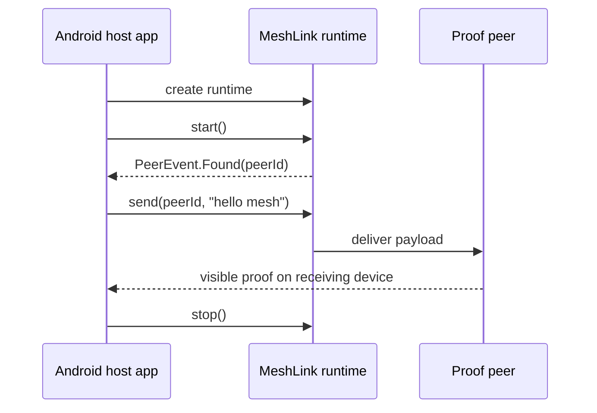

# Your first MeshLink exchange

In this tutorial, you will build a minimal Android host-side MeshLink
controller, discover a nearby proof peer, and send one message successfully.

This lesson stays intentionally narrow:

- it uses Android for the shortest path to a visible result
- it uses a proof app on a second device as the receiving proof peer
- it keeps that receiving proof peer in normal `meshlink` mode rather than the
  proof-only `gatt` or `gatt-notify` prototype modes

If you still need to add the library to your build, follow
[How to add MeshLink to your app](../how-to/add-meshlink-to-your-app.md).
If you need the broader Android and iOS bootstrap guidance afterward, follow
[How to integrate MeshLink into a host app](../how-to/integrate-meshlink-into-a-host-app.md).

## Before you start

You need:

- an Android app that can depend on MeshLink
- a second device you can use as the receiving proof peer
- the Android host app already has the permissions described in
  [How to unblock MeshLink permissions on Android and iOS](../how-to/unblock-meshlink-permissions.md)

### Pick the receiving proof peer once

For this tutorial, keep the second device simple.

| If your second device is... | Use... | Why |
|---|---|---|
| another Android device | [the Android proof app](../../meshlink-proof/android/README.md) in normal `meshlink` mode | shortest path and easiest manual setup |
| an iPhone | [the iOS proof app](../../meshlink-proof/ios/README.md) in normal `meshlink` mode | cross-platform first exchange without switching to product-like evaluation |
| a device where you want the full supported operator walkthrough instead | [the reference app guide](../how-to/evaluate-meshlink-with-the-reference-app.md) | different goal from this SDK tutorial |

For this lesson, keep these rules fixed:

- match the receiving proof peer `appId` to `com.example.meshlink.tutorial`
- keep the proof transport in `meshlink` mode
- do **not** use `gatt` or `gatt-notify` here; those are proof-only prototype
  modes for transport investigation, not for the first-success tutorial

You will create one small controller class and log the full flow.



## 1. Create the runtime

Create one long-lived MeshLink runtime for your app process:

```kotlin
import android.content.Context
import ch.trancee.meshlink.api.android.meshLinkBootstrap
import ch.trancee.meshlink.api.meshLink
import ch.trancee.meshlink.api.MeshLink
import ch.trancee.meshlink.config.MeshLinkConfig
import ch.trancee.meshlink.config.RegulatoryRegion
import ch.trancee.meshlink.config.meshLinkConfig

fun createMeshLink(context: Context): MeshLink {
    val config: MeshLinkConfig = meshLinkConfig {
        appId = "com.example.meshlink.tutorial"
        regulatoryRegion = RegulatoryRegion.DEFAULT
    }
    return meshLink(
        config = config,
        bootstrap = meshLinkBootstrap(context.applicationContext),
    )
}
```

At this point you have a runtime object, but it is not doing anything yet.

## 2. Add a tiny controller

Create a controller that:

- watches peers
- remembers the first discovered peer
- starts the runtime only after the collectors are attached

```kotlin
import ch.trancee.meshlink.api.MeshLink
import ch.trancee.meshlink.api.PeerEvent
import ch.trancee.meshlink.api.PeerId
import kotlinx.coroutines.CoroutineScope
import kotlinx.coroutines.Dispatchers
import kotlinx.coroutines.SupervisorJob
import kotlinx.coroutines.cancel
import kotlinx.coroutines.launch

class MeshLinkTutorialController(
    private val meshLink: MeshLink,
) {
    private val scope = CoroutineScope(SupervisorJob() + Dispatchers.Main.immediate)
    private var firstPeerId: PeerId? = null

    fun start() {
        scope.launch {
            meshLink.peerEvents.collect { event ->
                when (event) {
                    is PeerEvent.Found -> {
                        firstPeerId = event.peerId
                        println("Peer found: ${event.peerId.value}")
                    }
                    is PeerEvent.StateChanged -> {
                        println("Peer state changed: ${event.peerId.value} -> ${event.state}")
                    }
                    is PeerEvent.Lost -> {
                        println("Peer lost: ${event.peerId.value}")
                    }
                }
            }
        }

        scope.launch {
            meshLink.messages.collect { message ->
                println(
                    "Message from ${message.originPeerId.value}: ${message.payload.decodeToString()}"
                )
            }
        }

        scope.launch {
            println("start() -> ${meshLink.start()}")
        }
    }

    fun stop() {
        scope.launch {
            println("stop() -> ${meshLink.stop()}")
            scope.cancel()
        }
    }

    fun sendHello() {
        val peerId = firstPeerId ?: return
        scope.launch {
            val result = meshLink.send(peerId, "hello mesh".encodeToByteArray())
            println("sendHello() -> $result")
        }
    }
}
```

## 3. Wire it into your app and start it

Wire the controller into a screen, activity, or app-owned service and call
`start()`.

```kotlin
class MainViewModel(context: Context) {
    private val controller = MeshLinkTutorialController(createMeshLink(context))

    fun onStartMeshLink() {
        controller.start()
    }

    fun onStopMeshLink() {
        controller.stop()
    }

    fun onSendHello() {
        controller.sendHello()
    }
}
```

Expected first visible output:

```text
start() -> Started
```

## 4. Wait for a peer and send the first message

Launch the chosen proof peer on the second device with the same `appId` and
keep it in normal `meshlink` mode while you wait for discovery.

Use these tutorial-specific settings:

- tutorial host app `appId` → `com.example.meshlink.tutorial`
- Android proof peer → set `meshlink.appId=com.example.meshlink.tutorial`
  and leave `meshlink.benchmarkTransport=meshlink`
- iPhone proof peer → set `MESHLINK_APP_ID=com.example.meshlink.tutorial`
  and leave `MESHLINK_BENCHMARK_TRANSPORT` unset or `meshlink`

If you still need the concrete proof-peer launch steps, use the linked proof-app
guide for that device and then come back here once the peer is waiting.

Expected discovery output:

```text
Peer found: <peer-id>
```

Then call `sendHello()`.

Expected send output:

```text
sendHello() -> Sent
```

If discovery never happens, stop here and fix that first. If the missing piece
is still platform permission setup, use
[How to unblock MeshLink permissions on Android and iOS](../how-to/unblock-meshlink-permissions.md).

## 5. Verify on the receiving device and stop cleanly

On the proof peer, confirm that the message arrived. The visible result might be
a UI entry or a retained log line such as:

```text
MSG from ... text=hello mesh
```

If you see that result, the exchange worked.

Now stop the runtime.

Expected final output:

```text
stop() -> Stopped
```

## What you just learned

You now know how to:

- create a MeshLink runtime
- start and stop it
- observe peer discovery
- send a payload
- confirm visible success on a peer

Next:

- for broader bootstrap and platform setup, use
  [How to integrate MeshLink into a host app](../how-to/integrate-meshlink-into-a-host-app.md)
- for the complete public API, use the
  [MeshLink SDK API reference](../reference/meshlink-sdk-api.md)
- for design guidance and best practices, read
  [About integrating MeshLink well](../explanation/about-integrating-meshlink.md)
