# MeshLink Wire Format Specification

> **Canonical binary specification.** For design rationale and protocol context, see [design.md](design.md).

## Version

Protocol version: 1.0

## Overview

MeshLink uses a compact binary wire protocol designed for Bluetooth Low Energy
(BLE) mesh networking. Every framed message begins with a single **type byte**
(offset 0) that acts as the message discriminator. Separate from the framed
messages, the protocol defines a **16-byte BLE advertisement payload** and a
**5-byte Noise XX handshake payload**.

## Conventions

| Convention | Rule |
|---|---|
| **Byte ordering** | Varies per field — each field table states **BE** (big-endian / network order) or **LE** (little-endian). |
| **Type discriminator** | All framed messages share byte 0 as the type code. |
| **Sizes** | All sizes are in bytes unless stated otherwise. Multi-byte integers are unsigned unless noted. |
| **Key hashes** | Peer identifiers and visited-list entries are 12-byte values (truncated SHA-256, 96-bit collision resistance). |
| **Message IDs** | 16-byte random identifiers generated from platform CSPRNG (128-bit entropy). |
| **Signature blocks** | Ed25519 signatures are 64 bytes; Ed25519 public keys are 32 bytes. |

---

## BLE Advertisement Payload (16 bytes)

Broadcast as BLE service data in the scan response for peer discovery. Not
framed with a type byte — this is a standalone payload carried inside a
Service Data AD structure with the MeshLink 128-bit service UUID.

**Source:** `AdvertisementCodec.kt` · `SIZE = 16`

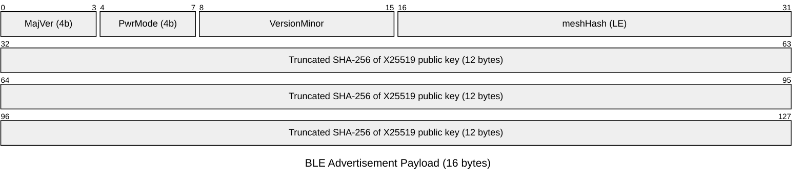

| Offset | Size | Field | Type | Endianness | Description |
|--------|------|-------|------|------------|-------------|
| 0 [7:4] | 4 bits | `versionMajor` | uint | — | Protocol major version (0–15). |
| 0 [3:0] | 4 bits | `powerMode` | uint | — | Power mode indicator (0–15). |
| 1 | 1 | `versionMinor` | uint8 | — | Protocol minor version (0–255). |
| 2–3 | 2 | `meshHash` | UShort | **LE** | 16-bit FNV-1a hash of `appId`. `0x0000` = no filtering (connects to all). |
| 4–15 | 12 | `keyHash` | bytes | — | First 12 bytes of `SHA-256(X25519_public_key)`. Identical to the 12-byte wire peer ID. |

**Encoding:** `byte0 = (versionMajor << 4) | powerMode`. Both nibble values are
clamped to their respective ranges via `coerceIn`.

**Decoding:** `versionMajor = byte0 >>> 4`, `powerMode = byte0 & 0x0F`.

**Mesh hash filtering:** Scanning peers compare the incoming `meshHash`
against their own. If both are nonzero and differ, the connection is skipped.
This eliminates cross-app processing at the BLE scan level.

See [design.md §3](design.md) for rationale on field sizes.

---

## Noise XX Handshake Payload (5 bytes)

Carried **inside** the Noise XX handshake messages for protocol version
negotiation and capability exchange. This is not a standalone framed message; it
is embedded in the `noiseMessage` field of a Handshake message (type `0x00`).

**Source:** `HandshakePayload.kt` · `SIZE = 5`

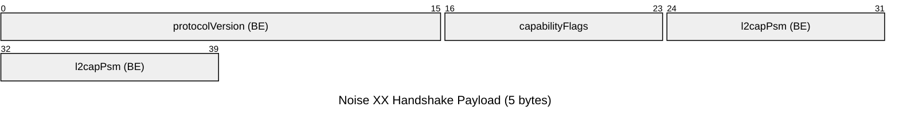

| Offset | Size | Field | Type | Endianness | Description |
|--------|------|-------|------|------------|-------------|
| 0–1 | 2 | `protocolVersion` | UShort | **BE** | Protocol version number. |
| 2 | 1 | `capabilityFlags` | UByte | — | Bitfield. Bit 0 (`0x01`) = L2CAP support (`CAP_L2CAP`). |
| 3–4 | 2 | `l2capPsm` | UShort | **BE** | L2CAP PSM value; `0` if L2CAP is not supported. |

---

## Message Types

All framed messages begin with a 1-byte type code at offset 0.

| Code | Name | Constant | Fixed Size | Description |
|------|------|----------|------------|-------------|
| `0x00` | Handshake | `TYPE_HANDSHAKE` | Variable (min 2) | Noise XX handshake step. |
| `0x01` | Keepalive | `TYPE_KEEPALIVE` | 12+ | Link liveness probe. Has [TLV extensions](#tlv-extension-area). |
| `0x02` | Rotation Announcement | `TYPE_ROTATION` | 201 | Key rotation broadcast. |
| `0x03` | Hello | `TYPE_HELLO` / `TYPE_ROUTE_REQUEST` | 15 | Babel Hello. Periodic neighbor liveness announcement with sender peer ID and sequence number. |
| `0x04` | Update | `TYPE_UPDATE` / `TYPE_ROUTE_REPLY` | 49 | Babel Update. Route propagation with destination, metric, sequence number, and public key. |
| `0x05` | Chunk | `TYPE_CHUNK` | Variable (min 19) | Fragment of a chunked transfer. First chunk (seq=0) has 21-byte header; subsequent chunks have 19-byte header. |
| `0x06` | Chunk ACK | `TYPE_CHUNK_ACK` | 27+ | Selective acknowledgment of chunks. Has [TLV extensions](#tlv-extension-area). |
| `0x07` | NACK | `TYPE_NACK` | 20+ | Negative acknowledgment with reason code. Has [TLV extensions](#tlv-extension-area). |
| `0x08` | Resume Request | `TYPE_RESUME_REQUEST` | 23+ | Request to resume a chunked transfer. Has [TLV extensions](#tlv-extension-area). |
| `0x09` | Broadcast | `TYPE_BROADCAST` | Variable (min 40) | Flood-fill broadcast to all nodes. |
| `0x0A` | Routed Message | `TYPE_ROUTED_MESSAGE` | Variable (min 52) | Unicast message forwarded along a route. Includes priority field. |
| `0x0B` | Delivery ACK | `TYPE_DELIVERY_ACK` | Variable (min 32) | End-to-end delivery confirmation. Has [TLV extensions](#tlv-extension-area). |

---

## TLV Extension Area

Five fixed/known-length message types support a trailing **TLV (Type-Length-Value)
extension area** for backward-compatible schema evolution. The extension area is
defined and parsed by `TlvCodec.kt`.

### Wire Layout

The extension area is appended immediately after the fixed body of a message:

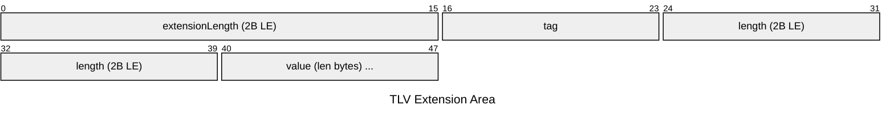

| Field | Size | Type | Endianness | Description |
|-------|------|------|------------|-------------|
| `extensionLength` | 2 | UShort | **LE** | Total bytes of TLV entries (0 = no extensions). |
| `tag` | 1 | UByte | — | Extension tag identifier. |
| `length` | 2 | UShort | **LE** | Byte length of `value`. |
| `value` | `length` | bytes | — | Extension data. |

### Tag Ranges

| Range | Purpose |
|-------|---------|
| `0x00`–`0x7F` | Reserved for protocol-defined extensions. |
| `0x80`–`0xFF` | Available for application use. |

### Messages with TLV Extensions

The following 5 message types include a TLV extension area after their fixed body:

| Message | Type Code | Fixed Body Size | Extension Area Follows |
|---------|-----------|-----------------|----------------------|
| Keepalive | `0x01` | 10 bytes | After byte 9 |
| Chunk ACK | `0x06` | 27 bytes | After byte 26 |
| NACK | `0x07` | 18 bytes | After byte 17 |
| Resume Request | `0x08` | 21 bytes | After byte 20 |
| Delivery ACK | `0x0B` | 30 bytes (+ optional 96-byte signature) | After body end |

### Messages WITHOUT TLV Extensions

| Message | Type Code | Reason |
|---------|-----------|--------|
| Handshake | `0x00` | Noise protocol opaque bytes — structure is not MeshLink-defined. |
| Rotation Announcement | `0x02` | Fixed 201-byte signed payload; adding extensions would invalidate the signature. |
| Hello | `0x03` | Fixed 15-byte message; no extensibility needed. |
| Update | `0x04` | Fixed 49-byte message; no extensibility needed. |
| Chunk | `0x05` | Variable-length payload at end. |
| Broadcast | `0x09` | Variable-length payload at end. |
| Routed Message | `0x0A` | Variable-length payload at end. |

### Forward Compatibility

- **Unknown tags are preserved**, not dropped. A decoder encountering an
  unrecognized tag includes it in the parsed extension list so callers can
  forward it to other peers unchanged.
- **Encoding:** New encoders always append the TLV area (minimum 2 bytes
  `0x00 0x00` when empty).
- **Decoding:** If `data.size > FIXED_SIZE`, the decoder parses trailing TLV
  extensions. If `data.size == FIXED_SIZE`, the message is treated as a legacy
  frame with no extensions (backward compatible with pre-TLV peers).

---

## Message Formats

### 0x09 — Broadcast

Flood-fill message propagated through the mesh. Optionally signed with Ed25519.

**Source:** `MessagingCodec.kt` · `BROADCAST_HEADER_SIZE = 40` (+ optional signature + payload)

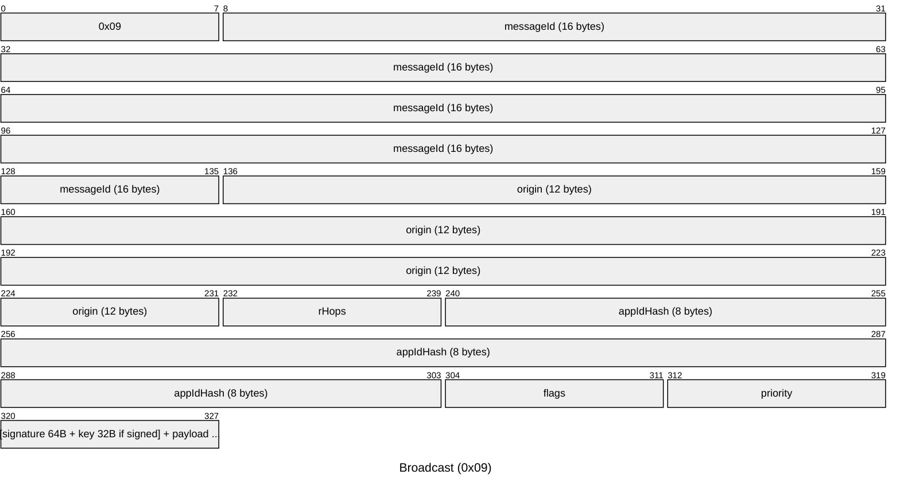

| Offset | Size | Field | Type | Endianness | Description |
|--------|------|-------|------|------------|-------------|
| 0 | 1 | `type` | byte | — | `0x09` |
| 1–16 | 16 | `messageId` | bytes | — | 16-byte random message identifier. |
| 17–28 | 12 | `origin` | bytes | — | Originator peer ID (truncated key hash). |
| 29 | 1 | `remainingHops` | UByte | — | TTL / remaining hop count. |
| 30–37 | 8 | `appIdHash` | bytes | — | Application identifier hash (zero-filled if unused). |
| 38 | 1 | `flags` | UByte | — | Bit 0: `HAS_SIGNATURE` (signature + signerPublicKey present). Bits 1–7: reserved. |
| 39 | 1 | `priority` | Byte (signed) | — | Message priority: `-1` = low, `0` = normal (default), `1` = high. |
| 40–103 | 64 | `signature` | bytes | — | Ed25519 signature (present only if `flags & 0x01`). |
| 104–135 | 32 | `signerPublicKey` | bytes | — | Ed25519 public key of signer (present only if `flags & 0x01`). |
| … | variable | `payload` | bytes | — | Application payload (remaining bytes). |

**Validation:**
- Minimum message size: 40 bytes (header with priority, `flags = 0x00`, empty payload).
- If `flags & 0x01`, the message must contain at least `40 + 64 + 32 = 136` bytes before the payload.

---

### 0x00 — Handshake

Wraps a single step of the Noise XX handshake protocol.

**Source:** `WireCodec.kt` · `HANDSHAKE_HEADER_SIZE = 2`

| Offset | Size | Field | Type | Endianness | Description |
|--------|------|-------|------|------------|-------------|
| 0 | 1 | `type` | byte | — | `0x00` |
| 1 | 1 | `step` | UByte | — | Handshake step: `0`, `1`, or `2`. |
| 2–N | variable | `noiseMessage` | bytes | — | Noise protocol message for this step. |

**Validation:**
- `step` must be `0`, `1`, or `2`.
- Minimum message size: 2 bytes.

**Noise XX Handshake Payload (embedded in `noiseMessage`):**

See [Noise XX Handshake Payload](#noise-xx-handshake-payload-5-bytes) above for
the 5-byte payload carried inside the Noise framework messages.

---

### 0x03 — Hello (Babel)

Periodic neighbor liveness announcement. Each peer sends Hello messages to
all direct neighbors at the keepalive interval (per power mode). When a
neighbor receives a Hello from a **new** peer, it responds with its full
routing table as a batch of Update messages.

**Source:** `RoutingCodec.kt` · Fixed size: **15 bytes**

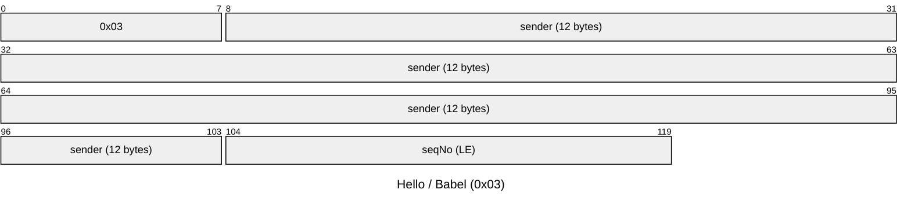

| Offset | Size | Field | Type | Endianness | Description |
|--------|------|-------|------|------------|-------------|
| 0 | 1 | `type` | byte | — | `0x03` |
| 1–12 | 12 | `sender` | bytes | — | Peer ID of the sender. |
| 13–14 | 2 | `seqNo` | UShort | **LE** | Sender's current sequence number. |

**Validation:**
- Minimum size: 15 bytes.

---

### 0x04 — Update (Babel)

Route advertisement carrying a destination, metric, sequence number, and
the destination's 32-byte Ed25519 public key (key propagation). Sent in
response to a Hello from a new neighbor, or periodically as a full routing
table dump (every 4× Hello interval).

An Update with `metric = 0xFFFF` is a **route retraction** (destination
unreachable).

**Source:** `RoutingCodec.kt` · Fixed size: **49 bytes**

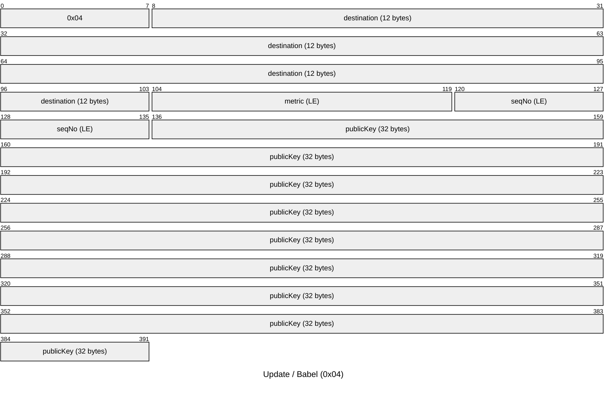

| Offset | Size | Field | Type | Endianness | Description |
|--------|------|-------|------|------------|-------------|
| 0 | 1 | `type` | byte | — | `0x04` |
| 1–12 | 12 | `destination` | bytes | — | Peer ID of the route destination. |
| 13–14 | 2 | `metric` | UShort | **LE** | Route metric (composite cost). `0xFFFF` = unreachable (retraction). |
| 15–16 | 2 | `seqNo` | UShort | **LE** | Route sequence number for freshness. |
| 17–48 | 32 | `publicKey` | bytes | — | Destination's Ed25519 public key. |

**Validation:**
- Minimum size: 49 bytes.
- `publicKey` must be 32 bytes.

---

### 0x05 — Chunk

Fragment of a chunked (multi-part) message transfer. The first chunk
(`sequenceNumber = 0`) carries the `totalChunks` field; subsequent chunks omit
it, saving 2 bytes per chunk.

**Source:** `WireCodec.kt` · `CHUNK_HEADER_SIZE_FIRST = 21`, `CHUNK_HEADER_SIZE_SUBSEQUENT = 19`

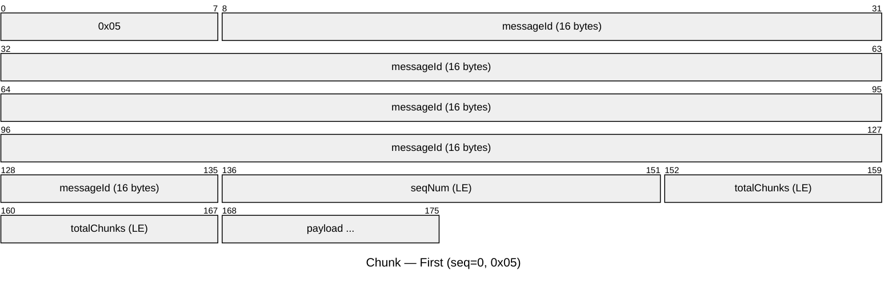

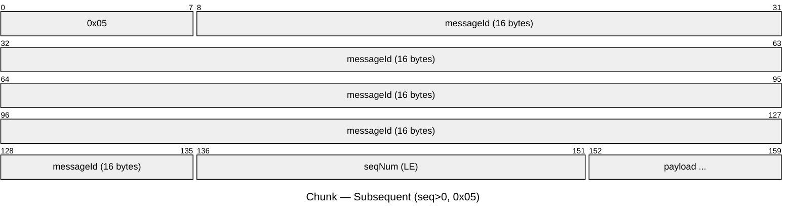

| Offset | Size | Field | Type | Endianness | Description |
|--------|------|-------|------|------------|-------------|
| 0 | 1 | `type` | byte | — | `0x05` |
| 1–16 | 16 | `messageId` | bytes | — | Identifies the overall message this chunk belongs to (16-byte random). |
| 17–18 | 2 | `sequenceNumber` | UShort | **LE** | Zero-based chunk index. |
| 19–20 | 2 | `totalChunks` | UShort | **LE** | Total number of chunks in this message. **Present only when `sequenceNumber = 0`.** |
| 19 or 21 | variable | `payload` | bytes | — | Chunk payload data. Starts at offset 21 for first chunk, offset 19 for subsequent chunks. |

**Validation:**
- When `sequenceNumber = 0`: `totalChunks` must be present and `sequenceNumber < totalChunks`.
- Minimum message size: 21 bytes for first chunk, 19 bytes for subsequent chunks.
- The receiver must store `totalChunks` from the first chunk and use it for all subsequent chunks of the same transfer.

---

### 0x06 — Chunk ACK

Selective acknowledgment for a chunked transfer, using a cumulative ACK
sequence number plus a 64-bit SACK bitmask for
out-of-order reception. Covers up to 64 chunks beyond `ackSequence`.

**Source:** `ChunkCodec.kt` · `CHUNK_ACK_SIZE = 27` (+ TLV extension area)

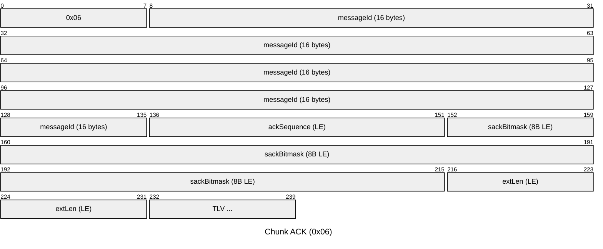

| Offset | Size | Field | Type | Endianness | Description |
|--------|------|-------|------|------------|-------------|
| 0 | 1 | `type` | byte | — | `0x06` |
| 1–16 | 16 | `messageId` | bytes | — | Message ID being acknowledged. |
| 17–18 | 2 | `ackSequence` | UShort | **LE** | Cumulative ACK: all chunks up to this number received. |
| 19–26 | 8 | `sackBitmask` | ULong | **LE** | 64-bit SACK for chunks at offsets 0–63 beyond `ackSequence`. |
| 27… | 2+ | `extensions` | [TLV](#tlv-extension-area) | **LE** | TLV extension area (minimum 2 bytes). |

**Minimum size:** 29 bytes (27-byte fixed body + 2-byte empty extension area).

---

### 0x0A — Routed Message

Unicast message forwarded hop-by-hop along a computed route. Includes a visited
list for loop detection.

**Source:** `MessagingCodec.kt` · `ROUTED_HEADER_SIZE = 52`

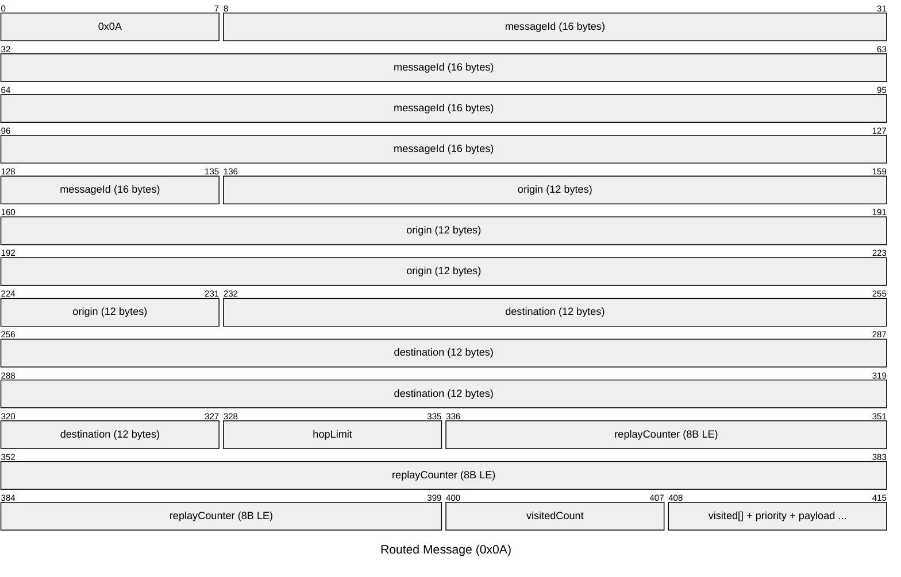

| Offset | Size | Field | Type | Endianness | Description |
|--------|------|-------|------|------------|-------------|
| 0 | 1 | `type` | byte | — | `0x0A` |
| 1–16 | 16 | `messageId` | bytes | — | 16-byte random message identifier. |
| 17–28 | 12 | `origin` | bytes | — | Originator peer ID (truncated SHA-256). |
| 29–40 | 12 | `destination` | bytes | — | Destination peer ID (truncated SHA-256). |
| 41 | 1 | `hopLimit` | UByte | — | Maximum remaining hops. |
| 42–49 | 8 | `replayCounter` | ULong | **LE** | Monotonic counter for replay protection. Default `0`. |
| 50 | 1 | `visitedCount` | UByte | — | Number of visited-list entries (0–255). |
| 51… | `vCnt × 12` | `visitedList` | bytes | — | 12-byte peer IDs already visited (loop detection). |
| … | 1 | `priority` | Byte (signed) | — | Message priority: `-1` = low, `0` = normal (default), `1` = high. |
| … | variable | `payload` | bytes | — | Application payload (remaining bytes). |

**Validation:**
- Minimum message size: 52 bytes (zero visited entries, empty payload, includes priority byte).
- `visitedCount` entries must fit within the remaining data.

---

### 0x0B — Delivery ACK

End-to-end delivery confirmation, optionally signed for non-repudiation.

**Source:** `WireCodec.kt` · `DELIVERY_ACK_HEADER_SIZE = 30` (+ optional signature + TLV extension area)

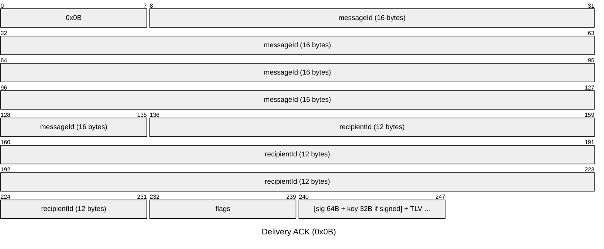

| Offset | Size | Field | Type | Endianness | Description |
|--------|------|-------|------|------------|-------------|
| 0 | 1 | `type` | byte | — | `0x0B` |
| 1–16 | 16 | `messageId` | bytes | — | ID of the message being acknowledged. |
| 17–28 | 12 | `recipientId` | bytes | — | Peer ID of the recipient confirming delivery. |
| 29 | 1 | `flags` | UByte | — | Bit 0: `HAS_SIGNATURE`. Bits 1–7: reserved. |
| 30–93 | 64 | `signature` | bytes | — | Ed25519 signature (present only if `flags & 0x01`). |
| 94–125 | 32 | `signerPublicKey` | bytes | — | Ed25519 public key (present only if `flags & 0x01`). |
| … | 2+ | `extensions` | [TLV](#tlv-extension-area) | **LE** | TLV extension area (minimum 2 bytes). Starts at offset 30 (unsigned) or 126 (signed). |

**Validation:**
- Minimum message size: 32 bytes (30-byte header + 2-byte empty extension area).
- If `flags & 0x01`, message must contain at least `30 + 64 + 32 + 2 = 128` bytes.

---

### 0x08 — Resume Request

Requests resumption of an interrupted chunked transfer, indicating how many
bytes have already been received.

**Source:** `WireCodec.kt` · `RESUME_REQUEST_SIZE = 21` (+ TLV extension area)

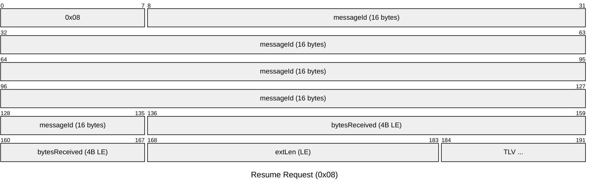

| Offset | Size | Field | Type | Endianness | Description |
|--------|------|-------|------|------------|-------------|
| 0 | 1 | `type` | byte | — | `0x08` |
| 1–16 | 16 | `messageId` | bytes | — | ID of the message to resume. |
| 17–20 | 4 | `bytesReceived` | UInt | **LE** | Number of bytes already received. |
| 21… | 2+ | `extensions` | [TLV](#tlv-extension-area) | **LE** | TLV extension area (minimum 2 bytes). |

**Minimum size:** 23 bytes (21-byte fixed body + 2-byte empty extension area).

---

### 0x01 — Keepalive

Lightweight link liveness probe with a timestamp and optional flags.

**Source:** `WireCodec.kt` · `KEEPALIVE_SIZE = 10` (+ TLV extension area)

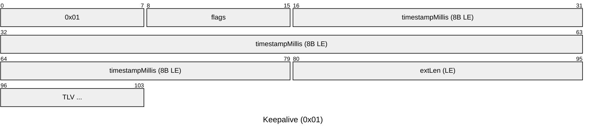

| Offset | Size | Field | Type | Endianness | Description |
|--------|------|-------|------|------------|-------------|
| 0 | 1 | `type` | byte | — | `0x01` |
| 1 | 1 | `flags` | UByte | — | Reserved flags. Default `0x00`. |
| 2–9 | 8 | `timestampMillis` | ULong | **LE** | Unix timestamp in milliseconds. |
| 10… | 2+ | `extensions` | [TLV](#tlv-extension-area) | **LE** | TLV extension area (minimum 2 bytes). |

**Minimum size:** 12 bytes (10-byte fixed body + 2-byte empty extension area).

---

### 0x07 — NACK

Negative acknowledgment indicating that a message could not be delivered or
processed. Includes a reason code so the sender can distinguish failure modes.

**Source:** `WireCodec.kt` · `NACK_SIZE = 18` (+ TLV extension area)

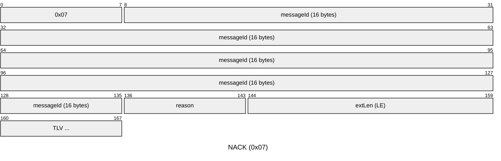

| Offset | Size | Field | Type | Endianness | Description |
|--------|------|-------|------|------------|-------------|
| 0 | 1 | `type` | byte | — | `0x07` |
| 1–16 | 16 | `messageId` | bytes | — | ID of the message being negatively acknowledged. |
| 17 | 1 | `reason` | UByte | — | Reason code: `0` = unknown, `1` = buffer full, `2` = unknown destination, `3` = decryption failed, `4` = rate limited. |
| 18… | 2+ | `extensions` | [TLV](#tlv-extension-area) | **LE** | TLV extension area (minimum 2 bytes). |

**Minimum size:** 20 bytes (18-byte fixed body + 2-byte empty extension area).

---

### 0x02 — Rotation Announcement

Announces a key rotation event. The old identity signs the announcement to prove
the transition is authorized.

**Source:** `RotationAnnouncement.kt` · `SIZE = 201`

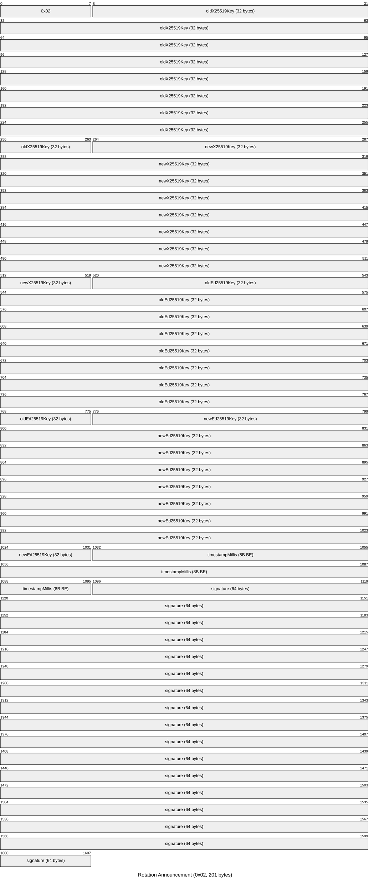

| Offset | Size | Field | Type | Endianness | Description |
|--------|------|-------|------|------------|-------------|
| 0 | 1 | `type` | byte | — | `0x02` |
| 1–32 | 32 | `oldX25519Key` | bytes | — | Previous X25519 (Diffie-Hellman) public key. |
| 33–64 | 32 | `newX25519Key` | bytes | — | New X25519 public key. |
| 65–96 | 32 | `oldEd25519Key` | bytes | — | Previous Ed25519 (signing) public key. |
| 97–128 | 32 | `newEd25519Key` | bytes | — | New Ed25519 public key. |
| 129–136 | 8 | `timestampMillis` | ULong | **BE** | Rotation timestamp in milliseconds since Unix epoch. |
| 137–200 | 64 | `signature` | bytes | — | Ed25519 signature over bytes 1–136 (the signable payload). |

**Signable payload:** bytes 1–136 of the wire format (4 keys + timestamp, 136
bytes total), excluding the type byte and the signature itself.

**Signature verification:** The signature is produced and verified using the
**old** Ed25519 key (`oldEd25519Key`), proving that the holder of the previous
identity authorized the rotation.

**Fixed size:** 201 bytes.

---

## Reserved Type Codes

Type codes `0x0C`–`0xFF` are **reserved** for future use. Implementations
receiving a message with a reserved type code must drop the message and emit an
`UNKNOWN_MESSAGE_TYPE` diagnostic.

---

## Compression Envelope (Inside Encrypted Payload)

The compression envelope is **not** a wire-level message type — it sits
**inside** the encrypted payload of Routed Messages (type `0x0A`). Compression
is applied **before** encryption (`compress → encrypt` on send;
`decrypt → decompress` on receive) and is therefore transparent to relays and
the wire format byte tables above.

When `compressionEnabled = true` (the default), every payload is wrapped in a
1-byte envelope prefix that signals whether the content is compressed:

### Uncompressed Envelope (`0x00`)

Used when the payload size is below `compressionMinBytes` (default 128) or when
compression did not reduce the payload size.

| Offset | Size | Field | Type | Endianness | Description |
|--------|------|-------|------|------------|-------------|
| 0 | 1 | `envelopeType` | byte | — | `0x00` — payload is uncompressed. |
| 1… | variable | `payload` | bytes | — | Original uncompressed payload. |

### Compressed Envelope (`0x01`)

Used when the payload is ≥ `compressionMinBytes` and DEFLATE reduces its size.

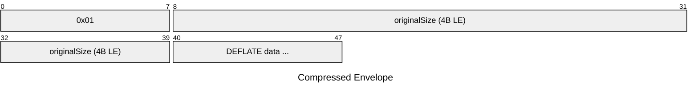

| Offset | Size | Field | Type | Endianness | Description |
|--------|------|-------|------|------------|-------------|
| 0 | 1 | `envelopeType` | byte | — | `0x01` — payload is DEFLATE-compressed. |
| 1–4 | 4 | `originalSize` | UInt | **LE** | Original uncompressed payload size in bytes. |
| 5… | variable | `compressedData` | bytes | — | Raw DEFLATE (RFC 1951) compressed payload. |

### Padded Envelope (`0x02`)

Used when `paddingBlockSize > 0`. Wraps the inner envelope (compressed or
uncompressed) with a 2-byte LE size prefix and zero-pads to the next block
boundary. Applied after compression, before E2E encryption.

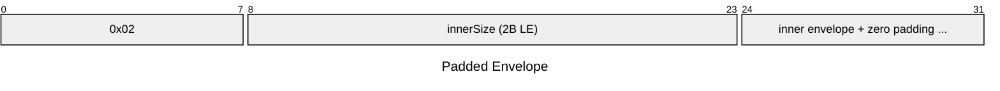

| Offset | Size | Field | Type | Endianness | Description |
|--------|------|-------|------|------------|-------------|
| 0 | 1 | `envelopeType` | byte | — | `0x02` — payload is padded. |
| 1–2 | 2 | `innerSize` | UShort | **LE** | Byte length of the inner envelope (max 65535). |
| 3… | `innerSize` | `inner` | bytes | — | Inner envelope (`0x00` uncompressed or `0x01` compressed). |
| 3+innerSize… | variable | `padding` | bytes | — | Zero bytes padding to the next `paddingBlockSize` boundary. |

**Total size:** `ceil((3 + innerSize) / paddingBlockSize) * paddingBlockSize`.

### Backward Compatibility

When `compressionEnabled = false`, no envelope is added — the payload is the
raw application data, identical to pre-compression protocol behavior. Peers
that do not support compression will not encounter the envelope prefix because
the envelope is inside the E2E encrypted payload and only visible after
decryption by peers running the compression-aware version.

---

## Security Considerations

### Ed25519 Signatures

- **Broadcast** and **Delivery ACK** messages support optional Ed25519
  signatures. When present, the signature block contains the 64-byte signature
  followed by the 32-byte signer public key.
- **Rotation Announcement** messages are always signed by the old Ed25519 key
  to authorize key transitions.

### Noise XX Handshake

The Handshake message (type `0x00`) wraps the Noise XX protocol, which provides:

- Mutual authentication of both peers.
- Forward secrecy via ephemeral Diffie-Hellman key exchange.
- Encrypted transport after the 3-step handshake completes (steps 0, 1, 2).

The 5-byte `HandshakePayload` embedded within Noise messages enables protocol
version negotiation and capability exchange (e.g., L2CAP support).

### Replay Protection

- **Routed Messages** include an 8-byte `replayCounter` (little-endian ULong)
  that should be monotonically increasing per origin. Receivers should reject
  messages with a replay counter at or below the last accepted value.
- **Rotation Announcements** include a `timestampMillis` field that can be used to
  reject stale announcements.

### Loop Detection

- **Routed Messages** maintain a `visitedList` of peer IDs (up to 255 entries)
  that have forwarded the message. Nodes must not forward a message if their own
  ID appears in the visited list.

### Key Identity

- Peer identity is derived from the **first 12 bytes of SHA-256(X25519 public
  key)** in BLE advertisements (see Advertisement Payload).
- Framed messages use **12-byte** truncated key hashes as peer identifiers.

---

## Appendix: Byte-Order Helper Functions

The wire codec uses the following byte-ordering utilities. Both big-endian and
little-endian helpers are used depending on the field.

### Big-Endian (Network Order)

Used for: Rotation `timestampMillis`, Handshake
payload fields.

| Function | Width | Description |
|----------|-------|-------------|
| `putUIntBE(offset, value)` | 4 bytes | Writes a `UInt` in big-endian order: MSB at `offset`. |
| `getUIntBE(offset)` | 4 bytes | Reads a `UInt` in big-endian order. |
| `putULongBE(offset, value)` | 8 bytes | Writes a `ULong` in big-endian order (Rotation Announcement). |
| `getULongBE(offset)` | 8 bytes | Reads a `ULong` in big-endian order. |

### Little-Endian

Used for: Chunk `sequenceNumber`/`totalChunks`, Chunk ACK `ackSequence`/
`sackBitmask`, Routed Message `replayCounter`,
Route Request/Reply `requestId`, Resume
Request `bytesReceived`, Keepalive `timestampMillis`.

| Function | Width | Description |
|----------|-------|-------------|
| `putUShortLE(offset, value)` | 2 bytes | Writes a `UShort` in little-endian order: LSB at `offset`. |
| `getUShortLE(offset)` | 2 bytes | Reads a `UShort` in little-endian order. |
| `putUIntLE(offset, value)` | 4 bytes | Writes a `UInt` in little-endian order. |
| `getUIntLE(offset)` | 4 bytes | Reads a `UInt` in little-endian order. |
| `putULongLE(offset, value)` | 8 bytes | Writes a `ULong` in little-endian order. |
| `getULongLE(offset)` | 8 bytes | Reads a `ULong` in little-endian order. |
| `putDoubleBitsLE(offset, value)` | 8 bytes | Writes an IEEE 754 `Double` as raw bits in little-endian order. |
| `getDoubleBitsLE(offset)` | 8 bytes | Reads an IEEE 754 `Double` from raw bits in little-endian order. |

---

## Appendix: Endianness Summary

Quick reference for the byte order of every multi-byte field in the protocol.

| Message | Field | Width | Endianness |
|---------|-------|-------|------------|
| Advertisement | `versionMajor` / `powerMode` | 4+4 bits | N/A (bit fields) |
| Handshake Payload | `protocolVersion` | 2 | **BE** |
| Handshake Payload | `l2capPsm` | 2 | **BE** |
| Chunk | `sequenceNumber` | 2 | **LE** |
| Chunk | `totalChunks` | 2 | **LE** (seq=0 only) |
| Chunk ACK | `ackSequence` | 2 | **LE** |
| Chunk ACK | `sackBitmask` | 8 | **LE** |
| Routed Message | `replayCounter` | 8 | **LE** |
| Route Request | `requestId` | 4 | **LE** |
| Route Reply | `requestId` | 4 | **LE** |
| Resume Request | `bytesReceived` | 4 | **LE** |
| Keepalive | `timestampMillis` | 8 | **LE** |
| Rotation | `timestampMillis` | 8 | **BE** |
| TLV Extension Area | `extensionLength` | 2 | **LE** |
| TLV Entry | `length` | 2 | **LE** |
