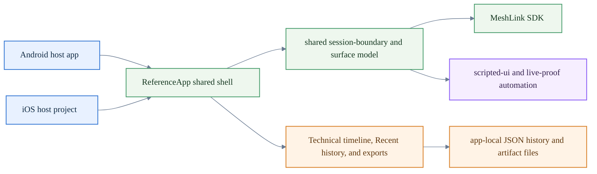

# MeshLink reference app

Use this app when you want to evaluate MeshLink as a product-like experience,
not just as a proof harness.

## Who this app is for

The reference app is designed for:

- SDK evaluators who want a **Guided first exchange**
- integrators who want to inspect the live control surface
- QA and support engineers who want diagnostics, retained session history, and
  exportable evidence
- reviewers who need the same named experience on Android and iOS

## What the app shows

The reference app is organized into clearly separated surfaces:

- **Guided first exchange** — the fastest path to a first offline message proof
- **Solo exploration** — a non-authoritative walkthrough when only one device
  is available
- **Advanced controls** — the richer runtime control surface for technical
  reviewers
- **Technical timeline** — lifecycle, peer, diagnostic, message, and transfer
  events in one place
- **Recent history** — retained sessions kept separate from the live run
- **Lab** — proof-only and benchmark-only behavior isolated from the supported
  product path

## Which surface to open first

| If you want to... | Open... |
|---|---|
| get one supported first proof on two devices | **Guided first exchange** |
| inspect runtime state and send controls in more detail | **Advanced controls** |
| review live evidence, end the session, or export | **Technical timeline** |
| reopen a retained session after the live run ends | **Recent history** |
| walk the app on one device without claiming physical proof | **Solo exploration** |
| keep proof-only or benchmark-only behavior out of the supported path | **Lab** |

## How the shared app is wired



The Android app module and the iOS host project both mount the same shared
Compose shell. Session boundaries, **Recent history**, export policy, and
automation live in shared code. Platform code mainly supplies bootstrap,
storage location, readiness blockers, and the native host entry points.

For the deeper contributor view, use the
[Repository layout reference](../docs/reference/repository-layout.md) and
[About the repository architecture](../docs/explanation/about-the-repository-architecture.md).

## Where it fits in MeshLink

Use the reference app for:

- guided SDK evaluation through **Guided first exchange** and **Advanced controls**
- operator-facing diagnostics and **Technical timeline** review
- retained session history and export walkthroughs through **Recent history**
- side-by-side Android and iOS product-like review

Do **not** use it as:

- the normative proof benchmark harness
- a consumer chat product
- a replacement for the Android and iOS proof apps used for retained transport
  evidence

Use the proof apps and benchmark runner for transport-performance evidence.
Use the reference app to understand and demonstrate the library as a coherent
reference experience.

For exact surface and export vocabulary such as **Supported live session**,
**Retained session**, **Redacted export**, and **Full-payload export**, use the
[Glossary and acronym reference](../docs/reference/glossary.md).

## Choose the right guide

| If you want to... | Start here |
|---|---|
| manually walk through the guided experience on Android and iOS | [How to evaluate MeshLink with the reference app](../docs/how-to/evaluate-meshlink-with-the-reference-app.md) |
| run the fleet-aware retained direct baseline for release review without hand-picking device IDs | [How to run the reference-app physical integration scenarios](../docs/how-to/run-reference-app-physical-integration-scenarios.md) |
| retain physical direct and relay evidence from real devices with explicit device control | [How to run the reference-app physical integration scenarios](../docs/how-to/run-reference-app-physical-integration-scenarios.md) |
| unblock startup or discovery permissions before debugging deeper | [How to unblock MeshLink permissions on Android and iOS](../docs/how-to/unblock-meshlink-permissions.md) |
| run deterministic automation or local verification commands | [Contributor build, test, and verification reference](../docs/reference/contributor-reference.md) |
| understand the shared shell, session model, and automation seams | [About the repository architecture](../docs/explanation/about-the-repository-architecture.md) |
| look up exact module and host ownership | [Repository layout reference](../docs/reference/repository-layout.md) |
| compare the reference app with the rest of the MeshLink docs set | [MeshLink documentation map](../docs/README.md) |
| decide whether to stay in the reference app or switch to proof fixtures or retained benchmarks | [About proof validation surfaces](../docs/explanation/about-proof-validation-surfaces.md) |
| inspect retained benchmark evidence and proof baselines | [Benchmarks and retained evidence](../benchmarks/README.md) |

## Release-review starting point

Start retained release review with the fleet-aware campaign entrypoint:

```bash
python3 meshlink-reference/scripts/run_reference_release_campaign.py
```

This entrypoint discovers the available Android fleet plus the optional iOS
sender, prefers the mixed `direct-guided-mixed` baseline, falls back to the
Android-only `direct-guided-android-only` baseline, and retains
`fleet-manifest.json`, `campaign-plan.json`, and per-baseline `analysis.md`
evidence under the selected run directory.

Use [How to run the reference-app physical integration scenarios](../docs/how-to/run-reference-app-physical-integration-scenarios.md)
for prerequisites, honest `skipped` versus `invalid-environment` outcomes,
retained artifact layout, and the lower-level explicit runners used for manual
direct, relay, and matrix investigations.

## Before you debug the app

- clear Android and iOS Bluetooth permissions first
- treat **Solo exploration** as a non-authoritative walkthrough, not physical proof
- keep proof-only and benchmark-only work in **Lab** or the proof surfaces
  instead of treating it as supported product behavior

## Expected outcome

After using the reference app, a reviewer should be able to:

1. complete a **Guided first exchange**
2. explain why the last send succeeded or failed
3. inspect retained session history separately from the live run
4. open the export chooser and export a redacted session artifact
5. distinguish supported product behavior from **Lab**-only behavior
