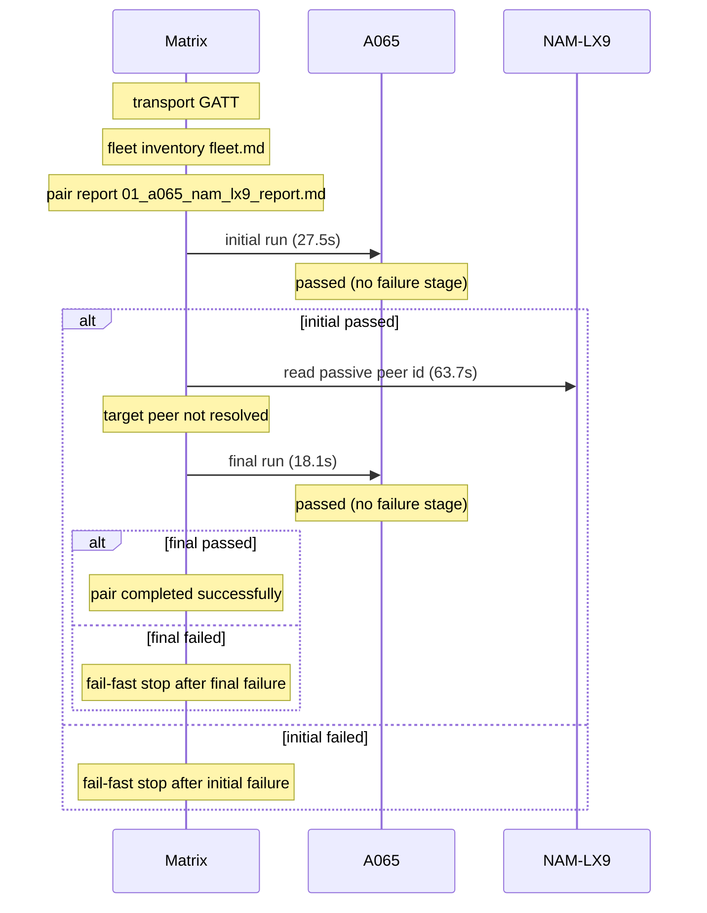

# Pair 01 — a065_nam_lx9

## Setup

- Sender: A065 (1f1dad34)
- Passive: NAM-LX9 (2ASVB21B09005117)
- Sender API level: 36
- Passive API level: 31
- Transport: GATT
- Fleet inventory: `/home/phil/Projects/MeshLink/reports/android-direct-proof-fleet/runs/20260618T114257/fleet.md`
- Pair report path: `/home/phil/Projects/MeshLink/reports/android-direct-proof-fleet/runs/20260618T114257/01_a065_nam_lx9_report.md`
- Peer lookup time: 63.7s
- Initial run dir: `/home/phil/Projects/MeshLink/reports/android-direct-proof-fleet/runs/20260618T114257/01_a065_nam_lx9_initial`
- Final run dir: `/home/phil/Projects/MeshLink/reports/android-direct-proof-fleet/runs/20260618T114257/01_a065_nam_lx9_final`

## Result

- Initial status: passed (no failure stage) in 27.5s
- Final status: passed (no failure stage) in 18.1s
- Target peer id: not resolved
- Initial HTML report: `summary.html`
- Final HTML report: `summary.html`
- Initial summary JSON: `/home/phil/Projects/MeshLink/reports/android-direct-proof-fleet/runs/20260618T114257/01_a065_nam_lx9_initial/summary.json`
- Final summary JSON: `/home/phil/Projects/MeshLink/reports/android-direct-proof-fleet/runs/20260618T114257/01_a065_nam_lx9_final/summary.json`

## Troubleshooting references

| Initial artifact | Path | Captured |
|---|---|---|
| Initial senderLogcat | `sender_logcat.log` | yes |
| Initial passiveLogcat | `passive_logcat.log` | yes |
| Initial senderStart | `sender_start.txt` | yes |
| Initial passiveStart | `passive_start.txt` | yes |
| Initial androidHistory | `android_history.json` | yes |
| Initial androidExport | `android_export.json` | yes |
| Final artifact | Path | Captured |
|---|---|---|
| Final senderLogcat | `sender_logcat.log` | yes |
| Final passiveLogcat | `passive_logcat.log` | yes |
| Final senderStart | `sender_start.txt` | yes |
| Final passiveStart | `passive_start.txt` | yes |
| Final androidHistory | `android_history.json` | yes |
| Final androidExport | `android_export.json` | yes |

## Device quirks and issues

- Transport used for the pair: GATT
- Fallback reason: android API below 33; using GATT fallback (senderApiLevel=36 passiveApiLevel=31)
- Passive API level 31 is below the floor 33.

## Startup timing

Initial startupTiming

```json
{
  "install": {
    "passiveReused": false,
    "passiveSeconds": 6.7,
    "senderReused": false,
    "senderSeconds": 8.5
  },
  "launch": {
    "passiveReused": false,
    "passiveSeconds": null,
    "passiveStartupWaitSeconds": 20.0,
    "passiveTransportWaitSeconds": 20.0,
    "postResultIdleSeconds": 2.0,
    "senderReused": false,
    "senderSeconds": null
  },
  "passive": {
    "elapsedSeconds": 0.5,
    "line": "06-18 11:43:06.054 17667 17667 I MeshLinkProof: MeshLink proof app ready on HUAWEI NAM-LX9 (SDK 31) appId=demo.meshlink.reference.android-direct.a065_nam_lx9 powerMode=Automatic primaryTransport=gattPrototype benchmarkTransport=gattPrototype",
    "observed": true
  },
  "passiveTransport": {
    "elapsedSeconds": 0.0,
    "line": "06-18 11:43:06.100 17667 17730 I MeshLinkProof: gatt.benchmark.start() -> Started",
    "observed": true
  },
  "permissions": {
    "passiveReused": false,
    "passiveSeconds": 0.1,
    "senderReused": false,
    "senderSeconds": 0.1
  },
  "sender": {
    "elapsedSeconds": 0.5,
    "line": "06-18 11:43:07.216 15129 15129 I MeshLinkReferenceAutomation: REFERENCE_AUTOMATION startup stage=activity.onCreate mode=LIVE_PROOF role=SENDER scenario=direct-guided appId=demo.meshlink.reference.android-direct.a065_nam_lx9 storage=01_a065_nam_lx9_initial",
    "observed": true
  },
  "totalSeconds": 27.4
}
```

Initial timings

```json
{
  "androidReadySeconds": 20.0,
  "captureTimeoutSeconds": 30.0,
  "passive": {
    "completionMarker": "06-18 11:43:09.701 17667 17711 I MeshLinkProof: REFERENCE_AUTOMATION proof.complete role=passive peer=52:15:AC:2B:DF:78 token=df870458685d420d bytes=51",
    "peerDiscoveryMarker": "06-18 11:43:07.810 17667 17711 I MeshLinkProof: REFERENCE_AUTOMATION peer.discovered role=PASSIVE peer=52:15:AC:2B:DF:78",
    "peerDiscoverySeconds": null,
    "receiptSeconds": null,
    "sendLatencySeconds": 1.891,
    "sendRequestMarker": "06-18 11:43:07.810 17667 17711 I MeshLinkProof: REFERENCE_AUTOMATION peer.discovered role=PASSIVE peer=52:15:AC:2B:DF:78",
    "startupMarker": null,
    "startupObserved": true,
    "startupWaitSeconds": 0.5,
    "transportEvidence": "06-18 11:43:06.054 17667 17667 I MeshLinkProof: MeshLink proof app ready on HUAWEI NAM-LX9 (SDK 31) appId=demo.meshlink.reference.android-direct.a065_nam_lx9 powerMode=Automatic primaryTransport=gattPrototype benchmarkTransport=gattPrototype",
    "transportMode": "GATT",
    "trustConnectionMarker": "06-18 11:43:07.811 17667 17711 I MeshLinkProof: REFERENCE_AUTOMATION ROUTE_DISCOVERED role=PASSIVE peer=52:15:AC:2B:DF:78",
    "trustConnectionSeconds": 0.001
  },
  "passiveInstallReused": false,
  "sender": {
    "completionMarker": "06-18 11:43:10.041 15129 15148 I MeshLinkReferenceAutomation: REFERENCE_AUTOMATION proof.complete role=sender",
    "peerDiscoveryMarker": "06-18 11:43:07.604 15129 15129 I MeshLinkReferenceAutomation: REFERENCE_AUTOMATION peer.discovered role=SENDER peer=gatt-notify-bridge",
    "peerDiscoverySeconds": 0.388,
    "sendCompletionSeconds": 2.825,
    "sendLatencySeconds": null,
    "sendRequestMarker": null,
    "startupMarker": "06-18 11:43:07.216 15129 15129 I MeshLinkReferenceAutomation: REFERENCE_AUTOMATION startup stage=activity.onCreate mode=LIVE_PROOF role=SENDER scenario=direct-guided appId=demo.meshlink.reference.android-direct.a065_nam_lx9 storage=01_a065_nam_lx9_initial",
    "startupObserved": true,
    "startupWaitSeconds": 0.5,
    "transportEvidence": "06-18 11:43:07.225 15129 15129 I MeshLinkReferenceAutomation: gatt.start() -> Started",
    "transportMode": "GATT",
    "trustConnectionMarker": "06-18 11:43:08.127 15129 15148 I MeshLinkReferenceAutomation: REFERENCE_AUTOMATION ROUTE_DISCOVERED role=SENDER peer=gatt-notify-bridge",
    "trustConnectionSeconds": 0.523
  },
  "senderInstallReused": false,
  "totalSeconds": 27.4,
  "transportEvidence": "06-18 11:43:06.054 17667 17667 I MeshLinkProof: MeshLink proof app ready on HUAWEI NAM-LX9 (SDK 31) appId=demo.meshlink.reference.android-direct.a065_nam_lx9 powerMode=Automatic primaryTransport=gattPrototype benchmarkTransport=gattPrototype",
  "transportMode": "GATT"
}
```

Final startupTiming

```json
{
  "install": {
    "passiveReused": true,
    "passiveSeconds": null,
    "senderReused": true,
    "senderSeconds": null
  },
  "launch": {
    "passiveReused": false,
    "passiveSeconds": null,
    "passiveStartupWaitSeconds": 20.0,
    "passiveTransportWaitSeconds": 20.0,
    "postResultIdleSeconds": 2.0,
    "senderReused": false,
    "senderSeconds": null
  },
  "passive": {
    "elapsedSeconds": 0.5,
    "line": "06-18 11:44:28.853 17954 17954 I MeshLinkProof: MeshLink proof app ready on HUAWEI NAM-LX9 (SDK 31) appId=demo.meshlink.reference.android-direct.a065_nam_lx9 powerMode=Automatic primaryTransport=gattPrototype benchmarkTransport=gattPrototype",
    "observed": true
  },
  "passiveTransport": {
    "elapsedSeconds": 0.0,
    "line": "06-18 11:44:28.891 17954 17985 I MeshLinkProof: gatt.benchmark.start() -> Started",
    "observed": true
  },
  "permissions": {
    "passiveReused": false,
    "passiveSeconds": 0.2,
    "senderReused": false,
    "senderSeconds": 0.1
  },
  "sender": {
    "elapsedSeconds": 0.5,
    "line": "06-18 11:44:30.043 15326 15326 I MeshLinkReferenceAutomation: REFERENCE_AUTOMATION startup stage=activity.onCreate mode=LIVE_PROOF role=SENDER scenario=direct-guided appId=demo.meshlink.reference.android-direct.a065_nam_lx9 storage=01_a065_nam_lx9_final",
    "observed": true
  },
  "totalSeconds": 18.0
}
```

Final timings

```json
{
  "androidReadySeconds": 20.0,
  "captureTimeoutSeconds": 30.0,
  "passive": {
    "completionMarker": "06-18 11:44:31.515 17954 17974 I MeshLinkProof: REFERENCE_AUTOMATION proof.complete role=passive peer=52:15:AC:2B:DF:78 token=54487b8274844eff bytes=51",
    "peerDiscoveryMarker": "06-18 11:44:30.404 17954 17974 I MeshLinkProof: REFERENCE_AUTOMATION peer.discovered role=PASSIVE peer=52:15:AC:2B:DF:78",
    "peerDiscoverySeconds": null,
    "receiptSeconds": null,
    "sendLatencySeconds": 1.111,
    "sendRequestMarker": "06-18 11:44:30.404 17954 17974 I MeshLinkProof: REFERENCE_AUTOMATION peer.discovered role=PASSIVE peer=52:15:AC:2B:DF:78",
    "startupMarker": null,
    "startupObserved": true,
    "startupWaitSeconds": 0.5,
    "transportEvidence": "06-18 11:44:28.853 17954 17954 I MeshLinkProof: MeshLink proof app ready on HUAWEI NAM-LX9 (SDK 31) appId=demo.meshlink.reference.android-direct.a065_nam_lx9 powerMode=Automatic primaryTransport=gattPrototype benchmarkTransport=gattPrototype",
    "transportMode": "GATT",
    "trustConnectionMarker": "06-18 11:44:30.405 17954 17974 I MeshLinkProof: REFERENCE_AUTOMATION ROUTE_DISCOVERED role=PASSIVE peer=52:15:AC:2B:DF:78",
    "trustConnectionSeconds": 0.001
  },
  "passiveInstallReused": true,
  "sender": {
    "completionMarker": "06-18 11:44:31.856 15326 15339 I MeshLinkReferenceAutomation: REFERENCE_AUTOMATION proof.complete role=sender",
    "peerDiscoveryMarker": "06-18 11:44:30.478 15326 15326 I MeshLinkReferenceAutomation: REFERENCE_AUTOMATION peer.discovered role=SENDER peer=gatt-notify-bridge",
    "peerDiscoverySeconds": 0.435,
    "sendCompletionSeconds": 1.813,
    "sendLatencySeconds": null,
    "sendRequestMarker": null,
    "startupMarker": "06-18 11:44:30.043 15326 15326 I MeshLinkReferenceAutomation: REFERENCE_AUTOMATION startup stage=activity.onCreate mode=LIVE_PROOF role=SENDER scenario=direct-guided appId=demo.meshlink.reference.android-direct.a065_nam_lx9 storage=01_a065_nam_lx9_final",
    "startupObserved": true,
    "startupWaitSeconds": 0.5,
    "transportEvidence": "06-18 11:44:30.052 15326 15326 I MeshLinkReferenceAutomation: gatt.start() -> Started",
    "transportMode": "GATT",
    "trustConnectionMarker": "06-18 11:44:30.721 15326 15375 I MeshLinkReferenceAutomation: REFERENCE_AUTOMATION ROUTE_DISCOVERED role=SENDER peer=gatt-notify-bridge",
    "trustConnectionSeconds": 0.243
  },
  "senderInstallReused": true,
  "totalSeconds": 18.0,
  "transportEvidence": "06-18 11:44:28.853 17954 17954 I MeshLinkProof: MeshLink proof app ready on HUAWEI NAM-LX9 (SDK 31) appId=demo.meshlink.reference.android-direct.a065_nam_lx9 powerMode=Automatic primaryTransport=gattPrototype benchmarkTransport=gattPrototype",
  "transportMode": "GATT"
}
```

Captured evidence map

```json
{
  "final": {
    "androidExport": true,
    "androidHistory": true,
    "passiveLogcat": true,
    "passiveStart": true,
    "senderLogcat": true,
    "senderStart": true
  },
  "initial": {
    "androidExport": true,
    "androidHistory": true,
    "passiveLogcat": true,
    "passiveStart": true,
    "senderLogcat": true,
    "senderStart": true
  }
}
```

## Mermaid sequence diagram


