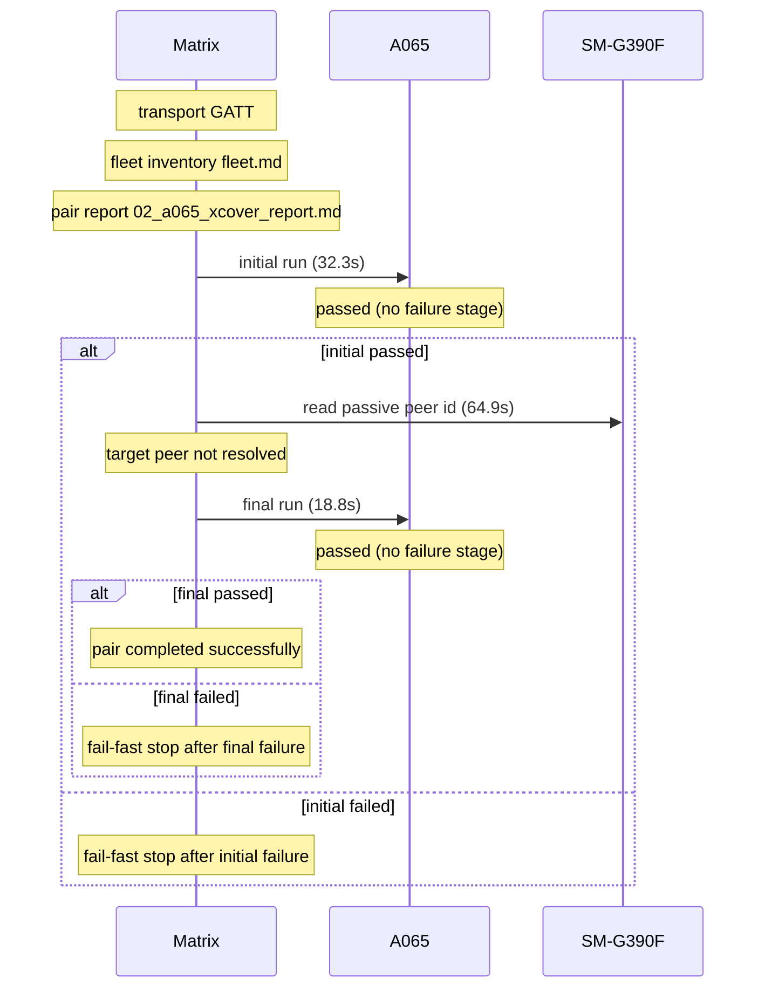

# Pair 02 — a065_xcover

## Setup

- Sender: A065 (1f1dad34)
- Passive: SM-G390F (42004386e43c8589)
- Sender API level: 36
- Passive API level: 28
- Transport: GATT
- Fleet inventory: `/home/phil/Projects/MeshLink/reports/android-direct-proof-fleet/runs/20260618T114257/fleet.md`
- Pair report path: `/home/phil/Projects/MeshLink/reports/android-direct-proof-fleet/runs/20260618T114257/02_a065_xcover_report.md`
- Peer lookup time: 64.9s
- Initial run dir: `/home/phil/Projects/MeshLink/reports/android-direct-proof-fleet/runs/20260618T114257/02_a065_xcover_initial`
- Final run dir: `/home/phil/Projects/MeshLink/reports/android-direct-proof-fleet/runs/20260618T114257/02_a065_xcover_final`

## Result

- Initial status: passed (no failure stage) in 32.3s
- Final status: passed (no failure stage) in 18.8s
- Target peer id: not resolved
- Initial HTML report: `summary.html`
- Final HTML report: `summary.html`
- Initial summary JSON: `/home/phil/Projects/MeshLink/reports/android-direct-proof-fleet/runs/20260618T114257/02_a065_xcover_initial/summary.json`
- Final summary JSON: `/home/phil/Projects/MeshLink/reports/android-direct-proof-fleet/runs/20260618T114257/02_a065_xcover_final/summary.json`

## Troubleshooting references

| Initial artifact | Path | Captured |
|---|---|---|
| Initial senderLogcat | `sender_logcat.log` | yes |
| Initial passiveLogcat | `passive_logcat.log` | yes |
| Initial senderStart | `sender_start.txt` | yes |
| Initial passiveStart | `passive_start.txt` | yes |
| Initial androidHistory | `android_history.json` | yes |
| Initial androidExport | `android_export.json` | yes |
| Final artifact | Path | Captured |
|---|---|---|
| Final senderLogcat | `sender_logcat.log` | yes |
| Final passiveLogcat | `passive_logcat.log` | yes |
| Final senderStart | `sender_start.txt` | yes |
| Final passiveStart | `passive_start.txt` | yes |
| Final androidHistory | `android_history.json` | yes |
| Final androidExport | `android_export.json` | yes |

## Device quirks and issues

- Transport used for the pair: GATT
- Fallback reason: android API below 33; using GATT fallback (senderApiLevel=36 passiveApiLevel=28)
- Passive API level 28 is below the floor 33.

## Startup timing

Initial startupTiming

```json
{
  "install": {
    "passiveReused": false,
    "passiveSeconds": 11.7,
    "senderReused": false,
    "senderSeconds": 8.6
  },
  "launch": {
    "passiveReused": false,
    "passiveSeconds": null,
    "passiveStartupWaitSeconds": 20.0,
    "passiveTransportWaitSeconds": 20.0,
    "postResultIdleSeconds": 2.0,
    "senderReused": false,
    "senderSeconds": null
  },
  "passive": {
    "elapsedSeconds": 1.8,
    "line": "06-18 11:45:00.318 17927 17927 I MeshLinkProof: MeshLink proof app ready on samsung SM-G390F (SDK 28) appId=demo.meshlink.reference.android-direct.a065_xcover powerMode=Automatic primaryTransport=gattPrototype benchmarkTransport=gattPrototype",
    "observed": true
  },
  "passiveTransport": {
    "elapsedSeconds": 0.3,
    "line": "06-18 11:45:00.551 17927 18032 I MeshLinkProof: gatt.benchmark.start() -> Started",
    "observed": true
  },
  "permissions": {
    "passiveReused": false,
    "passiveSeconds": 0.2,
    "senderReused": false,
    "senderSeconds": 0.1
  },
  "sender": {
    "elapsedSeconds": 0.5,
    "line": "06-18 11:45:02.307 15576 15576 I MeshLinkReferenceAutomation: REFERENCE_AUTOMATION startup stage=activity.onCreate mode=LIVE_PROOF role=SENDER scenario=direct-guided appId=demo.meshlink.reference.android-direct.a065_xcover storage=02_a065_xcover_initial",
    "observed": true
  },
  "totalSeconds": 32.2
}
```

Initial timings

```json
{
  "androidReadySeconds": 20.0,
  "captureTimeoutSeconds": 30.0,
  "passive": {
    "completionMarker": "06-18 11:45:02.967 17927 17946 I MeshLinkProof: REFERENCE_AUTOMATION proof.complete role=passive peer=52:15:AC:2B:DF:78 token=10f093f0885a42e4 bytes=50",
    "peerDiscoveryMarker": "06-18 11:45:01.931 17927 17946 I MeshLinkProof: REFERENCE_AUTOMATION peer.discovered role=PASSIVE peer=52:15:AC:2B:DF:78",
    "peerDiscoverySeconds": null,
    "receiptSeconds": null,
    "sendLatencySeconds": 1.036,
    "sendRequestMarker": "06-18 11:45:01.931 17927 17946 I MeshLinkProof: REFERENCE_AUTOMATION peer.discovered role=PASSIVE peer=52:15:AC:2B:DF:78",
    "startupMarker": null,
    "startupObserved": true,
    "startupWaitSeconds": 1.8,
    "transportEvidence": "06-18 11:45:00.318 17927 17927 I MeshLinkProof: MeshLink proof app ready on samsung SM-G390F (SDK 28) appId=demo.meshlink.reference.android-direct.a065_xcover powerMode=Automatic primaryTransport=gattPrototype benchmarkTransport=gattPrototype",
    "transportMode": "GATT",
    "trustConnectionMarker": "06-18 11:45:01.935 17927 17946 I MeshLinkProof: REFERENCE_AUTOMATION ROUTE_DISCOVERED role=PASSIVE peer=52:15:AC:2B:DF:78",
    "trustConnectionSeconds": 0.004
  },
  "passiveInstallReused": false,
  "sender": {
    "completionMarker": "06-18 11:45:03.904 15576 15615 I MeshLinkReferenceAutomation: REFERENCE_AUTOMATION proof.complete role=sender",
    "peerDiscoveryMarker": "06-18 11:45:02.687 15576 15576 I MeshLinkReferenceAutomation: REFERENCE_AUTOMATION peer.discovered role=SENDER peer=gatt-notify-bridge",
    "peerDiscoverySeconds": 0.38,
    "sendCompletionSeconds": 1.597,
    "sendLatencySeconds": null,
    "sendRequestMarker": null,
    "startupMarker": "06-18 11:45:02.307 15576 15576 I MeshLinkReferenceAutomation: REFERENCE_AUTOMATION startup stage=activity.onCreate mode=LIVE_PROOF role=SENDER scenario=direct-guided appId=demo.meshlink.reference.android-direct.a065_xcover storage=02_a065_xcover_initial",
    "startupObserved": true,
    "startupWaitSeconds": 0.5,
    "transportEvidence": "06-18 11:45:02.316 15576 15576 I MeshLinkReferenceAutomation: gatt.start() -> Started",
    "transportMode": "GATT",
    "trustConnectionMarker": "06-18 11:45:02.844 15576 15615 I MeshLinkReferenceAutomation: REFERENCE_AUTOMATION ROUTE_DISCOVERED role=SENDER peer=gatt-notify-bridge",
    "trustConnectionSeconds": 0.157
  },
  "senderInstallReused": false,
  "totalSeconds": 32.2,
  "transportEvidence": "06-18 11:45:00.318 17927 17927 I MeshLinkProof: MeshLink proof app ready on samsung SM-G390F (SDK 28) appId=demo.meshlink.reference.android-direct.a065_xcover powerMode=Automatic primaryTransport=gattPrototype benchmarkTransport=gattPrototype",
  "transportMode": "GATT"
}
```

Final startupTiming

```json
{
  "install": {
    "passiveReused": true,
    "passiveSeconds": null,
    "senderReused": true,
    "senderSeconds": null
  },
  "launch": {
    "passiveReused": false,
    "passiveSeconds": null,
    "passiveStartupWaitSeconds": 20.0,
    "passiveTransportWaitSeconds": 20.0,
    "postResultIdleSeconds": 2.0,
    "senderReused": false,
    "senderSeconds": null
  },
  "passive": {
    "elapsedSeconds": 1.3,
    "line": "06-18 11:46:24.234 18355 18355 I MeshLinkProof: MeshLink proof app ready on samsung SM-G390F (SDK 28) appId=demo.meshlink.reference.android-direct.a065_xcover powerMode=Automatic primaryTransport=gattPrototype benchmarkTransport=gattPrototype",
    "observed": true
  },
  "passiveTransport": {
    "elapsedSeconds": 0.0,
    "line": "06-18 11:46:24.359 18355 18375 I MeshLinkProof: gatt.benchmark.start() -> Started",
    "observed": true
  },
  "permissions": {
    "passiveReused": false,
    "passiveSeconds": 0.2,
    "senderReused": false,
    "senderSeconds": 0.1
  },
  "sender": {
    "elapsedSeconds": 0.5,
    "line": "06-18 11:46:26.064 15875 15875 I MeshLinkReferenceAutomation: REFERENCE_AUTOMATION startup stage=activity.onCreate mode=LIVE_PROOF role=SENDER scenario=direct-guided appId=demo.meshlink.reference.android-direct.a065_xcover storage=02_a065_xcover_final",
    "observed": true
  },
  "totalSeconds": 18.8
}
```

Final timings

```json
{
  "androidReadySeconds": 20.0,
  "captureTimeoutSeconds": 30.0,
  "passive": {
    "completionMarker": "06-18 11:46:26.977 18355 18368 I MeshLinkProof: REFERENCE_AUTOMATION proof.complete role=passive peer=7C:9B:EE:F8:58:1D token=1c01054e65ee4bb3 bytes=50",
    "peerDiscoveryMarker": "06-18 11:46:25.898 18355 18368 I MeshLinkProof: REFERENCE_AUTOMATION peer.discovered role=PASSIVE peer=7C:9B:EE:F8:58:1D",
    "peerDiscoverySeconds": null,
    "receiptSeconds": null,
    "sendLatencySeconds": 1.079,
    "sendRequestMarker": "06-18 11:46:25.898 18355 18368 I MeshLinkProof: REFERENCE_AUTOMATION peer.discovered role=PASSIVE peer=7C:9B:EE:F8:58:1D",
    "startupMarker": null,
    "startupObserved": true,
    "startupWaitSeconds": 1.3,
    "transportEvidence": "06-18 11:46:24.234 18355 18355 I MeshLinkProof: MeshLink proof app ready on samsung SM-G390F (SDK 28) appId=demo.meshlink.reference.android-direct.a065_xcover powerMode=Automatic primaryTransport=gattPrototype benchmarkTransport=gattPrototype",
    "transportMode": "GATT",
    "trustConnectionMarker": "06-18 11:46:25.911 18355 18368 I MeshLinkProof: REFERENCE_AUTOMATION ROUTE_DISCOVERED role=PASSIVE peer=7C:9B:EE:F8:58:1D",
    "trustConnectionSeconds": 0.013
  },
  "passiveInstallReused": true,
  "sender": {
    "completionMarker": "06-18 11:46:27.911 15875 15891 I MeshLinkReferenceAutomation: REFERENCE_AUTOMATION proof.complete role=sender",
    "peerDiscoveryMarker": "06-18 11:46:26.415 15875 15875 I MeshLinkReferenceAutomation: REFERENCE_AUTOMATION peer.discovered role=SENDER peer=gatt-notify-bridge",
    "peerDiscoverySeconds": 0.351,
    "sendCompletionSeconds": 1.847,
    "sendLatencySeconds": null,
    "sendRequestMarker": null,
    "startupMarker": "06-18 11:46:26.064 15875 15875 I MeshLinkReferenceAutomation: REFERENCE_AUTOMATION startup stage=activity.onCreate mode=LIVE_PROOF role=SENDER scenario=direct-guided appId=demo.meshlink.reference.android-direct.a065_xcover storage=02_a065_xcover_final",
    "startupObserved": true,
    "startupWaitSeconds": 0.5,
    "transportEvidence": "06-18 11:46:26.072 15875 15875 I MeshLinkReferenceAutomation: gatt.start() -> Started",
    "transportMode": "GATT",
    "trustConnectionMarker": "06-18 11:46:26.818 15875 15891 I MeshLinkReferenceAutomation: REFERENCE_AUTOMATION ROUTE_DISCOVERED role=SENDER peer=gatt-notify-bridge",
    "trustConnectionSeconds": 0.403
  },
  "senderInstallReused": true,
  "totalSeconds": 18.8,
  "transportEvidence": "06-18 11:46:24.234 18355 18355 I MeshLinkProof: MeshLink proof app ready on samsung SM-G390F (SDK 28) appId=demo.meshlink.reference.android-direct.a065_xcover powerMode=Automatic primaryTransport=gattPrototype benchmarkTransport=gattPrototype",
  "transportMode": "GATT"
}
```

Captured evidence map

```json
{
  "final": {
    "androidExport": true,
    "androidHistory": true,
    "passiveLogcat": true,
    "passiveStart": true,
    "senderLogcat": true,
    "senderStart": true
  },
  "initial": {
    "androidExport": true,
    "androidHistory": true,
    "passiveLogcat": true,
    "passiveStart": true,
    "senderLogcat": true,
    "senderStart": true
  }
}
```

## Mermaid sequence diagram


