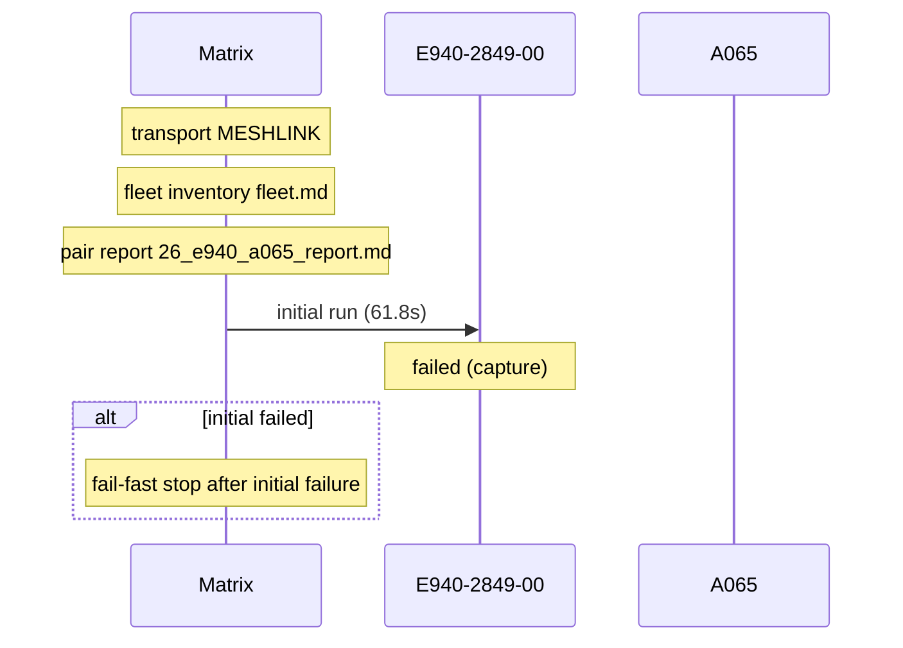

# Pair 26 — e940_a065

## Setup

- Sender: E940-2849-00 (GX6CTR500184)
- Passive: A065 (1f1dad34)
- Sender API level: 33
- Passive API level: 36
- Transport: MESHLINK
- Fleet inventory: `/home/phil/Projects/MeshLink/reports/android-direct-proof-fleet/runs/20260618T144214/fleet.md`
- Pair report path: `/home/phil/Projects/MeshLink/reports/android-direct-proof-fleet/runs/20260618T144214/26_e940_a065_report.md`
- Peer lookup time: —
- Initial run dir: `/home/phil/Projects/MeshLink/reports/android-direct-proof-fleet/runs/20260618T144214/26_e940_a065_initial`
- Final run dir: `—`

## Result

- Initial status: failed (capture) in 61.8s
- Final status: skipped (capture) in 61.8s
- Target peer id: not resolved
- Initial HTML report: `summary.html`
- Final HTML report: `summary.html`
- Initial summary JSON: `/home/phil/Projects/MeshLink/reports/android-direct-proof-fleet/runs/20260618T144214/26_e940_a065_initial/summary.json`
- Final summary JSON: `—`

## Troubleshooting references

| Initial artifact | Path | Captured |
|---|---|---|
| Initial senderLogcat | `sender_logcat.log` | yes |
| Initial passiveLogcat | `passive_logcat.log` | yes |
| Initial senderStart | `sender_start.txt` | yes |
| Initial passiveStart | `passive_start.txt` | yes |
| Initial androidHistory | `android_history.json` | no |
| Initial androidExport | `android_export.json` | no |
| Final artifact | Path | Captured |
|---|---|---|
| Final senderLogcat | `—` | no |
| Final passiveLogcat | `—` | no |
| Final senderStart | `—` | no |
| Final passiveStart | `—` | no |
| Final androidHistory | `—` | no |
| Final androidExport | `—` | no |

## Device quirks and issues

- Transport used for the pair: MESHLINK
- Initial run failure: Android direct proof stalled at route stage sender=route-unavailable passive=hop-failed; senderEvidence=06-18 15:00:21.999 28065 28087 I MeshLinkReferenceAutomation: REFERENCE_AUTOMATION sender.observed role=sender family=DIAGNOSTIC title=DELIVERY_RETRYING peer=f0321d detail=DELIVERY_RETRYING @ delivery.retrying {peerId=0e9c6802970b5698a3f0321d, topologyVersion=0, routeAvailable=false, attempt=2} passiveEvidence=06-18 15:00:16.153 25942 26066 I MeshLinkReferenceAutomation: REFERENCE_AUTOMATION passive.observed role=passive family=DIAGNOSTIC title=HOP_SESSION_FAILED peer=dd8266 detail=HOP_SESSION_FAILED @ transport.handshake.timeout {peerId=5e8cd99ec3bf483c55dd8266, topologyVersion=0, routeAvailable=false}
- Final run failure: Android direct proof stalled at route stage sender=route-unavailable passive=hop-failed; senderEvidence=06-18 15:00:21.999 28065 28087 I MeshLinkReferenceAutomation: REFERENCE_AUTOMATION sender.observed role=sender family=DIAGNOSTIC title=DELIVERY_RETRYING peer=f0321d detail=DELIVERY_RETRYING @ delivery.retrying {peerId=0e9c6802970b5698a3f0321d, topologyVersion=0, routeAvailable=false, attempt=2} passiveEvidence=06-18 15:00:16.153 25942 26066 I MeshLinkReferenceAutomation: REFERENCE_AUTOMATION passive.observed role=passive family=DIAGNOSTIC title=HOP_SESSION_FAILED peer=dd8266 detail=HOP_SESSION_FAILED @ transport.handshake.timeout {peerId=5e8cd99ec3bf483c55dd8266, topologyVersion=0, routeAvailable=false}

## Startup timing

Initial startupTiming

```json
{
  "launch": {
    "passiveStartupWaitSeconds": 20.0,
    "passiveTransportWaitSeconds": 20.0,
    "postResultIdleSeconds": 2.0
  },
  "passive": {
    "elapsedSeconds": 0.5,
    "line": "06-18 14:59:30.845 25942 25942 I MeshLinkReferenceAutomation: REFERENCE_AUTOMATION startup stage=activity.onCreate mode=LIVE_PROOF role=PASSIVE scenario=direct-guided appId=demo.meshlink.reference.android-direct.e940_a065 storage=26_e940_a065_initial",
    "observed": true
  },
  "passiveTransport": {
    "elapsedSeconds": 0.5,
    "line": "06-18 14:59:31.218 25942 25942 I MeshLinkReferenceAutomation: advertising started mode=2 tx=3 connectable=true",
    "observed": true
  },
  "sender": {
    "elapsedSeconds": 0.8,
    "line": "06-18 15:00:13.647 28065 28065 I MeshLinkReferenceAutomation: REFERENCE_AUTOMATION startup stage=activity.onCreate mode=LIVE_PROOF role=SENDER scenario=direct-guided appId=demo.meshlink.reference.android-direct.e940_a065 storage=26_e940_a065_initial",
    "observed": true
  },
  "totalSeconds": 61.7
}
```

Initial timings

```json
{
  "androidReadySeconds": 20.0,
  "captureTimeoutSeconds": 30.0,
  "passive": {
    "completionMarker": null,
    "peerDiscoveryMarker": "06-18 15:00:12.522 25942 26002 I MeshLinkReferenceAutomation: REFERENCE_AUTOMATION peer.discovered role=PASSIVE peer=dd8266",
    "peerDiscoverySeconds": 41.677,
    "receiptSeconds": null,
    "sendLatencySeconds": null,
    "sendRequestMarker": "06-18 15:00:12.522 25942 26002 I MeshLinkReferenceAutomation: REFERENCE_AUTOMATION peer.discovered role=PASSIVE peer=dd8266",
    "startupMarker": "06-18 14:59:30.845 25942 25942 I MeshLinkReferenceAutomation: REFERENCE_AUTOMATION startup stage=activity.onCreate mode=LIVE_PROOF role=PASSIVE scenario=direct-guided appId=demo.meshlink.reference.android-direct.e940_a065 storage=26_e940_a065_initial",
    "startupObserved": true,
    "startupWaitSeconds": 0.5,
    "transportEvidence": "06-18 15:00:12.506 25942 25942 I MeshLinkReferenceAutomation: scan found dd8266 mode=L2CAP psm=229 platform=ANDROID addr=5C:C6:B9:EA:06:02",
    "transportMode": "L2CAP",
    "trustConnectionMarker": null,
    "trustConnectionSeconds": null
  },
  "sender": {
    "completionMarker": null,
    "peerDiscoveryMarker": "06-18 15:00:14.606 28065 28093 I MeshLinkReferenceAutomation: REFERENCE_AUTOMATION peer.discovered role=SENDER peer=f0321d",
    "peerDiscoverySeconds": 0.959,
    "sendCompletionSeconds": null,
    "sendLatencySeconds": null,
    "sendRequestMarker": "06-18 15:00:14.607 28065 28093 I MeshLinkReferenceAutomation: REFERENCE_AUTOMATION send.requested role=sender phase=primary peer=f0321d priority=NORMAL bytes=23 payload=guided-hello targetIndex=0 requiredPeerCount=1 targetPeerId=auto",
    "startupMarker": "06-18 15:00:13.647 28065 28065 I MeshLinkReferenceAutomation: REFERENCE_AUTOMATION startup stage=activity.onCreate mode=LIVE_PROOF role=SENDER scenario=direct-guided appId=demo.meshlink.reference.android-direct.e940_a065 storage=26_e940_a065_initial",
    "startupObserved": true,
    "startupWaitSeconds": 0.8,
    "transportEvidence": "06-18 15:00:14.599 28065 28065 I MeshLinkReferenceAutomation: scan found f0321d mode=L2CAP psm=240 platform=ANDROID addr=7E:5C:05:95:DA:8D",
    "transportMode": "L2CAP",
    "trustConnectionMarker": null,
    "trustConnectionSeconds": null
  },
  "totalSeconds": 61.7,
  "transportEvidence": "06-18 15:00:12.506 25942 25942 I MeshLinkReferenceAutomation: scan found dd8266 mode=L2CAP psm=229 platform=ANDROID addr=5C:C6:B9:EA:06:02",
  "transportMode": "L2CAP"
}
```

Final startupTiming

```json
{}
```

Final timings

```json
{
  "androidReadySeconds": 20.0,
  "captureTimeoutSeconds": 30.0,
  "passive": {
    "completionMarker": null,
    "peerDiscoveryMarker": "06-18 15:00:12.522 25942 26002 I MeshLinkReferenceAutomation: REFERENCE_AUTOMATION peer.discovered role=PASSIVE peer=dd8266",
    "peerDiscoverySeconds": 41.677,
    "receiptSeconds": null,
    "sendLatencySeconds": null,
    "sendRequestMarker": "06-18 15:00:12.522 25942 26002 I MeshLinkReferenceAutomation: REFERENCE_AUTOMATION peer.discovered role=PASSIVE peer=dd8266",
    "startupMarker": "06-18 14:59:30.845 25942 25942 I MeshLinkReferenceAutomation: REFERENCE_AUTOMATION startup stage=activity.onCreate mode=LIVE_PROOF role=PASSIVE scenario=direct-guided appId=demo.meshlink.reference.android-direct.e940_a065 storage=26_e940_a065_initial",
    "startupObserved": true,
    "startupWaitSeconds": 0.5,
    "transportEvidence": "06-18 15:00:12.506 25942 25942 I MeshLinkReferenceAutomation: scan found dd8266 mode=L2CAP psm=229 platform=ANDROID addr=5C:C6:B9:EA:06:02",
    "transportMode": "L2CAP",
    "trustConnectionMarker": null,
    "trustConnectionSeconds": null
  },
  "sender": {
    "completionMarker": null,
    "peerDiscoveryMarker": "06-18 15:00:14.606 28065 28093 I MeshLinkReferenceAutomation: REFERENCE_AUTOMATION peer.discovered role=SENDER peer=f0321d",
    "peerDiscoverySeconds": 0.959,
    "sendCompletionSeconds": null,
    "sendLatencySeconds": null,
    "sendRequestMarker": "06-18 15:00:14.607 28065 28093 I MeshLinkReferenceAutomation: REFERENCE_AUTOMATION send.requested role=sender phase=primary peer=f0321d priority=NORMAL bytes=23 payload=guided-hello targetIndex=0 requiredPeerCount=1 targetPeerId=auto",
    "startupMarker": "06-18 15:00:13.647 28065 28065 I MeshLinkReferenceAutomation: REFERENCE_AUTOMATION startup stage=activity.onCreate mode=LIVE_PROOF role=SENDER scenario=direct-guided appId=demo.meshlink.reference.android-direct.e940_a065 storage=26_e940_a065_initial",
    "startupObserved": true,
    "startupWaitSeconds": 0.8,
    "transportEvidence": "06-18 15:00:14.599 28065 28065 I MeshLinkReferenceAutomation: scan found f0321d mode=L2CAP psm=240 platform=ANDROID addr=7E:5C:05:95:DA:8D",
    "transportMode": "L2CAP",
    "trustConnectionMarker": null,
    "trustConnectionSeconds": null
  },
  "totalSeconds": 61.7,
  "transportEvidence": "06-18 15:00:12.506 25942 25942 I MeshLinkReferenceAutomation: scan found dd8266 mode=L2CAP psm=229 platform=ANDROID addr=5C:C6:B9:EA:06:02",
  "transportMode": "L2CAP"
}
```

Captured evidence map

```json
{
  "final": {},
  "initial": {
    "androidExport": false,
    "androidHistory": false,
    "passiveLogcat": true,
    "passiveStart": true,
    "senderLogcat": true,
    "senderStart": true
  }
}
```

## Mermaid sequence diagram


