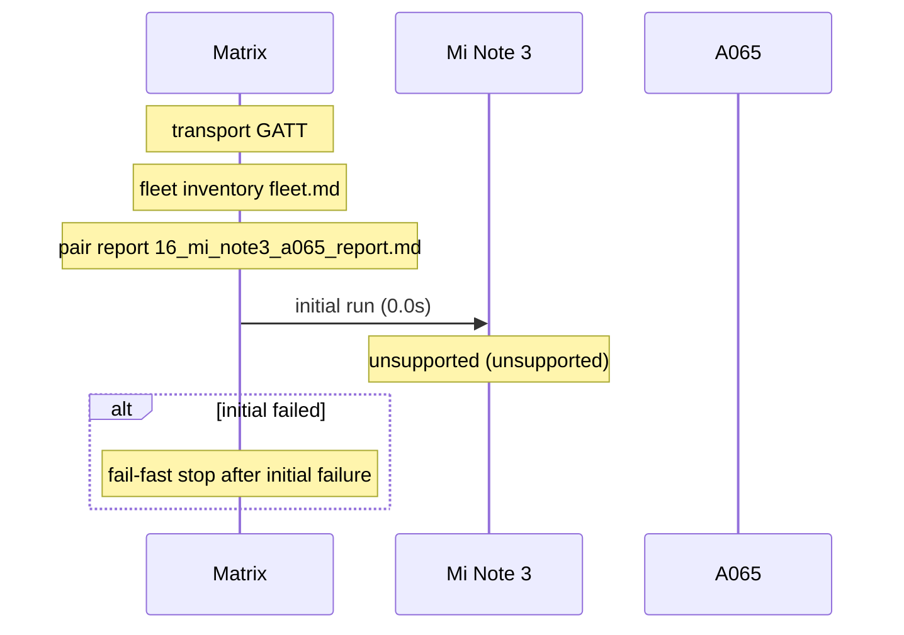

# Pair 16 — mi_note3_a065

## Setup

- Sender: Mi Note 3 (42c2cf)
- Passive: A065 (1f1dad34)
- Sender API level: 28
- Passive API level: 36
- Transport: GATT
- Fleet inventory: `/home/phil/Projects/MeshLink/reports/android-direct-proof-fleet/runs/20260618T161949/fleet.md`
- Pair report path: `/home/phil/Projects/MeshLink/reports/android-direct-proof-fleet/runs/20260618T161949/16_mi_note3_a065_report.md`
- Peer lookup time: —
- Initial run dir: `—`
- Final run dir: `—`

## Result

- Initial status: unsupported (unsupported) in 0.0s
- Final status: unsupported (unsupported) in 0.0s
- Target peer id: not resolved
- Initial HTML report: `—`
- Final HTML report: `—`
- Initial summary JSON: `—`
- Final summary JSON: `—`

## Troubleshooting references

| Initial artifact | Path | Captured |
|---|---|---|
| Initial senderLogcat | `—` | no |
| Initial passiveLogcat | `—` | no |
| Initial senderStart | `—` | no |
| Initial passiveStart | `—` | no |
| Initial androidHistory | `—` | no |
| Initial androidExport | `—` | no |
| Final artifact | Path | Captured |
|---|---|---|
| Final senderLogcat | `—` | no |
| Final passiveLogcat | `—` | no |
| Final senderStart | `—` | no |
| Final passiveStart | `—` | no |
| Final androidHistory | `—` | no |
| Final androidExport | `—` | no |

## Device quirks and issues

- Transport used for the pair: GATT
- Fallback reason: android API below 33; using GATT fallback (senderApiLevel=28 passiveApiLevel=36)
- Sender API level 28 is below the floor 33.
- Guardrail: SDK 28 devices are explicitly classified as unsupported before capture (senderApiLevel=28 passiveApiLevel=36).
- Initial run failure: SDK 28 direct-proof guardrail: sender API 28 device(s) are explicitly classified as unsupported before capture
- Final run failure: SDK 28 direct-proof guardrail: sender API 28 device(s) are explicitly classified as unsupported before capture

## Startup timing

Initial startupTiming

```json
{}
```

Initial timings

```json
{
  "androidReadySeconds": 20.0,
  "captureTimeoutSeconds": 30.0,
  "totalSeconds": 0.0,
  "transportMode": "GATT"
}
```

Final startupTiming

```json
{}
```

Final timings

```json
{
  "androidReadySeconds": 20.0,
  "captureTimeoutSeconds": 30.0,
  "totalSeconds": 0.0,
  "transportMode": "GATT"
}
```

Captured evidence map

```json
{
  "final": {},
  "initial": {}
}
```

## Mermaid sequence diagram


