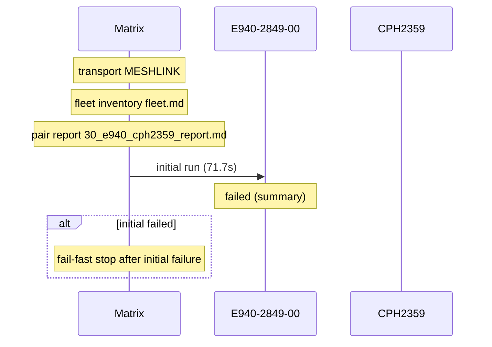

# Pair 30 — e940_cph2359

## Setup

- Sender: E940-2849-00 (GX6CTR500184)
- Passive: CPH2359 (EQUGS85LJNEIO7Z5)
- Sender API level: 33
- Passive API level: 34
- Transport: MESHLINK
- Fleet inventory: `/home/phil/Projects/MeshLink/reports/android-direct-proof-fleet/runs/20260618T161949/fleet.md`
- Pair report path: `/home/phil/Projects/MeshLink/reports/android-direct-proof-fleet/runs/20260618T161949/30_e940_cph2359_report.md`
- Peer lookup time: —
- Initial run dir: `/home/phil/Projects/MeshLink/reports/android-direct-proof-fleet/runs/20260618T161949/30_e940_cph2359_initial`
- Final run dir: `—`

## Result

- Initial status: failed (summary) in 71.7s
- Final status: skipped (summary) in 71.7s
- Target peer id: not resolved
- Initial HTML report: `summary.html`
- Final HTML report: `summary.html`
- Initial summary JSON: `/home/phil/Projects/MeshLink/reports/android-direct-proof-fleet/runs/20260618T161949/30_e940_cph2359_initial/summary.json`
- Final summary JSON: `—`

## Troubleshooting references

| Initial artifact | Path | Captured |
|---|---|---|
| Initial senderLogcat | `sender_logcat.log` | yes |
| Initial passiveLogcat | `passive_logcat.log` | yes |
| Initial senderStart | `sender_start.txt` | yes |
| Initial passiveStart | `passive_start.txt` | yes |
| Initial androidHistory | `android_history.json` | no |
| Initial androidExport | `android_export.json` | no |
| Final artifact | Path | Captured |
|---|---|---|
| Final senderLogcat | `—` | no |
| Final passiveLogcat | `—` | no |
| Final senderStart | `—` | no |
| Final passiveStart | `—` | no |
| Final androidHistory | `—` | no |
| Final androidExport | `—` | no |

## Device quirks and issues

- Transport used for the pair: MESHLINK
- Initial run failure: Missing passive proof.complete line in passive log
- Final run failure: Missing passive proof.complete line in passive log

## Startup timing

Initial startupTiming

```json
{
  "launch": {
    "passiveStartupWaitSeconds": 20.0,
    "passiveTransportWaitSeconds": 20.0,
    "postResultIdleSeconds": 2.0
  },
  "passive": {
    "elapsedSeconds": 0.8,
    "line": "06-18 16:28:21.875 20070 20070 I MeshLinkReferenceAutomation: REFERENCE_AUTOMATION startup stage=activity.onCreate mode=LIVE_PROOF role=PASSIVE scenario=direct-guided appId=demo.meshlink.reference.android-direct.e940_cph2359 storage=30_e940_cph2359_initial",
    "observed": true
  },
  "passiveTransport": {
    "elapsedSeconds": 0.8,
    "line": "06-18 16:28:22.657 20070 20070 I MeshLinkReferenceAutomation: advertising started mode=2 tx=3 connectable=true",
    "observed": true
  },
  "sender": {
    "elapsedSeconds": 0.8,
    "line": "06-18 16:29:01.492 32062 32062 I MeshLinkReferenceAutomation: REFERENCE_AUTOMATION startup stage=activity.onCreate mode=LIVE_PROOF role=SENDER scenario=direct-guided appId=demo.meshlink.reference.android-direct.e940_cph2359 storage=30_e940_cph2359_initial",
    "observed": true
  },
  "totalSeconds": 71.7
}
```

Initial timings

```json
{
  "androidReadySeconds": 20.0,
  "captureTimeoutSeconds": 30.0,
  "passive": {
    "completionMarker": null,
    "peerDiscoveryMarker": null,
    "peerDiscoverySeconds": null,
    "receiptSeconds": null,
    "sendLatencySeconds": null,
    "sendRequestMarker": null,
    "startupMarker": "06-18 16:28:21.875 20070 20070 I MeshLinkReferenceAutomation: REFERENCE_AUTOMATION startup stage=activity.onCreate mode=LIVE_PROOF role=PASSIVE scenario=direct-guided appId=demo.meshlink.reference.android-direct.e940_cph2359 storage=30_e940_cph2359_initial",
    "startupObserved": true,
    "startupWaitSeconds": 0.8,
    "transportEvidence": "06-18 16:28:21.954 20070 20070 I MeshLinkReferenceAutomation: start() with l2capPsm=157",
    "transportMode": "L2CAP",
    "trustConnectionMarker": "06-18 16:29:05.916 20070 20106 I MeshLinkReferenceAutomation: REFERENCE_RUNTIME diagnostic code=HOP_SESSION_ESTABLISHED stage=transport.handshake.message3.complete peer=baff21 detail=HOP_SESSION_ESTABLISHED @ transport.handshake.message3.complete {peerId=93bc5c75f98800b5ecbaff21, topologyVersion=0, routeAvailable=false}",
    "trustConnectionSeconds": 44.041
  },
  "sender": {
    "completionMarker": "06-18 16:29:06.598 32062 32091 I MeshLinkReferenceAutomation: REFERENCE_AUTOMATION proof.complete role=sender outcome=SendResult.Sent peer=e58aa8 delivery=First guided payload reached e58aa8 with NORMAL priority.",
    "peerDiscoveryMarker": "06-18 16:29:02.454 32062 32090 I MeshLinkReferenceAutomation: REFERENCE_AUTOMATION peer.discovered role=SENDER peer=e58aa8",
    "peerDiscoverySeconds": 0.962,
    "sendCompletionSeconds": 5.106,
    "sendLatencySeconds": 4.143,
    "sendRequestMarker": "06-18 16:29:02.455 32062 32090 I MeshLinkReferenceAutomation: REFERENCE_AUTOMATION send.requested role=sender phase=primary peer=e58aa8 priority=NORMAL bytes=23 payload=guided-hello targetIndex=0 requiredPeerCount=1 targetPeerId=auto",
    "startupMarker": "06-18 16:29:01.492 32062 32062 I MeshLinkReferenceAutomation: REFERENCE_AUTOMATION startup stage=activity.onCreate mode=LIVE_PROOF role=SENDER scenario=direct-guided appId=demo.meshlink.reference.android-direct.e940_cph2359 storage=30_e940_cph2359_initial",
    "startupObserved": true,
    "startupWaitSeconds": 0.8,
    "transportEvidence": "06-18 16:29:02.394 32062 32062 I MeshLinkReferenceAutomation: scan found e58aa8 mode=L2CAP psm=157 platform=ANDROID addr=7B:15:35:DF:58:EF",
    "transportMode": "L2CAP",
    "trustConnectionMarker": "06-18 16:29:03.697 32062 32085 I MeshLinkReferenceAutomation: REFERENCE_RUNTIME diagnostic code=HOP_SESSION_ESTABLISHED stage=transport.handshake.message2.complete peer=e58aa8 detail=HOP_SESSION_ESTABLISHED @ transport.handshake.message2.complete {peerId=dfd98f43a35ebf6957e58aa8, topologyVersion=0, routeAvailable=false}",
    "trustConnectionSeconds": 1.243
  },
  "totalSeconds": 71.7,
  "transportEvidence": "06-18 16:28:21.954 20070 20070 I MeshLinkReferenceAutomation: start() with l2capPsm=157",
  "transportMode": "L2CAP"
}
```

Final startupTiming

```json
{}
```

Final timings

```json
{
  "androidReadySeconds": 20.0,
  "captureTimeoutSeconds": 30.0,
  "passive": {
    "completionMarker": null,
    "peerDiscoveryMarker": null,
    "peerDiscoverySeconds": null,
    "receiptSeconds": null,
    "sendLatencySeconds": null,
    "sendRequestMarker": null,
    "startupMarker": "06-18 16:28:21.875 20070 20070 I MeshLinkReferenceAutomation: REFERENCE_AUTOMATION startup stage=activity.onCreate mode=LIVE_PROOF role=PASSIVE scenario=direct-guided appId=demo.meshlink.reference.android-direct.e940_cph2359 storage=30_e940_cph2359_initial",
    "startupObserved": true,
    "startupWaitSeconds": 0.8,
    "transportEvidence": "06-18 16:28:21.954 20070 20070 I MeshLinkReferenceAutomation: start() with l2capPsm=157",
    "transportMode": "L2CAP",
    "trustConnectionMarker": "06-18 16:29:05.916 20070 20106 I MeshLinkReferenceAutomation: REFERENCE_RUNTIME diagnostic code=HOP_SESSION_ESTABLISHED stage=transport.handshake.message3.complete peer=baff21 detail=HOP_SESSION_ESTABLISHED @ transport.handshake.message3.complete {peerId=93bc5c75f98800b5ecbaff21, topologyVersion=0, routeAvailable=false}",
    "trustConnectionSeconds": 44.041
  },
  "sender": {
    "completionMarker": "06-18 16:29:06.598 32062 32091 I MeshLinkReferenceAutomation: REFERENCE_AUTOMATION proof.complete role=sender outcome=SendResult.Sent peer=e58aa8 delivery=First guided payload reached e58aa8 with NORMAL priority.",
    "peerDiscoveryMarker": "06-18 16:29:02.454 32062 32090 I MeshLinkReferenceAutomation: REFERENCE_AUTOMATION peer.discovered role=SENDER peer=e58aa8",
    "peerDiscoverySeconds": 0.962,
    "sendCompletionSeconds": 5.106,
    "sendLatencySeconds": 4.143,
    "sendRequestMarker": "06-18 16:29:02.455 32062 32090 I MeshLinkReferenceAutomation: REFERENCE_AUTOMATION send.requested role=sender phase=primary peer=e58aa8 priority=NORMAL bytes=23 payload=guided-hello targetIndex=0 requiredPeerCount=1 targetPeerId=auto",
    "startupMarker": "06-18 16:29:01.492 32062 32062 I MeshLinkReferenceAutomation: REFERENCE_AUTOMATION startup stage=activity.onCreate mode=LIVE_PROOF role=SENDER scenario=direct-guided appId=demo.meshlink.reference.android-direct.e940_cph2359 storage=30_e940_cph2359_initial",
    "startupObserved": true,
    "startupWaitSeconds": 0.8,
    "transportEvidence": "06-18 16:29:02.394 32062 32062 I MeshLinkReferenceAutomation: scan found e58aa8 mode=L2CAP psm=157 platform=ANDROID addr=7B:15:35:DF:58:EF",
    "transportMode": "L2CAP",
    "trustConnectionMarker": "06-18 16:29:03.697 32062 32085 I MeshLinkReferenceAutomation: REFERENCE_RUNTIME diagnostic code=HOP_SESSION_ESTABLISHED stage=transport.handshake.message2.complete peer=e58aa8 detail=HOP_SESSION_ESTABLISHED @ transport.handshake.message2.complete {peerId=dfd98f43a35ebf6957e58aa8, topologyVersion=0, routeAvailable=false}",
    "trustConnectionSeconds": 1.243
  },
  "totalSeconds": 71.7,
  "transportEvidence": "06-18 16:28:21.954 20070 20070 I MeshLinkReferenceAutomation: start() with l2capPsm=157",
  "transportMode": "L2CAP"
}
```

Captured evidence map

```json
{
  "final": {},
  "initial": {
    "androidExport": false,
    "androidHistory": false,
    "passiveLogcat": true,
    "passiveStart": true,
    "senderLogcat": true,
    "senderStart": true
  }
}
```

## Mermaid sequence diagram


