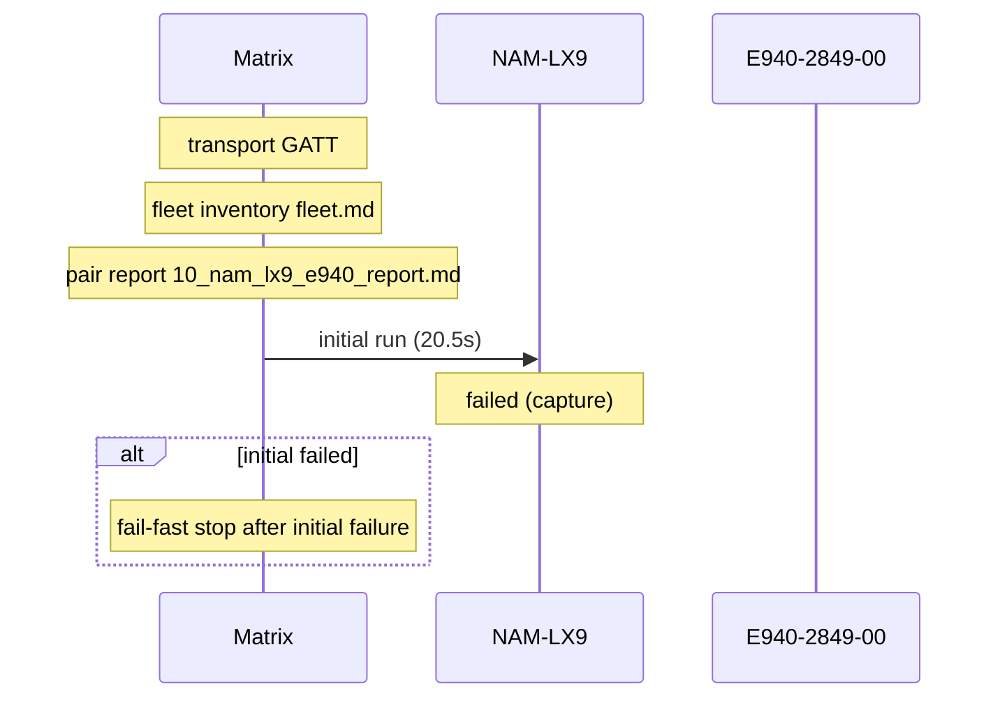

# Pair 10 — nam_lx9_e940

## Setup

- Sender: NAM-LX9 (2ASVB21B09005117)
- Passive: E940-2849-00 (GX6CTR500184)
- Sender API level: 31
- Passive API level: 33
- Transport: GATT
- Fleet inventory: `/home/phil/Projects/MeshLink/reports/android-direct-proof-fleet/runs/20260618T172640/fleet.md`
- Pair report path: `/home/phil/Projects/MeshLink/reports/android-direct-proof-fleet/runs/20260618T172640/10_nam_lx9_e940_report.md`
- Peer lookup time: —
- Initial run dir: `/home/phil/Projects/MeshLink/reports/android-direct-proof-fleet/runs/20260618T172640/10_nam_lx9_e940_initial`
- Final run dir: `—`

## Result

- Initial status: failed (capture) in 20.5s
- Final status: skipped (capture) in 20.5s
- Target peer id: not resolved
- Initial HTML report: `summary.html`
- Final HTML report: `summary.html`
- Initial summary JSON: `/home/phil/Projects/MeshLink/reports/android-direct-proof-fleet/runs/20260618T172640/10_nam_lx9_e940_initial/summary.json`
- Final summary JSON: `—`

## Troubleshooting references

| Initial artifact | Path | Captured |
|---|---|---|
| Initial senderLogcat | `sender_logcat.log` | yes |
| Initial passiveLogcat | `passive_logcat.log` | yes |
| Initial senderStart | `sender_start.txt` | yes |
| Initial passiveStart | `passive_start.txt` | yes |
| Initial androidHistory | `android_history.json` | no |
| Initial androidExport | `android_export.json` | no |
| Final artifact | Path | Captured |
|---|---|---|
| Final senderLogcat | `—` | no |
| Final passiveLogcat | `—` | no |
| Final senderStart | `—` | no |
| Final passiveStart | `—` | no |
| Final androidHistory | `—` | no |
| Final androidExport | `—` | no |

## Device quirks and issues

- Transport used for the pair: GATT
- Fallback reason: android API below 33; using GATT fallback (senderApiLevel=31 passiveApiLevel=33)
- Sender API level 31 is below the floor 33.
- Initial run failure: Android direct proof stalled at route stage sender=none passive=hop-established; senderEvidence=n/a passiveEvidence=06-18 17:33:31.913  2145  2164 I MeshLinkProof: REFERENCE_AUTOMATION HOP_SESSION_ESTABLISHED role=PASSIVE peer=73:74:02:C3:3F:9C
- Final run failure: Android direct proof stalled at route stage sender=none passive=hop-established; senderEvidence=n/a passiveEvidence=06-18 17:33:31.913  2145  2164 I MeshLinkProof: REFERENCE_AUTOMATION HOP_SESSION_ESTABLISHED role=PASSIVE peer=73:74:02:C3:3F:9C

## Startup timing

Initial startupTiming

```json
{
  "launch": {
    "passiveStartupWaitSeconds": 20.0,
    "passiveTransportWaitSeconds": 20.0,
    "postResultIdleSeconds": 2.0
  },
  "passive": {
    "elapsedSeconds": 0.3,
    "line": "06-18 17:33:31.838  2145  2145 I MeshLinkProof: MeshLink proof app ready on Gigaset E940-2849-00 (SDK 33) appId=demo.meshlink.reference.android-direct.nam_lx9_e940 powerMode=Automatic primaryTransport=gattPrototype benchmarkTransport=gattPrototype",
    "observed": true
  },
  "passiveTransport": {
    "elapsedSeconds": 0.0,
    "line": "06-18 17:33:31.873  2145  2176 I MeshLinkProof: gatt.benchmark.start() -> Started",
    "observed": true
  },
  "sender": {
    "elapsedSeconds": 0.8,
    "line": "06-18 17:33:30.863 30416 30416 I MeshLinkReferenceAutomation: REFERENCE_AUTOMATION startup stage=activity.onCreate mode=LIVE_PROOF role=SENDER scenario=direct-guided appId=demo.meshlink.reference.android-direct.nam_lx9_e940 storage=10_nam_lx9_e940_initial",
    "observed": true
  },
  "totalSeconds": 20.5
}
```

Initial timings

```json
{
  "androidReadySeconds": 20.0,
  "captureTimeoutSeconds": 30.0,
  "passive": {
    "completionMarker": null,
    "peerDiscoveryMarker": "06-18 17:33:31.869  2145  2164 I MeshLinkProof: REFERENCE_AUTOMATION peer.discovered role=PASSIVE peer=7B:15:35:DF:58:EF",
    "peerDiscoverySeconds": null,
    "receiptSeconds": null,
    "sendLatencySeconds": null,
    "sendRequestMarker": "06-18 17:33:31.869  2145  2164 I MeshLinkProof: REFERENCE_AUTOMATION peer.discovered role=PASSIVE peer=7B:15:35:DF:58:EF",
    "startupMarker": null,
    "startupObserved": true,
    "startupWaitSeconds": 0.3,
    "transportEvidence": "06-18 17:33:31.838  2145  2145 I MeshLinkProof: MeshLink proof app ready on Gigaset E940-2849-00 (SDK 33) appId=demo.meshlink.reference.android-direct.nam_lx9_e940 powerMode=Automatic primaryTransport=gattPrototype benchmarkTransport=gattPrototype",
    "transportMode": "GATT",
    "trustConnectionMarker": "06-18 17:33:31.869  2145  2164 I MeshLinkProof: REFERENCE_AUTOMATION ROUTE_DISCOVERED role=PASSIVE peer=7B:15:35:DF:58:EF",
    "trustConnectionSeconds": 0.0
  },
  "sender": {
    "completionMarker": null,
    "peerDiscoveryMarker": null,
    "peerDiscoverySeconds": null,
    "sendCompletionSeconds": null,
    "sendLatencySeconds": null,
    "sendRequestMarker": null,
    "startupMarker": "06-18 17:33:30.863 30416 30416 I MeshLinkReferenceAutomation: REFERENCE_AUTOMATION startup stage=activity.onCreate mode=LIVE_PROOF role=SENDER scenario=direct-guided appId=demo.meshlink.reference.android-direct.nam_lx9_e940 storage=10_nam_lx9_e940_initial",
    "startupObserved": true,
    "startupWaitSeconds": 0.8,
    "transportEvidence": "06-18 17:33:30.970 30416 30416 I MeshLinkReferenceAutomation: start() with l2capPsm=185",
    "transportMode": "L2CAP",
    "trustConnectionMarker": null,
    "trustConnectionSeconds": null
  },
  "totalSeconds": 20.5,
  "transportEvidence": "06-18 17:33:31.838  2145  2145 I MeshLinkProof: MeshLink proof app ready on Gigaset E940-2849-00 (SDK 33) appId=demo.meshlink.reference.android-direct.nam_lx9_e940 powerMode=Automatic primaryTransport=gattPrototype benchmarkTransport=gattPrototype",
  "transportMode": "GATT"
}
```

Final startupTiming

```json
{}
```

Final timings

```json
{
  "androidReadySeconds": 20.0,
  "captureTimeoutSeconds": 30.0,
  "passive": {
    "completionMarker": null,
    "peerDiscoveryMarker": "06-18 17:33:31.869  2145  2164 I MeshLinkProof: REFERENCE_AUTOMATION peer.discovered role=PASSIVE peer=7B:15:35:DF:58:EF",
    "peerDiscoverySeconds": null,
    "receiptSeconds": null,
    "sendLatencySeconds": null,
    "sendRequestMarker": "06-18 17:33:31.869  2145  2164 I MeshLinkProof: REFERENCE_AUTOMATION peer.discovered role=PASSIVE peer=7B:15:35:DF:58:EF",
    "startupMarker": null,
    "startupObserved": true,
    "startupWaitSeconds": 0.3,
    "transportEvidence": "06-18 17:33:31.838  2145  2145 I MeshLinkProof: MeshLink proof app ready on Gigaset E940-2849-00 (SDK 33) appId=demo.meshlink.reference.android-direct.nam_lx9_e940 powerMode=Automatic primaryTransport=gattPrototype benchmarkTransport=gattPrototype",
    "transportMode": "GATT",
    "trustConnectionMarker": "06-18 17:33:31.869  2145  2164 I MeshLinkProof: REFERENCE_AUTOMATION ROUTE_DISCOVERED role=PASSIVE peer=7B:15:35:DF:58:EF",
    "trustConnectionSeconds": 0.0
  },
  "sender": {
    "completionMarker": null,
    "peerDiscoveryMarker": null,
    "peerDiscoverySeconds": null,
    "sendCompletionSeconds": null,
    "sendLatencySeconds": null,
    "sendRequestMarker": null,
    "startupMarker": "06-18 17:33:30.863 30416 30416 I MeshLinkReferenceAutomation: REFERENCE_AUTOMATION startup stage=activity.onCreate mode=LIVE_PROOF role=SENDER scenario=direct-guided appId=demo.meshlink.reference.android-direct.nam_lx9_e940 storage=10_nam_lx9_e940_initial",
    "startupObserved": true,
    "startupWaitSeconds": 0.8,
    "transportEvidence": "06-18 17:33:30.970 30416 30416 I MeshLinkReferenceAutomation: start() with l2capPsm=185",
    "transportMode": "L2CAP",
    "trustConnectionMarker": null,
    "trustConnectionSeconds": null
  },
  "totalSeconds": 20.5,
  "transportEvidence": "06-18 17:33:31.838  2145  2145 I MeshLinkProof: MeshLink proof app ready on Gigaset E940-2849-00 (SDK 33) appId=demo.meshlink.reference.android-direct.nam_lx9_e940 powerMode=Automatic primaryTransport=gattPrototype benchmarkTransport=gattPrototype",
  "transportMode": "GATT"
}
```

Captured evidence map

```json
{
  "final": {},
  "initial": {
    "androidExport": false,
    "androidHistory": false,
    "passiveLogcat": true,
    "passiveStart": true,
    "senderLogcat": true,
    "senderStart": true
  }
}
```

## Mermaid sequence diagram


