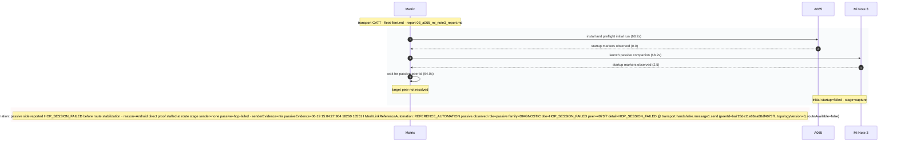

# Pair 03 — a065_mi_note3

## Setup

- Sender: A065 (1f1dad34)
- Passive: Mi Note 3 (42c2cf)
- Sender API level: 36
- Passive API level: 28
- Transport: GATT
- Fleet inventory: `/home/phil/Projects/MeshLink/reports/android-direct-proof-fleet/runs/20260619T205929/fleet.md`
- Pair report path: `/home/phil/Projects/MeshLink/reports/android-direct-proof-fleet/runs/20260619T205929/03_a065_mi_note3_report.md`
- Peer lookup time: 64.0s
- Initial run dir: `/home/phil/Projects/MeshLink/reports/android-direct-proof-fleet/runs/20260619T205929/03_a065_mi_note3_initial`
- Final run dir: `—`

## Result

- Initial status: failed (capture) in 68.2s
- Final status: skipped (capture) in 68.2s
- Target peer id: not resolved
- Initial HTML report: `summary.html`
- Final HTML report: `summary.html`
- Initial summary JSON: `/home/phil/Projects/MeshLink/reports/android-direct-proof-fleet/runs/20260619T205929/03_a065_mi_note3_initial/summary.json`
- Final summary JSON: `—`

## Troubleshooting references

| Initial artifact | Path | Captured |
|---|---|---|
| Initial senderLogcat | `sender_logcat.log` | yes |
| Initial passiveLogcat | `passive_logcat.log` | yes |
| Initial senderStart | `sender_start.txt` | yes |
| Initial passiveStart | `passive_start.txt` | yes |
| Initial androidHistory | `android_history.json` | no |
| Initial androidExport | `android_export.json` | no |
| Final artifact | Path | Captured |
|---|---|---|
| Final senderLogcat | `—` | no |
| Final passiveLogcat | `—` | no |
| Final senderStart | `—` | no |
| Final passiveStart | `—` | no |
| Final androidHistory | `—` | no |
| Final androidExport | `—` | no |

## Device quirks and issues

- Transport chosen by library: GATT
- Transport evidence: 06-19 15:04:21.394 18260 18260 I MeshLinkReferenceAutomation: GATT benchmark server opening
- Sender API level: 36
- Passive API level: 28
- Initial run failure: Android direct proof stalled at route stage sender=none passive=hop-failed; senderEvidence=n/a passiveEvidence=06-19 15:04:27.964 18260 18551 I MeshLinkReferenceAutomation: REFERENCE_AUTOMATION passive.observed role=passive family=DIAGNOSTIC title=HOP_SESSION_FAILED peer=4073f7 detail=HOP_SESSION_FAILED @ transport.handshake.message1.send {peerId=ba728de11e88aa88df4073f7, topologyVersion=0, routeAvailable=false}
- Final run failure: Android direct proof stalled at route stage sender=none passive=hop-failed; senderEvidence=n/a passiveEvidence=06-19 15:04:27.964 18260 18551 I MeshLinkReferenceAutomation: REFERENCE_AUTOMATION passive.observed role=passive family=DIAGNOSTIC title=HOP_SESSION_FAILED peer=4073f7 detail=HOP_SESSION_FAILED @ transport.handshake.message1.send {peerId=ba728de11e88aa88df4073f7, topologyVersion=0, routeAvailable=false}

## Startup timing

Initial startupTiming

```json
{
  "launch": {
    "passiveStartupWaitSeconds": 20.0,
    "passiveTransportWaitSeconds": 20.0,
    "postResultIdleSeconds": 2.0
  },
  "passive": {
    "elapsedSeconds": 2.5,
    "line": "06-19 15:04:21.378 18260 18260 I MeshLinkReferenceAutomation: REFERENCE_AUTOMATION startup stage=activity.onCreate mode=LIVE_PROOF role=PASSIVE scenario=direct-guided appId=demo.meshlink.reference.android-direct.a065_mi_note3 storage=03_a065_mi_note3_initial",
    "observed": true
  },
  "passiveTransport": {
    "elapsedSeconds": 2.0,
    "line": "06-19 15:04:23.338 18260 18260 I MeshLinkReferenceAutomation: advertising started mode=2 tx=3 connectable=true",
    "observed": true
  },
  "sender": {
    "elapsedSeconds": 0.0,
    "line": "06-19 21:04:19.492 31840 31840 I MeshLinkReferenceAutomation: REFERENCE_AUTOMATION startup stage=activity.onCreate mode=LIVE_PROOF role=SENDER scenario=direct-guided appId=demo.meshlink.reference.android-direct.a065_mi_note3 storage=03_a065_mi_note3_initial",
    "observed": true
  },
  "totalSeconds": 68.2
}
```

Initial timings

```json
{
  "androidReadySeconds": 20.0,
  "captureTimeoutSeconds": 30.0,
  "passive": {
    "completionMarker": null,
    "peerDiscoveryMarker": "06-19 15:04:23.334 18260 18546 I MeshLinkReferenceAutomation: REFERENCE_AUTOMATION peer.discovered role=PASSIVE peer=4073f7",
    "peerDiscoverySeconds": 1.956,
    "receiptSeconds": null,
    "sendLatencySeconds": null,
    "sendRequestMarker": "06-19 15:04:23.334 18260 18546 I MeshLinkReferenceAutomation: REFERENCE_AUTOMATION peer.discovered role=PASSIVE peer=4073f7",
    "startupMarker": "06-19 15:04:21.378 18260 18260 I MeshLinkReferenceAutomation: REFERENCE_AUTOMATION startup stage=activity.onCreate mode=LIVE_PROOF role=PASSIVE scenario=direct-guided appId=demo.meshlink.reference.android-direct.a065_mi_note3 storage=03_a065_mi_note3_initial",
    "startupObserved": true,
    "startupWaitSeconds": 2.5,
    "transportEvidence": "06-19 15:04:21.394 18260 18260 I MeshLinkReferenceAutomation: GATT benchmark server opening",
    "transportMode": "GATT",
    "trustConnectionMarker": null,
    "trustConnectionSeconds": null
  },
  "sender": {
    "completionMarker": null,
    "peerDiscoveryMarker": null,
    "peerDiscoverySeconds": null,
    "sendCompletionSeconds": null,
    "sendLatencySeconds": null,
    "sendRequestMarker": null,
    "startupMarker": "06-19 21:04:19.492 31840 31840 I MeshLinkReferenceAutomation: REFERENCE_AUTOMATION startup stage=activity.onCreate mode=LIVE_PROOF role=SENDER scenario=direct-guided appId=demo.meshlink.reference.android-direct.a065_mi_note3 storage=03_a065_mi_note3_initial",
    "startupObserved": true,
    "startupWaitSeconds": 0.0,
    "transportEvidence": "06-19 21:04:22.054 31840 31840 I MeshLinkReferenceAutomation: scan found d2026d mode=GATT psm=0 platform=ANDROID addr=78:FE:4A:C2:42:7F",
    "transportMode": "GATT",
    "trustConnectionMarker": null,
    "trustConnectionSeconds": null
  },
  "totalSeconds": 68.2,
  "transportEvidence": "06-19 15:04:21.394 18260 18260 I MeshLinkReferenceAutomation: GATT benchmark server opening",
  "transportMode": "GATT"
}
```

Final startupTiming

```json
{}
```

Final timings

```json
{
  "androidReadySeconds": 20.0,
  "captureTimeoutSeconds": 30.0,
  "passive": {
    "completionMarker": null,
    "peerDiscoveryMarker": "06-19 15:04:23.334 18260 18546 I MeshLinkReferenceAutomation: REFERENCE_AUTOMATION peer.discovered role=PASSIVE peer=4073f7",
    "peerDiscoverySeconds": 1.956,
    "receiptSeconds": null,
    "sendLatencySeconds": null,
    "sendRequestMarker": "06-19 15:04:23.334 18260 18546 I MeshLinkReferenceAutomation: REFERENCE_AUTOMATION peer.discovered role=PASSIVE peer=4073f7",
    "startupMarker": "06-19 15:04:21.378 18260 18260 I MeshLinkReferenceAutomation: REFERENCE_AUTOMATION startup stage=activity.onCreate mode=LIVE_PROOF role=PASSIVE scenario=direct-guided appId=demo.meshlink.reference.android-direct.a065_mi_note3 storage=03_a065_mi_note3_initial",
    "startupObserved": true,
    "startupWaitSeconds": 2.5,
    "transportEvidence": "06-19 15:04:21.394 18260 18260 I MeshLinkReferenceAutomation: GATT benchmark server opening",
    "transportMode": "GATT",
    "trustConnectionMarker": null,
    "trustConnectionSeconds": null
  },
  "sender": {
    "completionMarker": null,
    "peerDiscoveryMarker": null,
    "peerDiscoverySeconds": null,
    "sendCompletionSeconds": null,
    "sendLatencySeconds": null,
    "sendRequestMarker": null,
    "startupMarker": "06-19 21:04:19.492 31840 31840 I MeshLinkReferenceAutomation: REFERENCE_AUTOMATION startup stage=activity.onCreate mode=LIVE_PROOF role=SENDER scenario=direct-guided appId=demo.meshlink.reference.android-direct.a065_mi_note3 storage=03_a065_mi_note3_initial",
    "startupObserved": true,
    "startupWaitSeconds": 0.0,
    "transportEvidence": "06-19 21:04:22.054 31840 31840 I MeshLinkReferenceAutomation: scan found d2026d mode=GATT psm=0 platform=ANDROID addr=78:FE:4A:C2:42:7F",
    "transportMode": "GATT",
    "trustConnectionMarker": null,
    "trustConnectionSeconds": null
  },
  "totalSeconds": 68.2,
  "transportEvidence": "06-19 15:04:21.394 18260 18260 I MeshLinkReferenceAutomation: GATT benchmark server opening",
  "transportMode": "GATT"
}
```

Captured evidence map

```json
{
  "final": {},
  "initial": {
    "androidExport": false,
    "androidHistory": false,
    "passiveLogcat": true,
    "passiveStart": true,
    "senderLogcat": true,
    "senderStart": true
  }
}
```

## Mermaid sequence diagram


