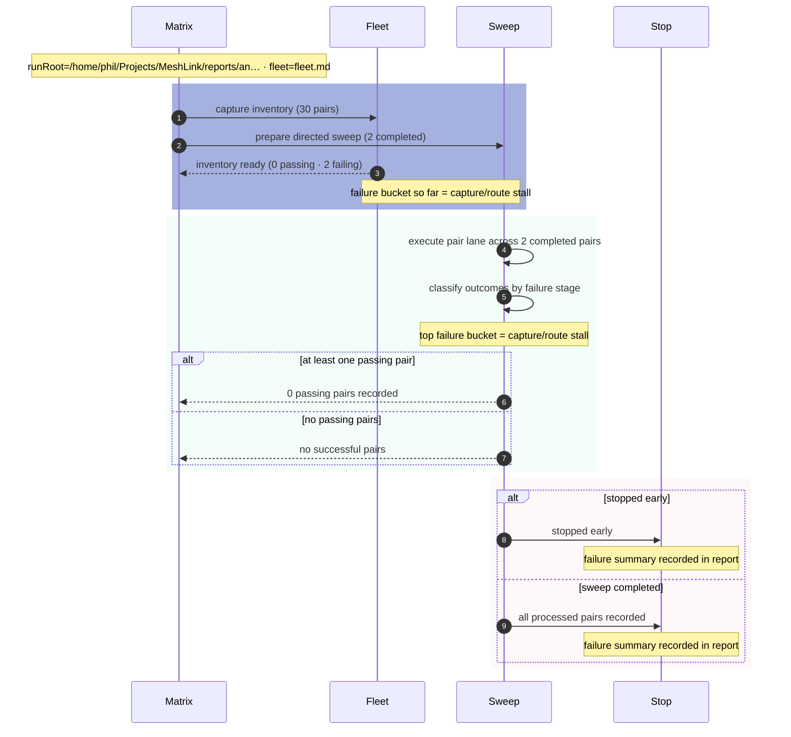

# Android direct-proof matrix

## Overview

| Metric | Value |
|---|---|
| Completed pairs | 2 |
| Passing pairs | 0 |
| Failing pairs | 2 |
| Pending pairs | 28 |
| Fail-fast | disabled |
| Max failures | 5 |
| Stopped early | no |
| Stop reason | — |

## Mermaid overview

## Passing pairs

| Sender | Passive | Result |
|---|---|---|

## Most common failure reason per device

| Device | Most common failure reason | Count |
|---|---|---|
| A065 | capture/route stall | 2 |
