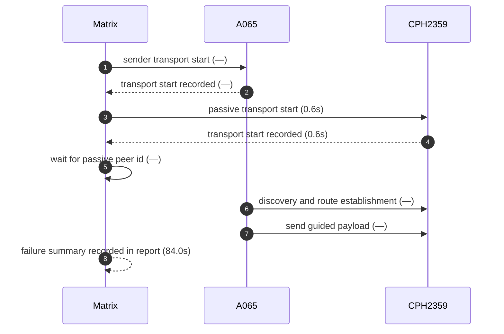
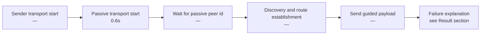

# Pair 04 — a065_cph2359

## Introduction

Pair 04 (a065_cph2359) is a failed initial run over A065 → CPH2359. The sender started L2CAP transport, the passive side started L2CAP transport, and the pair stalled at launch before route establishment.

## Setup

- Sender: A065 (1f1dad34)
- Passive: CPH2359 (EQUGS85LJNEIO7Z5)
- Sender API level: 36
- Passive API level: 34
- Sender connection: 🔌 USB
- Passive connection: 🔌 USB
- Matrix transport summary: `L2CAP`
- Pair report path: `reports/android-direct-proof-fleet/runs/20260620T154539/04_a065_cph2359_report.md`
- Fleet inventory: `reports/android-direct-proof-fleet/runs/20260620T154539/fleet.md`
- Peer lookup time: —
- Initial run dir: `reports/android-direct-proof-fleet/runs/20260620T154539/04_a065_cph2359_initial`
- Final run dir: `—`
- Target peer id: not resolved

## Result

- Initial status: failed (launch) in 84.0s
- Final status: skipped (launch) in 84.0s
- Initial failure reason: Android peer-resolution gate failed: passive peer id was not resolved before the route phase
- Final failure reason: Android peer-resolution gate failed: passive peer id was not resolved before the route phase
- Route stage: route-unavailable
- Route evidence: 06-20 15:52:22.538 22362 22397 I MeshLinkReferenceAutomation: REFERENCE_AUTOMATION sender.wait.retry role=sender reason=route-unavailable attempt=10 delayMs=5000

## Transport evidence

- Sender transport mode: `L2CAP`
  - `06-20 15:51:37.426 22362 22392 I MeshLinkReferenceAutomation: start() with l2capPsm=128`
  - Startup marker: `—`
  - Elapsed: —
- Passive transport mode: `L2CAP`
  - `06-20 15:51:41.136  5936  6034 I MeshLinkReferenceAutomation: start() with l2capPsm=249`
  - Startup marker: `06-20 15:51:40.550  5936  5936 I MeshLinkReferenceAutomation: REFERENCE_AUTOMATION startup stage=activity.onCreate mode=LIVE_PROOF role=PASSIVE scenario=direct-guided appId=demo.meshlink.reference.android-direct.a065_cph2359 storage=04_a065_cph2359_initial`
  - Elapsed: 0.6s
- `scan found ...` lines remain peer-discovery evidence only and are not used as transport source.

## Mermaid sequence diagram



## Mermaid timeline



## Connections

- Sender: 🔌 USB
- Passive: 🔌 USB

## Evidence summary

- Sender startup marker: `—`
- Passive startup marker: `06-20 15:51:40.550  5936  5936 I MeshLinkReferenceAutomation: REFERENCE_AUTOMATION startup stage=activity.onCreate mode=LIVE_PROOF role=PASSIVE scenario=direct-guided appId=demo.meshlink.reference.android-direct.a065_cph2359 storage=04_a065_cph2359_initial`
- Route evidence: 06-20 15:52:22.538 22362 22397 I MeshLinkReferenceAutomation: REFERENCE_AUTOMATION sender.wait.retry role=sender reason=route-unavailable attempt=10 delayMs=5000
- Passive route evidence: —

| Initial artifact | Path | Captured |
|---|---|---|
| Initial senderLogcat | `sender_logcat.log` | yes |
| Initial passiveLogcat | `passive_logcat.log` | yes |
| Initial senderStart | `sender_start.txt` | yes |
| Initial passiveStart | `passive_start.txt` | yes |
| Initial androidHistory | `android_history.json` | no |
| Initial androidExport | `android_export.json` | no |

## Startup timing

```json
{
  "launch": {
    "passiveStartupWaitSeconds": 20.0,
    "passiveTransportWaitSeconds": 20.0,
    "postResultIdleSeconds": 2.0
  },
  "passive": {
    "elapsedSeconds": 0.5,
    "line": "06-20 15:51:40.550  5936  5936 I MeshLinkReferenceAutomation: REFERENCE_AUTOMATION startup stage=activity.onCreate mode=LIVE_PROOF role=PASSIVE scenario=direct-guided appId=demo.meshlink.reference.android-direct.a065_cph2359 storage=04_a065_cph2359_initial",
    "observed": true
  },
  "passiveTransport": {
    "elapsedSeconds": 0.8,
    "line": "06-20 15:51:41.303  5936  5936 I MeshLinkReferenceAutomation: advertising started mode=2 tx=3 connectable=true",
    "observed": true
  },
  "sender": {
    "elapsedSeconds": null,
    "line": null,
    "observed": false
  },
  "totalSeconds": 84.0
}
```

## Captured evidence map

```json
{
  "final": {},
  "initial": {
    "androidExport": false,
    "androidHistory": false,
    "passiveLogcat": true,
    "passiveStart": true,
    "senderLogcat": true,
    "senderStart": true
  }
}
```

## Evidence files

- sender_logcat.log
- passive_logcat.log
- summary.json
