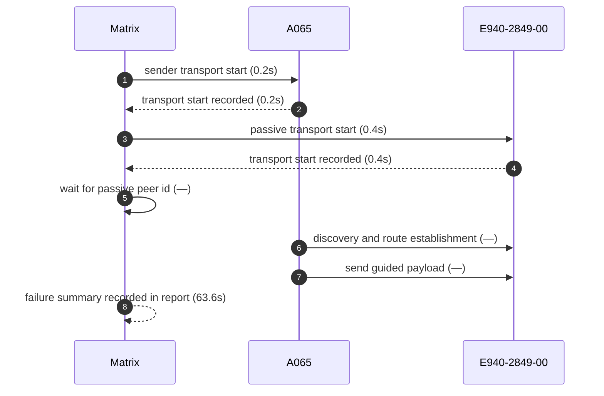
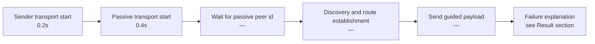

# Pair 05 — a065_e940

## Introduction

Pair 05 (a065_e940) is a failed initial run over A065 → E940-2849-00. The sender started L2CAP transport, the passive side started GATT transport, and the pair stalled at capture before route establishment.

## Setup

- Sender: A065 (1f1dad34)
- Passive: E940-2849-00 (GX6CTR500184)
- Sender API level: 36
- Passive API level: 33
- Sender connection: 🔌 USB
- Passive connection: 🔌 USB
- Matrix transport summary: `L2CAP`
- Pair report path: `reports/android-direct-proof-fleet/runs/20260620T154539/05_a065_e940_report.md`
- Fleet inventory: `reports/android-direct-proof-fleet/runs/20260620T154539/fleet.md`
- Peer lookup time: —
- Initial run dir: `reports/android-direct-proof-fleet/runs/20260620T154539/05_a065_e940_initial`
- Final run dir: `—`
- Target peer id: not resolved

## Result

- Initial status: failed (capture) in 63.5s
- Final status: skipped (capture) in 63.5s
- Initial failure reason: Android direct proof stalled at route stage sender=none passive=peer-discovered; senderEvidence=n/a passiveEvidence=06-20 15:53:13.598 15320 15442 I MeshLinkReferenceAutomation: REFERENCE_AUTOMATION peer.discovered role=PASSIVE peer=8fb970
- Final failure reason: Android direct proof stalled at route stage sender=none passive=peer-discovered; senderEvidence=n/a passiveEvidence=06-20 15:53:13.598 15320 15442 I MeshLinkReferenceAutomation: REFERENCE_AUTOMATION peer.discovered role=PASSIVE peer=8fb970
- Route stage: peer-discovered
- Route evidence: 06-20 15:53:13.598 15320 15442 I MeshLinkReferenceAutomation: REFERENCE_AUTOMATION peer.discovered role=PASSIVE peer=8fb970

## Transport evidence

- Sender transport mode: `L2CAP`
  - `06-20 15:53:10.905 22678 22708 I MeshLinkReferenceAutomation: start() with l2capPsm=129`
  - Startup marker: `06-20 15:53:10.747 22678 22678 I MeshLinkReferenceAutomation: REFERENCE_AUTOMATION startup stage=activity.onCreate mode=LIVE_PROOF role=SENDER scenario=direct-guided appId=demo.meshlink.reference.android-direct.a065_e940 storage=05_a065_e940_initial`
  - Elapsed: 0.2s
- Passive transport mode: `GATT`
  - `start()`
  - Startup marker: `06-20 15:53:12.696 15320 15320 I MeshLinkReferenceAutomation: REFERENCE_AUTOMATION startup stage=activity.onCreate mode=LIVE_PROOF role=PASSIVE scenario=direct-guided appId=demo.meshlink.reference.android-direct.a065_e940 storage=05_a065_e940_initial`
  - Elapsed: 0.4s
- `scan found ...` lines remain peer-discovery evidence only and are not used as transport source.

## Mermaid sequence diagram



## Mermaid timeline



## Connections

- Sender: 🔌 USB
- Passive: 🔌 USB

## Evidence summary

- Sender startup marker: `06-20 15:53:10.747 22678 22678 I MeshLinkReferenceAutomation: REFERENCE_AUTOMATION startup stage=activity.onCreate mode=LIVE_PROOF role=SENDER scenario=direct-guided appId=demo.meshlink.reference.android-direct.a065_e940 storage=05_a065_e940_initial`
- Passive startup marker: `06-20 15:53:12.696 15320 15320 I MeshLinkReferenceAutomation: REFERENCE_AUTOMATION startup stage=activity.onCreate mode=LIVE_PROOF role=PASSIVE scenario=direct-guided appId=demo.meshlink.reference.android-direct.a065_e940 storage=05_a065_e940_initial`
- Route evidence: 06-20 15:53:13.598 15320 15442 I MeshLinkReferenceAutomation: REFERENCE_AUTOMATION peer.discovered role=PASSIVE peer=8fb970
- Passive route evidence: —

| Initial artifact | Path | Captured |
|---|---|---|
| Initial senderLogcat | `sender_logcat.log` | yes |
| Initial passiveLogcat | `passive_logcat.log` | yes |
| Initial senderStart | `sender_start.txt` | yes |
| Initial passiveStart | `passive_start.txt` | yes |
| Initial androidHistory | `android_history.json` | no |
| Initial androidExport | `android_export.json` | no |

## Startup timing

```json
{
  "launch": {
    "passiveStartupWaitSeconds": 20.0,
    "passiveTransportWaitSeconds": 20.0,
    "postResultIdleSeconds": 2.0
  },
  "passive": {
    "elapsedSeconds": 0.5,
    "line": "06-20 15:53:12.696 15320 15320 I MeshLinkReferenceAutomation: REFERENCE_AUTOMATION startup stage=activity.onCreate mode=LIVE_PROOF role=PASSIVE scenario=direct-guided appId=demo.meshlink.reference.android-direct.a065_e940 storage=05_a065_e940_initial",
    "observed": true
  },
  "passiveTransport": {
    "elapsedSeconds": 1.0,
    "line": "06-20 15:53:13.601 15320 15320 I MeshLinkReferenceAutomation: advertising started mode=2 tx=3 connectable=true",
    "observed": true
  },
  "sender": {
    "elapsedSeconds": 0.0,
    "line": "06-20 15:53:10.747 22678 22678 I MeshLinkReferenceAutomation: REFERENCE_AUTOMATION startup stage=activity.onCreate mode=LIVE_PROOF role=SENDER scenario=direct-guided appId=demo.meshlink.reference.android-direct.a065_e940 storage=05_a065_e940_initial",
    "observed": true
  },
  "totalSeconds": 63.5
}
```

## Captured evidence map

```json
{
  "final": {},
  "initial": {
    "androidExport": false,
    "androidHistory": false,
    "passiveLogcat": true,
    "passiveStart": true,
    "senderLogcat": true,
    "senderStart": true
  }
}
```

## Evidence files

- sender_logcat.log
- passive_logcat.log
- summary.json
