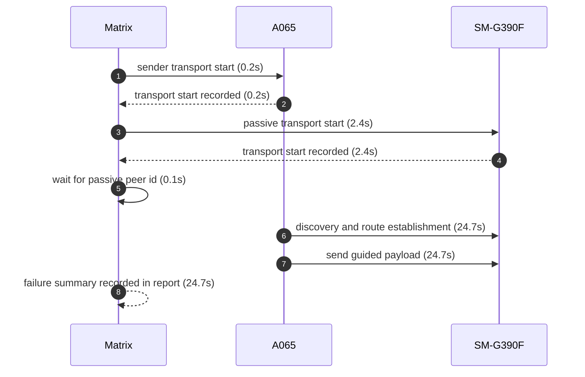
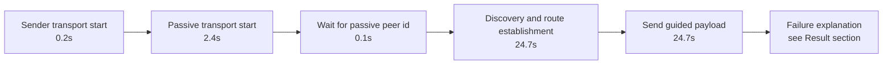

# Pair 02 — a065_xcover

## Introduction

Pair 02 (a065_xcover) is a failed initial run over A065 → SM-G390F. The sender started L2CAP transport, the passive side started GATT transport, and the pair stalled at capture before route establishment.

## Setup

- Sender: A065 (1f1dad34)
- Passive: SM-G390F (42004386e43c8589)
- Sender API level: 36
- Passive API level: 28
- Sender connection: 🔌 USB
- Passive connection: 🔌 USB
- Matrix transport summary: `L2CAP`
- Pair report path: `/home/phil/Projects/MeshLink/reports/android-direct-proof-fleet/runs/20260620T164700/02_a065_xcover_report.md`
- Fleet inventory: `/home/phil/Projects/MeshLink/reports/android-direct-proof-fleet/runs/20260620T164700/fleet.md`
- Peer lookup time: 0.1s
- Initial run dir: `/home/phil/Projects/MeshLink/reports/android-direct-proof-fleet/runs/20260620T164700/02_a065_xcover_initial`
- Final run dir: `/home/phil/Projects/MeshLink/reports/android-direct-proof-fleet/runs/20260620T164700/02_a065_xcover_final`
- Target peer id: OmZOC/HnmEPPE0MA5SCAGJWGpwUB8KHWUCXrg52qtUA=

## Result

- Initial status: failed (capture) in 85.7s
- Final status: failed (capture) in 24.6s
- Initial failure reason: Android direct proof stalled at route stage sender=none passive=hop-failed; senderEvidence=n/a passiveEvidence=06-20 16:48:52.694 21062 21262 I MeshLinkReferenceAutomation: REFERENCE_AUTOMATION passive.observed role=passive family=DIAGNOSTIC title=HOP_SESSION_FAILED peer=35ba3b detail=HOP_SESSION_FAILED @ transport.handshake.message1.send {peerId=c225419c9cf576e1b835ba3b, topologyVersion=0, routeAvailable=false}
- Final failure reason: Android direct proof stalled at route stage sender=route-unavailable passive=hop-failed; senderEvidence=06-20 16:49:58.889 25550 25581 I MeshLinkReferenceAutomation: REFERENCE_AUTOMATION sender.observed role=sender family=DIAGNOSTIC title=DELIVERY_UNREACHABLE peer=2qtUA= detail=DELIVERY_UNREACHABLE @ delivery.retryExpired {peerId=OmZOC/HnmEPPE0MA5SCAGJWGpwUB8KHWUCXrg52qtUA=, topologyVersion=0, routeAvailable=false} passiveEvidence=06-20 16:50:00.755 21531 21567 I MeshLinkReferenceAutomation: REFERENCE_AUTOMATION passive.observed role=passive family=DIAGNOSTIC title=HOP_SESSION_FAILED peer=35ba3b detail=HOP_SESSION_FAILED @ transport.handshake.message1.send {peerId=c225419c9cf576e1b835ba3b, topologyVersion=0, routeAvailable=false}
- Route stage: route-unavailable
- Route evidence: 06-20 16:49:58.889 25550 25581 I MeshLinkReferenceAutomation: REFERENCE_AUTOMATION sender.observed role=sender family=DIAGNOSTIC title=DELIVERY_UNREACHABLE peer=2qtUA= detail=DELIVERY_UNREACHABLE @ delivery.retryExpired {peerId=OmZOC/HnmEPPE0MA5SCAGJWGpwUB8KHWUCXrg52qtUA=, topologyVersion=0, routeAvailable=false}

## Transport evidence

- Sender transport mode: `L2CAP`
  - `06-20 16:48:32.613 25397 25423 I MeshLinkReferenceAutomation: start() with l2capPsm=133`
  - Startup marker: `06-20 16:48:32.451 25397 25397 I MeshLinkReferenceAutomation: REFERENCE_AUTOMATION startup stage=activity.onCreate mode=LIVE_PROOF role=SENDER scenario=direct-guided appId=demo.meshlink.reference.android-direct.a065_xcover storage=02_a065_xcover_initial`
  - Elapsed: 0.2s
- Passive transport mode: `GATT`
  - `start()`
  - Startup marker: `06-20 16:48:42.393 21062 21062 I MeshLinkReferenceAutomation: REFERENCE_AUTOMATION startup stage=activity.onCreate mode=LIVE_PROOF role=PASSIVE scenario=direct-guided appId=demo.meshlink.reference.android-direct.a065_xcover storage=02_a065_xcover_initial`
  - Elapsed: 2.4s
- `scan found ...` lines remain peer-discovery evidence only and are not used as transport source.

## Mermaid sequence diagram



## Mermaid timeline



## Connections

- Sender: 🔌 USB
- Passive: 🔌 USB

## Evidence summary

- Sender startup marker: `06-20 16:48:32.451 25397 25397 I MeshLinkReferenceAutomation: REFERENCE_AUTOMATION startup stage=activity.onCreate mode=LIVE_PROOF role=SENDER scenario=direct-guided appId=demo.meshlink.reference.android-direct.a065_xcover storage=02_a065_xcover_initial`
- Passive startup marker: `06-20 16:48:42.393 21062 21062 I MeshLinkReferenceAutomation: REFERENCE_AUTOMATION startup stage=activity.onCreate mode=LIVE_PROOF role=PASSIVE scenario=direct-guided appId=demo.meshlink.reference.android-direct.a065_xcover storage=02_a065_xcover_initial`
- Route evidence: 06-20 16:49:58.889 25550 25581 I MeshLinkReferenceAutomation: REFERENCE_AUTOMATION sender.observed role=sender family=DIAGNOSTIC title=DELIVERY_UNREACHABLE peer=2qtUA= detail=DELIVERY_UNREACHABLE @ delivery.retryExpired {peerId=OmZOC/HnmEPPE0MA5SCAGJWGpwUB8KHWUCXrg52qtUA=, topologyVersion=0, routeAvailable=false}
- Passive route evidence: —

| Initial artifact | Path | Captured |
|---|---|---|
| Initial senderLogcat | `sender_logcat.log` | yes |
| Initial passiveLogcat | `passive_logcat.log` | yes |
| Initial senderStart | `sender_start.txt` | yes |
| Initial passiveStart | `passive_start.txt` | yes |
| Initial androidHistory | `android_history.json` | no |
| Initial androidExport | `android_export.json` | no |

## Startup timing

```json
{
  "launch": {
    "passiveStartupWaitSeconds": 20.0,
    "passiveTransportWaitSeconds": 20.0,
    "postResultIdleSeconds": 2.0
  },
  "passive": {
    "elapsedSeconds": 9.5,
    "line": "06-20 16:48:42.393 21062 21062 I MeshLinkReferenceAutomation: REFERENCE_AUTOMATION startup stage=activity.onCreate mode=LIVE_PROOF role=PASSIVE scenario=direct-guided appId=demo.meshlink.reference.android-direct.a065_xcover storage=02_a065_xcover_initial",
    "observed": true
  },
  "passiveTransport": {
    "elapsedSeconds": 6.0,
    "line": "06-20 16:48:48.314 21062 21062 I MeshLinkReferenceAutomation: advertising started mode=2 tx=3 connectable=true",
    "observed": true
  },
  "sender": {
    "elapsedSeconds": 0.0,
    "line": "06-20 16:48:32.451 25397 25397 I MeshLinkReferenceAutomation: REFERENCE_AUTOMATION startup stage=activity.onCreate mode=LIVE_PROOF role=SENDER scenario=direct-guided appId=demo.meshlink.reference.android-direct.a065_xcover storage=02_a065_xcover_initial",
    "observed": true
  },
  "totalSeconds": 85.7
}
```

## Captured evidence map

```json
{
  "final": {
    "androidExport": false,
    "androidHistory": false,
    "passiveLogcat": true,
    "passiveStart": true,
    "senderLogcat": true,
    "senderStart": true
  },
  "initial": {
    "androidExport": false,
    "androidHistory": false,
    "passiveLogcat": true,
    "passiveStart": true,
    "senderLogcat": true,
    "senderStart": true
  }
}
```

## Evidence files

- sender_logcat.log
- passive_logcat.log
- summary.json
