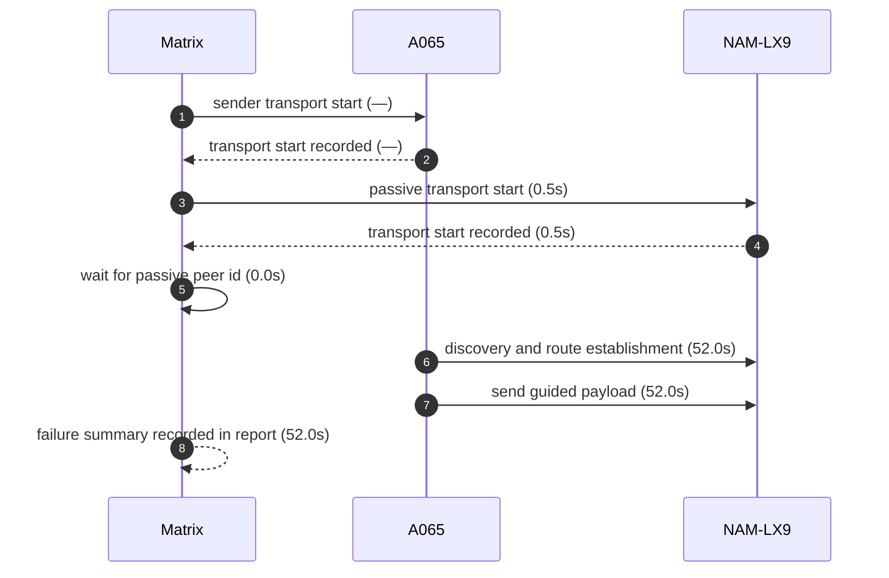
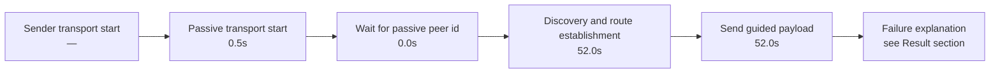

# Pair 01 — a065_nam_lx9

## Introduction

Pair 01 (a065_nam_lx9) is a failed initial run over A065 → NAM-LX9. The sender started GATT transport, the passive side started GATT transport, and the pair stalled at capture before route establishment.

## Setup

- Sender: A065 (1f1dad34)
- Passive: NAM-LX9 (2ASVB21B09005117)
- Sender API level: 36
- Passive API level: 31
- Sender connection: 🔌 USB
- Passive connection: 🔌 USB
- Matrix transport summary: `GATT`
- Pair report path: `reports/android-direct-proof-fleet/runs/20260620T221630/01_a065_nam_lx9_report.md`
- Fleet inventory: `reports/android-direct-proof-fleet/runs/20260620T221630/fleet.md`
- Peer lookup time: 0.0s
- Initial run dir: `reports/android-direct-proof-fleet/runs/20260620T221630/01_a065_nam_lx9_initial`
- Final run dir: `reports/android-direct-proof-fleet/runs/20260620T221630/01_a065_nam_lx9_final`
- Target peer id: Iz4CzZ99uLSYYXolDgb0WTI+fgHc4ri9Rd9GIAQDVjk=

## Result

- Initial status: failed (launch) in 100.1s
- Final status: failed (capture) in 52.0s
- Initial failure reason: Android peer-resolution gate failed: passive peer id was not resolved before the route phase
- Final failure reason: Timed out waiting for proof.complete on Android roles: passive, sender
- Route stage: unknown
- Route evidence: —

## Transport evidence

- Sender transport mode: `GATT`
  - `start()`
  - Startup marker: `—`
  - Elapsed: —
- Passive transport mode: `GATT`
  - `start()`
  - Startup marker: `06-20 22:16:45.500 20159 20159 I MeshLinkReferenceAutomation: REFERENCE_AUTOMATION startup stage=activity.onCreate mode=LIVE_PROOF role=PASSIVE scenario=direct-guided appId=demo.meshlink.reference.android-direct.a065_nam_lx9 storage=01_a065_nam_lx9_initial`
  - Elapsed: 0.5s
- `scan found ...` lines remain peer-discovery evidence only and are not used as transport source.

## Mermaid sequence diagram



## Mermaid timeline



## Connections

- Sender: 🔌 USB
- Passive: 🔌 USB

## Evidence summary

- Sender startup marker: `—`
- Passive startup marker: `06-20 22:16:45.500 20159 20159 I MeshLinkReferenceAutomation: REFERENCE_AUTOMATION startup stage=activity.onCreate mode=LIVE_PROOF role=PASSIVE scenario=direct-guided appId=demo.meshlink.reference.android-direct.a065_nam_lx9 storage=01_a065_nam_lx9_initial`
- Route evidence: —
- Passive route evidence: —

| Initial artifact | Path | Captured |
|---|---|---|
| Initial senderLogcat | `sender_logcat.log` | yes |
| Initial passiveLogcat | `passive_logcat.log` | yes |
| Initial senderStart | `sender_start.txt` | yes |
| Initial passiveStart | `passive_start.txt` | yes |
| Initial androidHistory | `android_history.json` | no |
| Initial androidExport | `android_export.json` | no |

## Startup timing

```json
{
  "launch": {
    "passiveStartupWaitSeconds": 20.0,
    "passiveTransportWaitSeconds": 20.0,
    "postResultIdleSeconds": 2.0
  },
  "passive": {
    "elapsedSeconds": 0.5,
    "line": "06-20 22:16:45.500 20159 20159 I MeshLinkReferenceAutomation: REFERENCE_AUTOMATION startup stage=activity.onCreate mode=LIVE_PROOF role=PASSIVE scenario=direct-guided appId=demo.meshlink.reference.android-direct.a065_nam_lx9 storage=01_a065_nam_lx9_initial",
    "observed": true
  },
  "passiveTransport": {
    "elapsedSeconds": 1.0,
    "line": "06-20 22:16:46.430 20159 20159 I MeshLinkReferenceAutomation: advertising started mode=2 tx=3 connectable=true",
    "observed": true
  },
  "sender": {
    "elapsedSeconds": null,
    "line": null,
    "observed": false
  },
  "totalSeconds": 100.1
}
```

## Captured evidence map

```json
{
  "final": {
    "androidExport": false,
    "androidHistory": false,
    "passiveLogcat": true,
    "passiveStart": true,
    "senderLogcat": true,
    "senderStart": true
  },
  "initial": {
    "androidExport": false,
    "androidHistory": false,
    "passiveLogcat": true,
    "passiveStart": true,
    "senderLogcat": true,
    "senderStart": true
  }
}
```

## Evidence files

- sender_logcat.log
- passive_logcat.log
- summary.json
