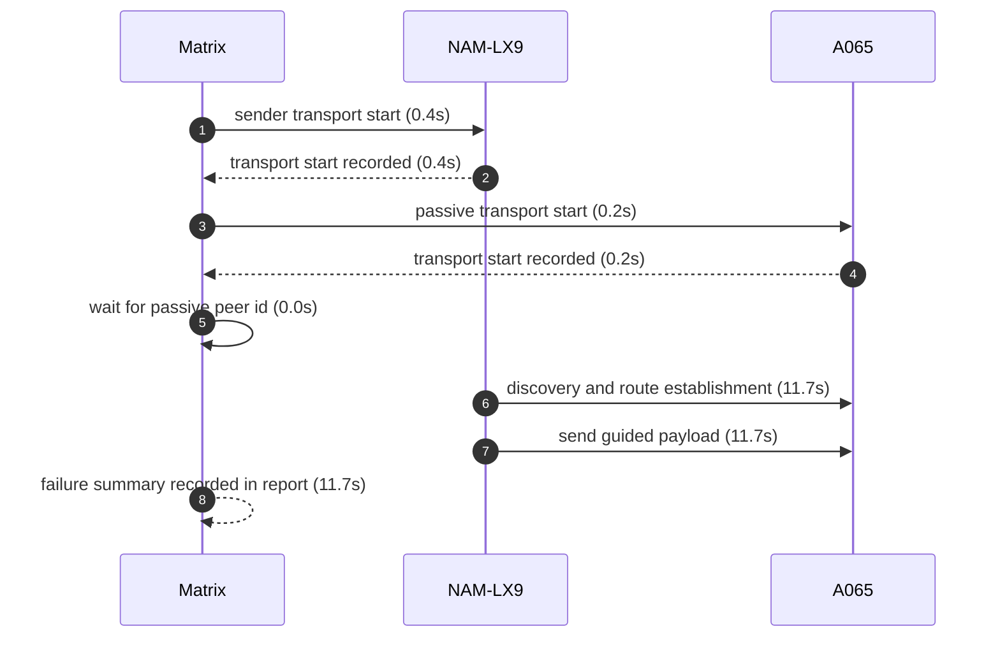
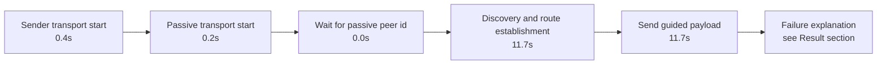

# Pair 06 — nam_lx9_a065

## Introduction

Pair 06 (nam_lx9_a065) is a failed initial run over NAM-LX9 → A065. The sender started GATT transport, the passive side started L2CAP transport, and the pair stalled at capture before route establishment.

## Setup

- Sender: NAM-LX9 (2ASVB21B09005117)
- Passive: A065 (1f1dad34)
- Sender API level: 31
- Passive API level: 36
- Sender connection: 🔌 USB
- Passive connection: 🔌 USB
- Matrix transport summary: `GATT`
- Pair report path: `reports/android-direct-proof-fleet/runs/20260620T221630/06_nam_lx9_a065_report.md`
- Fleet inventory: `reports/android-direct-proof-fleet/runs/20260620T221630/fleet.md`
- Peer lookup time: 0.0s
- Initial run dir: `reports/android-direct-proof-fleet/runs/20260620T221630/06_nam_lx9_a065_initial`
- Final run dir: `reports/android-direct-proof-fleet/runs/20260620T221630/06_nam_lx9_a065_final`
- Target peer id: PpnPyhTFfML4JYdF4oJE+O3Z+MdN9ReJ2GrBMSb9TDU=

## Result

- Initial status: failed (capture) in 64.0s
- Final status: failed (capture) in 11.6s
- Initial failure reason: Android direct proof stalled at route stage sender=route-unavailable passive=peer-discovered; senderEvidence=06-20 22:26:11.183 20935 20998 I MeshLinkReferenceAutomation: REFERENCE_AUTOMATION sender.wait.retry role=sender reason=route-unavailable attempt=10 delayMs=5000 passiveEvidence=06-20 22:25:26.459 13304 13338 I MeshLinkReferenceAutomation: REFERENCE_AUTOMATION peer.discovered role=PASSIVE peer=eb4b61
- Final failure reason: Android direct proof stalled at route stage sender=route-unavailable passive=peer-discovered; senderEvidence=06-20 22:26:30.237 21103 21144 I MeshLinkReferenceAutomation: REFERENCE_AUTOMATION sender.wait.retry role=sender reason=route-unavailable attempt=3 delayMs=5000 passiveEvidence=06-20 22:26:20.527 13617 13650 I MeshLinkReferenceAutomation: REFERENCE_AUTOMATION peer.discovered role=PASSIVE peer=eb4b61
- Route stage: route-unavailable
- Route evidence: 06-20 22:26:30.237 21103 21144 I MeshLinkReferenceAutomation: REFERENCE_AUTOMATION sender.wait.retry role=sender reason=route-unavailable attempt=3 delayMs=5000

## Transport evidence

- Sender transport mode: `GATT`
  - `start()`
  - Startup marker: `06-20 22:25:25.569 20935 20935 I MeshLinkReferenceAutomation: REFERENCE_AUTOMATION startup stage=activity.onCreate mode=LIVE_PROOF role=SENDER scenario=direct-guided appId=demo.meshlink.reference.android-direct.nam_lx9_a065 storage=06_nam_lx9_a065_initial`
  - Elapsed: 0.4s
- Passive transport mode: `L2CAP`
  - `06-20 22:25:25.976 13304 13333 I MeshLinkReferenceAutomation: start() with l2capPsm=164`
  - Startup marker: `06-20 22:25:25.820 13304 13304 I MeshLinkReferenceAutomation: REFERENCE_AUTOMATION startup stage=activity.onCreate mode=LIVE_PROOF role=PASSIVE scenario=direct-guided appId=demo.meshlink.reference.android-direct.nam_lx9_a065 storage=06_nam_lx9_a065_initial`
  - Elapsed: 0.2s
- `scan found ...` lines remain peer-discovery evidence only and are not used as transport source.

## Mermaid sequence diagram



## Mermaid timeline



## Connections

- Sender: 🔌 USB
- Passive: 🔌 USB

## Evidence summary

- Sender startup marker: `06-20 22:25:25.569 20935 20935 I MeshLinkReferenceAutomation: REFERENCE_AUTOMATION startup stage=activity.onCreate mode=LIVE_PROOF role=SENDER scenario=direct-guided appId=demo.meshlink.reference.android-direct.nam_lx9_a065 storage=06_nam_lx9_a065_initial`
- Passive startup marker: `06-20 22:25:25.820 13304 13304 I MeshLinkReferenceAutomation: REFERENCE_AUTOMATION startup stage=activity.onCreate mode=LIVE_PROOF role=PASSIVE scenario=direct-guided appId=demo.meshlink.reference.android-direct.nam_lx9_a065 storage=06_nam_lx9_a065_initial`
- Route evidence: 06-20 22:26:30.237 21103 21144 I MeshLinkReferenceAutomation: REFERENCE_AUTOMATION sender.wait.retry role=sender reason=route-unavailable attempt=3 delayMs=5000
- Passive route evidence: —

| Initial artifact | Path | Captured |
|---|---|---|
| Initial senderLogcat | `sender_logcat.log` | yes |
| Initial passiveLogcat | `passive_logcat.log` | yes |
| Initial senderStart | `sender_start.txt` | yes |
| Initial passiveStart | `passive_start.txt` | yes |
| Initial androidHistory | `android_history.json` | no |
| Initial androidExport | `android_export.json` | no |

## Startup timing

```json
{
  "launch": {
    "passiveStartupWaitSeconds": 20.0,
    "passiveTransportWaitSeconds": 20.0,
    "postResultIdleSeconds": 2.0
  },
  "passive": {
    "elapsedSeconds": 0.5,
    "line": "06-20 22:25:25.820 13304 13304 I MeshLinkReferenceAutomation: REFERENCE_AUTOMATION startup stage=activity.onCreate mode=LIVE_PROOF role=PASSIVE scenario=direct-guided appId=demo.meshlink.reference.android-direct.nam_lx9_a065 storage=06_nam_lx9_a065_initial",
    "observed": true
  },
  "passiveTransport": {
    "elapsedSeconds": 0.5,
    "line": "06-20 22:25:26.195 13304 13304 I MeshLinkReferenceAutomation: advertising started mode=2 tx=3 connectable=true",
    "observed": true
  },
  "sender": {
    "elapsedSeconds": 0.0,
    "line": "06-20 22:25:25.569 20935 20935 I MeshLinkReferenceAutomation: REFERENCE_AUTOMATION startup stage=activity.onCreate mode=LIVE_PROOF role=SENDER scenario=direct-guided appId=demo.meshlink.reference.android-direct.nam_lx9_a065 storage=06_nam_lx9_a065_initial",
    "observed": true
  },
  "totalSeconds": 64.0
}
```

## Captured evidence map

```json
{
  "final": {
    "androidExport": false,
    "androidHistory": false,
    "passiveLogcat": true,
    "passiveStart": true,
    "senderLogcat": true,
    "senderStart": true
  },
  "initial": {
    "androidExport": false,
    "androidHistory": false,
    "passiveLogcat": true,
    "passiveStart": true,
    "senderLogcat": true,
    "senderStart": true
  }
}
```

## Evidence files

- sender_logcat.log
- passive_logcat.log
- summary.json
