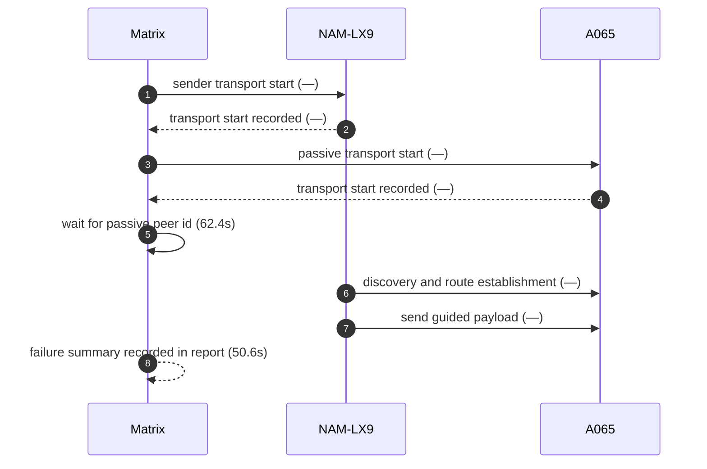
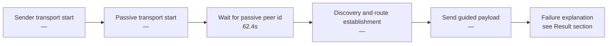

# Pair 06 — nam_lx9_a065

## Introduction

Pair 06 (nam_lx9_a065) is a failed initial run over NAM-LX9 → A065. The sender started unknown transport, the passive side started unknown transport, and the pair stalled at launch before route establishment.

## Setup

- Sender: NAM-LX9 (2ASVB21B09005117)
- Passive: A065 (1f1dad34)
- Sender API level: 31
- Passive API level: 36
- Sender connection: 🔌 USB
- Passive connection: 🔌 USB
- Matrix transport summary: `unknown`
- Pair report path: `/home/phil/Projects/MeshLink/reports/android-direct-proof-fleet/runs/20260621T153830/06_nam_lx9_a065_report.md`
- Fleet inventory: `/home/phil/Projects/MeshLink/reports/android-direct-proof-fleet/runs/20260621T153830/fleet.md`
- Peer lookup time: 62.4s
- Initial run dir: `/home/phil/Projects/MeshLink/reports/android-direct-proof-fleet/runs/20260621T153830/06_nam_lx9_a065_initial`
- Final run dir: `/home/phil/Projects/MeshLink/reports/android-direct-proof-fleet/runs/20260621T153830/06_nam_lx9_a065_final`
- Target peer id: not resolved

## Result

- Initial status: failed (launch) in 50.5s
- Final status: skipped (launch) in 50.5s
- Initial failure reason: Android passive transport did not start within 20.0 seconds
- Final failure reason: Android passive transport did not start within 20.0 seconds
- Route stage: unknown
- Route evidence: —

## Transport evidence

- Sender transport mode: `unknown`
  - `start()`
  - Startup marker: `—`
  - Elapsed: —
- Passive transport mode: `unknown`
  - `start()`
  - Startup marker: `—`
  - Elapsed: —
- `scan found ...` lines remain peer-discovery evidence only and are not used as transport source.

## Mermaid sequence diagram



## Mermaid timeline



## Connections

- Sender: 🔌 USB
- Passive: 🔌 USB

## Evidence summary

- Sender startup marker: `—`
- Passive startup marker: `—`
- Route evidence: —
- Passive route evidence: —

| Initial artifact | Path | Captured |
|---|---|---|
| Initial senderLogcat | `sender_logcat.log` | yes |
| Initial passiveLogcat | `passive_logcat.log` | yes |
| Initial senderStart | `sender_start.txt` | yes |
| Initial passiveStart | `passive_start.txt` | yes |
| Initial androidHistory | `android_history.json` | no |
| Initial androidExport | `android_export.json` | no |

## Startup timing

```json
{
  "launch": {
    "passiveStartupWaitSeconds": 20.0,
    "passiveTransportWaitSeconds": 20.0,
    "postResultIdleSeconds": 2.0
  },
  "passive": {
    "elapsedSeconds": 20.0,
    "line": null,
    "observed": false
  },
  "passiveTransport": {
    "elapsedSeconds": 20.0,
    "line": null,
    "observed": false
  },
  "sender": {
    "elapsedSeconds": null,
    "line": null,
    "observed": false
  },
  "totalSeconds": 50.5
}
```

## Captured evidence map

```json
{
  "final": {},
  "initial": {
    "androidExport": false,
    "androidHistory": false,
    "passiveLogcat": true,
    "passiveStart": true,
    "senderLogcat": true,
    "senderStart": true
  }
}
```

## Evidence files

- sender_logcat.log
- passive_logcat.log
- summary.json
