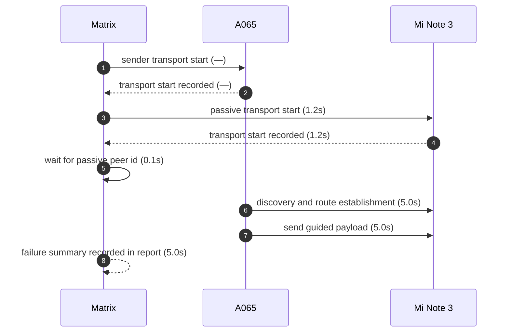
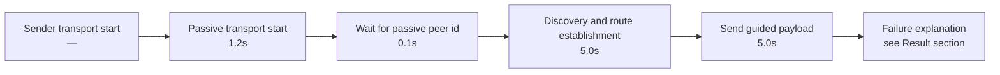

# Pair 03 — a065_mi_note3

## Introduction

Pair 03 (a065_mi_note3) is a failed initial run over A065 → Mi Note 3. The sender started L2CAP transport, the passive side started GATT transport, and the pair stalled at capture before route establishment. Foreign scan summary: initial sender ignored 0 · initial passive ignored 51 · final sender ignored 9 · final passive ignored 7

### How to read this report
- The foreign-scan summary in the intro aggregates initial + final runs for this pair.
- The detailed initial/final counts below let you see whether scan noise was one-sided or symmetric.

## Setup

- Sender: A065 (1f1dad34)
- Passive: Mi Note 3 (42c2cf)
- Sender API level: 36
- Passive API level: 28
- Sender connection: 🔌 USB
- Passive connection: 🔌 USB
- Matrix transport summary: `L2CAP`
- Pair report path: `reports/android-direct-proof-fleet/runs/20260626T160235_9120d1/03_a065_mi_note3_report.md`
- Fleet inventory: `reports/android-direct-proof-fleet/runs/20260626T160235_9120d1/fleet.md`
- Peer lookup time: 0.1s
- Initial run dir: `reports/android-direct-proof-fleet/runs/20260626T160235_9120d1/03_a065_mi_note3_initial`
- Final run dir: `reports/android-direct-proof-fleet/runs/20260626T160235_9120d1/03_a065_mi_note3_final`
- Target peer id: 3Gx8RQLxywc8FwUI6FsKuc2VSpoowlm2lddyUtx3+kw=
- How to read this report: the foreign-scan summary above aggregates the initial + final runs; the per-pair counts below are broken out per run.
- How to read this report: the sender and passive counts are treated separately so you can spot whether the mesh hash noise is localized or symmetric.

## Result

- Initial status: failed (capture) in 20.8s
- Final status: failed (capture) in 4.9s
- Initial failure reason: Android direct proof reached startup but discovery stalled before peer discovery or route readiness; classified as a capture stall
- Final failure reason: Android direct proof sender stalled before peer discovery; classified as a capture stall
- Route stage: route-discovered
- Route evidence: 06-26 16:04:18.649 15752 15789 I MeshLinkReferenceAutomation: REFERENCE_AUTOMATION route.ready role=SENDER peerId=6be5e9eddded635a6327baf6 peerSuffix=27baf6 trustState=UNKNOWN connectionState=CONNECTED

## Transport evidence

- Sender transport mode: `L2CAP`
  - `start()`
  - Startup marker: `06-26 16:04:14.004 15670 15670 I MeshLinkReferenceAutomation: REFERENCE_AUTOMATION startup stage=activity.onCreate mode=LIVE_PROOF role=SENDER scenario=direct-guided appId=demo.meshlink.reference.android-direct.a065_mi_note3 storage=03_a065_mi_note3_initial targetPeerId=3Gx8RQLxywc8FwUI6FsKuc2VSpoowlm2lddyUtx3+kw= autoStartMesh=true autoSendHello=true`
  - Elapsed: —
- Passive transport mode: `GATT`
  - `start()`
  - Startup marker: `06-26 10:04:06.447 19894 19894 I MeshLinkReferenceAutomation: REFERENCE_AUTOMATION startup stage=activity.onCreate mode=LIVE_PROOF role=PASSIVE scenario=direct-guided appId=demo.meshlink.reference.android-direct.a065_mi_note3 storage=03_a065_mi_note3_initial targetPeerId=none autoStartMesh=true autoSendHello=false`
  - Elapsed: 1.2s
- `scan found ...` lines remain peer-discovery evidence only and are not used as transport source.

## Mermaid sequence diagram



## Mermaid timeline



## Connections

- Sender: 🔌 USB
- Passive: 🔌 USB

## Evidence summary

- Sender startup marker: `06-26 16:04:14.004 15670 15670 I MeshLinkReferenceAutomation: REFERENCE_AUTOMATION startup stage=activity.onCreate mode=LIVE_PROOF role=SENDER scenario=direct-guided appId=demo.meshlink.reference.android-direct.a065_mi_note3 storage=03_a065_mi_note3_initial targetPeerId=3Gx8RQLxywc8FwUI6FsKuc2VSpoowlm2lddyUtx3+kw= autoStartMesh=true autoSendHello=true`
- Passive startup marker: `06-26 10:04:06.447 19894 19894 I MeshLinkReferenceAutomation: REFERENCE_AUTOMATION startup stage=activity.onCreate mode=LIVE_PROOF role=PASSIVE scenario=direct-guided appId=demo.meshlink.reference.android-direct.a065_mi_note3 storage=03_a065_mi_note3_initial targetPeerId=none autoStartMesh=true autoSendHello=false`
- Route evidence: 06-26 16:04:18.649 15752 15789 I MeshLinkReferenceAutomation: REFERENCE_AUTOMATION route.ready role=SENDER peerId=6be5e9eddded635a6327baf6 peerSuffix=27baf6 trustState=UNKNOWN connectionState=CONNECTED
- Passive route evidence: —

| Initial artifact | Path | Captured |
|---|---|---|
| Initial senderLogcat | `sender_logcat.log` | yes |
| Initial passiveLogcat | `passive_logcat.log` | yes |
| Initial senderStart | `sender_start.txt` | yes |
| Initial passiveStart | `passive_start.txt` | yes |
| Initial androidHistory | `android_history.json` | no |
| Initial androidExport | `android_export.json` | no |

## Startup timing

```json
{
  "launch": {
    "passiveStartupWaitSeconds": 30.0,
    "passiveTransportWaitSeconds": 30.0,
    "postResultIdleSeconds": 2.0
  },
  "passive": {
    "elapsedSeconds": 2.8,
    "line": "06-26 10:04:06.447 19894 19894 I MeshLinkReferenceAutomation: REFERENCE_AUTOMATION startup stage=activity.onCreate mode=LIVE_PROOF role=PASSIVE scenario=direct-guided appId=demo.meshlink.reference.android-direct.a065_mi_note3 storage=03_a065_mi_note3_initial targetPeerId=none autoStartMesh=true autoSendHello=false",
    "observed": true
  },
  "passiveTransport": {
    "elapsedSeconds": 1.8,
    "line": "06-26 10:04:08.075 19894 19894 I MeshLinkReferenceAutomation: advertising started mode=2 tx=3 connectable=true",
    "observed": true
  },
  "sender": {
    "elapsedSeconds": 0.5,
    "line": "06-26 16:04:14.004 15670 15670 I MeshLinkReferenceAutomation: REFERENCE_AUTOMATION startup stage=activity.onCreate mode=LIVE_PROOF role=SENDER scenario=direct-guided appId=demo.meshlink.reference.android-direct.a065_mi_note3 storage=03_a065_mi_note3_initial targetPeerId=3Gx8RQLxywc8FwUI6FsKuc2VSpoowlm2lddyUtx3+kw= autoStartMesh=true autoSendHello=true",
    "observed": true
  },
  "totalSeconds": 20.8
}
```

## Captured evidence map

```json
{
  "final": {
    "androidExport": false,
    "androidHistory": false,
    "passiveLogcat": true,
    "passiveStart": true,
    "senderLogcat": true,
    "senderStart": true
  },
  "initial": {
    "androidExport": false,
    "androidHistory": false,
    "passiveLogcat": true,
    "passiveStart": true,
    "senderLogcat": true,
    "senderStart": true
  }
}
```

## Evidence files

- sender_logcat.log
- passive_logcat.log
- summary.json
