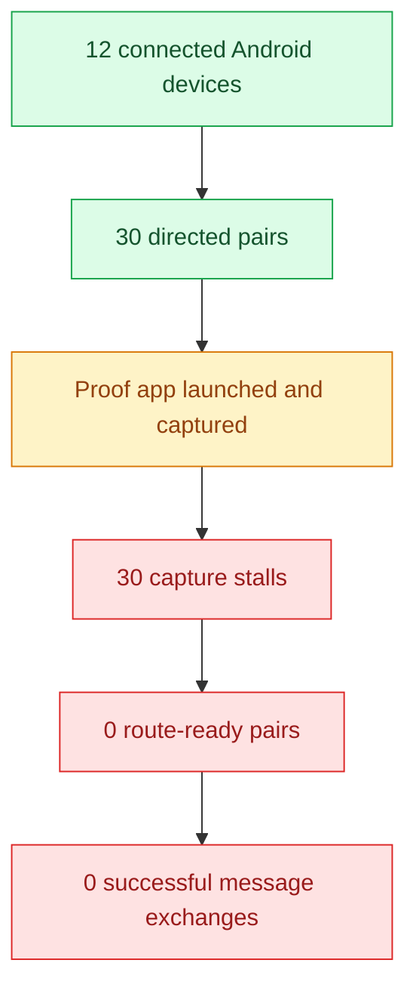

# Android direct-proof fleet report

## Executive summary

I ran the proof app across the connected Android fleet using the direct-proof matrix runner. The sweep discovered **12 devices** and enumerated **30 directed sender→passive pairs**. The full run completed, but **all 30 pairs failed at the capture stage** before route establishment.

A small runner adjustment was needed to get past one slow APK install on the first device pair: the USB install timeout in the proof runner was widened from 60s to 120s. After that, the run reached the real transport boundary instead of dying during preflight.

## Outcome at a glance

| Metric | Value |
|---|---:|
| Devices discovered | 12 |
| Directed pairs | 30 |
| Completed pairs | 30 |
| Passing pairs | 0 |
| Failing pairs | 30 |
| Pending pairs | 0 |
| Fail-fast | disabled for the sweep run |
| Stopped early | no |
| Stop reason | none |
| Aggregate foreign-scan noise | sender ignored 54 · passive ignored 2347 |

## What happened

1. The runner discovered the fleet and built the 30 directed pairs.
2. The proof app was installed/launched for each pair.
3. The first pair progressed past startup and into capture.
4. Every pair then stalled before peer discovery or route readiness could be confirmed.
5. No pair reached a stable send-ready state, so no proof message exchange completed.

## Failure pattern

Every pair failed for the same underlying reason: **capture stall before route establishment**.

### Failure-stage summary

| Stage | Count |
|---|---:|
| Preflight | 0 |
| Capture stall | 30 |
| Route-ready | 0 |
| Completed successfully | 0 |

### Interpretation

This is not a launch/install problem anymore. The fleet can start the proof app, but the mesh does not converge far enough for the proof harness to observe route readiness or a peer-discovery handoff. The repeated failure signature suggests a transport / discovery / environment issue rather than a device-specific crash.

## Mermaid view

## Notable artifacts

- `matrix-report.md` — full run summary and Mermaid overview
- `matrix-results.json` — machine-readable pair results
- `fleet.md` — device inventory and directed-pair list
- `01_a065_nam_lx9_report.md` through `30_*_report.md` — per-pair deep dives

## Representative pair

The first pair, `a065_nam_lx9`, is representative of the whole sweep:

- sender: A065 (`1f1dad34`)
- passive: NAM-LX9 (`2ASVB21B09005117`)
- outcome: failed during capture
- failure reason: discovery stalled before peer discovery or route readiness

## Bottom line

The fleet automation now gets far enough to exercise the proof app across the connected devices, but the transport layer never reaches a state where the app can exchange messages. The next useful step is not more retries of the same matrix; it is fixing the discovery/route-readiness boundary that is blocking every pair in the same way.
