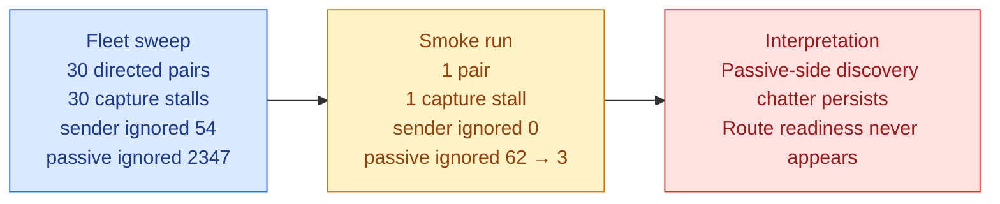
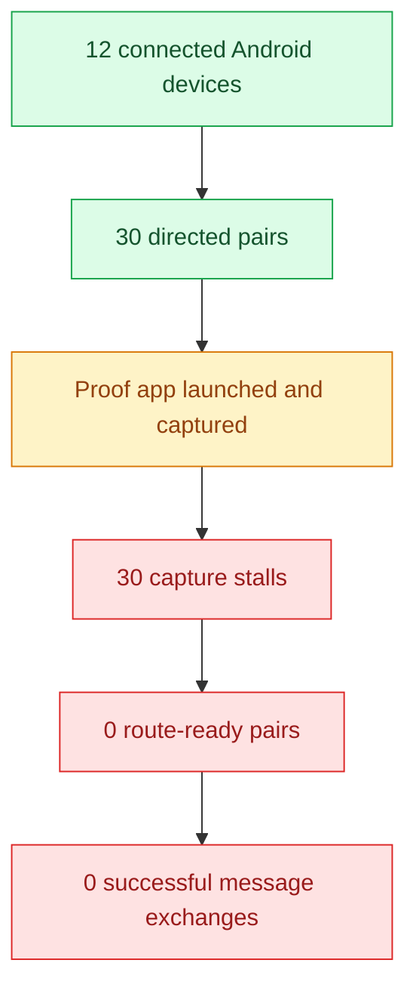

# Android direct-proof fleet report

## Executive summary

I ran the proof app across the connected Android fleet using the direct-proof matrix runner. The sweep discovered **12 devices** and enumerated **30 directed sender→passive pairs**. The full run completed, but **all 30 pairs failed at the capture stage** before route establishment.

A small runner adjustment was needed to get past one slow APK install on the first device pair: the USB install timeout in the proof runner was widened from 60s to 120s. After that, the run reached the real transport boundary instead of dying during preflight.

Two exploratory wrapper attempts failed before the final sweep because the matrix script was loaded from the repo root without the sibling `meshlink-reference/scripts` directory on `sys.path`, which raised `ModuleNotFoundError: run_headless_reference_live_proof`. The matrix script now adds its own script directory to `sys.path` before importing the sibling helper, so root-level loading is safe.

## Outcome at a glance

| Metric | Value |
|---|---:|
| Devices discovered | 12 |
| Directed pairs | 30 |
| Completed pairs | 30 |
| Passing pairs | 0 |
| Failing pairs | 30 |
| Pending pairs | 0 |
| Fail-fast | disabled for the sweep run |
| Stopped early | no |
| Stop reason | none |
| Aggregate foreign-scan noise | sender ignored 54 · passive ignored 2347 |
| Root-level smoke check | passed; repo-root CLI invocation confirmed, 1 pair capture-stalled |

## What happened

1. The runner discovered the fleet and built the 30 directed pairs.
2. The proof app was installed/launched for each pair.
3. The first pair progressed past startup and into capture.
4. Every pair then stalled before peer discovery or route readiness could be confirmed.
5. No pair reached a stable send-ready state, so no proof message exchange completed.

## Failure pattern

Every pair failed for the same underlying reason: **capture stall before route establishment**.

### Failure-stage summary

| Stage | Count |
|---|---:|
| Preflight | 0 |
| Capture stall | 30 |
| Route-ready | 0 |
| Completed successfully | 0 |

### Interpretation

This is not a launch/install problem anymore. The fleet can start the proof app, but the mesh does not converge far enough for the proof harness to observe route readiness or a peer-discovery handoff. The repeated failure signature suggests a transport / discovery / environment issue rather than a device-specific crash.

The foreign-scan pattern is asymmetric: sender ignored counts stay at zero, while passive ignored counts are high on the fleet run and still non-zero on the smoke run. That is consistent with passive-side discovery chatter or environmental noise on the receiving devices rather than symmetrical mesh churn. The drop from 62 ignored scans in the smoke run's initial pass to 3 in the final pass suggests the passive side quieted after discovery settled, but not enough for route readiness to appear.

## Root-level smoke check

A follow-up smoke run launched the matrix script from the repo root with a single pair (`a065_nam_lx9`). That invocation now succeeds end-to-end at the CLI layer, confirming the import-path fix is effective. The smoke run still failed at capture, with foreign scan summary `sender ignored 0 · passive ignored 62`, which matches the fleet-wide pattern rather than a wrapper failure.

### Quoted passive evidence

From the initial smoke run payload:

```text
06-26 17:56:22.942 12767 12767 I MeshLinkReferenceAutomation: REFERENCE_AUTOMATION startup.meshHashSummary appId=demo.meshlink.reference.android-direct.a065_nam_lx9 activeMeshHash=25979 advertisedMeshHash=25979
06-26 17:56:23.470 12767 12819 I MeshLinkReferenceAutomation: discovery.summary activeMeshHash=25979 advertisedMeshHash=25979 psm=0 carrier=UUID_PAIR foreignScanIgnoredCount=0
```

- `foreignScanIgnoredCount = 62`

From the final smoke run payload:

```text
06-26 17:56:30.461 12893 12893 I MeshLinkReferenceAutomation: REFERENCE_AUTOMATION startup.meshHashSummary appId=demo.meshlink.reference.android-direct.a065_nam_lx9 activeMeshHash=25979 advertisedMeshHash=25979
06-26 17:56:30.955 12893 12931 I MeshLinkReferenceAutomation: discovery.summary activeMeshHash=25979 advertisedMeshHash=25979 psm=0 carrier=UUID_PAIR foreignScanIgnoredCount=0
```

- `foreignScanIgnoredCount = 3`
- sender side remained at `foreignScanIgnoredCount = 0`
- no route readiness was observed in either pass

### Fleet vs smoke comparison

| Signal | Fleet sweep | Root-level smoke run |
|---|---:|---:|
| Directed pairs | 30 | 1 |
| Capture stalls | 30 | 1 |
| Sender ignored | 54 aggregate | 0 |
| Passive ignored | 2347 aggregate | 62 → 3 |
| Route readiness observed | 0 | 0 |
| Message exchange completed | 0 | 0 |

### Mermaid comparison



## Appendix: passive log excerpts

### Initial smoke pass

```text
06-26 17:56:22.942 12767 12767 I MeshLinkReferenceAutomation: REFERENCE_AUTOMATION startup.meshHashSummary appId=demo.meshlink.reference.android-direct.a065_nam_lx9 activeMeshHash=25979 advertisedMeshHash=25979
06-26 17:56:23.470 12767 12819 I MeshLinkReferenceAutomation: discovery.summary activeMeshHash=25979 advertisedMeshHash=25979 psm=0 carrier=UUID_PAIR foreignScanIgnoredCount=0
```

### Final smoke pass

```text
06-26 17:56:30.461 12893 12893 I MeshLinkReferenceAutomation: REFERENCE_AUTOMATION startup.meshHashSummary appId=demo.meshlink.reference.android-direct.a065_nam_lx9 activeMeshHash=25979 advertisedMeshHash=25979
06-26 17:56:30.955 12893 12931 I MeshLinkReferenceAutomation: discovery.summary activeMeshHash=25979 advertisedMeshHash=25979 psm=0 carrier=UUID_PAIR foreignScanIgnoredCount=0
```

## Mermaid view



## Notable artifacts

- `matrix-report.md` — full run summary and Mermaid overview
- `matrix-results.json` — machine-readable pair results
- `fleet.md` — device inventory and directed-pair list
- `01_a065_nam_lx9_report.md` through `30_*_report.md` — per-pair deep dives

## Representative pair

The first pair, `a065_nam_lx9`, is representative of the whole sweep:

- sender: A065 (`1f1dad34`)
- passive: NAM-LX9 (`2ASVB21B09005117`)
- outcome: failed during capture
- failure reason: discovery stalled before peer discovery or route readiness

## Bottom line

The fleet automation now gets far enough to exercise the proof app across the connected devices, but the transport layer never reaches a state where the app can exchange messages. The next useful step is not more retries of the same matrix; it is fixing the discovery/route-readiness boundary that is blocking every pair in the same way.
