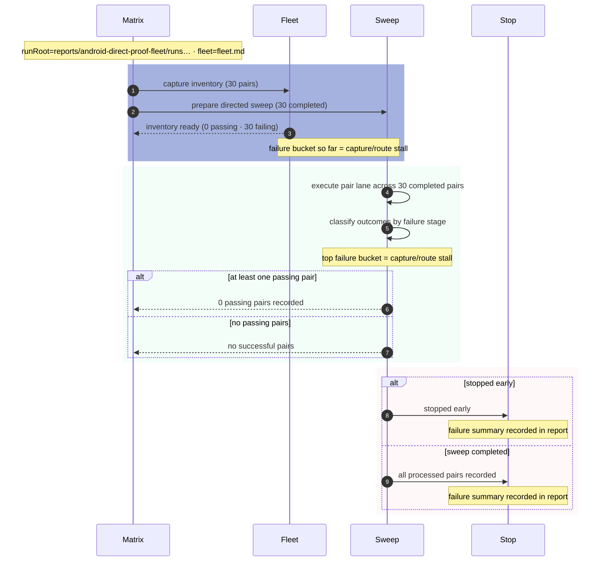

# Android direct-proof matrix

## Overview

| Metric | Value |
|---|---|
| Completed pairs | 30 |
| Passing pairs | 0 |
| Failing pairs | 30 |
| Pending pairs | 0 |
| Fail-fast | disabled |
| Max failures | — |
| Stopped early | no |
| Stop reason | — |

Foreign scan summary: sender ignored 54 · passive ignored 2347
- How to read this report: sender/passive foreign-scan counts are summed across initial + final passes for the fleet overview, while pair reports show the same counts per run.

## Mermaid overview

## Passing pairs

| Sender | Passive | Result |
|---|---|---|

## Most common failure reason per device

| Device | Most common failure reason | Count |
|---|---|---|
| A065 | capture/route stall | 5 |
| NAM-LX9 | capture/route stall | 5 |
| SM-G390F | capture/route stall | 5 |
| Mi Note 3 | capture/route stall | 5 |
| CPH2359 | capture/route stall | 5 |
| E940-2849-00 | capture/route stall | 5 |

## Run setup

- Fleet inventory: `reports/android-direct-proof-fleet/runs/20260626T160235_9120d1/fleet.md`
- Fleet JSON: `reports/android-direct-proof-fleet/runs/20260626T160235_9120d1/fleet.json`
- `foreignScanSummary` is written to both `fleet.json` and `progress.json` for downstream tooling.
- Fail-fast: disabled
- Stopped early: no
